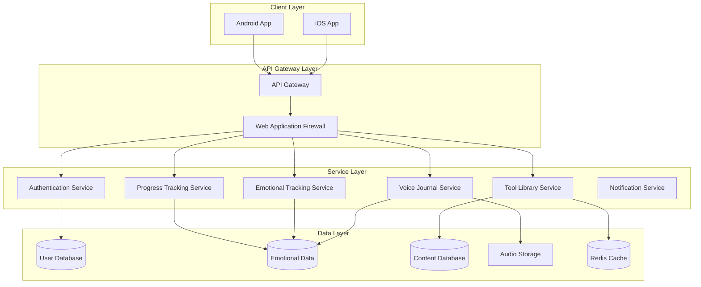

# Amira Wellness

A mobile application designed to support emotional well-being through accessible self-regulation tools, emotional release mechanisms, and personal growth tracking. The application addresses the growing need for private, judgment-free spaces where users can express emotions and develop healthy emotional habits.

[](https://github.com/amira-wellness/amira-app/actions/workflows/backend-ci.yml)
[](https://github.com/amira-wellness/amira-app/actions/workflows/ios-ci.yml)
[](https://github.com/amira-wellness/amira-app/actions/workflows/android-ci.yml)
[](https://github.com/amira-wellness/amira-app/actions/workflows/security-scan.yml)

## Project Overview

Amira Wellness is a privacy-focused emotional wellness application targeting Spanish-speaking individuals (primarily ages 25-45). The application provides a suite of tools for emotional regulation, self-reflection, and personal growth tracking.

### Core Features

- **Voice Journaling**: Audio recording for emotional release with pre/post emotional check-ins
- **Emotional Check-Ins**: Simple tools to log emotional states and track changes over time
- **Tool Library**: Categorized collection of emotional regulation tools and exercises
- **Progress Tracking**: Visual representation of emotional patterns and usage streaks

### Key Differentiators

- **Privacy-First Approach**: End-to-end encryption for all sensitive user data
- **Spanish-First Design**: Built specifically for Spanish-speaking users
- **Emotional Insight Generation**: Track emotional shifts before and after journaling
- **Minimalist, Nature-Inspired Design**: Creates a calm, trustworthy environment

## Repository Structure

This repository contains all components of the Amira Wellness application:

```
├── src/                    # Source code for all application components
│   ├── backend/            # Python FastAPI backend services
│   ├── ios/                # Swift iOS application
│   └── android/            # Kotlin Android application
├── infrastructure/         # Infrastructure as Code and deployment configurations
├── docs/                   # Comprehensive documentation
├── scripts/                # Utility scripts for development and deployment
└── .github/                # GitHub workflows and templates
```

Each component has its own README with detailed information about its structure, setup, and development guidelines.

## Technology Stack

### Backend
- **Language**: Python 3.11+
- **Framework**: FastAPI // installed with pip
- **Database**: PostgreSQL 15+
- **Storage**: AWS S3 (encrypted)
- **Caching**: Redis

### Mobile Applications
- **iOS**: Swift 5.9+, SwiftUI // Apple's UI framework
- **Android**: Kotlin 1.9+, Jetpack Compose // Google's UI framework

### Infrastructure
- **Cloud Provider**: AWS // Amazon Web Services
- **Containerization**: Docker
- **Orchestration**: Amazon ECS with Fargate
- **IaC**: Terraform // HashiCorp's infrastructure as code tool
- **CI/CD**: GitHub Actions

### Security
- **Authentication**: JWT with OAuth 2.0
- **Encryption**: AES-256-GCM for end-to-end encryption
- **API Security**: TLS 1.3, rate limiting, WAF

## Architecture Overview

Amira Wellness employs a client-server architecture with native mobile applications communicating with cloud-based backend services. The system follows a layered architecture pattern with clear separation of concerns between presentation, business logic, and data layers.



Key architectural principles include:
- **Privacy by design**: End-to-end encryption for sensitive user data
- **Scalability**: Horizontally scalable microservices
- **Resilience**: Fault-tolerant design with graceful degradation
- **Modularity**: Loosely coupled components for independent development

## Getting Started

To get started with the Amira Wellness application, follow the setup instructions for the component you want to work with:

### Backend Development

See [Backend README](src/backend/README.md) for detailed setup instructions.

```bash
# Clone the repository
git clone https://github.com/amira-wellness/amira-app.git
cd amira-app

# Set up backend environment
cd src/backend
python -m venv venv
source venv/bin/activate  # On Windows: venv\Scripts\activate
pip install -r requirements.txt

# Configure environment variables
cp .env.example .env
# Edit .env with your configuration

# Run database migrations
alembic upgrade head

# Start the development server
uvicorn main:app --reload
```

### iOS Development

See [iOS README](src/ios/README.md) for detailed setup instructions.

```bash
# Navigate to iOS project
cd src/ios/AmiraWellness

# Install dependencies
pod install

# Open the workspace in Xcode
open AmiraWellness.xcworkspace
```

### Android Development

See [Android README](src/android/README.md) for detailed setup instructions.

```bash
# Navigate to Android project
cd src/android

# Open in Android Studio or build with Gradle
./gradlew assembleDebug
```

### Infrastructure Deployment

See [Infrastructure README](infrastructure/README.md) for detailed deployment instructions.

```bash
# Navigate to infrastructure directory
cd infrastructure/terraform

# Initialize Terraform
terraform init

# Create a workspace for your environment
terraform workspace new dev

# Apply the configuration
terraform apply -var-file=environments/dev/terraform.tfvars
```

## Security and Privacy

Amira Wellness is built with a privacy-first approach, implementing several security measures to protect user data:

- **End-to-End Encryption**: Voice recordings and sensitive data are encrypted on-device before storage or transmission
- **Minimal Data Collection**: Only essential data is collected for application functionality
- **User-Controlled Data**: Users have complete control over their data with export and deletion options
- **Secure Authentication**: Multi-factor authentication and secure token handling
- **Regular Security Audits**: Automated and manual security testing

For more details on security implementation, see the [Security Documentation](docs/security/encryption.md).

## Documentation

Comprehensive documentation is available in the [docs](docs/) directory, covering:

- [Architecture Overview](docs/architecture/overview.md)
- [API Documentation](docs/api/)
- [Development Guidelines](docs/development/)
- [Deployment Procedures](docs/deployment/)
- [Security Implementation](docs/security/)

See the [Documentation README](docs/README.md) for a complete overview of available documentation.

## Contributing

We welcome contributions to the Amira Wellness project. Please see [CONTRIBUTING.md](CONTRIBUTING.md) for guidelines on how to contribute.

### Development Workflow

1. Fork the repository
2. Create a feature branch (`git checkout -b feature/amazing-feature`)
3. Commit your changes (`git commit -m 'Add some amazing feature'`)
4. Push to the branch (`git push origin feature/amazing-feature`)
5. Open a Pull Request

### Code of Conduct

This project adheres to a [Code of Conduct](CODE_OF_CONDUCT.md). By participating, you are expected to uphold this code.

## License

This project is licensed under the terms specified in the [LICENSE](LICENSE) file.

## Contact

For questions or support, please contact the development team through the appropriate channels:

- **Technical Issues**: Create an issue in this repository
- **Security Concerns**: See [SECURITY.md](SECURITY.md) for reporting process
- **General Inquiries**: contact@amirawellness.com