# Project Guide: Amira Wellness

## Project Overview

### Introduction

Amira Wellness is a privacy-focused mobile application designed to support emotional well-being through accessible self-regulation tools, emotional release mechanisms, and personal growth tracking. The application addresses the growing need for private, judgment-free spaces where users can express emotions and develop healthy emotional habits.

The core business problem being solved is the lack of accessible, privacy-focused emotional wellness tools for Spanish-speaking young adults. By providing voice journaling with emotional check-ins, progress tracking, and a library of self-regulation tools, Amira Wellness fills this gap in the market.

### Target Audience

Amira Wellness primarily targets Spanish-speaking individuals between the ages of 25-45 who:
- Seek tools for emotional regulation and self-reflection
- Value privacy and data security
- Prefer mobile-first solutions for wellness
- Want to track their emotional patterns and progress over time

The application is designed with Spanish as the primary language, with support for regional variations and future expansion to additional languages.

### Key Stakeholders

| Stakeholder | Role | Responsibilities |
|-------------|------|------------------|
| End Users | Primary application users | Provide feedback, engage with features |
| Content Creators | Wellness professionals | Create journaling prompts, breathwork guides, exercises |
| Development Team | Engineers, designers, product managers | Build and maintain the application |
| Business Owners | Project stakeholders | Define strategy, secure resources, ensure success |

### Core Features

#### Voice Journaling
The voice journaling feature allows users to record audio journals with pre and post emotional check-ins to track mood changes. This provides a unique way for users to express themselves verbally and observe how their emotional state shifts through the process of journaling.

Key components:
- Audio recording with intuitive controls
- Pre-recording emotional check-in
- Post-recording emotional check-in
- Emotional shift visualization
- End-to-end encryption for privacy
- Secure storage and playback

#### Emotional Check-ins
The emotional check-in system enables users to log their emotional states using an intuitive interface. This helps users develop emotional awareness and provides data for tracking patterns over time.

Key components:
- Primary and secondary emotion selection
- Intensity slider for emotion strength
- Optional contextual notes
- Historical tracking and visualization
- Tool recommendations based on emotional state

#### Tool Library
The tool library provides a categorized collection of emotional regulation tools and exercises. These evidence-based resources help users manage their emotions and develop healthy coping mechanisms.

Key components:
- Categorized browsing (breathing, meditation, somatic, journaling, gratitude)
- Detailed instructions and guidance
- Estimated duration and difficulty indicators
- Favoriting for quick access
- Usage tracking for progress monitoring

#### Progress Tracking
The progress tracking feature visualizes users' emotional patterns and engagement with the application over time. This helps users recognize trends, celebrate consistency, and identify areas for growth.

Key components:
- Streak tracking for consistent usage
- Achievement system for motivation
- Emotional trend visualization
- Usage statistics and insights
- Personalized recommendations

### Technology Stack

#### Mobile Applications
- **iOS**: Swift 5.9+, SwiftUI, UIKit, Combine
- **Android**: Kotlin 1.9+, Jetpack Compose, Coroutines, Flow
- **Minimum Versions**: iOS 14.0+, Android 8.0+ (API 26)

#### Backend Services
- **Language**: Python 3.11+
- **Framework**: FastAPI
- **Database**: PostgreSQL 15+ (relational data), TimescaleDB (time-series data), MongoDB (content)
- **Storage**: AWS S3 (encrypted audio files)
- **Caching**: Redis

#### Infrastructure
- **Cloud Provider**: AWS
- **Containerization**: Docker, Amazon ECS with Fargate
- **CI/CD**: GitHub Actions
- **Monitoring**: CloudWatch, X-Ray

#### Security
- **Authentication**: JWT with OAuth 2.0
- **Encryption**: AES-256-GCM for end-to-end encryption
- **API Security**: TLS 1.3, rate limiting, WAF
- **Key Management**: Client-side key derivation, secure storage

### Architecture Overview

Amira Wellness employs a client-server architecture with native mobile applications communicating with cloud-based backend services. The system follows a layered architecture pattern with clear separation of concerns between presentation, business logic, and data layers.

#### Client Layer
The client layer consists of native mobile applications for iOS and Android platforms:
- **iOS Application**: Built with Swift, SwiftUI and UIKit, following MVVM architecture
- **Android Application**: Built with Kotlin and Jetpack Compose, following MVVM architecture

Both applications implement client-side encryption for sensitive data and provide offline functionality for core features.

#### API Gateway Layer
The API Gateway serves as the entry point for all client requests, providing:
- Request routing to appropriate backend services
- Authentication and authorization verification
- Rate limiting and throttling
- Request validation and response formatting

#### Service Layer
The service layer consists of microservices organized by domain functionality:
- **Authentication Service**: User identity and access management
- **Voice Journal Service**: Management of voice recordings and metadata
- **Emotional Tracking Service**: Processing and analysis of emotional check-in data
- **Tool Library Service**: Management of emotional regulation tools and content
- **Progress Tracking Service**: Analysis of user activity and progress tracking
- **Notification Service**: Management of alerts, reminders, and affirmations

#### Data Layer
The data layer consists of various storage solutions optimized for different data types:
- **User Database**: PostgreSQL for structured user data
- **Emotional Data**: TimescaleDB for time-series emotional data
- **Content Database**: MongoDB for flexible tool content
- **Audio Storage**: Amazon S3 for encrypted voice recordings
- **Cache**: Redis for performance optimization

### Security Model

Security is a fundamental aspect of the Amira Wellness architecture, with particular emphasis on protecting sensitive emotional data and voice recordings.

#### End-to-End Encryption
Sensitive user data, particularly voice recordings, are protected with end-to-end encryption:
- AES-256-GCM encryption for data confidentiality and integrity
- Client-side encryption with user-derived keys
- Secure key storage using platform security features
- Unique initialization vectors (IV) for each encryption operation

The encryption implementation ensures that the backend never has access to unencrypted user content or encryption keys.

#### Authentication Framework
The application implements a comprehensive authentication framework:
- JWT-based authentication with short-lived access tokens
- Refresh token rotation for secure session management
- Argon2id password hashing with appropriate work factors
- Role-based access control for authorization
- Multi-factor authentication for sensitive operations (future)

#### Data Protection
User data is protected throughout its lifecycle:
- Encryption at rest for all sensitive data
- Encryption in transit for all communications (TLS 1.3)
- Secure deletion with verification
- Data minimization principles
- Purpose-specific data access

### Development Approach

The development approach for Amira Wellness follows modern best practices:

#### Agile Methodology
- Two-week sprint cycles
- Regular sprint planning, review, and retrospective meetings
- Continuous integration and delivery
- Feature prioritization based on user value and technical dependencies

#### Quality Assurance
- Comprehensive unit testing (target: 80%+ coverage)
- Integration testing for service interactions
- UI testing for critical user flows
- Performance testing for key operations
- Security testing and vulnerability scanning

#### Deployment Strategy
- Automated CI/CD pipeline with GitHub Actions
- Environment-based deployment (development, staging, production)
- Canary releases for risk mitigation
- Automated rollback capabilities
- Comprehensive monitoring and alerting

### Project Timeline

The Amira Wellness project follows a phased development approach:

#### Phase 1: Core Features (3 months)
- User authentication and profile management
- Basic voice journaling functionality
- Simple emotional check-in system
- Initial tool library with core categories
- Basic progress tracking

#### Phase 2: Enhanced Features (2 months)
- Advanced emotional tracking and visualization
- Expanded tool library with additional content
- Improved progress insights and recommendations
- Offline functionality enhancements
- Performance optimizations

#### Phase 3: Premium Features (2 months)
- Advanced analytics and personalized insights
- Additional tool categories and content
- Enhanced sharing and export capabilities
- Subscription management
- Polishing and refinement

#### Phase 4: Expansion (Ongoing)
- English language support
- Additional platform support
- Community features with privacy controls
- Integration with wearable devices
- AI companion for personalized support

### Success Metrics

The success of the Amira Wellness application will be measured through the following key metrics:

#### User Engagement
- Daily Active Users (DAU): Target 10,000+ within 6 months
- Session Duration: Average 10+ minutes per session
- Retention Rate: 60%+ after 30 days
- Feature Usage: 70%+ of users completing voice journaling weekly

#### Emotional Impact
- Self-reported Improvement: 80%+ users reporting improved emotional awareness
- Emotional Shift: Positive trend in emotional states after journaling
- Streak Achievement: Average streak length of 5+ days
- Tool Effectiveness: 75%+ positive feedback on tool usefulness

#### Technical Performance
- App Stability: Crash-free sessions >99.5%
- API Response Time: <500ms for 95% of requests
- Offline Reliability: 100% core functionality available offline
- Security Incidents: Zero data breaches or privacy violations

### Conclusion

Amira Wellness represents a significant opportunity to address the growing need for accessible, privacy-focused emotional wellness tools for Spanish-speaking users. By combining voice journaling, emotional tracking, and evidence-based tools in a secure, user-friendly application, we aim to help users develop emotional awareness, build healthy habits, and improve their overall well-being.

The project's success depends on delivering a high-quality, secure application that respects user privacy while providing meaningful insights and tools for emotional regulation. Through careful planning, iterative development, and continuous user feedback, we are positioned to create a valuable resource for emotional wellness that users can trust and rely on.

# PROJECT STATUS

The Amira Wellness application is in an advanced stage of development with most core components implemented and ready for final testing and deployment.

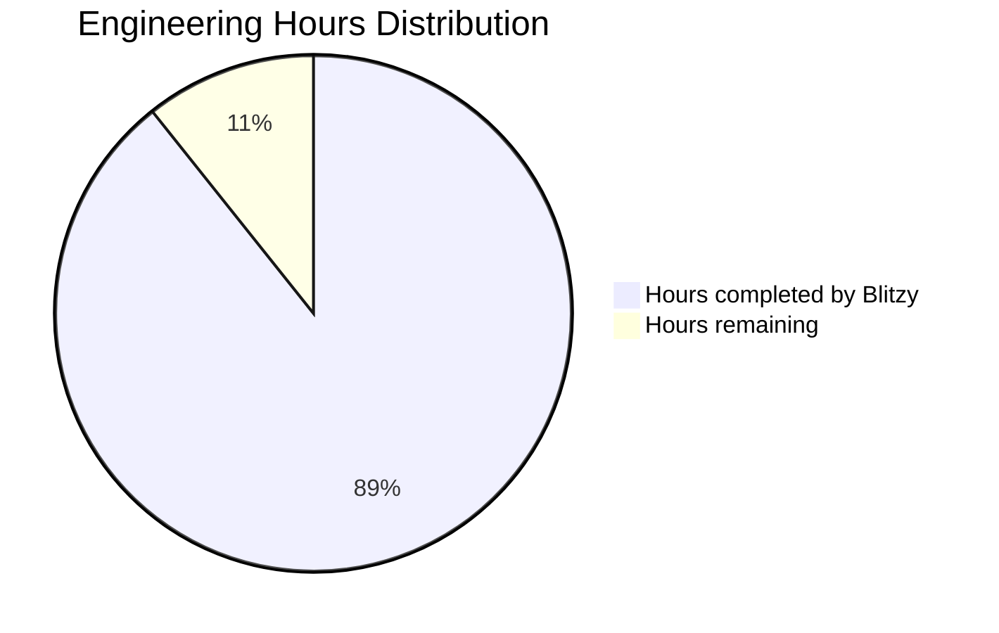

The project is approximately 89% complete, with most of the core functionality implemented across backend services and mobile applications. The remaining work primarily involves final integration testing, performance optimization, and preparing for production deployment.

## Completed Components

- **Backend Services**: Core API endpoints, database models, and service layers are fully implemented with proper error handling and security measures.
- **iOS Application**: User interface, encryption services, audio recording, and data synchronization components are complete.
- **Android Application**: Core functionality including audio recording, encryption, and UI components are implemented.
- **Security Features**: End-to-end encryption, secure authentication, and privacy controls are in place.
- **Infrastructure**: Deployment configurations, CI/CD pipelines, and monitoring setup are ready.

## Remaining Work

- **Integration Testing**: Comprehensive end-to-end testing across all platforms.
- **Performance Optimization**: Fine-tuning database queries and API response times.
- **Localization Refinement**: Ensuring all Spanish language content is properly implemented.
- **Production Deployment**: Final configuration for production environments.
- **Documentation**: Completing user guides and operational documentation.

The project is on track for completion with an estimated 150 engineering hours remaining before full production readiness.

# TECHNOLOGY STACK

## PROGRAMMING LANGUAGES

| Platform/Component | Language | Version | Justification |
|-------------------|----------|---------|---------------|
| iOS | Swift | 5.9+ | Native performance for audio processing, better security controls, and seamless iOS integration |
| Android | Kotlin | 1.9+ | Modern Android development with improved safety features and concise syntax |
| Backend | Python | 3.11+ | Excellent for rapid API development, strong encryption libraries, and data processing capabilities |
| Database Scripts | SQL | - | Required for complex queries and data migrations |

Swift and Kotlin were selected for their native performance capabilities, which are critical for the audio recording functionality that requires low latency and smooth user experience. Python was chosen for the backend due to its robust ecosystem for secure API development and data processing, which aligns with the application's focus on privacy and data analysis for emotional tracking.

## FRAMEWORKS & LIBRARIES

### Mobile Development

| Framework/Library | Version | Purpose | Justification |
|-------------------|---------|---------|---------------|
| SwiftUI | Latest | iOS UI development | Modern declarative UI framework for responsive interfaces |
| UIKit | Latest | iOS UI components | Required for custom audio recording components |
| Jetpack Compose | 1.5+ | Android UI development | Declarative UI toolkit for efficient development |
| Room | 2.6+ | Android local database | Provides abstraction layer over SQLite for local data storage |
| AVFoundation | Latest | iOS audio recording | Native audio processing with high performance |
| ExoPlayer | 2.19+ | Android media playback | Efficient audio playback with streaming capabilities |
| Alamofire | 5.8+ | iOS networking | Simplified HTTP networking with robust features |
| Retrofit | 2.9+ | Android networking | Type-safe HTTP client for API communication |
| KeychainAccess | 4.2+ | iOS secure storage | Simplified access to iOS Keychain for secure data storage |
| Security-Crypto | 1.1+ | Android secure storage | Encryption utilities for Android secure storage |
| Lottie | 4.3+ (iOS), 6.1+ (Android) | Animations | High-quality animations for improved user experience |
| Charts/MPAndroidChart | 4.1+ (iOS), 3.1+ (Android) | Data visualization | Visualizing emotional trends and progress |
| RxSwift/RxKotlin | 6.6+ | Reactive programming | Simplified asynchronous programming |
| Hilt | 2.48+ | Android dependency injection | Simplified dependency management |

### Backend Development

| Framework/Library | Version | Purpose | Justification |
|-------------------|---------|---------|---------------|
| FastAPI | 0.104+ | API framework | High-performance async framework with automatic documentation |
| SQLAlchemy | 2.0+ | ORM | Robust database abstraction for complex data relationships |
| Pydantic | 2.4+ | Data validation | Type checking and data validation for API requests/responses |
| Alembic | 1.12+ | Database migrations | Version-controlled database schema changes |
| PyJWT | 2.8+ | JWT authentication | Secure token-based authentication |
| cryptography | 41.0+ | Encryption | End-to-end encryption implementation |
| pandas | 2.1+ | Data analysis | Processing emotional data for visualization and insights |
| boto3 | 1.28+ | AWS SDK | Integration with AWS services for storage and security |
| uvicorn | 0.23+ | ASGI server | High-performance server for FastAPI applications |
| gunicorn | 21.2+ | WSGI HTTP server | Production-ready HTTP server |
| APScheduler | 3.10+ | Task scheduling | Background task scheduling for notifications and analytics |

These frameworks were selected to support the core requirements of voice journaling, emotional tracking, and secure data handling. FastAPI provides the performance needed for handling concurrent API requests, while the mobile frameworks enable the responsive and intuitive UI required for emotional check-ins and progress visualization.

## DATABASES & STORAGE

| Component | Technology | Version | Purpose | Justification |
|-----------|------------|---------|---------|---------------|
| Primary Database | PostgreSQL | 15+ | Relational data storage | Strong data integrity, complex query support for emotional data analysis |
| Document Storage | MongoDB | 6.0+ | Tool library content | Flexible schema for varied content types in the tool library |
| Caching | Redis | 7.0+ | Performance optimization | Fast in-memory caching for frequently accessed data |
| Audio Storage | Amazon S3 | - | Secure audio file storage | Scalable, secure object storage with encryption support |
| Local Storage | Core Data (iOS) | - | Offline data persistence | Native iOS data persistence framework |
| Local Storage | Room (Android) | - | Offline data persistence | SQLite wrapper for Android with ORM features |

The database architecture employs PostgreSQL for structured data that requires strong relationships (user profiles, emotional check-ins, progress data) while using MongoDB for the more flexible content in the tool library. Amazon S3 provides the secure, scalable storage needed for encrypted audio recordings with appropriate access controls.

## THIRD-PARTY SERVICES

| Service | Purpose | Justification |
|---------|---------|---------------|
| AWS | Cloud infrastructure | Comprehensive suite of secure, scalable services |
| Amazon Cognito | User authentication | Secure, scalable authentication service with MFA support |
| Amazon CloudFront | Content delivery | Fast delivery of tool library content with edge caching |
| AWS KMS | Encryption key management | Secure management of encryption keys for end-to-end encryption |
| Firebase Analytics | Usage analytics | Privacy-focused analytics for understanding user behavior |
| Firebase Cloud Messaging | Push notifications | Reliable notification delivery for reminders and affirmations |
| Sentry | Error monitoring | Real-time error tracking to ensure application stability |
| AWS CloudWatch | System monitoring | Comprehensive monitoring of backend services |

These services were selected to support the application's requirements for security, scalability, and performance. AWS provides the infrastructure needed for secure data storage and processing, while Firebase services enable essential mobile app features like notifications and analytics with privacy considerations in mind.

## DEVELOPMENT & DEPLOYMENT

| Component | Technology | Purpose | Justification |
|-----------|------------|---------|---------------|
| Version Control | Git/GitHub | Code management | Industry standard with strong collaboration features |
| CI/CD | GitHub Actions | Automated pipeline | Seamless integration with GitHub repositories |
| Containerization | Docker | Backend deployment | Consistent environments across development and production |
| Container Orchestration | Amazon ECS | Service management | Scalable, resilient backend service deployment |
| Infrastructure as Code | Terraform | Infrastructure management | Reproducible infrastructure with version control |
| API Documentation | Swagger/OpenAPI | API specification | Automated documentation for backend APIs |
| Mobile Build | Xcode Cloud | iOS build pipeline | Native iOS build system with CI/CD capabilities |
| Mobile Build | Gradle | Android build system | Flexible build configuration for Android |
| Code Quality | SonarQube | Code analysis | Automated code quality and security scanning |
| Testing | XCTest, JUnit, pytest | Automated testing | Comprehensive test coverage across platforms |

The development and deployment stack focuses on automation and consistency to ensure reliable delivery of features. Docker and ECS provide the scalability needed to support growth in the user base, while CI/CD automation ensures consistent quality across releases.

## ARCHITECTURE DIAGRAM

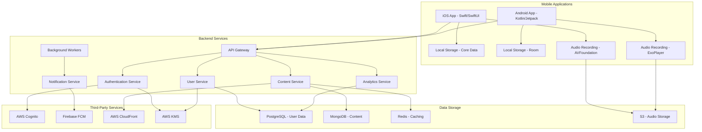

This architecture supports the core requirements of Amira Wellness, with a focus on secure data handling, responsive user experience, and scalable infrastructure to accommodate growth. The separation of concerns between services allows for independent scaling and maintenance of each component.

## SECURITY FEATURES

| Security Feature | Implementation | Purpose |
|------------------|----------------|---------|
| End-to-End Encryption | AES-256-GCM | Ensures user data can only be decrypted on their devices |
| Secure Authentication | JWT with OAuth 2.0 | Provides secure, stateless authentication |
| Multi-Factor Authentication | Optional for sensitive operations | Adds additional security layer for critical actions |
| Secure Local Storage | Keychain (iOS), EncryptedSharedPreferences (Android) | Protects sensitive data on device |
| API Security | TLS 1.3, rate limiting | Prevents API abuse and ensures secure communication |
| Data Privacy Controls | User-controlled data management | Allows users to export or delete their data |
| Vulnerability Scanning | Automated security testing | Identifies and addresses security issues early |

Security is a core principle of the Amira Wellness application, with particular emphasis on protecting sensitive emotional data through end-to-end encryption and comprehensive security controls at all levels of the application.

# System Architecture and Components

## 1. Architecture Overview

Amira Wellness employs a client-server architecture with native mobile applications communicating with cloud-based backend services. The system follows a layered architecture pattern with clear separation of concerns between presentation, business logic, and data layers.

### 1.1 Key Architectural Principles

- **Privacy by Design**: End-to-end encryption for sensitive user data, particularly voice recordings
- **Scalability**: Horizontally scalable microservices to accommodate user growth
- **Resilience**: Fault-tolerant design with graceful degradation capabilities
- **Modularity**: Loosely coupled components to enable independent development and deployment
- **Offline-First**: Core functionality available without internet connection

### 1.2 High-Level Architecture Diagram

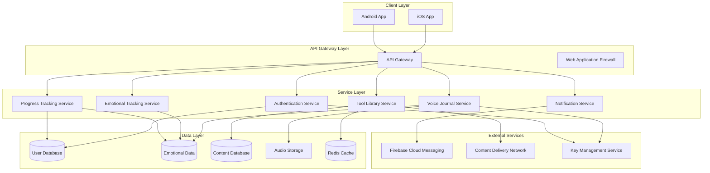

## 2. Client Layer

The client layer consists of native mobile applications for iOS and Android platforms, serving as the primary interface for users to access emotional wellness tools, record voice journals, track emotional states, and monitor their progress.

### 2.1 iOS Application

- **Language**: Swift 5.9+
- **UI Framework**: SwiftUI with UIKit components where needed
- **Minimum iOS Version**: iOS 14.0
- **Target Devices**: iPhone and iPad
- **Reactive Framework**: Combine
- **Architecture Pattern**: MVVM (Model-View-ViewModel)

#### 2.1.1 Key Components

- **View Layer**: SwiftUI views and UIKit components
- **ViewModel Layer**: Business logic and state management
- **Service Layer**: Network, storage, and utility services
- **Model Layer**: Data models and business entities

#### 2.1.2 Project Structure

```
AmiraWellness/
├── Config/                 # App configuration
├── Core/
│   ├── Constants/          # App-wide constants
│   ├── Extensions/         # Swift extensions
│   ├── Modifiers/          # SwiftUI modifiers
│   ├── Utilities/          # Utility classes
│   └── DI/                 # Dependency injection
├── Models/                 # Data models
├── Services/
│   ├── Network/            # API client
│   ├── Authentication/     # Auth services
│   ├── Encryption/         # Encryption services
│   ├── Storage/            # Data persistence
│   ├── Journal/            # Journal services
│   ├── Emotion/            # Emotion tracking
│   ├── Tool/               # Tool library
│   ├── Progress/           # Progress tracking
│   └── Notification/       # Notifications
├── UI/
│   ├── Components/         # Reusable UI components
│   ├── Navigation/         # Navigation system
│   └── Screens/            # App screens
└── Resources/              # Assets and resources
```

### 2.2 Android Application

- **Language**: Kotlin 1.9+
- **UI Framework**: Jetpack Compose with some XML layouts for compatibility
- **Minimum Android Version**: Android 8.0 (API 26)
- **Target Devices**: Phones and tablets with >2GB RAM
- **Reactive Framework**: Kotlin Coroutines and Flow
- **Architecture Pattern**: MVVM (Model-View-ViewModel)

#### 2.2.1 Key Components

- **View Layer**: Jetpack Compose UI components
- **ViewModel Layer**: Business logic and state management
- **Repository Layer**: Data access abstraction
- **Data Layer**: Local and remote data sources
- **Domain Layer**: Business use cases

#### 2.2.2 Project Structure

```
com.amirawellness/
├── config/                 # App configuration
├── core/
│   ├── constants/          # App-wide constants
│   ├── extensions/         # Kotlin extensions
│   └── utils/              # Utility classes
├── data/
│   ├── models/             # Data models
│   ├── local/              # Local data sources
│   ├── remote/             # Remote data sources
│   └── repositories/       # Repository implementations
├── di/                     # Dependency injection
├── domain/
│   └── usecases/           # Business logic use cases
├── services/
│   ├── encryption/         # Encryption services
│   ├── audio/              # Audio recording/playback
│   ├── notification/       # Notification services
│   ├── biometric/          # Biometric authentication
│   ├── sync/               # Synchronization
│   └── analytics/          # Analytics tracking
├── ui/
│   ├── theme/              # App theme
│   ├── navigation/         # Navigation components
│   ├── components/         # Reusable UI components
│   └── screens/            # App screens
└── AmiraApplication.kt     # Application class
```

### 2.3 Common Client Features

- **End-to-End Encryption**: Client-side encryption for sensitive data
- **Offline Support**: Core functionality available without internet connection
- **Reactive UI**: Responsive interface with reactive programming patterns
- **Dependency Injection**: Modular and testable code through DI
- **Secure Storage**: Platform-specific secure storage for sensitive data
- **Biometric Authentication**: TouchID/FaceID on iOS, Fingerprint/Face on Android

## 3. API Gateway Layer

The API Gateway serves as the entry point for all client requests, providing a unified interface to backend services.

### 3.1 Components

- **Request Routing**: Directs requests to appropriate backend services
- **Authentication**: Verifies user identity and token validity
- **Authorization**: Enforces access control policies
- **Rate Limiting**: Prevents abuse through request throttling
- **Request Validation**: Ensures request format and content validity
- **Response Formatting**: Standardizes API responses
- **Logging**: Records API access for monitoring and troubleshooting

### 3.2 Implementation

- **Technology**: AWS API Gateway
- **Security**: WAF (Web Application Firewall) for threat protection
- **Authentication**: Custom authorizers for JWT validation
- **Documentation**: OpenAPI/Swagger for API documentation

## 4. Service Layer

The service layer consists of microservices organized by domain functionality, each responsible for a specific aspect of the application.

### 4.1 Authentication Service

Responsible for user identity and access management.

#### 4.1.1 Key Features

- User registration and authentication
- JWT token issuance and validation
- Password management (reset, change)
- Session management
- Multi-device support

#### 4.1.2 Implementation

- **Framework**: FastAPI
- **Authentication**: JWT with OAuth 2.0
- **Password Hashing**: Argon2id
- **Integration**: Amazon Cognito

#### 4.1.3 API Endpoints

- `POST /auth/register` - Register a new user
- `POST /auth/login` - Authenticate user and get tokens
- `POST /auth/refresh` - Refresh access token
- `POST /auth/logout` - Logout user and invalidate tokens
- `POST /auth/reset-password` - Request password reset
- `POST /auth/reset-password-confirm` - Confirm password reset
- `POST /auth/verify-email` - Verify user email

### 4.2 Voice Journal Service

Manages voice recordings and associated metadata.

#### 4.2.1 Key Features

- Audio recording storage and retrieval
- End-to-end encryption of recordings
- Pre/post emotional check-in association
- Journal metadata management
- Export and sharing capabilities

#### 4.2.2 Implementation

- **Framework**: FastAPI
- **Storage**: Amazon S3 for encrypted audio files
- **Encryption**: Client-side AES-256-GCM
- **Database**: PostgreSQL for metadata

#### 4.2.3 API Endpoints

- `POST /journals` - Create a new journal entry
- `GET /journals` - Get user's journal entries
- `GET /journals/{id}` - Get a specific journal entry
- `GET /journals/{id}/audio` - Get journal audio data
- `POST /journals/filter` - Filter journal entries
- `PUT /journals/{id}/favorite` - Mark journal as favorite
- `DELETE /journals/{id}/favorite` - Remove journal from favorites
- `DELETE /journals/{id}` - Delete a journal entry
- `POST /journals/{id}/export` - Export a journal entry

### 4.3 Emotional Tracking Service

Processes and analyzes emotional check-in data.

#### 4.3.1 Key Features

- Emotional state recording and retrieval
- Trend analysis and pattern detection
- Emotional shift analysis
- Insight generation
- Tool recommendations based on emotional state

#### 4.3.2 Implementation

- **Framework**: FastAPI
- **Database**: TimescaleDB for time-series data
- **Analytics**: Custom analysis algorithms
- **Integration**: Tool Library Service for recommendations

#### 4.3.3 API Endpoints

- `POST /emotions` - Create a new emotional check-in
- `GET /emotions` - Get user's emotional check-ins
- `GET /emotions/{id}` - Get a specific emotional check-in
- `POST /emotions/filter` - Filter emotional check-ins
- `GET /emotions/distribution` - Get emotion distribution
- `POST /emotions/trends` - Analyze emotional trends
- `POST /emotions/patterns` - Detect emotional patterns
- `GET /emotions/insights` - Generate emotional insights
- `POST /emotions/recommendations` - Get tool recommendations

### 4.4 Tool Library Service

Manages the catalog of emotional regulation tools.

#### 4.4.1 Key Features

- Tool content management
- Categorization and tagging
- Personalized recommendations
- Usage tracking
- Favorites management

#### 4.4.2 Implementation

- **Framework**: FastAPI
- **Database**: MongoDB for flexible content storage
- **Caching**: Redis for performance optimization
- **Content Delivery**: CloudFront CDN

#### 4.4.3 API Endpoints

- `GET /tools/categories` - Get tool categories
- `GET /tools/categories/{id}` - Get tools in category
- `GET /tools/{id}` - Get a specific tool
- `GET /tools/search` - Search for tools
- `GET /tools/favorites` - Get favorite tools
- `PUT /tools/{id}/favorite` - Add tool to favorites
- `DELETE /tools/{id}/favorite` - Remove tool from favorites
- `POST /tools/{id}/usage` - Track tool engagement

### 4.5 Progress Tracking Service

Analyzes user activity and tracks progress.

#### 4.5.1 Key Features

- Streak calculation and management
- Achievement tracking
- Usage statistics
- Visualization data generation
- Progress insights

#### 4.5.2 Implementation

- **Framework**: FastAPI
- **Database**: PostgreSQL with analytics extensions
- **Integration**: Multiple service data aggregation
- **Visualization**: Data preparation for client rendering

#### 4.5.3 API Endpoints

- `GET /progress/streak` - Get user streak information
- `GET /progress/achievements` - Get user achievements
- `GET /progress/trends` - Get emotional trends
- `GET /progress/statistics` - Get usage statistics
- `GET /progress/insights` - Get progress insights

### 4.6 Notification Service

Manages alerts, reminders, and affirmations.

#### 4.6.1 Key Features

- Scheduled notifications
- Achievement notifications
- Reminder management
- Affirmation delivery
- Notification preferences

#### 4.6.2 Implementation

- **Framework**: FastAPI
- **Background Processing**: Celery for scheduled tasks
- **Push Notifications**: Firebase Cloud Messaging (FCM)
- **Scheduling**: Cron-based and event-based triggers

#### 4.6.3 API Endpoints

- `GET /notifications` - Get user notifications
- `POST /notifications/settings` - Update notification settings
- `POST /notifications/test` - Send test notification
- `DELETE /notifications/{id}` - Dismiss notification
- `GET /notifications/scheduled` - Get scheduled notifications

## 5. Data Layer

The data layer employs a polyglot persistence approach, using different database technologies optimized for specific data types and access patterns.

### 5.1 Database Technologies

#### 5.1.1 PostgreSQL

Used for structured relational data:
- User accounts and profiles
- Authentication data
- Journal metadata
- Relationships between entities

**Key characteristics**:
- Strong data consistency
- Complex query support
- Transactional integrity
- Row-level security for data isolation

#### 5.1.2 TimescaleDB

Used for time-series emotional data:
- Emotional check-ins
- Trend data
- Activity logs

**Key characteristics**:
- Optimized for time-series data
- Efficient time-based queries
- Automatic partitioning by time
- Advanced aggregation capabilities

#### 5.1.3 MongoDB

Used for flexible content storage:
- Tool library content
- Content metadata
- Categorization data

**Key characteristics**:
- Flexible schema for varied content types
- Document-oriented structure
- Rich query capabilities
- Efficient for content retrieval

#### 5.1.4 Amazon S3

Used for object storage:
- Encrypted voice recordings
- Exported files
- Large media assets

**Key characteristics**:
- Scalable object storage
- Server-side encryption
- Lifecycle policies
- Access control policies

#### 5.1.5 Redis

Used for caching and ephemeral data:
- API response caching
- Session data
- Rate limiting counters
- Temporary data

**Key characteristics**:
- In-memory performance
- Data structure support
- Automatic expiration
- Pub/sub capabilities

### 5.2 Data Models

#### 5.2.1 User Data Model

```
User
├── id: UUID
├── email: String
├── password_hash: String
├── created_at: Timestamp
├── updated_at: Timestamp
├── last_login: Timestamp
├── account_status: String
├── email_verified: Boolean
├── encryption_key_salt: String
├── subscription_tier: String
└── language_preference: String

UserProfile
├── id: UUID
├── user_id: UUID (FK to User)
├── display_name: String
├── preferences: JSON
└── settings: JSON

UserDevice
├── id: UUID
├── user_id: UUID (FK to User)
├── device_id: String
├── device_name: String
├── platform: String
├── push_token: String
├── last_active: Timestamp
└── is_active: Boolean
```

#### 5.2.2 Journal Data Model

```
Journal
├── id: UUID
├── user_id: UUID (FK to User)
├── created_at: Timestamp
├── duration_seconds: Integer
├── title: String
├── is_favorite: Boolean
├── storage_path: String
├── encryption_iv: Binary
├── is_uploaded: Boolean
├── is_deleted: Boolean
└── deleted_at: Timestamp

AudioMetadata
├── id: UUID
├── journal_id: UUID (FK to Journal)
├── format: String
├── sample_rate: Integer
├── bit_rate: Integer
├── channels: Integer
├── file_size: Integer
└── checksum: String
```

#### 5.2.3 Emotional Data Model

```
EmotionalCheckin
├── id: UUID
├── user_id: UUID (FK to User)
├── emotion_type_id: Integer (FK to EmotionType)
├── intensity: Integer (1-10)
├── context: String
├── notes: Text
├── created_at: Timestamp
├── related_journal_id: UUID (FK to Journal, optional)
└── related_tool_id: UUID (FK to Tool, optional)

EmotionType
├── id: Integer
├── name: String
├── description: String
└── category: String
```

#### 5.2.4 Tool Data Model

```
Tool
├── id: UUID
├── category_id: Integer (FK to ToolCategory)
├── name: String
├── description: Text
├── content_type: String
├── content: JSON
├── estimated_duration: Integer
├── created_at: Timestamp
├── updated_at: Timestamp
├── is_active: Boolean
└── target_emotions: Array<Integer> (FK to EmotionType)

ToolCategory
├── id: Integer
├── name: String
├── description: String
└── icon_url: String

ToolFavorite
├── id: UUID
├── user_id: UUID (FK to User)
├── tool_id: UUID (FK to Tool)
└── created_at: Timestamp

ToolUsage
├── id: UUID
├── user_id: UUID (FK to User)
├── tool_id: UUID (FK to Tool)
├── started_at: Timestamp
├── completed_at: Timestamp
├── duration_seconds: Integer
└── completion_status: String
```

#### 5.2.5 Progress Data Model

```
UserActivity
├── id: UUID
├── user_id: UUID (FK to User)
├── activity_type_id: Integer (FK to ActivityType)
├── created_at: Timestamp
├── metadata: JSON
└── related_entity_id: UUID (optional)

ActivityType
├── id: Integer
├── name: String
└── description: String

UserStreak
├── id: UUID
├── user_id: UUID (FK to User)
├── current_streak: Integer
├── longest_streak: Integer
├── last_activity_date: Date
└── updated_at: Timestamp

UserAchievement
├── id: UUID
├── user_id: UUID (FK to User)
├── achievement_type_id: Integer (FK to AchievementType)
├── earned_at: Timestamp
└── metadata: JSON

AchievementType
├── id: Integer
├── name: String
├── description: String
├── criteria: JSON
└── icon_url: String
```

## 6. Security Architecture

Security is a fundamental aspect of the Amira Wellness architecture, with particular emphasis on protecting sensitive emotional data and voice recordings.

### 6.1 End-to-End Encryption

The application implements true end-to-end encryption for sensitive user data:

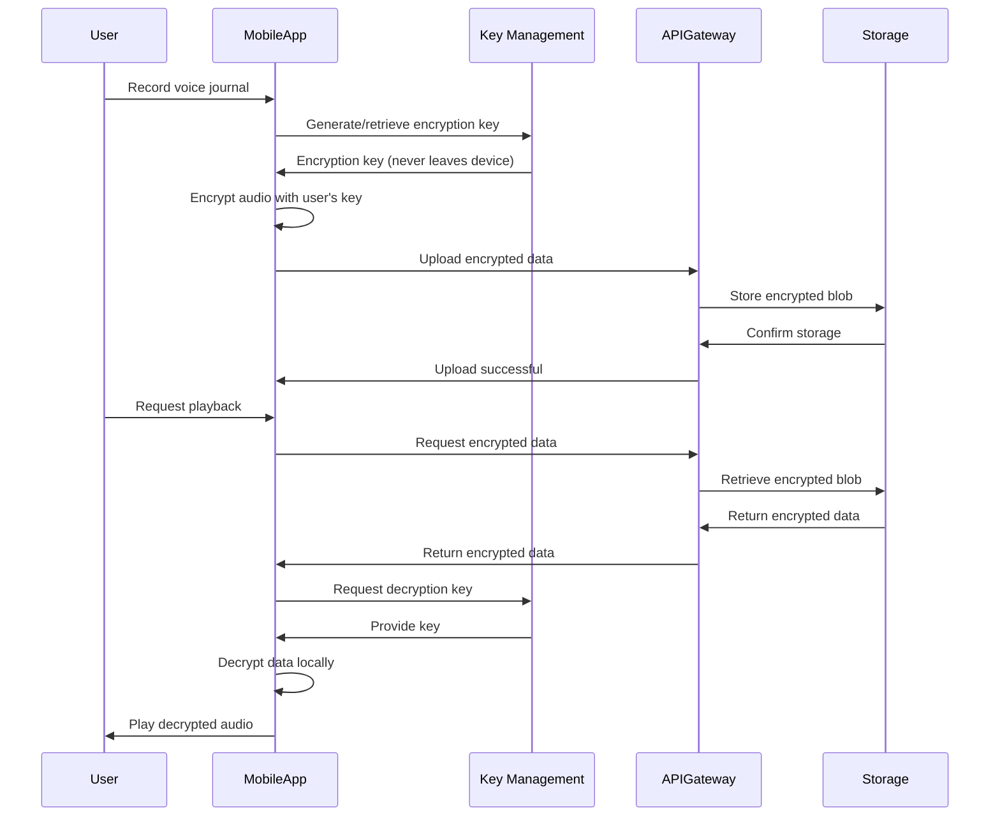

#### 6.1.1 Key Components

1. **Client-side encryption**: All sensitive data is encrypted on the user's device before transmission
2. **User-controlled keys**: Encryption keys are derived from user credentials and never leave the device
3. **Zero-knowledge design**: Server infrastructure never has access to unencrypted data or encryption keys
4. **Complete privacy**: Even Amira Wellness staff cannot access users' sensitive content

#### 6.1.2 Encryption Algorithms

- **Algorithm**: AES-256-GCM (Advanced Encryption Standard with Galois/Counter Mode)
- **Key Length**: 256 bits (32 bytes)
- **IV Length**: 96 bits (12 bytes)
- **Authentication Tag Length**: 128 bits (16 bytes)

### 6.2 Authentication Framework

The application implements a comprehensive authentication framework:

#### 6.2.1 Authentication Methods

- **Primary**: Email/password with JWT tokens
- **Secondary**: Biometric authentication on device (TouchID/FaceID, Fingerprint)
- **Future**: Social login options

#### 6.2.2 Token Management

- Short-lived access tokens (15 minutes)
- Refresh token rotation for secure session management
- Secure token storage using platform security features

#### 6.2.3 Password Security

- Argon2id password hashing with appropriate work factors
- Strong password requirements
- Secure password reset workflow
- Rate limiting on authentication attempts

### 6.3 Data Protection

#### 6.3.1 Data Classification

- **Highly Sensitive** (End-to-End Encrypted): Voice recordings, emotional check-in data
- **Sensitive** (Encrypted at Rest): User profile information, app settings
- **Non-Sensitive** (Standard Protection): Public content, anonymized analytics

#### 6.3.2 Storage Security

- **iOS**: Keychain for sensitive data, Data Protection for files
- **Android**: Keystore for keys, EncryptedSharedPreferences for sensitive data
- **Backend**: Encrypted databases, S3 with server-side encryption

#### 6.3.3 Transport Security

- TLS 1.3 for all API communications
- Certificate pinning in mobile applications
- Strong cipher suites with perfect forward secrecy

### 6.4 Privacy Controls

#### 6.4.1 User Controls

- Complete data export capability
- Account deletion with data purging
- Granular notification permissions
- Transparency about data usage

#### 6.4.2 Data Minimization

- Collection of only necessary data
- Anonymization where possible
- Automatic purging of unnecessary data
- Privacy-preserving analytics

## 7. Offline Capabilities

The Amira Wellness mobile applications implement an offline-first approach to ensure core functionality is available even without internet connectivity.

### 7.1 Local Data Storage

#### 7.1.1 iOS Implementation

- **Core Data**: For structured data (user profile, emotional states, journal metadata)
- **FileManager**: For encrypted audio files and other binary data
- **UserDefaults**: For app preferences and non-sensitive settings
- **Keychain**: For secure storage of authentication tokens and encryption keys

#### 7.1.2 Android Implementation

- **Room Database**: For structured data with SQL support
- **DataStore**: For preferences and small datasets
- **File Storage**: For encrypted audio files with MediaStore integration
- **EncryptedSharedPreferences**: For secure storage of sensitive settings

### 7.2 Synchronization Strategy

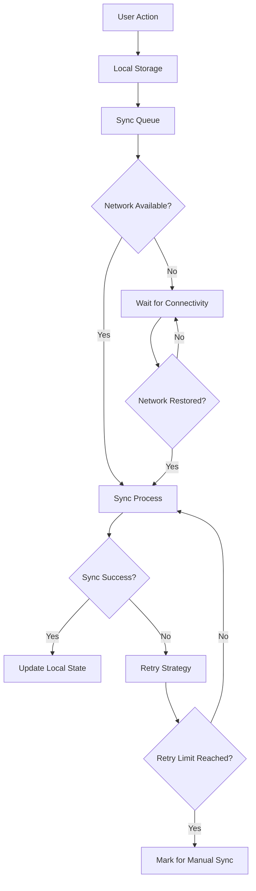

#### 7.2.1 Key Components

1. **Offline Queue**:
   - Records all changes made while offline
   - Prioritizes operations for synchronization
   - Handles dependencies between operations

2. **Conflict Resolution**:
   - Server-wins strategy for most data
   - Client-wins strategy for user content
   - Three-way merge for complex conflicts
   - User notification for unresolvable conflicts

3. **Sync Manager**:
   - Monitors network connectivity
   - Manages synchronization process
   - Implements retry strategies with exponential backoff
   - Provides sync status to UI

### 7.3 Offline Feature Support

The following features are fully functional offline:

1. **Voice Journaling**:
   - Recording and playback of voice journals
   - Emotional check-ins before and after recording
   - Local storage of encrypted recordings
   - Queuing for upload when online

2. **Emotional Check-ins**:
   - Recording emotional states
   - Basic emotional trend visualization
   - Local storage of emotional data

3. **Tool Library**:
   - Access to downloaded/cached tools
   - Favorited tools available offline
   - Basic tool usage tracking

4. **Progress Tracking**:
   - Basic streak calculation
   - Local achievement tracking
   - Limited progress visualization

## 8. Scalability and Performance

The Amira Wellness architecture is designed for scalability and performance to support growth in user base and usage patterns.

### 8.1 Scaling Approach

The system implements a multi-dimensional scaling strategy:

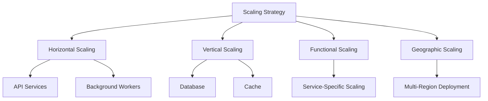

#### 8.1.1 Horizontal Scaling

Stateless services are designed for horizontal scaling:
- API services scale based on request load
- Background workers scale based on queue depth
- Auto-scaling groups with health checks
- Load balancing across instances

#### 8.1.2 Vertical Scaling

Stateful components scale vertically for performance:
- Database instances scale up for increased capacity
- Cache instances scale up for memory capacity
- Read replicas for read-heavy workloads

#### 8.1.3 Functional Scaling

Services scale independently based on specific requirements:
- Voice Journal Service scales based on recording volume
- Emotional Tracking Service scales based on check-in frequency
- Tool Library Service scales based on content access patterns

### 8.2 Performance Optimization

#### 8.2.1 Caching Strategy

The system implements a multi-level caching strategy:
- **API Response Caching**: Redis cache for frequent API responses
- **Content Caching**: CDN for static content delivery
- **Database Query Caching**: Result caching for expensive queries
- **Computed Results Caching**: Caching for expensive computations

#### 8.2.2 Database Optimization

Database performance is optimized through:
- Proper indexing for common query patterns
- Query optimization and monitoring
- Connection pooling for efficient resource usage
- Read replicas for read-heavy workloads
- Data partitioning for large tables (e.g., emotional check-ins)

#### 8.2.3 Mobile Performance

Performance optimizations for mobile devices include:
- Efficient cryptographic implementation
- Hardware acceleration where available
- Batched operations for efficiency
- Background processing for large operations
- Memory management and optimization

## 9. Resilience and Fault Tolerance

The Amira Wellness architecture implements resilience patterns to ensure system availability and data integrity even during component failures.

### 9.1 High Availability Design

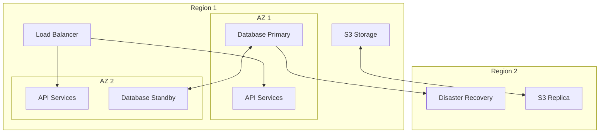

High availability is achieved through:
- Multi-AZ deployment for redundancy
- Auto-scaling groups for service instances
- Database replication with automated failover
- Stateless service design for easy replacement
- Load balancing across healthy instances

### 9.2 Fault Tolerance Mechanisms

#### 9.2.1 Circuit Breaker Pattern

The system implements circuit breakers for dependency failures:

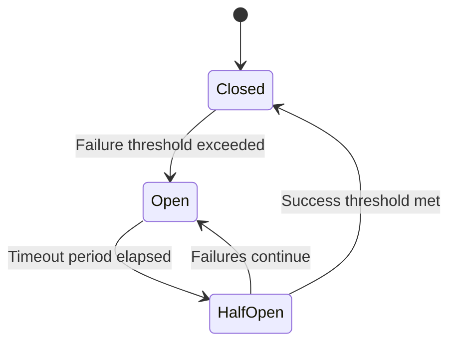

Circuit breakers are implemented for:
- Service-to-service communication
- Database connections
- External service integrations
- Storage operations

#### 9.2.2 Retry Mechanisms

Retry strategies are implemented for transient failures:
- Exponential backoff with jitter
- Maximum retry limits
- Retry budgets to prevent cascading failures
- Idempotent operations for safe retries

#### 9.2.3 Fallback Responses

Fallback mechanisms for degraded operation:
- Cached responses when live data is unavailable
- Default values for missing data
- Graceful degradation of features
- Clear user communication about limited functionality

### 9.3 Disaster Recovery

Disaster recovery capabilities include:
- Regular automated backups
- Point-in-time recovery for databases
- Cross-region replication for critical data
- Documented recovery procedures with regular testing

Recovery objectives:
- Recovery Time Objective (RTO): 1 hour for critical services
- Recovery Point Objective (RPO): 5 minutes for critical data

## 10. Integration Points

The Amira Wellness application integrates with several external systems to provide its core functionality.

### 10.1 External Services

#### 10.1.1 AWS Services

- **S3**: Secure storage for encrypted audio files
- **Cognito**: User authentication and identity management
- **CloudFront**: Content delivery network for static assets
- **KMS**: Key management for server-side encryption

#### 10.1.2 Firebase Services

- **Firebase Cloud Messaging (FCM)**: Push notification delivery
- **Firebase Analytics**: Anonymous usage analytics
- **Firebase Crashlytics**: Crash reporting and analysis

### 10.2 Integration Patterns

#### 10.2.1 API Integration

- RESTful APIs for service communication
- OpenAPI/Swagger for API documentation
- Versioned APIs for backward compatibility

#### 10.2.2 Event-Driven Integration

- Message queues for asynchronous processing
- Event sourcing for activity tracking
- Publish-subscribe for notifications

### 10.3 Mobile Platform Integration

#### 10.3.1 iOS Platform Integration

- AVFoundation for audio recording and playback
- LocalAuthentication for biometric authentication
- UserNotifications for local and push notifications
- HealthKit for future health data integration (planned)

#### 10.3.2 Android Platform Integration

- MediaRecorder for audio recording
- ExoPlayer for audio playback
- BiometricPrompt for biometric authentication
- NotificationManager for notifications
- WorkManager for background tasks

## 11. Deployment Architecture

The Amira Wellness backend is deployed using a containerized approach with AWS services for infrastructure.

### 11.1 Container Architecture

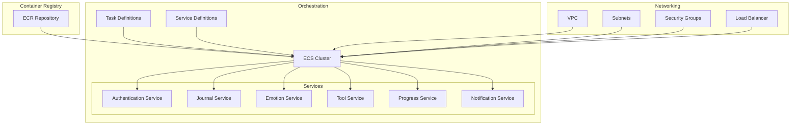

The deployment architecture uses:
- Docker containers for service packaging
- Amazon ECR for container registry
- Amazon ECS for container orchestration
- Fargate for serverless container execution
- Application Load Balancer for traffic distribution

### 11.2 Infrastructure as Code

The infrastructure is defined and managed using:
- Terraform for infrastructure provisioning
- AWS CloudFormation for AWS-specific resources
- GitHub Actions for CI/CD automation
- Infrastructure versioning in Git

### 11.3 Mobile App Deployment

#### 11.3.1 iOS Deployment

- Xcode Cloud for CI/CD pipeline
- TestFlight for beta distribution
- App Store for production distribution
- Fastlane for automation

#### 11.3.2 Android Deployment

- GitHub Actions for CI/CD pipeline
- Firebase App Distribution for beta testing
- Google Play Store for production distribution
- Gradle for build automation

## 12. Monitoring and Observability

The Amira Wellness application implements comprehensive monitoring to ensure system health, performance, and security.

### 12.1 Metrics Collection

| Component | Metrics Type | Collection Method | Retention |
|-----------|-------------|-------------------|-----------|
| Mobile Apps | Performance, crashes, usage | Firebase Performance, Sentry | 90 days |
| API Services | Request rates, latency, errors | CloudWatch, custom metrics | 13 months |
| Databases | Query performance, connections, storage | CloudWatch, database metrics | 13 months |
| Storage | Capacity, throughput, errors | CloudWatch S3 metrics | 13 months |

### 12.2 Logging Strategy

The logging system implements:
- Structured logging with consistent JSON format
- Centralized collection with CloudWatch Logs
- Privacy-aware logging that avoids capturing sensitive user data
- Tiered storage with hot storage for recent logs and cold storage for archives

### 12.3 Alerting System

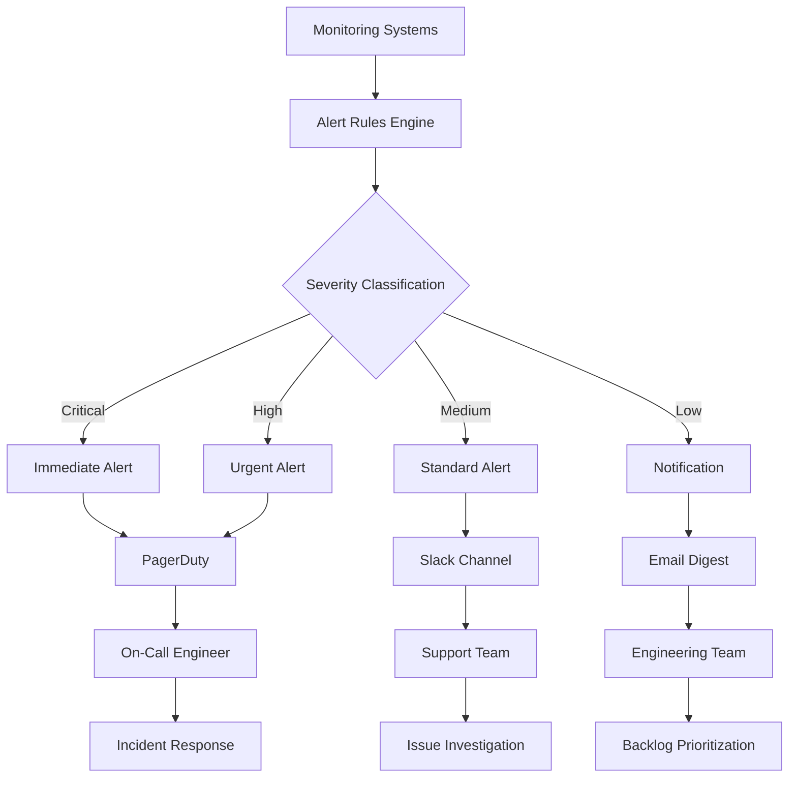

The alert management system includes:
- Multi-level severity classification based on user impact
- Intelligent alert grouping to prevent alert fatigue
- Automated routing based on component and issue type
- Escalation paths for unacknowledged critical alerts

### 12.4 Dashboards

The monitoring system includes purpose-built dashboards for different stakeholders:

1. **Operations Dashboard**
   - Real-time system health indicators
   - Active incidents and their status
   - Key performance metrics by component
   - Capacity utilization trends

2. **Development Dashboard**
   - Error rates and performance bottlenecks
   - Deployment status and version tracking
   - Feature usage statistics
   - Technical debt indicators

3. **Business Dashboard**
   - User acquisition and retention metrics
   - Feature engagement statistics
   - Emotional improvement trends
   - Subscription conversion rates (future)

## 13. Future Considerations

The Amira Wellness architecture is designed to accommodate future growth and feature expansion.

### 13.1 Planned Enhancements

1. **English Language Support**
   - Expanded internationalization framework
   - Language switching without app restart
   - Content adaptation for different cultures

2. **Community Features**
   - Privacy-focused social components
   - Content sharing with consent controls
   - Anonymous community insights

3. **AI Companion**
   - On-device ML for privacy-preserving analysis
   - Personalized recommendations
   - Natural language processing for journal insights
   - Emotion detection from voice

4. **Premium Subscription**
   - Feature flagging system
   - Subscription management
   - Payment processing integration
   - Entitlement verification

5. **Wearable Integration**
   - WatchOS and Wear OS extensions
   - Health data integration
   - Biometric monitoring
   - Quick emotional check-ins

### 13.2 Technical Improvements

1. **Enhanced Observability**
   - Distributed tracing with OpenTelemetry
   - Advanced analytics for user insights
   - Improved performance monitoring
   - Predictive scaling based on usage patterns

2. **Advanced Security**
   - Post-quantum cryptography preparation
   - Enhanced key management
   - Advanced threat detection
   - Improved privacy controls

3. **Scalability Enhancements**
   - Multi-region deployment
   - Enhanced caching strategies
   - Database sharding for horizontal scaling
   - Serverless expansion for improved scalability

4. **Developer Experience**
   - Improved CI/CD pipelines
   - Enhanced testing frameworks
   - Better documentation generation
   - Streamlined development workflows

# Amira Wellness Project Guide

## 1. Project Overview

Amira Wellness is a mobile application designed to support emotional well-being through accessible self-regulation tools, emotional release mechanisms, and personal growth tracking. The application addresses the growing need for private, judgment-free spaces where users can express emotions and develop healthy emotional habits.

### 1.1 Core Features

- **Voice Journaling**: Audio recording for emotional release with pre/post emotional check-ins
- **Emotional Check-Ins**: Simple tools to log emotional states and track changes over time
- **Tool Library**: Categorized collection of emotional regulation tools and exercises
- **Progress Tracking**: Visual representation of emotional patterns and usage streaks

### 1.2 Key Differentiators

- **Privacy-First Approach**: End-to-end encryption for all sensitive user data
- **Spanish-First Design**: Built specifically for Spanish-speaking users
- **Emotional Insight Generation**: Track emotional shifts before and after journaling
- **Minimalist, Nature-Inspired Design**: Creates a calm, trustworthy environment

### 1.3 Target Audience

Amira Wellness targets Spanish-speaking individuals (primarily ages 25-45) seeking emotional regulation tools. The application is designed to be accessible and intuitive, providing a safe space for emotional expression and growth.

## 2. Technical Architecture

### 2.1 System Architecture

Amira Wellness employs a client-server architecture with native mobile applications communicating with cloud-based backend services. The system follows a layered architecture pattern with clear separation of concerns between presentation, business logic, and data layers.

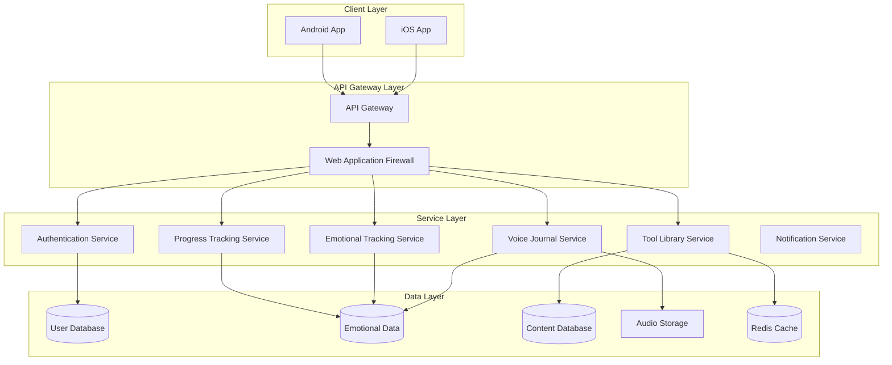

### 2.2 Technology Stack

#### Backend
- **Language**: Python 3.11+
- **Framework**: FastAPI
- **Database**: PostgreSQL 15+
- **Storage**: AWS S3 (encrypted)
- **Caching**: Redis

#### Mobile Applications
- **iOS**: Swift 5.9+, SwiftUI
- **Android**: Kotlin 1.9+, Jetpack Compose

#### Infrastructure
- **Cloud Provider**: AWS
- **Containerization**: Docker
- **Orchestration**: Amazon ECS with Fargate
- **IaC**: Terraform
- **CI/CD**: GitHub Actions

#### Security
- **Authentication**: JWT with OAuth 2.0
- **Encryption**: AES-256-GCM for end-to-end encryption
- **API Security**: TLS 1.3, rate limiting, WAF

### 2.3 Data Flow

1. **Voice Journaling Flow**:
   - User records audio journal with pre/post emotional check-ins
   - Audio is encrypted on device before transmission
   - Encrypted audio is stored in S3 with metadata in PostgreSQL
   - Emotional data is analyzed for patterns and insights

2. **Emotional Check-in Flow**:
   - User logs emotional state with type and intensity
   - Data is stored and analyzed for patterns
   - System generates recommendations based on emotional state
   - Visualizations show emotional trends over time

3. **Tool Library Flow**:
   - User browses categorized emotional regulation tools
   - System recommends tools based on emotional state
   - User engagement with tools is tracked for effectiveness
   - Favorites and usage history personalize recommendations

4. **Progress Tracking Flow**:
   - System tracks user activity and streaks
   - Achievements are unlocked based on usage patterns
   - Emotional data is visualized to show progress
   - Insights are generated to support emotional growth

## 3. Core Components

### 3.1 Voice Journaling

The Voice Journaling feature allows users to record audio journals with emotional check-ins before and after recording, providing a way to track emotional shifts through verbal expression.

#### Key Components:
- **Audio Recording Service**: Handles recording, playback, and storage of voice journals
- **Encryption Service**: Provides end-to-end encryption for privacy
- **Emotional Check-in Integration**: Links emotional states to journal entries
- **Storage Service**: Manages secure cloud storage of encrypted recordings

#### Data Model:
```
Journal
├── id: UUID
├── user_id: UUID (Foreign Key to User)
├── title: String (optional)
├── duration_seconds: Integer
├── storage_path: String
├── s3_key: String
├── encryption_iv: Text
├── encryption_tag: Text
├── audio_format: String
├── file_size_bytes: Integer
├── is_favorite: Boolean
├── is_uploaded: Boolean
├── is_deleted: Boolean
├── created_at: DateTime
└── updated_at: DateTime
```

#### Process Flow:
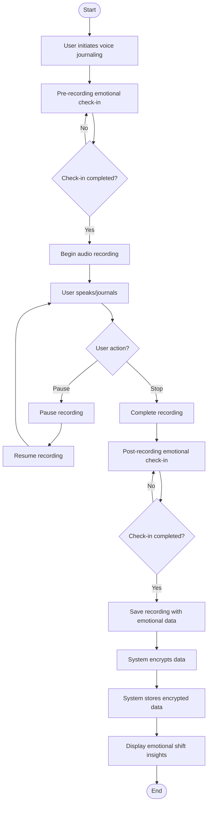

### 3.2 Emotional Check-ins

The Emotional Check-in feature allows users to log their emotional states, track changes over time, and receive personalized recommendations based on their emotional patterns.

#### Key Components:
- **Emotion Service**: Processes and stores emotional check-in data
- **Emotion Analysis Service**: Analyzes emotional patterns and trends
- **Recommendation Engine**: Suggests tools based on emotional state
- **Visualization Service**: Generates visual representations of emotional data

#### Data Model:
```
EmotionalCheckin
├── id: UUID
├── user_id: UUID (Foreign Key to User)
├── emotion_type: Enum (JOY, SADNESS, ANGER, etc.)
├── intensity: Integer (1-10)
├── context: Enum (PRE_JOURNALING, POST_JOURNALING, etc.)
├── notes: Text (optional)
├── related_journal_id: UUID (optional)
├── related_tool_id: UUID (optional)
├── created_at: DateTime
└── updated_at: DateTime

EmotionalTrend
├── id: UUID
├── user_id: UUID (Foreign Key to User)
├── period_type: Enum (DAY, WEEK, MONTH)
├── period_value: String
├── emotion_type: Enum
├── occurrence_count: Integer
├── average_intensity: Float
├── min_intensity: Integer
├── max_intensity: Integer
├── trend_direction: Enum (INCREASING, DECREASING, etc.)
├── created_at: DateTime
└── updated_at: DateTime
```

#### Process Flow:
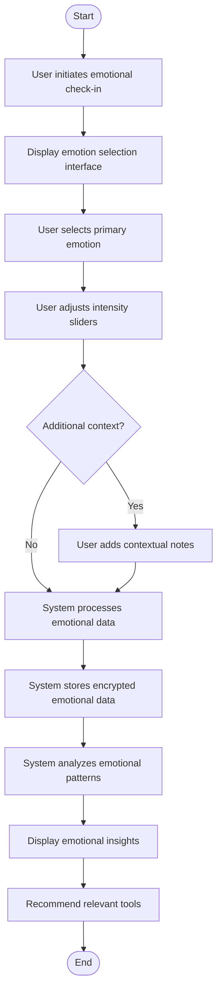

### 3.3 Tool Library

The Tool Library feature provides users with a categorized collection of emotional regulation tools and exercises, personalized based on their emotional state and preferences.

#### Key Components:
- **Tool Service**: Manages the catalog of emotional regulation tools
- **Content Service**: Delivers tool content to users
- **Recommendation Engine**: Suggests tools based on emotional state
- **Usage Tracking Service**: Monitors tool effectiveness

#### Data Model:
```
Tool
├── id: UUID
├── name: String
├── description: Text
├── category: Enum (BREATHING, MEDITATION, etc.)
├── content_type: Enum (TEXT, AUDIO, etc.)
├── content: JSON
├── estimated_duration: Integer
├── difficulty: Enum (BEGINNER, INTERMEDIATE, ADVANCED)
├── target_emotions: Array<Integer>
├── icon_url: String
├── is_active: Boolean
├── is_premium: Boolean
├── created_at: DateTime
└── updated_at: DateTime

ToolFavorite
├── id: UUID
├── user_id: UUID (Foreign Key to User)
├── tool_id: UUID (Foreign Key to Tool)
├── created_at: DateTime
└── updated_at: DateTime

ToolUsage
├── id: UUID
├── user_id: UUID (Foreign Key to User)
├── tool_id: UUID (Foreign Key to Tool)
├── duration_seconds: Integer
├── completed_at: DateTime
├── completion_status: String
├── pre_checkin_id: UUID (optional)
├── post_checkin_id: UUID (optional)
├── created_at: DateTime
└── updated_at: DateTime
```

#### Process Flow:
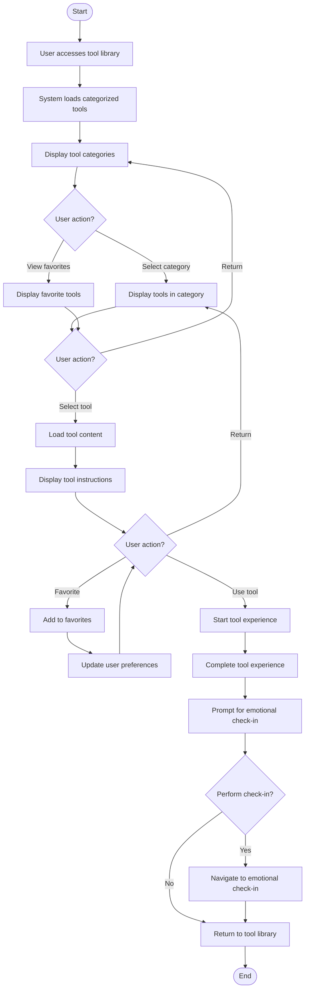

### 3.4 Progress Tracking

The Progress Tracking feature allows users to visualize their emotional patterns, track usage streaks, and earn achievements for consistent engagement with the application.

#### Key Components:
- **Streak Service**: Tracks consecutive days of app usage
- **Achievement Service**: Manages and awards achievements
- **Analytics Service**: Generates insights from user data
- **Visualization Service**: Creates visual representations of progress

#### Data Model:
```
Streak
├── id: UUID
├── user_id: UUID (Foreign Key to User)
├── current_streak: Integer
├── longest_streak: Integer
├── last_activity_date: Date
├── total_days_active: Integer
├── streak_history: JSON
├── grace_period_used_count: Integer
├── grace_period_reset_date: Date
├── grace_period_active: Boolean
├── created_at: DateTime
└── updated_at: DateTime

Achievement
├── id: UUID
├── achievement_type: Enum
├── category: Enum (MILESTONE, STREAK, etc.)
├── name_es: String
├── name_en: String
├── description_es: String
├── description_en: String
├── icon_url: String
├── points: Integer
├── is_hidden: Boolean
├── criteria: JSON
├── metadata: JSON
├── created_at: DateTime
└── updated_at: DateTime
```

#### Process Flow:
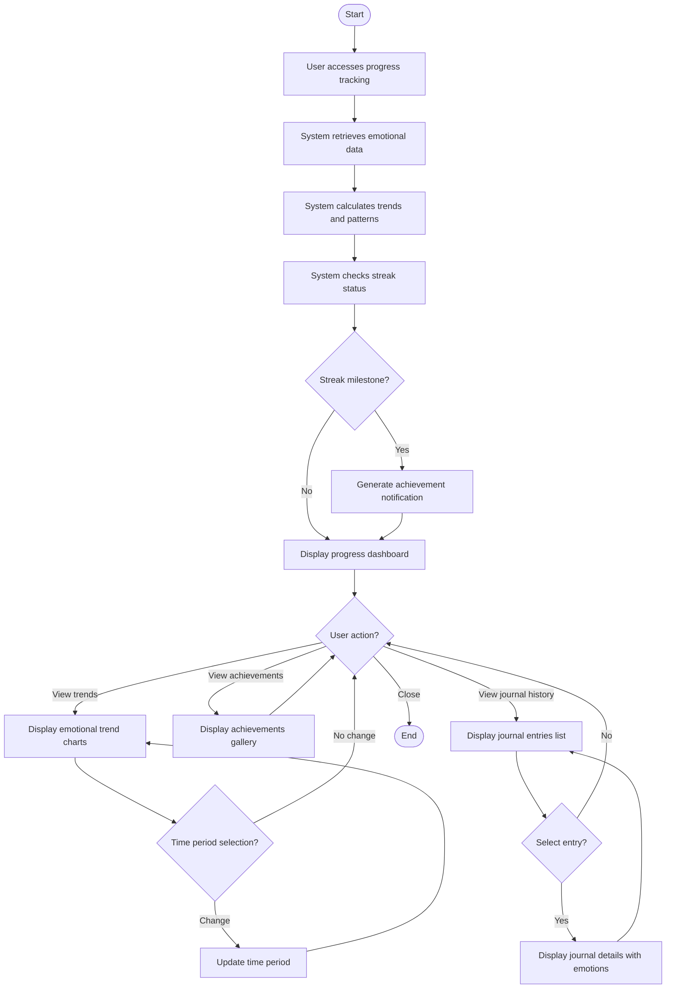

## 4. Security Implementation

### 4.1 End-to-End Encryption

Amira Wellness implements end-to-end encryption for sensitive user data, particularly voice recordings, ensuring that only the user can access their emotional content.

#### Key Components:
- **Key Management Service**: Handles secure generation and storage of encryption keys
- **Encryption Service**: Provides encryption and decryption functionality
- **Secure Storage Service**: Manages encrypted data storage

#### Encryption Flow:
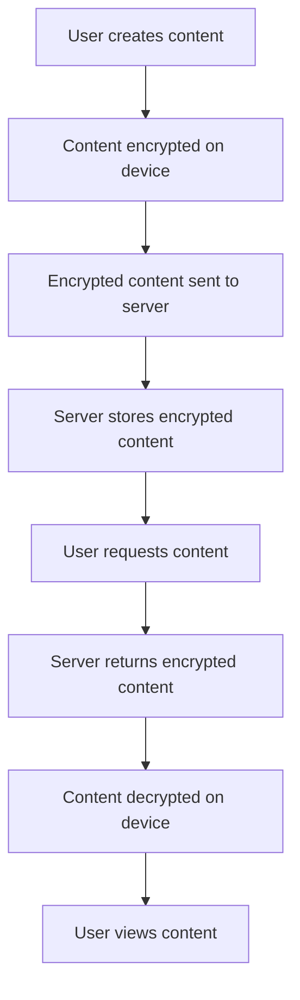

### 4.2 Authentication and Authorization

The application implements a secure authentication system with role-based access control to protect user data and ensure appropriate access levels.

#### Key Components:
- **Authentication Service**: Handles user authentication and token management
- **Authorization Service**: Enforces access control policies
- **Token Management Service**: Manages JWT tokens for secure API access

#### Authentication Flow:
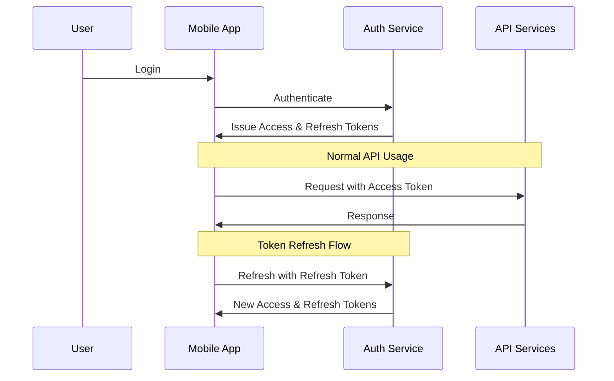

### 4.3 Data Privacy

Amira Wellness is built with privacy by design principles, implementing several measures to protect user data:

- **Minimal Data Collection**: Only essential data is collected for application functionality
- **User-Controlled Data**: Users have complete control over their data with export and deletion options
- **Secure Storage**: All sensitive data is encrypted at rest and in transit
- **Privacy Settings**: Granular privacy controls for user preferences

## 5. Mobile Implementation

### 5.1 iOS Application

The iOS application is built using Swift and SwiftUI, providing a native experience for Apple devices.

#### Key Components:
- **UI Layer**: SwiftUI views and components
- **Business Logic Layer**: Services and managers
- **Data Layer**: Local storage and API clients
- **Security Layer**: Encryption and authentication services

#### Architecture Pattern:
The iOS app follows the MVVM (Model-View-ViewModel) architecture pattern with a service-oriented approach for business logic.

### 5.2 Android Application

The Android application is built using Kotlin and Jetpack Compose, providing a native experience for Android devices.

#### Key Components:
- **UI Layer**: Jetpack Compose UI components
- **Business Logic Layer**: ViewModels and use cases
- **Data Layer**: Repositories and data sources
- **Security Layer**: Encryption and authentication services

#### Architecture Pattern:
The Android app follows the Clean Architecture pattern with MVVM for the presentation layer, using use cases for business logic and repositories for data access.

## 6. Backend Implementation

### 6.1 API Services

The backend is built using FastAPI, providing high-performance, asynchronous API endpoints for the mobile applications.

#### Key Components:
- **Authentication Service**: Handles user authentication and authorization
- **Journal Service**: Manages voice journal recordings and metadata
- **Emotion Service**: Processes emotional check-in data and analysis
- **Tool Service**: Provides access to the tool library and recommendations
- **Progress Service**: Tracks user progress and achievements

#### API Structure:
```
/api/v1
├── /auth
│   ├── /login
│   ├── /register
│   ├── /refresh
│   └── /logout
├── /journals
│   ├── /
│   ├── /{id}
│   └── /{id}/emotional-shift
├── /emotions
│   ├── /check-in
│   ├── /history
│   └── /trends
├── /tools
│   ├── /categories
│   ├── /
│   ├── /{id}
│   ├── /favorites
│   └── /recommendations
└── /progress
    ├── /streak
    ├── /achievements
    └── /insights
```

### 6.2 Database Design

The application uses PostgreSQL for structured data storage, with specialized models for different aspects of the application.

#### Key Database Models:
- **User**: User accounts and authentication data
- **Journal**: Voice journal metadata and references
- **EmotionalCheckin**: Emotional check-in data
- **Tool**: Tool library content and metadata
- **Streak**: User streak tracking
- **Achievement**: Achievement definitions and criteria

#### Database Schema:
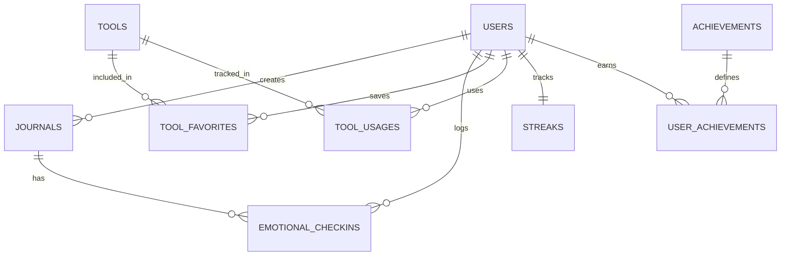

### 6.3 Background Processing

The application uses background processing for tasks that don't require immediate execution:

- **Emotional Analysis**: Processing emotional data for trends and insights
- **Streak Calculation**: Updating streak information and checking for achievements
- **Notification Delivery**: Sending push notifications for reminders and achievements
- **Storage Cleanup**: Managing temporary files and optimizing storage

## 7. Deployment and Infrastructure

### 7.1 Cloud Infrastructure

The application is deployed on AWS, using various services for different components:

- **Compute**: ECS with Fargate for containerized services
- **Storage**: S3 for encrypted audio storage, RDS for PostgreSQL
- **Networking**: VPC, ALB, CloudFront for content delivery
- **Security**: WAF, Shield, KMS for encryption key management
- **Monitoring**: CloudWatch, X-Ray for observability

### 7.2 CI/CD Pipeline

The application uses GitHub Actions for continuous integration and deployment:

- **Backend CI**: Runs tests, linting, and security scans for Python code
- **iOS CI**: Builds and tests the iOS application
- **Android CI**: Builds and tests the Android application
- **Security Scan**: Performs security analysis on all components
- **Deployment**: Automates deployment to staging and production environments

### 7.3 Monitoring and Alerting

The application implements comprehensive monitoring and alerting:

- **Application Monitoring**: Performance metrics, error rates, and user activity
- **Infrastructure Monitoring**: Resource utilization, availability, and scaling events
- **Security Monitoring**: Authentication attempts, encryption operations, and potential threats
- **Business Metrics**: User engagement, feature usage, and emotional trends

## 8. Future Enhancements

### 8.1 Planned Features

- **English Language Support**: Expanding to English-speaking users
- **Community Features**: Optional sharing of anonymized insights
- **AI Companion**: Personalized support based on emotional patterns
- **Integration with Wearable Devices**: Incorporating biometric data for enhanced insights
- **Desktop/Web Application**: Expanding platform availability

### 8.2 Technical Roadmap

- **Enhanced Analytics**: More sophisticated emotional pattern recognition
- **Improved Recommendation Engine**: Machine learning-based tool recommendations
- **Offline Mode**: Full functionality without internet connection
- **Performance Optimizations**: Reduced battery usage and improved responsiveness
- **Expanded Tool Library**: Additional categories and content types

## 9. Conclusion

Amira Wellness is a comprehensive emotional wellness application designed with privacy, accessibility, and effectiveness as core principles. By providing tools for voice journaling, emotional tracking, and self-regulation, the application supports users in developing healthy emotional habits and greater self-awareness.

The technical implementation balances security, performance, and user experience, creating a platform that users can trust with their emotional expression while providing valuable insights and growth opportunities.

# Project Structure

## Repository Organization

The Amira Wellness application is organized as a monorepo containing all components of the system, including mobile applications, backend services, infrastructure configurations, and documentation. This structure facilitates coordinated development and ensures consistency across all system components.

```mermaid
graph TD
    Root[Amira Wellness Repository] --> SRC[src/]
    Root --> Infrastructure[infrastructure/]
    Root --> Docs[docs/]
    Root --> Scripts[scripts/]
    Root --> GitHub[.github/]
    
    SRC --> Backend[backend/]
    SRC --> iOS[ios/]
    SRC --> Android[android/]
    
    Backend --> BackendApp[app/]
    Backend --> BackendTests[tests/]
    Backend --> BackendDeploy[deploy/]
    Backend --> BackendScripts[scripts/]
    Backend --> BackendMigrations[migrations/]
    
    iOS --> iOSApp[AmiraWellness/]
    iOS --> iOSTests[AmiraWellnessTests/]
    iOS --> iOSUITests[AmiraWellnessUITests/]
    
    Android --> AndroidApp[app/]
    Android --> AndroidGradle[gradle/]
    
    Infrastructure --> Kubernetes[kubernetes/]
    Infrastructure --> Docker[docker/]
    Infrastructure --> AWS[aws/]
    Infrastructure --> Terraform[terraform/]
    
    Docs --> Architecture[architecture/]
    Docs --> API[api/]
    Docs --> Deployment[deployment/]
    Docs --> Development[development/]
    Docs --> Security[security/]
    
    Scripts --> DevScripts[development scripts]
    Scripts --> DeployScripts[deployment scripts]
    
    GitHub --> Workflows[workflows/]
    GitHub --> Templates[ISSUE_TEMPLATE/]
```

## Source Code Structure

### Backend (Python/FastAPI)

The backend follows a modular architecture with clear separation of concerns:

```
src/backend/
├── app/                    # Main application package
│   ├── api/                # API routes and endpoints
│   │   ├── deps.py         # Dependency injection
│   │   ├── errors.py       # Error handling
│   │   └── routes/         # API route modules
│   ├── background/         # Background processing
│   │   ├── jobs/           # Background job definitions
│   │   ├── scheduler.py    # Job scheduling
│   │   ├── tasks.py        # Task definitions
│   │   └── worker.py       # Worker implementation
│   ├── constants/          # Application constants
│   │   ├── achievements.py # Achievement definitions
│   │   ├── emotions.py     # Emotion type definitions
│   │   ├── error_codes.py  # Error code definitions
│   │   ├── languages.py    # Supported languages
│   │   └── tools.py        # Tool category definitions
│   ├── core/               # Core functionality
│   │   ├── config.py       # Application configuration
│   │   ├── encryption.py   # Encryption utilities
│   │   ├── events.py       # Event handling
│   │   ├── exceptions.py   # Custom exceptions
│   │   ├── logging.py      # Logging configuration
│   │   └── security.py     # Security utilities
│   ├── crud/               # Database operations
│   │   ├── base.py         # Base CRUD operations
│   │   ├── achievement.py  # Achievement operations
│   │   ├── device.py       # Device operations
│   │   ├── emotion.py      # Emotion operations
│   │   ├── journal.py      # Journal operations
│   │   ├── notification.py # Notification operations
│   │   ├── progress.py     # Progress operations
│   │   ├── streak.py       # Streak operations
│   │   ├── tool.py         # Tool operations
│   │   └── user.py         # User operations
│   ├── db/                 # Database setup
│   │   ├── base.py         # Base models
│   │   ├── init_db.py      # Database initialization
│   │   └── session.py      # Database session
│   ├── middleware/         # Request/response middleware
│   │   ├── authentication.py # Authentication middleware
│   │   ├── error_handler.py  # Error handling middleware
│   │   ├── logging.py        # Logging middleware
│   │   └── rate_limiter.py   # Rate limiting middleware
│   ├── models/             # SQLAlchemy models
│   │   ├── achievement.py  # Achievement model
│   │   ├── base.py         # Base model
│   │   ├── device.py       # Device model
│   │   ├── emotion.py      # Emotion model
│   │   ├── journal.py      # Journal model
│   │   ├── notification.py # Notification model
│   │   ├── progress.py     # Progress model
│   │   ├── streak.py       # Streak model
│   │   ├── tool.py         # Tool model
│   │   └── user.py         # User model
│   ├── schemas/            # Pydantic schemas
│   │   ├── auth.py         # Authentication schemas
│   │   ├── common.py       # Common schemas
│   │   ├── emotion.py      # Emotion schemas
│   │   ├── journal.py      # Journal schemas
│   │   ├── notification.py # Notification schemas
│   │   ├── progress.py     # Progress schemas
│   │   ├── tool.py         # Tool schemas
│   │   └── user.py         # User schemas
│   ├── services/           # Business logic services
│   │   ├── analytics.py    # Analytics service
│   │   ├── auth.py         # Authentication service
│   │   ├── emotion.py      # Emotion service
│   │   ├── encryption.py   # Encryption service
│   │   ├── journal.py      # Journal service
│   │   ├── notification.py # Notification service
│   │   ├── progress.py     # Progress service
│   │   ├── recommendation.py # Recommendation service
│   │   ├── storage.py      # Storage service
│   │   ├── streak.py       # Streak service
│   │   ├── tool.py         # Tool service
│   │   └── user.py         # User service
│   └── utils/              # Utility functions
│       ├── audio_processing.py # Audio processing utilities
│       ├── date_helpers.py     # Date manipulation utilities
│       ├── logging.py          # Logging utilities
│       ├── pagination.py       # Pagination utilities
│       ├── security.py         # Security utilities
│       ├── storage.py          # Storage utilities
│       └── validators.py       # Data validation utilities
├── deploy/                 # Deployment configurations
│   ├── aws/                # AWS deployment
│   ├── kubernetes/         # Kubernetes deployment
│   ├── docker-compose.prod.yml # Production Docker Compose
│   └── nginx.conf          # Nginx configuration
├── migrations/             # Alembic migrations
│   ├── versions/           # Migration versions
│   ├── env.py              # Migration environment
│   └── script.py.mako      # Migration script template
├── scripts/                # Utility scripts
│   ├── check_encryption.py # Encryption verification
│   ├── create_admin.py     # Admin user creation
│   ├── db_backup.py        # Database backup
│   ├── generate_tool_content.py # Content generation
│   └── seed_db.py          # Database seeding
├── tests/                  # Test suite
│   ├── fixtures/           # Test fixtures
│   ├── integration/        # Integration tests
│   └── unit/               # Unit tests
├── alembic.ini             # Alembic configuration
├── conftest.py             # Pytest configuration
├── Dockerfile              # Docker build configuration
├── gunicorn.conf.py        # Gunicorn configuration
├── logging.conf            # Logging configuration
├── main.py                 # Application entry point
├── mypy.ini                # Type checking configuration
├── pytest.ini              # Pytest configuration
├── requirements.txt        # Dependencies
└── setup.py                # Package setup
```

### iOS Application (Swift/SwiftUI)

The iOS application follows MVVM architecture with a coordinator pattern:

```
src/ios/AmiraWellness/
├── AmiraWellness/          # Main application
│   ├── AmiraWellnessApp.swift # App entry point
│   ├── Config/             # Configuration
│   │   ├── AppConfig.swift # App configuration
│   │   └── EnvironmentConfig.swift # Environment-specific config
│   ├── Core/               # Core functionality
│   │   ├── Constants/      # Application constants
│   │   │   ├── ApiConstants.swift     # API constants
│   │   │   ├── AppConstants.swift     # App constants
│   │   │   ├── ColorConstants.swift   # Color definitions
│   │   │   └── NotificationConstants.swift # Notification constants
│   │   ├── DI/             # Dependency injection
│   │   │   ├── DIContainer.swift      # DI container
│   │   │   └── ServiceFactory.swift   # Service factory
│   │   ├── Extensions/     # Swift extensions
│   │   │   ├── Bundle+Extensions.swift # Bundle extensions
│   │   │   ├── Color+Extensions.swift  # Color extensions
│   │   │   ├── Date+Extensions.swift   # Date extensions
│   │   │   ├── String+Extensions.swift # String extensions
│   │   │   ├── UIApplication+Extensions.swift # UIApplication extensions
│   │   │   └── View+Extensions.swift   # SwiftUI View extensions
│   │   ├── Modifiers/      # SwiftUI modifiers
│   │   │   ├── CardModifier.swift     # Card styling
│   │   │   ├── ShadowModifier.swift   # Shadow styling
│   │   │   └── TextFieldModifier.swift # Text field styling
│   │   └── Utilities/      # Utility classes
│   │       ├── BiometricAuthManager.swift # Biometric authentication
│   │       ├── Haptics.swift           # Haptic feedback
│   │       ├── KeychainManager.swift   # Keychain access
│   │       ├── Logger.swift            # Logging utility
│   │       ├── NotificationManager.swift # Notification handling
│   │       └── UserDefaultsManager.swift # User defaults access
│   ├── Managers/           # Application managers
│   │   ├── AnalyticsManager.swift     # Analytics tracking
│   │   ├── AppStateManager.swift      # Application state
│   │   ├── PermissionManager.swift    # Permission handling
│   │   └── ThemeManager.swift         # Theme management
│   ├── Models/             # Data models
│   │   ├── Achievement.swift          # Achievement model
│   │   ├── APIError.swift             # API error model
│   │   ├── APIResponse.swift          # API response model
│   │   ├── EmotionalState.swift       # Emotional state model
│   │   ├── EmotionalTrend.swift       # Emotional trend model
│   │   ├── Journal.swift              # Journal model
│   │   ├── Notification.swift         # Notification model
│   │   ├── Streak.swift               # Streak model
│   │   ├── Tool.swift                 # Tool model
│   │   ├── ToolCategory.swift         # Tool category model
│   │   └── User.swift                 # User model
│   ├── Resources/          # Application resources
│   │   ├── Assets.xcassets/           # Image assets
│   │   ├── LaunchScreen.storyboard    # Launch screen
│   │   └── Localizable.strings        # Localized strings
│   ├── Services/           # Service layer
│   │   ├── Authentication/  # Authentication services
│   │   │   ├── AuthService.swift      # Authentication service
│   │   │   ├── BiometricAuthService.swift # Biometric authentication
│   │   │   └── TokenManager.swift     # Token management
│   │   ├── Emotion/         # Emotion services
│   │   │   ├── EmotionAnalysisService.swift # Emotion analysis
│   │   │   └── EmotionService.swift   # Emotion service
│   │   ├── Encryption/      # Encryption services
│   │   │   ├── EncryptionService.swift # Encryption service
│   │   │   └── KeyManagementService.swift # Key management
│   │   ├── Journal/         # Journal services
│   │   │   ├── AudioPlaybackService.swift # Audio playback
│   │   │   ├── AudioRecordingService.swift # Audio recording
│   │   │   └── JournalService.swift   # Journal service
│   │   ├── Network/         # Network services
│   │   │   ├── APIClient.swift        # API client
│   │   │   ├── APIRouter.swift        # API routing
│   │   │   ├── NetworkMonitor.swift   # Network monitoring
│   │   │   └── RequestInterceptor.swift # Request interception
│   │   ├── Notification/    # Notification services
│   │   │   └── NotificationService.swift # Notification service
│   │   ├── Offline/         # Offline capabilities
│   │   │   ├── DataQueueService.swift # Data queuing
│   │   │   └── OfflineSyncService.swift # Offline synchronization
│   │   ├── Progress/        # Progress services
│   │   │   ├── AchievementService.swift # Achievement service
│   │   │   ├── ProgressService.swift  # Progress service
│   │   │   └── StreakService.swift    # Streak service
│   │   ├── Storage/         # Storage services
│   │   │   ├── SecureStorageService.swift # Secure storage
│   │   │   └── StorageService.swift   # General storage
│   │   └── Tool/            # Tool services
│   │       ├── ToolCacheService.swift # Tool caching
│   │       └── ToolService.swift      # Tool service
│   ├── UI/                 # User interface
│   │   ├── Components/      # Reusable UI components
│   │   │   ├── Animation/   # Animation components
│   │   │   │   ├── LottieView.swift   # Lottie animation
│   │   │   │   └── WaveformAnimation.swift # Audio waveform
│   │   │   ├── Buttons/     # Button components
│   │   │   │   ├── IconButton.swift   # Icon button
│   │   │   │   ├── PrimaryButton.swift # Primary button
│   │   │   │   └── SecondaryButton.swift # Secondary button
│   │   │   ├── Cards/       # Card components
│   │   │   │   ├── AchievementCard.swift # Achievement card
│   │   │   │   ├── EmotionCard.swift  # Emotion card
│   │   │   │   ├── JournalCard.swift  # Journal card
│   │   │   │   └── ToolCard.swift     # Tool card
│   │   │   ├── Charts/      # Chart components
│   │   │   │   ├── ActivityBarChart.swift # Activity chart
│   │   │   │   ├── EmotionTrendChart.swift # Emotion trend chart
│   │   │   │   └── StreakChart.swift  # Streak chart
│   │   │   ├── Feedback/    # Feedback components
│   │   │   │   ├── EmptyStateView.swift # Empty state
│   │   │   │   ├── ErrorView.swift    # Error display
│   │   │   │   └── SuccessView.swift  # Success display
│   │   │   ├── Inputs/      # Input components
│   │   │   │   ├── CustomTextField.swift # Custom text field
│   │   │   │   ├── EmotionSelector.swift # Emotion selection
│   │   │   │   ├── IntensitySlider.swift # Intensity slider
│   │   │   │   ├── SearchBar.swift    # Search bar
│   │   │   │   └── SecureField.swift  # Secure text field
│   │   │   ├── Loading/     # Loading components
│   │   │   │   ├── LoadingView.swift  # Loading indicator
│   │   │   │   └── ProgressBar.swift  # Progress bar
│   │   │   └── Modals/      # Modal components
│   │   │       └── ConfirmationDialog.swift # Confirmation dialog
│   │   ├── Navigation/      # Navigation system
│   │   │   ├── AppCoordinator.swift   # App coordinator
│   │   │   ├── NavigationRouter.swift # Navigation router
│   │   │   └── ViewFactory.swift      # View factory
│   │   └── Screens/         # Application screens
│   │       ├── Authentication/ # Authentication screens
│   │       │   ├── ForgotPasswordView.swift # Password reset
│   │       │   ├── ForgotPasswordViewModel.swift
│   │       │   ├── LoginView.swift    # Login screen
│   │       │   ├── LoginViewModel.swift
│   │       │   ├── RegisterView.swift # Registration screen
│   │       │   └── RegisterViewModel.swift
│   │       ├── EmotionalCheckin/ # Emotional check-in screens
│   │       │   ├── EmotionalCheckinResultView.swift # Check-in results
│   │       │   ├── EmotionalCheckinResultViewModel.swift
│   │       │   ├── EmotionalCheckinView.swift # Check-in screen
│   │       │   └── EmotionalCheckinViewModel.swift
│   │       ├── Home/        # Home screen
│   │       │   ├── HomeView.swift     # Home dashboard
│   │       │   └── HomeViewModel.swift
│   │       ├── Journal/     # Journal screens
│   │       │   ├── JournalDetailView.swift # Journal details
│   │       │   ├── JournalDetailViewModel.swift
│   │       │   ├── JournalListView.swift # Journal list
│   │       │   ├── JournalListViewModel.swift
│   │       │   ├── RecordJournalView.swift # Recording screen
│   │       │   └── RecordJournalViewModel.swift
│   │       ├── Main/        # Main container
│   │       │   └── MainTabView.swift  # Tab navigation
│   │       ├── Onboarding/  # Onboarding screens
│   │       │   ├── OnboardingView.swift # Onboarding flow
│   │       │   └── OnboardingViewModel.swift
│   │       ├── Profile/     # Profile screens
│   │       │   ├── ProfileView.swift  # User profile
│   │       │   └── ProfileViewModel.swift
│   │       ├── Progress/    # Progress screens
│   │       │   ├── AchievementsView.swift # Achievements
│   │       │   ├── AchievementsViewModel.swift
│   │       │   ├── EmotionalTrendsView.swift # Emotional trends
│   │       │   ├── EmotionalTrendsViewModel.swift
│   │       │   ├── ProgressDashboardView.swift # Progress dashboard
│   │       │   └── ProgressDashboardViewModel.swift
│   │       ├── Settings/    # Settings screens
│   │       │   ├── DataExportView.swift # Data export
│   │       │   ├── DataExportViewModel.swift
│   │       │   ├── NotificationSettingsView.swift # Notification settings
│   │       │   ├── NotificationSettingsViewModel.swift
│   │       │   ├── PrivacySettingsView.swift # Privacy settings
│   │       │   ├── PrivacySettingsViewModel.swift
│   │       │   ├── SettingsView.swift # Settings menu
│   │       │   └── SettingsViewModel.swift
│   │       └── ToolLibrary/ # Tool library screens
│   │           ├── FavoritesView.swift # Favorite tools
│   │           ├── FavoritesViewModel.swift
│   │           ├── ToolCategoryView.swift # Tool categories
│   │           ├── ToolCategoryViewModel.swift
│   │           ├── ToolCompletionView.swift # Tool completion
│   │           ├── ToolCompletionViewModel.swift
│   │           ├── ToolDetailView.swift # Tool details
│   │           ├── ToolDetailViewModel.swift
│   │           ├── ToolInProgressView.swift # Tool in progress
│   │           ├── ToolInProgressViewModel.swift
│   │           ├── ToolLibraryView.swift # Tool library
│   │           └── ToolLibraryViewModel.swift
│   └── Info.plist           # App information
├── AmiraWellnessTests/     # Unit tests
│   ├── Helpers/            # Test helpers
│   │   ├── TestData.swift  # Test data
│   │   └── XCTestCase+Extensions.swift # Test extensions
│   ├── Mocks/              # Test mocks
│   │   ├── MockAPIClient.swift        # API client mock
│   │   ├── MockAudioRecordingService.swift # Audio recording mock
│   │   ├── MockAuthService.swift      # Auth service mock
│   │   ├── MockEmotionService.swift   # Emotion service mock
│   │   ├── MockEncryptionService.swift # Encryption service mock
│   │   ├── MockJournalService.swift   # Journal service mock
│   │   ├── MockProgressService.swift  # Progress service mock
│   │   ├── MockStorageService.swift   # Storage service mock
│   │   └── MockToolService.swift      # Tool service mock
│   └── Tests/              # Test cases
│       ├── Core/           # Core tests
│       │   ├── EncryptionTests.swift  # Encryption tests
│       │   ├── NetworkTests.swift     # Network tests
│       │   ├── StorageTests.swift     # Storage tests
│       │   └── UtilitiesTests.swift   # Utility tests
│       ├── Models/         # Model tests
│       │   ├── EmotionalStateTests.swift # Emotional state tests
│       │   ├── JournalTests.swift     # Journal tests
│       │   ├── ToolTests.swift        # Tool tests
│       │   └── UserTests.swift        # User tests
│       ├── Services/       # Service tests
│       │   ├── AudioRecordingServiceTests.swift # Audio recording tests
│       │   ├── AuthServiceTests.swift # Auth service tests
│       │   ├── EmotionServiceTests.swift # Emotion service tests
│       │   ├── EncryptionServiceTests.swift # Encryption service tests
│       │   ├── JournalServiceTests.swift # Journal service tests
│       │   ├── ProgressServiceTests.swift # Progress service tests
│       │   └── ToolServiceTests.swift # Tool service tests
│       └── ViewModels/     # ViewModel tests
│           ├── EmotionalCheckinViewModelTests.swift # Emotional check-in tests
│           ├── HomeViewModelTests.swift # Home tests
│           ├── JournalListViewModelTests.swift # Journal list tests
│           ├── LoginViewModelTests.swift # Login tests
│           ├── ProgressDashboardViewModelTests.swift # Progress tests
│           ├── RecordJournalViewModelTests.swift # Record journal tests
│           └── ToolLibraryViewModelTests.swift # Tool library tests
└── AmiraWellnessUITests/  # UI tests
    ├── Helpers/           # UI test helpers
    │   └── UITestHelpers.swift # UI test utilities
    ├── Screens/           # Screen objects
    │   ├── BaseScreen.swift           # Base screen
    │   ├── EmotionalCheckinScreen.swift # Emotional check-in screen
    │   ├── HomeScreen.swift           # Home screen
    │   ├── JournalScreen.swift        # Journal screen
    │   ├── LoginScreen.swift          # Login screen
    │   ├── OnboardingScreen.swift     # Onboarding screen
    │   ├── ProgressScreen.swift       # Progress screen
    │   ├── SettingsScreen.swift       # Settings screen
    │   └── ToolLibraryScreen.swift    # Tool library screen
    └── Tests/             # UI test cases
        ├── AuthenticationUITests.swift # Authentication tests
        ├── EmotionalCheckinUITests.swift # Emotional check-in tests
        ├── HomeUITests.swift          # Home tests
        ├── JournalUITests.swift       # Journal tests
        ├── OnboardingUITests.swift    # Onboarding tests
        ├── ProgressUITests.swift      # Progress tests
        ├── SettingsUITests.swift      # Settings tests
        └── ToolLibraryUITests.swift   # Tool library tests
```

### Android Application (Kotlin/Jetpack Compose)

The Android application follows MVVM architecture with Clean Architecture principles:

```
src/android/
├── app/                    # Main application module
│   ├── src/                # Source code
│   │   ├── main/           # Main source set
│   │   │   ├── kotlin/com/amirawellness/ # Kotlin source code
│   │   │   │   ├── AmiraApplication.kt   # Application class
│   │   │   │   ├── MainActivity.kt       # Main activity
│   │   │   │   ├── config/               # Configuration
│   │   │   │   │   ├── AppConfig.kt      # App configuration
│   │   │   │   │   └── EnvironmentConfig.kt # Environment config
│   │   │   │   ├── core/                 # Core functionality
│   │   │   │   │   ├── constants/        # Application constants
│   │   │   │   │   │   ├── ApiConstants.kt     # API constants
│   │   │   │   │   │   ├── AppConstants.kt     # App constants
│   │   │   │   │   │   ├── NotificationConstants.kt # Notification constants
│   │   │   │   │   │   └── PreferenceConstants.kt  # Preference constants
│   │   │   │   │   ├── extensions/       # Kotlin extensions
│   │   │   │   │   │   ├── ComposableExtensions.kt # Compose extensions
│   │   │   │   │   │   ├── DateExtensions.kt       # Date extensions
│   │   │   │   │   │   ├── FlowExtensions.kt       # Flow extensions
│   │   │   │   │   │   └── StringExtensions.kt     # String extensions
│   │   │   │   │   └── utils/            # Utility classes
│   │   │   │   │       ├── AudioUtils.kt           # Audio utilities
│   │   │   │   │       ├── ContentUtils.kt         # Content utilities
│   │   │   │   │       ├── LocaleUtils.kt          # Localization utilities
│   │   │   │   │       ├── LogUtils.kt             # Logging utilities
│   │   │   │   │       └── PermissionUtils.kt      # Permission utilities
│   │   │   │   ├── data/                 # Data layer
│   │   │   │   │   ├── local/            # Local data sources
│   │   │   │   │   │   ├── AppDatabase.kt          # Room database
│   │   │   │   │   │   ├── dao/                    # Data access objects
│   │   │   │   │   │   │   ├── AchievementDao.kt   # Achievement DAO
│   │   │   │   │   │   │   ├── EmotionalStateDao.kt # Emotional state DAO
│   │   │   │   │   │   │   ├── JournalDao.kt       # Journal DAO
│   │   │   │   │   │   │   ├── NotificationDao.kt  # Notification DAO
│   │   │   │   │   │   │   ├── StreakDao.kt        # Streak DAO
│   │   │   │   │   │   │   ├── ToolCategoryDao.kt  # Tool category DAO
│   │   │   │   │   │   │   ├── ToolDao.kt          # Tool DAO
│   │   │   │   │   │   │   └── UserDao.kt          # User DAO
│   │   │   │   │   │   └── preferences/            # Shared preferences
│   │   │   │   │   │       ├── EncryptedPreferenceManager.kt # Encrypted prefs
│   │   │   │   │   │       └── PreferenceManager.kt # Preference manager
│   │   │   │   │   ├── models/           # Data models
│   │   │   │   │   │   ├── Achievement.kt          # Achievement model
│   │   │   │   │   │   ├── ApiError.kt             # API error model
│   │   │   │   │   │   ├── ApiResponse.kt          # API response model
│   │   │   │   │   │   ├── AppNotification.kt      # Notification model
│   │   │   │   │   │   ├── EmotionalState.kt       # Emotional state model
│   │   │   │   │   │   ├── EmotionalTrend.kt       # Emotional trend model
│   │   │   │   │   │   ├── Journal.kt              # Journal model
│   │   │   │   │   │   ├── Streak.kt               # Streak model
│   │   │   │   │   │   ├── Tool.kt                 # Tool model
│   │   │   │   │   │   ├── ToolCategory.kt         # Tool category model
│   │   │   │   │   │   └── User.kt                 # User model
│   │   │   │   │   ├── remote/           # Remote data sources
│   │   │   │   │   │   ├── api/                    # API client
│   │   │   │   │   │   │   ├── ApiClient.kt        # API client
│   │   │   │   │   │   │   ├── ApiService.kt       # API service interface
│   │   │   │   │   │   │   ├── AuthInterceptor.kt  # Auth interceptor
│   │   │   │   │   │   │   ├── ErrorHandler.kt     # Error handling
│   │   │   │   │   │   │   └── NetworkMonitor.kt   # Network monitoring
│   │   │   │   │   │   ├── dto/                    # Data transfer objects
│   │   │   │   │   │   │   ├── AchievementDto.kt   # Achievement DTO
│   │   │   │   │   │   │   ├── EmotionalStateDto.kt # Emotional state DTO
│   │   │   │   │   │   │   ├── JournalDto.kt       # Journal DTO
│   │   │   │   │   │   │   ├── StreakDto.kt        # Streak DTO
│   │   │   │   │   │   │   ├── ToolDto.kt          # Tool DTO
│   │   │   │   │   │   │   └── UserDto.kt          # User DTO
│   │   │   │   │   │   └── mappers/                # DTO to model mappers
│   │   │   │   │   │       ├── AchievementMapper.kt # Achievement mapper
│   │   │   │   │   │       ├── EmotionalStateMapper.kt # Emotional state mapper
│   │   │   │   │   │       ├── JournalMapper.kt    # Journal mapper
│   │   │   │   │   │       ├── StreakMapper.kt     # Streak mapper
│   │   │   │   │   │       ├── ToolMapper.kt       # Tool mapper
│   │   │   │   │   │       └── UserMapper.kt       # User mapper
│   │   │   │   │   └── repositories/     # Data repositories
│   │   │   │   │       ├── AuthRepository.kt       # Auth repository
│   │   │   │   │       ├── EmotionalStateRepository.kt # Emotional state repo
│   │   │   │   │       ├── JournalRepository.kt    # Journal repository
│   │   │   │   │       ├── NotificationRepository.kt # Notification repository
│   │   │   │   │       ├── ProgressRepository.kt   # Progress repository
│   │   │   │   │       ├── ToolRepository.kt       # Tool repository
│   │   │   │   │       └── UserRepository.kt       # User repository
│   │   │   │   ├── di/                   # Dependency injection
│   │   │   │   │   ├── AppModule.kt              # App module
│   │   │   │   │   ├── EncryptionModule.kt       # Encryption module
│   │   │   │   │   ├── NetworkModule.kt          # Network module
│   │   │   │   │   ├── ServiceModule.kt          # Service module
│   │   │   │   │   ├── StorageModule.kt          # Storage module
│   │   │   │   │   └── ViewModelModule.kt        # ViewModel module
│   │   │   │   ├── domain/               # Domain layer
│   │   │   │   │   └── usecases/         # Business use cases
│   │   │   │   │       ├── auth/                   # Authentication use cases
│   │   │   │   │       │   ├── LoginUseCase.kt     # Login use case
│   │   │   │   │       │   ├── LogoutUseCase.kt    # Logout use case
│   │   │   │   │       │   ├── RegisterUseCase.kt  # Registration use case
│   │   │   │   │       │   └── ResetPasswordUseCase.kt # Password reset use case
│   │   │   │   │       ├── emotional/              # Emotional use cases
│   │   │   │   │       │   ├── GetEmotionalHistoryUseCase.kt # Get history use case
│   │   │   │   │       │   ├── GetEmotionalTrendsUseCase.kt # Get trends use case
│   │   │   │   │       │   └── RecordEmotionalStateUseCase.kt # Record state use case
│   │   │   │   │       ├── journal/                # Journal use cases
│   │   │   │   │       │   ├── CreateJournalUseCase.kt # Create journal use case
│   │   │   │   │       │   ├── DeleteJournalUseCase.kt # Delete journal use case
│   │   │   │   │       │   ├── ExportJournalUseCase.kt # Export journal use case
│   │   │   │   │       │   ├── GetJournalUseCase.kt # Get journal use case
│   │   │   │   │       │   └── GetJournalsUseCase.kt # Get journals use case
│   │   │   │   │       ├── progress/               # Progress use cases
│   │   │   │   │       │   ├── GetAchievementsUseCase.kt # Get achievements use case
│   │   │   │   │       │   ├── GetProgressInsightsUseCase.kt # Get insights use case
│   │   │   │   │       │   ├── GetStreakInfoUseCase.kt # Get streak info use case
│   │   │   │   │       │   └── GetUsageStatisticsUseCase.kt # Get usage stats use case
│   │   │   │   │       └── tool/                   # Tool use cases
│   │   │   │   │           ├── GetFavoriteToolsUseCase.kt # Get favorites use case
│   │   │   │   │           ├── GetRecommendedToolsUseCase.kt # Get recommendations use case
│   │   │   │   │           ├── GetToolCategoriesUseCase.kt # Get categories use case
│   │   │   │   │           ├── GetToolUseCase.kt   # Get tool use case
│   │   │   │   │           ├── GetToolsUseCase.kt  # Get tools use case
│   │   │   │   │           ├── ToggleToolFavoriteUseCase.kt # Toggle favorite use case
│   │   │   │   │           └── TrackToolUsageUseCase.kt # Track usage use case
│   │   │   │   ├── services/             # Service layer
│   │   │   │   │   ├── analytics/              # Analytics services
│   │   │   │   │   │   ├── AnalyticsManager.kt # Analytics manager
│   │   │   │   │   │   └── AnalyticsTrackers.kt # Analytics trackers
│   │   │   │   │   ├── audio/                  # Audio services
│   │   │   │   │   │   ├── AudioPlaybackService.kt # Audio playback
│   │   │   │   │   │   └── AudioRecordingService.kt # Audio recording
│   │   │   │   │   ├── biometric/              # Biometric services
│   │   │   │   │   │   └── BiometricManager.kt # Biometric authentication
│   │   │   │   │   ├── encryption/             # Encryption services
│   │   │   │   │   │   ├── EncryptionManager.kt # Encryption manager
│   │   │   │   │   │   └── KeyStoreManager.kt  # Key management
│   │   │   │   │   ├── notification/           # Notification services
│   │   │   │   │   │   ├── NotificationManager.kt # Notification manager
│   │   │   │   │   │   └── NotificationScheduler.kt # Notification scheduling
│   │   │   │   │   └── sync/                   # Synchronization services
│   │   │   │   │       ├── DataQueueManager.kt # Data queue management
│   │   │   │   │       ├── OfflineDataManager.kt # Offline data management
│   │   │   │   │       └── SyncManager.kt      # Synchronization manager
│   │   │   │   ├── ui/                   # User interface
│   │   │   │   │   ├── components/             # Reusable UI components
│   │   │   │   │   │   ├── animations/         # Animation components
│   │   │   │   │   │   │   ├── LottieAnimation.kt # Lottie animation
│   │   │   │   │   │   │   └── WaveformAnimation.kt # Audio waveform
│   │   │   │   │   │   ├── buttons/            # Button components
│   │   │   │   │   │   │   ├── IconButton.kt   # Icon button
│   │   │   │   │   │   │   ├── PrimaryButton.kt # Primary button
│   │   │   │   │   │   │   └── SecondaryButton.kt # Secondary button
│   │   │   │   │   │   ├── cards/              # Card components
│   │   │   │   │   │   │   ├── AchievementCard.kt # Achievement card
│   │   │   │   │   │   │   ├── EmotionCard.kt  # Emotion card
│   │   │   │   │   │   │   ├── JournalCard.kt  # Journal card
│   │   │   │   │   │   │   └── ToolCard.kt     # Tool card
│   │   │   │   │   │   ├── charts/             # Chart components
│   │   │   │   │   │   │   ├── ActivityBarChart.kt # Activity chart
│   │   │   │   │   │   │   ├── EmotionTrendChart.kt # Emotion trend chart
│   │   │   │   │   │   │   └── StreakChart.kt  # Streak chart
│   │   │   │   │   │   ├── dialogs/            # Dialog components
│   │   │   │   │   │   │   ├── ConfirmationDialog.kt # Confirmation dialog
│   │   │   │   │   │   │   └── ErrorDialog.kt  # Error dialog
│   │   │   │   │   │   ├── feedback/           # Feedback components
│   │   │   │   │   │   │   ├── EmptyStateView.kt # Empty state
│   │   │   │   │   │   │   ├── ErrorView.kt    # Error display
│   │   │   │   │   │   │   └── SuccessView.kt  # Success display
│   │   │   │   │   │   ├── inputs/             # Input components
│   │   │   │   │   │   │   ├── CustomTextField.kt # Custom text field
│   │   │   │   │   │   │   ├── EmotionSelector.kt # Emotion selection
│   │   │   │   │   │   │   ├── IntensitySlider.kt # Intensity slider
│   │   │   │   │   │   │   ├── PasswordField.kt # Password field
│   │   │   │   │   │   │   └── SearchBar.kt    # Search bar
│   │   │   │   │   │   └── loading/            # Loading components
│   │   │   │   │   │       ├── LoadingIndicator.kt # Loading indicator
│   │   │   │   │   │       └── ProgressBar.kt  # Progress bar
│   │   │   │   │   ├── navigation/            # Navigation system
│   │   │   │   │   │   ├── NavActions.kt      # Navigation actions
│   │   │   │   │   │   ├── NavGraph.kt        # Navigation graph
│   │   │   │   │   │   └── Screen.kt          # Screen definitions
│   │   │   │   │   ├── screens/              # Application screens
│   │   │   │   │   │   ├── auth/              # Authentication screens
│   │   │   │   │   │   │   ├── ForgotPasswordScreen.kt # Password reset screen
│   │   │   │   │   │   │   ├── ForgotPasswordViewModel.kt
│   │   │   │   │   │   │   ├── LoginScreen.kt # Login screen
│   │   │   │   │   │   │   ├── LoginViewModel.kt
│   │   │   │   │   │   │   ├── RegisterScreen.kt # Registration screen
│   │   │   │   │   │   │   └── RegisterViewModel.kt
│   │   │   │   │   │   ├── emotions/          # Emotional check-in screens
│   │   │   │   │   │   │   ├── EmotionalCheckinResultScreen.kt # Check-in results
│   │   │   │   │   │   │   ├── EmotionalCheckinResultViewModel.kt
│   │   │   │   │   │   │   ├── EmotionalCheckinScreen.kt # Check-in screen
│   │   │   │   │   │   │   └── EmotionalCheckinViewModel.kt
│   │   │   │   │   │   ├── home/              # Home screen
│   │   │   │   │   │   │   ├── HomeScreen.kt  # Home dashboard
│   │   │   │   │   │   │   └── HomeViewModel.kt
│   │   │   │   │   │   ├── journal/           # Journal screens
│   │   │   │   │   │   │   ├── JournalDetailScreen.kt # Journal details
│   │   │   │   │   │   │   ├── JournalDetailViewModel.kt
│   │   │   │   │   │   │   ├── JournalListScreen.kt # Journal list
│   │   │   │   │   │   │   ├── JournalListViewModel.kt
│   │   │   │   │   │   │   ├── RecordJournalScreen.kt # Recording screen
│   │   │   │   │   │   │   └── RecordJournalViewModel.kt
│   │   │   │   │   │   ├── main/              # Main container
│   │   │   │   │   │   │   └── MainScreen.kt  # Main navigation
│   │   │   │   │   │   ├── onboarding/        # Onboarding screens
│   │   │   │   │   │   │   ├── OnboardingScreen.kt # Onboarding flow
│   │   │   │   │   │   │   └── OnboardingViewModel.kt
│   │   │   │   │   │   ├── profile/           # Profile screens
│   │   │   │   │   │   │   ├── ProfileScreen.kt # User profile
│   │   │   │   │   │   │   └── ProfileViewModel.kt
│   │   │   │   │   │   ├── progress/          # Progress screens
│   │   │   │   │   │   │   ├── AchievementsScreen.kt # Achievements
│   │   │   │   │   │   │   ├── AchievementsViewModel.kt
│   │   │   │   │   │   │   ├── EmotionalTrendsScreen.kt # Emotional trends
│   │   │   │   │   │   │   ├── EmotionalTrendsViewModel.kt
│   │   │   │   │   │   │   ├── ProgressDashboardScreen.kt # Progress dashboard
│   │   │   │   │   │   │   └── ProgressDashboardViewModel.kt
│   │   │   │   │   │   ├── settings/          # Settings screens
│   │   │   │   │   │   │   ├── DataExportScreen.kt # Data export
│   │   │   │   │   │   │   ├── DataExportViewModel.kt
│   │   │   │   │   │   │   ├── NotificationSettingsScreen.kt # Notification settings
│   │   │   │   │   │   │   ├── NotificationSettingsViewModel.kt
│   │   │   │   │   │   │   ├── PrivacySettingsScreen.kt # Privacy settings
│   │   │   │   │   │   │   ├── PrivacySettingsViewModel.kt
│   │   │   │   │   │   │   ├── SettingsScreen.kt # Settings menu
│   │   │   │   │   │   │   └── SettingsViewModel.kt
│   │   │   │   │   │   └── tools/             # Tool library screens
│   │   │   │   │   │       ├── FavoritesScreen.kt # Favorite tools
│   │   │   │   │   │       ├── FavoritesViewModel.kt
│   │   │   │   │   │       ├── ToolCategoryScreen.kt # Tool categories
│   │   │   │   │   │       ├── ToolCategoryViewModel.kt
│   │   │   │   │   │       ├── ToolCompletionScreen.kt # Tool completion
│   │   │   │   │   │       ├── ToolCompletionViewModel.kt
│   │   │   │   │   │       ├── ToolDetailScreen.kt # Tool details
│   │   │   │   │   │       ├── ToolDetailViewModel.kt
│   │   │   │   │   │       ├── ToolInProgressScreen.kt # Tool in progress
│   │   │   │   │   │       ├── ToolInProgressViewModel.kt
│   │   │   │   │   │       ├── ToolLibraryScreen.kt # Tool library
│   │   │   │   │   │       └── ToolLibraryViewModel.kt
│   │   │   │   │   └── theme/                # UI theme
│   │   │   │   │       ├── Color.kt          # Color definitions
│   │   │   │   │       ├── Shape.kt          # Shape definitions
│   │   │   │   │       ├── Theme.kt          # Theme configuration
│   │   │   │   │       └── Type.kt           # Typography definitions
│   │   │   │   └── utils/                # Utility functions
│   │   │   ├── res/                # Android resources
│   │   │   │   ├── drawable/        # Drawable resources
│   │   │   │   ├── drawable-v24/    # Vector drawables
│   │   │   │   ├── mipmap-*/        # App icons
│   │   │   │   ├── raw/             # Raw resources
│   │   │   │   ├── values/          # Value resources
│   │   │   │   │   ├── colors.xml   # Color definitions
│   │   │   │   │   ├── strings.xml  # String resources
│   │   │   │   │   ├── styles.xml   # Style definitions
│   │   │   │   │   └── themes.xml   # Theme definitions
│   │   │   │   ├── values-es/       # Spanish resources
│   │   │   │   │   └── strings.xml  # Spanish strings
│   │   │   │   └── xml/             # XML resources
│   │   │   └── AndroidManifest.xml  # App manifest
│   │   ├── androidTest/              # Instrumented tests
│   │   │   └── kotlin/com/amirawellness/ # Test source code
│   │   │       ├── data/local/dao/       # DAO tests
│   │   │       ├── services/             # Service tests
│   │   │       └── ui/screens/           # UI tests
│   │   └── test/                    # Unit tests
│   │       └── kotlin/com/amirawellness/ # Test source code
│   │           ├── data/repositories/    # Repository tests
│   │           ├── domain/usecases/      # Use case tests
│   │           ├── services/             # Service tests
│   │           └── ui/screens/           # ViewModel tests
│   ├── build.gradle.kts           # Module build configuration
│   └── proguard-rules.pro         # ProGuard rules
├── gradle/                       # Gradle configuration
│   └── wrapper/                  # Gradle wrapper
├── build.gradle                  # Project build configuration
├── gradle.properties             # Gradle properties
└── settings.gradle               # Project settings
```

## Infrastructure and Deployment

The infrastructure and deployment configurations are organized as follows:

```
infrastructure/
├── aws/                    # AWS-specific configurations
│   ├── cloudformation/     # CloudFormation templates
│   │   ├── cloudfront.yaml # CloudFront distribution
│   │   ├── cognito.yaml    # Cognito user pools
│   │   └── s3-buckets.yaml # S3 bucket configuration
│   └── scripts/            # AWS utility scripts
│       ├── backup-db.sh    # Database backup
│       └── restore-db.sh   # Database restoration
├── docker/                 # Docker configurations
│   ├── Dockerfile.backend  # Backend Dockerfile
│   └── docker-compose.yml  # Docker Compose configuration
├── kubernetes/             # Kubernetes configurations
│   ├── backend-configmap.yaml # Backend ConfigMap
│   ├── backend-deployment.yaml # Backend Deployment
│   ├── backend-ingress.yaml # Backend Ingress
│   ├── backend-secret.yaml # Backend Secrets
│   ├── backend-service.yaml # Backend Service
│   └── monitoring/         # Monitoring configurations
│       ├── grafana.yaml    # Grafana configuration
│       └── prometheus.yaml # Prometheus configuration
└── terraform/              # Terraform configurations
    ├── environments/       # Environment-specific variables
    │   ├── dev/            # Development environment
    │   ├── staging/        # Staging environment
    │   └── prod/           # Production environment
    ├── modules/            # Terraform modules
    │   ├── compute/        # Compute resources
    │   ├── database/       # Database resources
    │   ├── networking/     # Networking resources
    │   ├── security/       # Security resources
    │   └── storage/        # Storage resources
    ├── main.tf             # Main Terraform configuration
    ├── outputs.tf          # Output definitions
    ├── providers.tf        # Provider configuration
    └── variables.tf        # Variable definitions
```

## Documentation Structure

The project documentation is organized as follows:

```
docs/
├── api/                    # API documentation
│   ├── authentication.md   # Authentication API
│   ├── emotions.md         # Emotional check-in API
│   ├── journaling.md       # Voice journaling API
│   ├── progress.md         # Progress tracking API
│   └── tools.md            # Tool library API
├── architecture/           # Architecture documentation
│   ├── backend.md          # Backend architecture
│   ├── diagrams/           # Architecture diagrams
│   │   ├── data-flow.png   # Data flow diagram
│   │   └── system-overview.png # System overview
│   ├── mobile.md           # Mobile architecture
│   └── overview.md         # Architecture overview
├── deployment/             # Deployment documentation
│   ├── android-deployment.md # Android deployment
│   ├── backend-deployment.md # Backend deployment
│   └── ios-deployment.md   # iOS deployment
├── development/            # Development documentation
│   ├── coding-standards.md # Coding standards
│   ├── pr-process.md       # Pull request process
│   ├── setup.md            # Development setup
│   └── testing.md          # Testing guidelines
├── security/               # Security documentation
│   ├── data-handling.md    # Data handling
│   ├── encryption.md       # Encryption implementation
│   └── incident-response.md # Security incident response
└── README.md               # Documentation overview
```

## CI/CD Pipelines

The project uses GitHub Actions for continuous integration and deployment:

```
.github/
├── CODEOWNERS              # Code ownership definitions
├── ISSUE_TEMPLATE/         # Issue templates
│   ├── bug_report.md       # Bug report template
│   └── feature_request.md  # Feature request template
├── PULL_REQUEST_TEMPLATE.md # Pull request template
└── workflows/              # GitHub Actions workflows
    ├── android-ci.yml      # Android CI workflow
    ├── backend-ci.yml      # Backend CI workflow
    ├── deploy-production.yml # Production deployment
    ├── deploy-staging.yml  # Staging deployment
    ├── ios-ci.yml          # iOS CI workflow
    └── security-scan.yml   # Security scanning workflow
```

## Utility Scripts

The project includes various utility scripts for development and operations:

```
scripts/
├── audit-logs.sh           # Log auditing
├── cleanup-resources.sh    # Resource cleanup
├── db-migration-helper.sh  # Database migration helper
├── encryption-key-rotation.py # Encryption key rotation
├── generate-test-data.py   # Test data generation
├── localization-helper.py  # Localization helper
├── performance-testing.sh  # Performance testing
├── security-scan.sh        # Security scanning
├── setup-dev-environment.sh # Development environment setup
└── version-bump.sh         # Version bumping
```

This comprehensive project structure enables efficient development, testing, and deployment of the Amira Wellness application across all platforms while maintaining a consistent architecture and approach to security, privacy, and user experience.

# AMIRA WELLNESS CODE GUIDE

## Introduction

Amira Wellness is a mobile application designed to support emotional well-being through accessible self-regulation tools, emotional release mechanisms, and personal growth tracking. The application addresses the growing need for private, judgment-free spaces where users can express emotions and develop healthy emotional habits.

This guide provides a comprehensive overview of the codebase, explaining the purpose and structure of each component to help developers understand and contribute to the project.

## Project Overview

### Core Features

- **Voice Journaling**: Audio recording for emotional release with pre/post emotional check-ins
- **Emotional Check-Ins**: Simple tools to log emotional states and track changes over time
- **Tool Library**: Categorized collection of emotional regulation tools and exercises
- **Progress Tracking**: Visual representation of emotional patterns and usage streaks

### Key Differentiators

- **Privacy-First Approach**: End-to-end encryption for all sensitive user data
- **Spanish-First Design**: Built specifically for Spanish-speaking users
- **Emotional Insight Generation**: Track emotional shifts before and after journaling
- **Minimalist, Nature-Inspired Design**: Creates a calm, trustworthy environment

### Technology Stack

#### Backend
- **Language**: Python 3.11+
- **Framework**: FastAPI
- **Database**: PostgreSQL 15+
- **Storage**: AWS S3 (encrypted)
- **Caching**: Redis

#### Mobile Applications
- **iOS**: Swift 5.9+, SwiftUI
- **Android**: Kotlin 1.9+, Jetpack Compose

#### Infrastructure
- **Cloud Provider**: AWS
- **Containerization**: Docker
- **Orchestration**: Amazon ECS with Fargate
- **IaC**: Terraform
- **CI/CD**: GitHub Actions

#### Security
- **Authentication**: JWT with OAuth 2.0
- **Encryption**: AES-256-GCM for end-to-end encryption
- **API Security**: TLS 1.3, rate limiting, WAF

## Repository Structure

The repository is organized into several main directories:

```
├── src/                    # Source code for all application components
│   ├── backend/            # Python FastAPI backend services
│   ├── ios/                # Swift iOS application
│   └── android/            # Kotlin Android application
├── infrastructure/         # Infrastructure as Code and deployment configurations
├── docs/                   # Comprehensive documentation
├── scripts/                # Utility scripts for development and deployment
└── .github/                # GitHub workflows and templates
```

## Backend Code Structure

The backend is built with Python and FastAPI, following a modular architecture that separates concerns and promotes maintainability.

### Core Modules

#### `/src/backend/app/core/`

This directory contains core functionality and configuration for the backend application.

- **`config.py`**: Configuration management using Pydantic settings, loading from environment variables with sensible defaults. Handles database connections, AWS settings, security parameters, and more.
- **`encryption.py`**: Implements end-to-end encryption using AES-256-GCM with authentication. Provides functions for key generation, encryption/decryption, and integration with AWS KMS.
- **`logging.py`**: Configures structured logging for the application with different log levels and categories.
- **`security.py`**: Implements JWT-based authentication, password hashing, and token management.
- **`events.py`**: Handles application startup and shutdown events.
- **`exceptions.py`**: Defines custom exception classes for the application.

#### `/src/backend/app/models/`

Contains SQLAlchemy ORM models that define the database schema.

- **`base.py`**: Base model class with common fields like id, created_at, updated_at.
- **`user.py`**: User account model with authentication and profile information.
- **`emotion.py`**: Models for emotional check-ins, trends, and insights.
- **`journal.py`**: Voice journal entry model with metadata and encryption details.
- **`tool.py`**: Tool library models for emotional regulation tools and exercises.
- **`streak.py`**: Models for tracking user activity streaks.
- **`achievement.py`**: Models for user achievements and progress tracking.
- **`device.py`**: Models for user devices and push notification tokens.
- **`progress.py`**: Models for tracking user progress and insights.

#### `/src/backend/app/schemas/`

Pydantic models for request/response validation and serialization.

- **`common.py`**: Common schema components used across multiple endpoints.
- **`user.py`**: User registration, login, and profile schemas.
- **`emotion.py`**: Schemas for emotional check-ins and analysis.
- **`journal.py`**: Schemas for voice journal operations.
- **`tool.py`**: Schemas for tool library operations.
- **`progress.py`**: Schemas for progress tracking and visualization.
- **`notification.py`**: Schemas for notification management.
- **`auth.py`**: Authentication and token schemas.

#### `/src/backend/app/api/`

API route definitions and endpoint handlers.

- **`routes/auth.py`**: Authentication endpoints (login, register, refresh token).
- **`routes/users.py`**: User profile and management endpoints.
- **`routes/journals.py`**: Voice journal recording and management endpoints.
- **`routes/emotions.py`**: Emotional check-in and analysis endpoints.
- **`routes/tools.py`**: Tool library and recommendation endpoints.
- **`routes/progress.py`**: Progress tracking and visualization endpoints.
- **`routes/notifications.py`**: Notification management endpoints.
- **`routes/health.py`**: Health check and monitoring endpoints.
- **`deps.py`**: Dependency injection functions for routes.
- **`errors.py`**: Error handling and response formatting.

#### `/src/backend/app/crud/`

Database CRUD (Create, Read, Update, Delete) operations.

- **`base.py`**: Base CRUD class with common operations.
- **`user.py`**: User account operations.
- **`emotion.py`**: Emotional data operations.
- **`journal.py`**: Voice journal operations.
- **`tool.py`**: Tool library operations.
- **`streak.py`**: Streak tracking operations.
- **`achievement.py`**: Achievement operations.
- **`progress.py`**: Progress tracking operations.
- **`notification.py`**: Notification operations.
- **`device.py`**: Device registration operations.

#### `/src/backend/app/services/`

Business logic and service layer.

- **`auth.py`**: Authentication and authorization services.
- **`encryption.py`**: Encryption and key management services.
- **`journal.py`**: Voice journal processing services.
- **`emotion.py`**: Emotional analysis services.
- **`tool.py`**: Tool recommendation services.
- **`progress.py`**: Progress tracking and insight generation.
- **`notification.py`**: Notification delivery services.
- **`recommendation.py`**: Tool recommendation algorithm.
- **`storage.py`**: Secure file storage services.
- **`streak.py`**: Streak calculation services.
- **`analytics.py`**: Analytics and data processing services.
- **`user.py`**: User management services.

#### `/src/backend/app/constants/`

Application constants and enumerations.

- **`emotions.py`**: Emotion types, categories, and metadata.
- **`tools.py`**: Tool categories, content types, and metadata.
- **`achievements.py`**: Achievement types and criteria.
- **`error_codes.py`**: Error codes and messages.
- **`languages.py`**: Supported languages and localization.

#### `/src/backend/app/utils/`

Utility functions and helpers.

- **`security.py`**: Security utility functions.
- **`validators.py`**: Data validation helpers.
- **`storage.py`**: Storage utility functions.
- **`date_helpers.py`**: Date and time utility functions.
- **`audio_processing.py`**: Audio processing utilities.
- **`logging.py`**: Logging utility functions.
- **`pagination.py`**: Pagination helpers for API responses.

#### `/src/backend/app/middleware/`

HTTP middleware components.

- **`authentication.py`**: Authentication middleware.
- **`rate_limiter.py`**: Rate limiting middleware.
- **`error_handler.py`**: Global error handling middleware.
- **`logging.py`**: Request logging middleware.

#### `/src/backend/app/background/`

Background tasks and scheduled jobs.

- **`worker.py`**: Background worker configuration.
- **`scheduler.py`**: Task scheduling system.
- **`tasks.py`**: Task definitions and registration.
- **`jobs/notification_delivery.py`**: Scheduled notification delivery.
- **`jobs/streak_calculation.py`**: Daily streak calculation.
- **`jobs/emotion_analysis.py`**: Emotional trend analysis.
- **`jobs/recommendation_engine.py`**: Tool recommendation updates.
- **`jobs/storage_cleanup.py`**: Temporary file cleanup.

### Database Configuration

- **`/src/backend/app/db/base.py`**: Database base configuration.
- **`/src/backend/app/db/session.py`**: Database session management.
- **`/src/backend/app/db/init_db.py`**: Database initialization and seeding.

### Main Application Entry Point

- **`/src/backend/main.py`**: Application entry point and FastAPI app configuration.
- **`/src/backend/gunicorn.conf.py`**: Gunicorn configuration for production.

## iOS Code Structure

The iOS application is built with Swift and SwiftUI, following the MVVM (Model-View-ViewModel) architecture pattern.

### Core Modules

#### `/src/ios/AmiraWellness/AmiraWellness/Core/`

Core functionality and utilities.

- **`Constants/`**: Application constants and configuration values.
  - **`AppConstants.swift`**: Global application constants.
  - **`ApiConstants.swift`**: API endpoints and parameters.
  - **`ColorConstants.swift`**: Color definitions for UI.
  - **`NotificationConstants.swift`**: Notification names and identifiers.
- **`Extensions/`**: Swift extension methods.
  - **`Date+Extensions.swift`**: Date formatting and manipulation.
  - **`View+Extensions.swift`**: SwiftUI view extensions.
  - **`String+Extensions.swift`**: String manipulation utilities.
  - **`Color+Extensions.swift`**: Color utility extensions.
  - **`Bundle+Extensions.swift`**: Bundle resource helpers.
  - **`UIApplication+Extensions.swift`**: UIApplication extensions.
- **`Utilities/`**: Utility classes and helpers.
  - **`Logger.swift`**: Logging utility for debugging and analytics.
  - **`BiometricAuthManager.swift`**: Biometric authentication utilities.
  - **`KeychainManager.swift`**: Secure keychain storage.
  - **`UserDefaultsManager.swift`**: User preferences storage.
  - **`NotificationManager.swift`**: Local notification management.
  - **`Haptics.swift`**: Haptic feedback utilities.
- **`Modifiers/`**: SwiftUI view modifiers.
  - **`ShadowModifier.swift`**: Consistent shadow styling.
  - **`TextFieldModifier.swift`**: Text field styling.
  - **`CardModifier.swift`**: Card view styling.
- **`DI/`**: Dependency injection.
  - **`DIContainer.swift`**: Dependency injection container.
  - **`ServiceFactory.swift`**: Factory for service creation.

#### `/src/ios/AmiraWellness/AmiraWellness/Config/`

Application configuration.

- **`EnvironmentConfig.swift`**: Environment-specific configuration (dev, staging, prod).
- **`AppConfig.swift`**: Global application configuration.

#### `/src/ios/AmiraWellness/AmiraWellness/Models/`

Data models and entities.

- **`User.swift`**: User profile model.
- **`EmotionalState.swift`**: Emotional state model with types and metadata.
- **`Journal.swift`**: Voice journal entry model.
- **`Tool.swift`**: Tool model for emotional regulation tools.
- **`ToolCategory.swift`**: Tool category model.
- **`EmotionalTrend.swift`**: Emotional trend analysis model.
- **`Streak.swift`**: Activity streak model.
- **`Achievement.swift`**: User achievement model.
- **`Notification.swift`**: Notification model.
- **`APIResponse.swift`**: API response wrapper.
- **`APIError.swift`**: API error model.

#### `/src/ios/AmiraWellness/AmiraWellness/Services/`

Service layer for business logic and API communication.

- **`Network/`**: Networking services.
  - **`APIClient.swift`**: HTTP client for API requests.
  - **`APIRouter.swift`**: API endpoint routing.
  - **`RequestInterceptor.swift`**: Request/response interception.
  - **`NetworkMonitor.swift`**: Network connectivity monitoring.
- **`Authentication/`**: Authentication services.
  - **`AuthService.swift`**: User authentication service.
  - **`TokenManager.swift`**: JWT token management.
  - **`BiometricAuthService.swift`**: Biometric authentication.
- **`Encryption/`**: Encryption services.
  - **`EncryptionService.swift`**: Data encryption/decryption.
  - **`KeyManagementService.swift`**: Encryption key management.
- **`Journal/`**: Journal services.
  - **`JournalService.swift`**: Voice journal management.
  - **`AudioRecordingService.swift`**: Audio recording functionality.
  - **`AudioPlaybackService.swift`**: Audio playback functionality.
- **`Emotion/`**: Emotion services.
  - **`EmotionService.swift`**: Emotional check-in management.
  - **`EmotionAnalysisService.swift`**: Emotional data analysis.
- **`Tool/`**: Tool services.
  - **`ToolService.swift`**: Tool library management.
  - **`ToolCacheService.swift`**: Tool content caching.
- **`Progress/`**: Progress tracking services.
  - **`ProgressService.swift`**: Progress tracking and visualization.
  - **`StreakService.swift`**: Streak calculation and tracking.
  - **`AchievementService.swift`**: Achievement management.
- **`Notification/`**: Notification services.
  - **`NotificationService.swift`**: Push notification handling.
- **`Storage/`**: Storage services.
  - **`StorageService.swift`**: File storage management.
  - **`SecureStorageService.swift`**: Secure data storage.
- **`Offline/`**: Offline functionality.
  - **`DataQueueService.swift`**: Offline data queuing.
  - **`OfflineSyncService.swift`**: Data synchronization.

#### `/src/ios/AmiraWellness/AmiraWellness/UI/`

User interface components and screens.

- **`Screens/`**: Application screens.
  - **`Onboarding/`**: Onboarding screens.
    - **`OnboardingView.swift`**: Onboarding UI.
    - **`OnboardingViewModel.swift`**: Onboarding logic.
  - **`Authentication/`**: Authentication screens.
    - **`LoginView.swift`**: Login UI.
    - **`LoginViewModel.swift`**: Login logic.
    - **`RegisterView.swift`**: Registration UI.
    - **`RegisterViewModel.swift`**: Registration logic.
    - **`ForgotPasswordView.swift`**: Password reset UI.
    - **`ForgotPasswordViewModel.swift`**: Password reset logic.
  - **`Main/`**: Main application screens.
    - **`MainTabView.swift`**: Tab-based main navigation.
  - **`Home/`**: Home screen.
    - **`HomeView.swift`**: Home UI.
    - **`HomeViewModel.swift`**: Home screen logic.
  - **`Journal/`**: Journal screens.
    - **`JournalListView.swift`**: Journal list UI.
    - **`JournalListViewModel.swift`**: Journal list logic.
    - **`RecordJournalView.swift`**: Journal recording UI.
    - **`RecordJournalViewModel.swift`**: Recording logic.
    - **`JournalDetailView.swift`**: Journal details UI.
    - **`JournalDetailViewModel.swift`**: Journal details logic.
  - **`EmotionalCheckin/`**: Emotional check-in screens.
    - **`EmotionalCheckinView.swift`**: Check-in UI.
    - **`EmotionalCheckinViewModel.swift`**: Check-in logic.
    - **`EmotionalCheckinResultView.swift`**: Check-in results UI.
    - **`EmotionalCheckinResultViewModel.swift`**: Results logic.
  - **`ToolLibrary/`**: Tool library screens.
    - **`ToolLibraryView.swift`**: Tool library UI.
    - **`ToolLibraryViewModel.swift`**: Tool library logic.
    - **`ToolCategoryView.swift`**: Tool category UI.
    - **`ToolCategoryViewModel.swift`**: Category logic.
    - **`ToolDetailView.swift`**: Tool details UI.
    - **`ToolDetailViewModel.swift`**: Tool details logic.
    - **`ToolInProgressView.swift`**: Tool usage UI.
    - **`ToolInProgressViewModel.swift`**: Tool usage logic.
    - **`ToolCompletionView.swift`**: Tool completion UI.
    - **`ToolCompletionViewModel.swift`**: Completion logic.
    - **`FavoritesView.swift`**: Favorite tools UI.
    - **`FavoritesViewModel.swift`**: Favorites logic.
  - **`Progress/`**: Progress tracking screens.
    - **`ProgressDashboardView.swift`**: Progress dashboard UI.
    - **`ProgressDashboardViewModel.swift`**: Dashboard logic.
    - **`EmotionalTrendsView.swift`**: Trends visualization UI.
    - **`EmotionalTrendsViewModel.swift`**: Trends logic.
    - **`AchievementsView.swift`**: Achievements UI.
    - **`AchievementsViewModel.swift`**: Achievements logic.
  - **`Profile/`**: User profile screens.
    - **`ProfileView.swift`**: Profile UI.
    - **`ProfileViewModel.swift`**: Profile logic.
  - **`Settings/`**: Settings screens.
    - **`SettingsView.swift`**: Settings UI.
    - **`SettingsViewModel.swift`**: Settings logic.
    - **`NotificationSettingsView.swift`**: Notification settings UI.
    - **`NotificationSettingsViewModel.swift`**: Notification settings logic.
    - **`PrivacySettingsView.swift`**: Privacy settings UI.
    - **`PrivacySettingsViewModel.swift`**: Privacy settings logic.
    - **`DataExportView.swift`**: Data export UI.
    - **`DataExportViewModel.swift`**: Data export logic.
- **`Components/`**: Reusable UI components.
  - **`Buttons/`**: Button components.
    - **`PrimaryButton.swift`**: Primary action button.
    - **`SecondaryButton.swift`**: Secondary action button.
    - **`IconButton.swift`**: Icon-based button.
  - **`Cards/`**: Card components.
    - **`ToolCard.swift`**: Tool display card.
    - **`EmotionCard.swift`**: Emotion display card.
    - **`JournalCard.swift`**: Journal entry card.
    - **`AchievementCard.swift`**: Achievement card.
  - **`Inputs/`**: Input components.
    - **`CustomTextField.swift`**: Styled text field.
    - **`SecureField.swift`**: Password input field.
    - **`SearchBar.swift`**: Search input field.
    - **`EmotionSelector.swift`**: Emotion selection component.
    - **`IntensitySlider.swift`**: Emotion intensity slider.
  - **`Feedback/`**: Feedback components.
    - **`ErrorView.swift`**: Error display.
    - **`SuccessView.swift`**: Success confirmation.
    - **`EmptyStateView.swift`**: Empty state display.
  - **`Loading/`**: Loading indicators.
    - **`LoadingView.swift`**: Loading spinner.
    - **`ProgressBar.swift`**: Progress indicator.
  - **`Charts/`**: Data visualization.
    - **`EmotionTrendChart.swift`**: Emotion trend visualization.
    - **`ActivityBarChart.swift`**: Activity visualization.
    - **`StreakChart.swift`**: Streak visualization.
  - **`Animation/`**: Animation components.
    - **`LottieView.swift`**: Lottie animation wrapper.
    - **`WaveformAnimation.swift`**: Audio waveform animation.
  - **`Modals/`**: Modal dialogs.
    - **`ConfirmationDialog.swift`**: Confirmation dialog.

#### `/src/ios/AmiraWellness/AmiraWellness/Navigation/`

Navigation management.

- **`NavigationRouter.swift`**: Navigation routing.
- **`AppCoordinator.swift`**: Application flow coordination.
- **`ViewFactory.swift`**: View creation factory.

#### `/src/ios/AmiraWellness/AmiraWellness/Managers/`

Application managers.

- **`ThemeManager.swift`**: UI theme management.
- **`PermissionManager.swift`**: Permission request management.
- **`AppStateManager.swift`**: Application state management.
- **`AnalyticsManager.swift`**: Analytics tracking.

#### `/src/ios/AmiraWellness/AmiraWellness/Resources/`

Application resources.

- **`Assets.xcassets/`**: Image assets and colors.
- **`Localizable.strings`**: Localized strings.
- **`LaunchScreen.storyboard`**: Launch screen.

### Application Entry Point

- **`/src/ios/AmiraWellness/AmiraWellness/AmiraWellnessApp.swift`**: SwiftUI app entry point.
- **`/src/ios/AmiraWellness/AmiraWellness/Info.plist`**: Application information.

## Android Code Structure

The Android application is built with Kotlin and Jetpack Compose, following the MVVM (Model-View-ViewModel) architecture pattern with Clean Architecture principles.

### Core Modules

#### `/src/android/app/src/main/kotlin/com/amirawellness/core/`

Core functionality and utilities.

- **`constants/`**: Application constants.
  - **`AppConstants.kt`**: Global application constants.
  - **`ApiConstants.kt`**: API endpoints and parameters.
  - **`NotificationConstants.kt`**: Notification constants.
  - **`PreferenceConstants.kt`**: Preference keys.
- **`extensions/`**: Kotlin extension functions.
  - **`DateExtensions.kt`**: Date formatting and manipulation.
  - **`StringExtensions.kt`**: String utility extensions.
  - **`FlowExtensions.kt`**: Flow utility extensions.
  - **`ComposableExtensions.kt`**: Composable function extensions.
- **`utils/`**: Utility classes.
  - **`LogUtils.kt`**: Logging utilities.
  - **`PermissionUtils.kt`**: Permission handling utilities.
  - **`AudioUtils.kt`**: Audio processing utilities.
  - **`ContentUtils.kt`**: Content management utilities.
  - **`LocaleUtils.kt`**: Localization utilities.

#### `/src/android/app/src/main/kotlin/com/amirawellness/config/`

Application configuration.

- **`EnvironmentConfig.kt`**: Environment-specific configuration.
- **`AppConfig.kt`**: Global application configuration.

#### `/src/android/app/src/main/kotlin/com/amirawellness/data/`

Data layer implementation.

- **`models/`**: Data models.
  - **`User.kt`**: User profile model.
  - **`EmotionalState.kt`**: Emotional state model.
  - **`Journal.kt`**: Voice journal model.
  - **`Tool.kt`**: Tool model.
  - **`ToolCategory.kt`**: Tool category model.
  - **`EmotionalTrend.kt`**: Emotional trend model.
  - **`Streak.kt`**: Activity streak model.
  - **`Achievement.kt`**: Achievement model.
  - **`AppNotification.kt`**: Notification model.
  - **`ApiResponse.kt`**: API response wrapper.
  - **`ApiError.kt`**: API error model.
- **`repositories/`**: Repository implementations.
  - **`UserRepository.kt`**: User data repository.
  - **`AuthRepository.kt`**: Authentication repository.
  - **`JournalRepository.kt`**: Journal data repository.
  - **`EmotionalStateRepository.kt`**: Emotional data repository.
  - **`ToolRepository.kt`**: Tool data repository.
  - **`ProgressRepository.kt`**: Progress data repository.
  - **`NotificationRepository.kt`**: Notification repository.
- **`remote/`**: Remote data sources.
  - **`api/`**: API clients.
    - **`ApiService.kt`**: Retrofit API service.
    - **`ApiClient.kt`**: API client implementation.
    - **`NetworkMonitor.kt`**: Network connectivity monitoring.
    - **`ErrorHandler.kt`**: API error handling.
    - **`AuthInterceptor.kt`**: Authentication interceptor.
  - **`dto/`**: Data transfer objects.
    - **`UserDto.kt`**: User DTO.
    - **`EmotionalStateDto.kt`**: Emotional state DTO.
    - **`JournalDto.kt`**: Journal DTO.
    - **`ToolDto.kt`**: Tool DTO.
    - **`AchievementDto.kt`**: Achievement DTO.
    - **`StreakDto.kt`**: Streak DTO.
  - **`mappers/`**: DTO to model mappers.
    - **`UserMapper.kt`**: User DTO mapper.
    - **`EmotionalStateMapper.kt`**: Emotional state mapper.
    - **`JournalMapper.kt`**: Journal mapper.
    - **`ToolMapper.kt`**: Tool mapper.
    - **`AchievementMapper.kt`**: Achievement mapper.
    - **`StreakMapper.kt`**: Streak mapper.
- **`local/`**: Local data sources.
  - **`AppDatabase.kt`**: Room database configuration.
  - **`dao/`**: Data access objects.
    - **`UserDao.kt`**: User DAO.
    - **`EmotionalStateDao.kt`**: Emotional state DAO.
    - **`JournalDao.kt`**: Journal DAO.
    - **`ToolDao.kt`**: Tool DAO.
    - **`ToolCategoryDao.kt`**: Tool category DAO.
    - **`AchievementDao.kt`**: Achievement DAO.
    - **`StreakDao.kt`**: Streak DAO.
    - **`NotificationDao.kt`**: Notification DAO.
  - **`preferences/`**: Preference storage.
    - **`PreferenceManager.kt`**: Shared preferences manager.
    - **`EncryptedPreferenceManager.kt`**: Encrypted preferences.

#### `/src/android/app/src/main/kotlin/com/amirawellness/domain/`

Domain layer with business logic.

- **`usecases/`**: Use cases implementing business logic.
  - **`auth/`**: Authentication use cases.
    - **`LoginUseCase.kt`**: User login.
    - **`RegisterUseCase.kt`**: User registration.
    - **`LogoutUseCase.kt`**: User logout.
    - **`ResetPasswordUseCase.kt`**: Password reset.
  - **`emotional/`**: Emotional data use cases.
    - **`RecordEmotionalStateUseCase.kt`**: Record emotional state.
    - **`GetEmotionalTrendsUseCase.kt`**: Get emotional trends.
    - **`GetEmotionalHistoryUseCase.kt`**: Get emotional history.
  - **`journal/`**: Journal use cases.
    - **`CreateJournalUseCase.kt`**: Create journal entry.
    - **`GetJournalsUseCase.kt`**: Get journal entries.
    - **`GetJournalUseCase.kt`**: Get single journal.
    - **`DeleteJournalUseCase.kt`**: Delete journal.
    - **`ExportJournalUseCase.kt`**: Export journal.
  - **`tool/`**: Tool use cases.
    - **`GetToolsUseCase.kt`**: Get tools.
    - **`GetToolUseCase.kt`**: Get single tool.
    - **`GetToolCategoriesUseCase.kt`**: Get tool categories.
    - **`GetFavoriteToolsUseCase.kt`**: Get favorite tools.
    - **`ToggleToolFavoriteUseCase.kt`**: Toggle tool favorite.
    - **`TrackToolUsageUseCase.kt`**: Track tool usage.
    - **`GetRecommendedToolsUseCase.kt`**: Get tool recommendations.
  - **`progress/`**: Progress tracking use cases.
    - **`GetStreakInfoUseCase.kt`**: Get streak information.
    - **`GetAchievementsUseCase.kt`**: Get achievements.
    - **`GetProgressInsightsUseCase.kt`**: Get progress insights.
    - **`GetUsageStatisticsUseCase.kt`**: Get usage statistics.

#### `/src/android/app/src/main/kotlin/com/amirawellness/services/`

Service implementations.

- **`audio/`**: Audio services.
  - **`AudioRecordingService.kt`**: Audio recording functionality.
  - **`AudioPlaybackService.kt`**: Audio playback functionality.
- **`encryption/`**: Encryption services.
  - **`EncryptionManager.kt`**: Encryption/decryption functionality.
  - **`KeyStoreManager.kt`**: Secure key management.
- **`biometric/`**: Biometric authentication.
  - **`BiometricManager.kt`**: Biometric authentication.
- **`notification/`**: Notification services.
  - **`NotificationManager.kt`**: Notification management.
  - **`NotificationScheduler.kt`**: Notification scheduling.
- **`analytics/`**: Analytics services.
  - **`AnalyticsManager.kt`**: Analytics tracking.
  - **`AnalyticsTrackers.kt`**: Analytics event trackers.
- **`sync/`**: Synchronization services.
  - **`SyncManager.kt`**: Data synchronization.
  - **`DataQueueManager.kt`**: Offline data queuing.
  - **`OfflineDataManager.kt`**: Offline data management.

#### `/src/android/app/src/main/kotlin/com/amirawellness/ui/`

User interface implementation with Jetpack Compose.

- **`theme/`**: UI theme.
  - **`Theme.kt`**: Application theme.
  - **`Color.kt`**: Color definitions.
  - **`Type.kt`**: Typography definitions.
  - **`Shape.kt`**: Shape definitions.
- **`navigation/`**: Navigation.
  - **`Screen.kt`**: Screen route definitions.
  - **`NavGraph.kt`**: Navigation graph.
  - **`NavActions.kt`**: Navigation actions.
- **`screens/`**: Application screens.
  - **`onboarding/`**: Onboarding screens.
    - **`OnboardingScreen.kt`**: Onboarding UI.
    - **`OnboardingViewModel.kt`**: Onboarding logic.
  - **`auth/`**: Authentication screens.
    - **`LoginScreen.kt`**: Login UI.
    - **`LoginViewModel.kt`**: Login logic.
    - **`RegisterScreen.kt`**: Registration UI.
    - **`RegisterViewModel.kt`**: Registration logic.
    - **`ForgotPasswordScreen.kt`**: Password reset UI.
    - **`ForgotPasswordViewModel.kt`**: Password reset logic.
  - **`main/`**: Main application screen.
    - **`MainScreen.kt`**: Main navigation UI.
  - **`home/`**: Home screen.
    - **`HomeScreen.kt`**: Home UI.
    - **`HomeViewModel.kt`**: Home logic.
  - **`journal/`**: Journal screens.
    - **`JournalListScreen.kt`**: Journal list UI.
    - **`JournalListViewModel.kt`**: Journal list logic.
    - **`RecordJournalScreen.kt`**: Journal recording UI.
    - **`RecordJournalViewModel.kt`**: Recording logic.
    - **`JournalDetailScreen.kt`**: Journal details UI.
    - **`JournalDetailViewModel.kt`**: Journal details logic.
  - **`emotions/`**: Emotional check-in screens.
    - **`EmotionalCheckinScreen.kt`**: Check-in UI.
    - **`EmotionalCheckinViewModel.kt`**: Check-in logic.
    - **`EmotionalCheckinResultScreen.kt`**: Check-in results UI.
    - **`EmotionalCheckinResultViewModel.kt`**: Results logic.
  - **`tools/`**: Tool library screens.
    - **`ToolLibraryScreen.kt`**: Tool library UI.
    - **`ToolLibraryViewModel.kt`**: Tool library logic.
    - **`ToolCategoryScreen.kt`**: Tool category UI.
    - **`ToolCategoryViewModel.kt`**: Category logic.
    - **`ToolDetailScreen.kt`**: Tool details UI.
    - **`ToolDetailViewModel.kt`**: Tool details logic.
    - **`ToolInProgressScreen.kt`**: Tool usage UI.
    - **`ToolInProgressViewModel.kt`**: Tool usage logic.
    - **`ToolCompletionScreen.kt`**: Tool completion UI.
    - **`ToolCompletionViewModel.kt`**: Completion logic.
    - **`FavoritesScreen.kt`**: Favorite tools UI.
    - **`FavoritesViewModel.kt`**: Favorites logic.
  - **`progress/`**: Progress tracking screens.
    - **`ProgressDashboardScreen.kt`**: Progress dashboard UI.
    - **`ProgressDashboardViewModel.kt`**: Dashboard logic.
    - **`EmotionalTrendsScreen.kt`**: Trends visualization UI.
    - **`EmotionalTrendsViewModel.kt`**: Trends logic.
    - **`AchievementsScreen.kt`**: Achievements UI.
    - **`AchievementsViewModel.kt`**: Achievements logic.
  - **`profile/`**: User profile screens.
    - **`ProfileScreen.kt`**: Profile UI.
    - **`ProfileViewModel.kt`**: Profile logic.
  - **`settings/`**: Settings screens.
    - **`SettingsScreen.kt`**: Settings UI.
    - **`SettingsViewModel.kt`**: Settings logic.
    - **`NotificationSettingsScreen.kt`**: Notification settings UI.
    - **`NotificationSettingsViewModel.kt`**: Notification settings logic.
    - **`PrivacySettingsScreen.kt`**: Privacy settings UI.
    - **`PrivacySettingsViewModel.kt`**: Privacy settings logic.
    - **`DataExportScreen.kt`**: Data export UI.
    - **`DataExportViewModel.kt`**: Data export logic.
- **`components/`**: Reusable UI components.
  - **`buttons/`**: Button components.
    - **`PrimaryButton.kt`**: Primary action button.
    - **`SecondaryButton.kt`**: Secondary action button.
    - **`IconButton.kt`**: Icon-based button.
  - **`cards/`**: Card components.
    - **`ToolCard.kt`**: Tool display card.
    - **`EmotionCard.kt`**: Emotion display card.
    - **`JournalCard.kt`**: Journal entry card.
    - **`AchievementCard.kt`**: Achievement card.
  - **`inputs/`**: Input components.
    - **`CustomTextField.kt`**: Styled text field.
    - **`PasswordField.kt`**: Password input field.
    - **`SearchBar.kt`**: Search input field.
    - **`EmotionSelector.kt`**: Emotion selection component.
    - **`IntensitySlider.kt`**: Emotion intensity slider.
  - **`feedback/`**: Feedback components.
    - **`ErrorView.kt`**: Error display.
    - **`SuccessView.kt`**: Success confirmation.
    - **`EmptyStateView.kt`**: Empty state display.
  - **`loading/`**: Loading indicators.
    - **`LoadingIndicator.kt`**: Loading spinner.
    - **`ProgressBar.kt`**: Progress indicator.
  - **`charts/`**: Data visualization.
    - **`EmotionTrendChart.kt`**: Emotion trend visualization.
    - **`ActivityBarChart.kt`**: Activity visualization.
    - **`StreakChart.kt`**: Streak visualization.
  - **`animations/`**: Animation components.
    - **`LottieAnimation.kt`**: Lottie animation wrapper.
    - **`WaveformAnimation.kt`**: Audio waveform animation.
  - **`dialogs/`**: Dialog components.
    - **`ConfirmationDialog.kt`**: Confirmation dialog.
    - **`ErrorDialog.kt`**: Error dialog.

#### `/src/android/app/src/main/kotlin/com/amirawellness/di/`

Dependency injection with Hilt.

- **`AppModule.kt`**: Application-level dependencies.
- **`NetworkModule.kt`**: Networking dependencies.
- **`StorageModule.kt`**: Storage dependencies.
- **`EncryptionModule.kt`**: Encryption dependencies.
- **`ServiceModule.kt`**: Service dependencies.
- **`ViewModelModule.kt`**: ViewModel dependencies.

### Application Entry Point

- **`/src/android/app/src/main/kotlin/com/amirawellness/AmiraApplication.kt`**: Application class.
- **`/src/android/app/src/main/kotlin/com/amirawellness/MainActivity.kt`**: Main activity.
- **`/src/android/app/src/main/AndroidManifest.xml`**: Android manifest.

## Infrastructure Code Structure

The infrastructure code is organized to support deployment and operations of the Amira Wellness application.

### Terraform Infrastructure as Code

- **`/infrastructure/terraform/`**: Terraform configuration.
  - **`main.tf`**: Main Terraform configuration.
  - **`variables.tf`**: Input variables.
  - **`outputs.tf`**: Output values.
  - **`providers.tf`**: Provider configuration.
  - **`modules/`**: Reusable Terraform modules.
    - **`compute/`**: Compute resources (ECS, Lambda).
    - **`database/`**: Database resources (RDS, ElastiCache).
    - **`networking/`**: Networking resources (VPC, ALB).
    - **`security/`**: Security resources (IAM, KMS).
    - **`storage/`**: Storage resources (S3, EFS).
  - **`environments/`**: Environment-specific configurations.
    - **`dev/`**: Development environment.
    - **`staging/`**: Staging environment.
    - **`prod/`**: Production environment.

### Kubernetes Configuration

- **`/infrastructure/kubernetes/`**: Kubernetes manifests.
  - **`backend-deployment.yaml`**: Backend deployment.
  - **`backend-service.yaml`**: Backend service.
  - **`backend-ingress.yaml`**: Backend ingress.
  - **`backend-configmap.yaml`**: Backend configuration.
  - **`backend-secret.yaml`**: Backend secrets.
  - **`monitoring/`**: Monitoring configuration.
    - **`prometheus.yaml`**: Prometheus configuration.
    - **`grafana.yaml`**: Grafana configuration.

### Docker Configuration

- **`/infrastructure/docker/`**: Docker configuration.
  - **`Dockerfile.backend`**: Backend Dockerfile.
  - **`docker-compose.yml`**: Docker Compose for local development.

### AWS Configuration

- **`/infrastructure/aws/`**: AWS-specific configuration.
  - **`cloudformation/`**: CloudFormation templates.
    - **`s3-buckets.yaml`**: S3 bucket configuration.
    - **`cloudfront.yaml`**: CloudFront configuration.
    - **`cognito.yaml`**: Cognito configuration.
  - **`scripts/`**: AWS utility scripts.
    - **`backup-db.sh`**: Database backup script.
    - **`restore-db.sh`**: Database restore script.

## Key Features Implementation

### Voice Journaling

The voice journaling feature allows users to record audio journals with pre and post emotional check-ins to track emotional shifts.

#### Backend Implementation

- **`/src/backend/app/models/journal.py`**: Defines the Journal model for storing voice journal metadata.
- **`/src/backend/app/services/journal.py`**: Implements journal processing and storage.
- **`/src/backend/app/api/routes/journals.py`**: Provides API endpoints for journal operations.
- **`/src/backend/app/services/storage.py`**: Handles secure storage of encrypted audio files.

#### iOS Implementation

- **`/src/ios/AmiraWellness/AmiraWellness/Services/Journal/AudioRecordingService.swift`**: Handles audio recording.
- **`/src/ios/AmiraWellness/AmiraWellness/Services/Journal/JournalService.swift`**: Manages journal entries.
- **`/src/ios/AmiraWellness/AmiraWellness/UI/Screens/Journal/RecordJournalViewModel.swift`**: Implements recording logic.
- **`/src/ios/AmiraWellness/AmiraWellness/UI/Screens/Journal/RecordJournalView.swift`**: Provides the recording UI.

#### Android Implementation

- **`/src/android/app/src/main/kotlin/com/amirawellness/services/audio/AudioRecordingService.kt`**: Handles audio recording.
- **`/src/android/app/src/main/kotlin/com/amirawellness/domain/usecases/journal/CreateJournalUseCase.kt`**: Implements journal creation.
- **`/src/android/app/src/main/kotlin/com/amirawellness/ui/screens/journal/RecordJournalViewModel.kt`**: Implements recording logic.
- **`/src/android/app/src/main/kotlin/com/amirawellness/ui/screens/journal/RecordJournalScreen.kt`**: Provides the recording UI.

### Emotional Check-ins

The emotional check-in feature allows users to log their emotional states and track changes over time.

#### Backend Implementation

- **`/src/backend/app/models/emotion.py`**: Defines the EmotionalCheckin model.
- **`/src/backend/app/constants/emotions.py`**: Defines emotion types and metadata.
- **`/src/backend/app/services/emotion.py`**: Implements emotional data processing.
- **`/src/backend/app/api/routes/emotions.py`**: Provides API endpoints for emotional data.

#### iOS Implementation

- **`/src/ios/AmiraWellness/AmiraWellness/Models/EmotionalState.swift`**: Defines the EmotionalState model.
- **`/src/ios/AmiraWellness/AmiraWellness/Services/Emotion/EmotionService.swift`**: Manages emotional data.
- **`/src/ios/AmiraWellness/AmiraWellness/UI/Screens/EmotionalCheckin/EmotionalCheckinViewModel.swift`**: Implements check-in logic.
- **`/src/ios/AmiraWellness/AmiraWellness/UI/Screens/EmotionalCheckin/EmotionalCheckinView.swift`**: Provides the check-in UI.

#### Android Implementation

- **`/src/android/app/src/main/kotlin/com/amirawellness/data/models/EmotionalState.kt`**: Defines the EmotionalState model.
- **`/src/android/app/src/main/kotlin/com/amirawellness/domain/usecases/emotional/RecordEmotionalStateUseCase.kt`**: Implements check-in logic.
- **`/src/android/app/src/main/kotlin/com/amirawellness/ui/screens/emotions/EmotionalCheckinViewModel.kt`**: Manages check-in state.
- **`/src/android/app/src/main/kotlin/com/amirawellness/ui/screens/emotions/EmotionalCheckinScreen.kt`**: Provides the check-in UI.

### Tool Library

The tool library provides a collection of emotional regulation tools and exercises categorized by type.

#### Backend Implementation

- **`/src/backend/app/models/tool.py`**: Defines the Tool model.
- **`/src/backend/app/constants/tools.py`**: Defines tool categories and metadata.
- **`/src/backend/app/services/tool.py`**: Implements tool management and recommendations.
- **`/src/backend/app/api/routes/tools.py`**: Provides API endpoints for tool operations.

#### iOS Implementation

- **`/src/ios/AmiraWellness/AmiraWellness/Models/Tool.swift`**: Defines the Tool model.
- **`/src/ios/AmiraWellness/AmiraWellness/Services/Tool/ToolService.swift`**: Manages tool data.
- **`/src/ios/AmiraWellness/AmiraWellness/UI/Screens/ToolLibrary/ToolLibraryViewModel.swift`**: Implements tool library logic.
- **`/src/ios/AmiraWellness/AmiraWellness/UI/Screens/ToolLibrary/ToolLibraryView.swift`**: Provides the tool library UI.

#### Android Implementation

- **`/src/android/app/src/main/kotlin/com/amirawellness/data/models/Tool.kt`**: Defines the Tool model.
- **`/src/android/app/src/main/kotlin/com/amirawellness/domain/usecases/tool/GetToolsUseCase.kt`**: Implements tool retrieval.
- **`/src/android/app/src/main/kotlin/com/amirawellness/ui/screens/tools/ToolLibraryViewModel.kt`**: Manages tool library state.
- **`/src/android/app/src/main/kotlin/com/amirawellness/ui/screens/tools/ToolLibraryScreen.kt`**: Provides the tool library UI.

### Progress Tracking

The progress tracking feature visualizes emotional patterns and tracks usage streaks.

#### Backend Implementation

- **`/src/backend/app/models/streak.py`**: Defines the Streak model.
- **`/src/backend/app/models/achievement.py`**: Defines the Achievement model.
- **`/src/backend/app/services/progress.py`**: Implements progress tracking and analysis.
- **`/src/backend/app/api/routes/progress.py`**: Provides API endpoints for progress data.

#### iOS Implementation

- **`/src/ios/AmiraWellness/AmiraWellness/Models/Streak.swift`**: Defines the Streak model.
- **`/src/ios/AmiraWellness/AmiraWellness/Services/Progress/ProgressService.swift`**: Manages progress data.
- **`/src/ios/AmiraWellness/AmiraWellness/UI/Screens/Progress/ProgressDashboardViewModel.swift`**: Implements progress dashboard logic.
- **`/src/ios/AmiraWellness/AmiraWellness/UI/Screens/Progress/ProgressDashboardView.swift`**: Provides the progress dashboard UI.

#### Android Implementation

- **`/src/android/app/src/main/kotlin/com/amirawellness/data/models/Streak.kt`**: Defines the Streak model.
- **`/src/android/app/src/main/kotlin/com/amirawellness/domain/usecases/progress/GetStreakInfoUseCase.kt`**: Implements streak retrieval.
- **`/src/android/app/src/main/kotlin/com/amirawellness/ui/screens/progress/ProgressDashboardViewModel.kt`**: Manages progress dashboard state.
- **`/src/android/app/src/main/kotlin/com/amirawellness/ui/screens/progress/ProgressDashboardScreen.kt`**: Provides the progress dashboard UI.

### End-to-End Encryption

The application implements end-to-end encryption for sensitive user data, particularly voice recordings.

#### Backend Implementation

- **`/src/backend/app/core/encryption.py`**: Implements encryption/decryption functionality.
- **`/src/backend/app/services/encryption.py`**: Provides encryption services.
- **`/src/backend/app/utils/security.py`**: Implements security utilities.

#### iOS Implementation

- **`/src/ios/AmiraWellness/AmiraWellness/Services/Encryption/EncryptionService.swift`**: Implements encryption/decryption.
- **`/src/ios/AmiraWellness/AmiraWellness/Services/Encryption/KeyManagementService.swift`**: Manages encryption keys.

#### Android Implementation

- **`/src/android/app/src/main/kotlin/com/amirawellness/services/encryption/EncryptionManager.kt`**: Implements encryption/decryption.
- **`/src/android/app/src/main/kotlin/com/amirawellness/services/encryption/KeyStoreManager.kt`**: Manages encryption keys.

## Development Workflow

### Getting Started

1. Clone the repository:
   ```bash
   git clone https://github.com/amira-wellness/amira-app.git
   cd amira-app
   ```

2. Set up the backend:
   ```bash
   cd src/backend
   python -m venv venv
   source venv/bin/activate  # On Windows: venv\Scripts\activate
   pip install -r requirements.txt
   cp .env.example .env
   # Edit .env with your configuration
   alembic upgrade head
   uvicorn main:app --reload
   ```

3. Set up the iOS app:
   ```bash
   cd src/ios/AmiraWellness
   pod install
   open AmiraWellness.xcworkspace
   ```

4. Set up the Android app:
   ```bash
   cd src/android
   ./gradlew assembleDebug
   ```

### Development Process

1. Create a feature branch:
   ```bash
   git checkout -b feature/your-feature-name
   ```

2. Make your changes and commit them:
   ```bash
   git add .
   git commit -m "Add your feature description"
   ```

3. Push your branch and create a pull request:
   ```bash
   git push origin feature/your-feature-name
   ```

4. Wait for code review and CI checks to pass.

5. Merge your pull request once approved.

## Conclusion

This code guide provides a comprehensive overview of the Amira Wellness application codebase. By understanding the structure and organization of the code, developers can more easily navigate and contribute to the project.

For more detailed information, refer to the specific documentation in the `/docs` directory or the README files in each component directory.

# Development Guidelines

## Introduction

The Amira Wellness application follows strict development guidelines to ensure code quality, security, and privacy. This section outlines the key development practices, coding standards, and workflows that all contributors must follow.

## Development Environment Setup

### Prerequisites

Before setting up the development environment, ensure you have the following:

- **Git**: Version 2.30.0 or higher
- **GitHub Account**: With access to the Amira Wellness repositories
- **Code Editor/IDE**: Visual Studio Code, IntelliJ IDEA, or similar
- **SSH Keys**: Configured for GitHub authentication

### Backend Development Environment (Python/FastAPI)

1. **Python Setup**:
   - Install Python 3.11 or higher
   - Install pipenv for dependency management: `pip3 install pipenv`

2. **Project Setup**:
   ```bash
   cd src/backend
   pipenv install --dev
   pipenv shell
   cp .env.example .env
   # Update .env with your configuration
   ```

3. **Database Setup**:
   - Install PostgreSQL 15+
   - Create a development database: `createdb amira_dev`
   - Run migrations: `alembic upgrade head`
   - Seed initial data: `python -m scripts.seed_db`

4. **Running the Backend**:
   ```bash
   uvicorn app.main:app --reload --port 8000
   ```
   - Access API documentation at http://localhost:8000/docs

### iOS Development Environment (Swift/SwiftUI)

1. **Requirements**:
   - Mac running macOS Monterey (12.0) or later
   - Xcode 14.0 or later

2. **Project Setup**:
   ```bash
   cd src/ios
   cd AmiraWellness
   pod install
   open AmiraWellness.xcworkspace
   cp Config/Development.xcconfig.example Config/Development.xcconfig
   # Update configuration file with development settings
   ```

3. **Running the iOS App**:
   - Select a simulator or connected device in Xcode
   - Select the "AmiraWellness" scheme
   - Click the Run button (▶️) or press Cmd+R

### Android Development Environment (Kotlin/Jetpack Compose)

1. **Requirements**:
   - Android Studio (latest stable version)
   - Android SDK with API Level 33 (Android 13) and API Level 26 (Android 8.0)

2. **Project Setup**:
   ```bash
   cd src/android
   # Open in Android Studio
   # Create config.properties file
   cp app/src/main/assets/config.properties.example app/src/main/assets/config.properties
   # Update configuration file with development settings
   ```

3. **Running the Android App**:
   - Create an Android Virtual Device (AVD) or connect a physical device
   - Select the "app" configuration
   - Click the Run button (▶️) or press Shift+F10

## Coding Standards

### General Principles

- **Privacy First**: Always prioritize user privacy in code design
- **Security by Design**: Incorporate security best practices from the beginning
- **Readability**: Write code that is easy to read and understand
- **Maintainability**: Structure code to be maintainable over time
- **Testability**: Design code to be easily testable
- **Documentation**: Document code thoroughly, especially complex logic

### Python (Backend) Standards

- Follow PEP 8 style guide
- Use 4 spaces for indentation (no tabs)
- Maximum line length of 88 characters (Black formatter standard)
- Use snake_case for variables, functions, and file names
- Use PascalCase for class names
- Use UPPER_CASE for constants
- Include docstrings for all modules, classes, and functions
- Use type hints for function parameters and return values

### Swift (iOS) Standards

- Follow Swift API Design Guidelines
- Use 4 spaces for indentation (no tabs)
- Use camelCase for variables and function names
- Use PascalCase for types and protocols
- Use UPPER_CASE for static constants
- Use Swift-style documentation comments (///) for all public interfaces
- Follow MVVM architecture pattern
- Use SwiftUI for new UI components

### Kotlin (Android) Standards

- Follow Kotlin coding conventions
- Use 4 spaces for indentation (no tabs)
- Use camelCase for variables and function names
- Use PascalCase for classes and interfaces
- Use UPPER_CASE for constants
- Maximum line length of 100 characters
- Use KDoc comments for all public interfaces
- Follow MVVM architecture pattern
- Use Jetpack Compose for new UI components

## Version Control

### Git Workflow

The project follows a GitFlow-based branching strategy:

- **main**: Production-ready code that has been released
- **develop**: Integration branch for features being developed for the next release
- **feature/\***: Feature branches for active development work
- **release/\***: Release candidate branches for testing
- **hotfix/\***: Branches for critical production fixes

### Branch Naming Convention

- `feature/feature-name` - For new features
- `bugfix/issue-description` - For bug fixes
- `hotfix/issue-description` - For critical fixes
- `docs/description` - For documentation updates
- `refactor/description` - For code refactoring

### Commit Guidelines

```
<type>: <subject>

<body>

<footer>
```

**Types:**
- `feat`: A new feature
- `fix`: A bug fix
- `docs`: Documentation changes
- `style`: Code style changes
- `refactor`: Code refactoring
- `perf`: Performance improvements
- `test`: Adding or updating tests
- `chore`: Changes to build process or tools

Example:
```
feat: implement end-to-end encryption for voice journals

Add AES-256-GCM encryption for voice journal recordings with client-side
key generation to ensure privacy of user data.

Resolves #123
```

## Pull Request Process

### Creating a Pull Request

1. Create a feature branch from `develop`:
   ```bash
   git checkout develop
   git pull
   git checkout -b feature/your-feature-name
   ```

2. Implement your changes following the project's coding standards

3. Commit your changes with meaningful commit messages

4. Push your branch to GitHub:
   ```bash
   git push -u origin feature/your-feature-name
   ```

5. Create a pull request using the GitHub interface

### PR Requirements

- Fill out the PR template completely
- Ensure all CI checks pass
- Include appropriate tests for all changes
- Update documentation to reflect code changes
- Keep PRs small and focused on a single concern
- Address all review comments

### Code Review Guidelines

- Reviews should be thorough but constructive
- Focus on code quality, security, performance, and adherence to standards
- Address all comments before requesting re-review
- Be open to feedback and suggestions

### Merge Requirements

- All CI checks pass
- Required number of approvals received (minimum 1, 2 for security-sensitive code)
- No unresolved comments or requested changes
- PR template is completely filled out
- Branch is up-to-date with the target branch

## Testing Strategy

### Unit Testing

Unit tests verify the functionality of individual components in isolation.

**Tools:**
- Backend: pytest
- iOS: XCTest
- Android: JUnit

**Requirements:**
- All new code must have unit tests
- Aim for at least 90% code coverage for core business logic
- Test both success and failure paths
- Mock external dependencies

### Integration Testing

Integration tests verify that different components work together correctly.

**Tools:**
- Backend: pytest with test database
- iOS: XCTest with test doubles
- Android: JUnit with test doubles

**Requirements:**
- Test component interactions
- Verify API contracts and data flow
- Test error handling and edge cases

### End-to-End Testing

End-to-end tests verify the entire application workflow from the user's perspective.

**Tools:**
- iOS: XCUITest
- Android: Espresso
- API: Postman/Newman

**Requirements:**
- Test complete user journeys
- Verify integration with external systems
- Test from the user's perspective

### Security Testing

Security tests verify that the application protects user data and is resistant to common security vulnerabilities.

**Key Security Test Areas:**
- End-to-end encryption for voice recordings
- Authentication and authorization
- Input validation and sanitization
- Secure data storage
- Network security

## Security and Privacy

### Data Protection

- Implement end-to-end encryption for sensitive data
- Use AES-256-GCM for encryption
- Store encryption keys securely
- Implement proper key rotation
- Minimize data collection
- Implement data retention policies
- Provide data export and deletion functionality

### Authentication and Authorization

- Use secure authentication mechanisms
- Implement proper password policies
- Use JWT for authentication tokens
- Implement token expiration and refresh
- Use role-based access control
- Implement proper session management
- Log authentication events

### Secure Coding

- Validate all user input
- Sanitize output to prevent XSS
- Use parameterized queries to prevent SQL injection
- Implement proper error handling
- Use secure random number generation
- Keep dependencies up to date
- Follow the principle of least privilege

## Continuous Integration

The project uses GitHub Actions for continuous integration with the following workflows:

- **Backend CI**: Runs linting, tests, and security scans for backend code
- **iOS CI**: Runs SwiftLint, tests, and builds for iOS code
- **Android CI**: Runs ktlint, tests, and builds for Android code
- **Security Scan**: Runs security scanning for all components

All code must pass CI checks before being merged.

## Documentation

### Code Documentation

- Use docstrings/comments for all public APIs
- Document complex logic and algorithms
- Keep documentation up-to-date with code changes

### Project Documentation

- API documentation for backend services
- Architecture documentation
- Setup and deployment guides
- User guides and tutorials

## Resources

### Internal Documentation

- [Coding Standards](./coding-standards.md)
- [Testing Guidelines](./testing.md)
- [Security Guidelines](../security/encryption.md)
- [Architecture Overview](../architecture/overview.md)

### External Resources

- [FastAPI Documentation](https://fastapi.tiangolo.com/)
- [Swift Documentation](https://swift.org/documentation/)
- [Kotlin Documentation](https://kotlinlang.org/docs/home.html)
- [GitHub Pull Request Documentation](https://docs.github.com/en/github/collaborating-with-pull-requests)

# HUMAN INPUTS NEEDED

| Task | Description | Priority | Estimated Hours |
|------|-------------|----------|-----------------|
| QA/Bug Fixes | Examine generated code and fix compilation and package dependency issues in the codebase | High | 40 |
| API Key Configuration | Set up and configure API keys for AWS services (S3, Cognito, CloudFront) and Firebase services | High | 4 |
| Environment Variables | Configure environment variables for all environments (dev, staging, production) | High | 3 |
| Database Migration Scripts | Verify and complete database migration scripts for initial deployment | High | 6 |
| End-to-End Encryption Implementation | Review and finalize the end-to-end encryption implementation for voice recordings | High | 10 |
| Third-Party Dependency Audit | Audit all third-party dependencies for security vulnerabilities and license compliance | Medium | 8 |
| Localization Completion | Complete Spanish localization strings and verify proper implementation | Medium | 5 |
| Performance Optimization | Profile and optimize performance bottlenecks in mobile applications | Medium | 12 |
| CI/CD Pipeline Verification | Test and verify CI/CD pipelines for all environments | Medium | 6 |
| AWS Infrastructure Provisioning | Complete Terraform scripts and provision AWS infrastructure | High | 8 |
| Tool Content Creation | Create initial content for the tool library (breathing exercises, meditations, etc.) | Medium | 15 |
| Security Penetration Testing | Conduct security penetration testing on API endpoints and encryption implementation | High | 16 |
| Accessibility Compliance | Verify and improve accessibility features in mobile applications | Medium | 10 |
| Analytics Implementation | Configure and implement analytics tracking for user engagement metrics | Low | 6 |
| Documentation Completion | Complete missing sections in technical and user documentation | Medium | 8 |
| App Store Submission Preparation | Prepare assets and metadata for iOS App Store and Google Play Store submissions | High | 5 |