# Technical Specifications

## 1. INTRODUCTION

### EXECUTIVE SUMMARY

Amira Wellness is a mobile application designed to support emotional well-being through accessible self-regulation tools, emotional release mechanisms, and personal growth tracking. The application addresses the growing need for private, judgment-free spaces where users can express emotions and develop healthy emotional habits.

The core business problem being solved is the lack of accessible, privacy-focused emotional wellness tools for Spanish-speaking young adults. By providing voice journaling with emotional check-ins, progress tracking, and a library of self-regulation tools, Amira Wellness fills this gap in the market.

| Key Stakeholders | Description |
|------------------|-------------|
| End Users | Spanish-speaking individuals (primarily ages 25-45) seeking emotional regulation tools |
| Content Creators | Wellness professionals providing journaling prompts, breathwork guides, and exercises |
| Development Team | Engineers, designers, and product managers building the application |
| Business Owners | Stakeholders responsible for the application's success and growth |

The expected business impact includes establishing a trusted emotional wellness platform in the Spanish-speaking market, creating a sustainable subscription model for premium features, and building a community of users committed to emotional health as a daily practice.

### SYSTEM OVERVIEW

#### Project Context

Amira Wellness positions itself as a privacy-first emotional wellness application in a market dominated by meditation and general wellness apps. The application's focus on emotional release through voice journaling with pre/post emotional check-ins creates a unique value proposition.

The application enters a landscape where users are increasingly concerned about data privacy while seeking accessible mental health tools. Amira Wellness addresses these concerns with end-to-end encryption and a minimalist, nature-inspired design that fosters trust and calm.

#### High-Level Description

| Primary Capabilities | Description |
|---------------------|-------------|
| Voice Journaling | Audio recording for emotional release with pre/post emotional check-ins |
| Emotional Check-Ins | Simple tools to log emotional states and track changes over time |
| Tool Library | Categorized collection of emotional regulation tools and exercises |
| Progress Tracking | Visual representation of emotional patterns and usage streaks |

The system architecture employs a native mobile application approach for iOS and Android, supported by a RESTful API backend. Key architectural decisions include implementing end-to-end encryption for sensitive data, cloud storage for audio recordings, and a scalable infrastructure to support growth.

Major system components include:
- Frontend mobile applications
- Secure backend API services
- Encrypted data storage
- Analytics and progress tracking engine
- Notification system

#### Success Criteria

| Objective | Measurement |
|-----------|-------------|
| User Adoption | 10,000 active users within 6 months of launch |
| User Retention | 60% of users remain active after 3 months |
| Feature Engagement | 70% of users complete at least 3 voice journaling sessions per week |
| Emotional Impact | 80% of users report improved emotional awareness after 1 month |

Critical success factors include creating an intuitive, responsive user experience, ensuring complete data privacy and security, and providing meaningful insights through progress tracking.

### SCOPE

#### In-Scope

**Core Features and Functionalities:**
- Voice journaling with emotional check-ins
- Emotional state tracking and visualization
- Tool library with categorized self-regulation resources
- Progress tracking with streaks and rewards
- End-to-end encryption for all sensitive user data
- User authentication and profile management

**Implementation Boundaries:**
- Native mobile applications for iOS and Android
- Spanish language interface (primary)
- Individual user accounts (no multi-user or family accounts)
- Cloud-based storage for encrypted audio recordings
- Basic notification system for reminders and affirmations

#### Out-of-Scope

- Community features (forums, group sessions)
- AI companion for personalized support
- English language interface (planned for future phases)
- Desktop or web application versions
- Direct integration with healthcare providers or EHR systems
- Real-time coaching or professional therapy services
- Content creation tools for third-party contributors
- Offline mode for full functionality without internet connection
- Integration with wearable devices for biometric data

Future phases may include premium subscription features, community engagement tools, and expanded language support, but these are explicitly excluded from the initial release.

## 2. PRODUCT REQUIREMENTS

### FEATURE CATALOG

#### Voice Journaling Features

| Feature Metadata | Details |
|------------------|---------|
| **ID** | F-001 |
| **Feature Name** | Voice Journaling with Emotional Check-ins |
| **Feature Category** | Core Functionality |
| **Priority Level** | Critical |
| **Status** | Proposed |

**Description:**
- **Overview**: Enables users to record audio journals with pre and post emotional check-ins to track mood changes.
- **Business Value**: Primary differentiator in the market, creates unique user data for insights.
- **User Benefits**: Provides emotional release through verbal expression and tracks emotional shifts.
- **Technical Context**: Requires secure audio recording, storage, and emotional state tracking integration.

**Dependencies:**
- **Prerequisite Features**: User authentication system, emotional check-in mechanism
- **System Dependencies**: Cloud storage for audio files, encryption system
- **External Dependencies**: Mobile device audio recording capabilities
- **Integration Requirements**: Integration with emotional tracking system

| Feature Metadata | Details |
|------------------|---------|
| **ID** | F-002 |
| **Feature Name** | Audio Recording Management |
| **Feature Category** | Core Functionality |
| **Priority Level** | Critical |
| **Status** | Proposed |

**Description:**
- **Overview**: Allows users to save, delete, and export their voice recordings.
- **Business Value**: Ensures user control over personal data, building trust.
- **User Benefits**: Provides flexibility in managing personal content and privacy.
- **Technical Context**: Requires secure file management and export capabilities.

**Dependencies:**
- **Prerequisite Features**: Voice journaling system (F-001)
- **System Dependencies**: Secure file storage system
- **External Dependencies**: Device file system access
- **Integration Requirements**: Integration with encryption system

#### Emotional Check-in Features

| Feature Metadata | Details |
|------------------|---------|
| **ID** | F-003 |
| **Feature Name** | Emotional State Logging |
| **Feature Category** | Core Functionality |
| **Priority Level** | Critical |
| **Status** | Proposed |

**Description:**
- **Overview**: Simple interface for users to log emotional states using sliders or emojis.
- **Business Value**: Generates valuable user data for insights and personalization.
- **User Benefits**: Increases emotional awareness and provides tracking mechanism.
- **Technical Context**: Requires intuitive UI components and data storage.

**Dependencies:**
- **Prerequisite Features**: User authentication system
- **System Dependencies**: Database for emotional data storage
- **External Dependencies**: None
- **Integration Requirements**: Integration with progress tracking system

| Feature Metadata | Details |
|------------------|---------|
| **ID** | F-004 |
| **Feature Name** | Tool Recommendations |
| **Feature Category** | Personalization |
| **Priority Level** | High |
| **Status** | Proposed |

**Description:**
- **Overview**: Provides tailored tool recommendations based on emotional check-in results.
- **Business Value**: Increases engagement with app features and tools.
- **User Benefits**: Offers relevant support based on current emotional state.
- **Technical Context**: Requires recommendation algorithm based on emotional data.

**Dependencies:**
- **Prerequisite Features**: Emotional state logging (F-003), Tool library (F-005)
- **System Dependencies**: Recommendation engine
- **External Dependencies**: None
- **Integration Requirements**: Integration with tool library system

#### Tool Library Features

| Feature Metadata | Details |
|------------------|---------|
| **ID** | F-005 |
| **Feature Name** | Tool Library |
| **Feature Category** | Content |
| **Priority Level** | High |
| **Status** | Proposed |

**Description:**
- **Overview**: Categorized collection of emotional regulation tools and exercises.
- **Business Value**: Core content offering that drives user engagement.
- **User Benefits**: Provides practical resources for emotional regulation.
- **Technical Context**: Requires content management system and categorization.

**Dependencies:**
- **Prerequisite Features**: User authentication system
- **System Dependencies**: Content database
- **External Dependencies**: None
- **Integration Requirements**: None

| Feature Metadata | Details |
|------------------|---------|
| **ID** | F-006 |
| **Feature Name** | Tool Favoriting |
| **Feature Category** | User Experience |
| **Priority Level** | Medium |
| **Status** | Proposed |

**Description:**
- **Overview**: Allows users to mark tools as favorites for quick access.
- **Business Value**: Increases user engagement and retention.
- **User Benefits**: Provides personalized experience and quick access to preferred tools.
- **Technical Context**: Requires user preference storage and UI components.

**Dependencies:**
- **Prerequisite Features**: Tool library (F-005)
- **System Dependencies**: User preferences database
- **External Dependencies**: None
- **Integration Requirements**: None

#### Progress Tracking Features

| Feature Metadata | Details |
|------------------|---------|
| **ID** | F-007 |
| **Feature Name** | Emotional Pattern Visualization |
| **Feature Category** | Analytics |
| **Priority Level** | High |
| **Status** | Proposed |

**Description:**
- **Overview**: Visual charts displaying emotional patterns over time.
- **Business Value**: Provides value-added insights that encourage continued use.
- **User Benefits**: Helps users understand emotional trends and progress.
- **Technical Context**: Requires data analytics and visualization components.

**Dependencies:**
- **Prerequisite Features**: Emotional state logging (F-003)
- **System Dependencies**: Analytics engine
- **External Dependencies**: None
- **Integration Requirements**: Integration with emotional data storage

| Feature Metadata | Details |
|------------------|---------|
| **ID** | F-008 |
| **Feature Name** | Streak Tracking and Rewards |
| **Feature Category** | Gamification |
| **Priority Level** | Medium |
| **Status** | Proposed |

**Description:**
- **Overview**: Tracks consistent app usage and rewards users with achievements.
- **Business Value**: Increases user retention and engagement.
- **User Benefits**: Provides motivation for consistent emotional wellness practice.
- **Technical Context**: Requires gamification system and user activity tracking.

**Dependencies:**
- **Prerequisite Features**: User authentication system
- **System Dependencies**: User activity tracking system
- **External Dependencies**: None
- **Integration Requirements**: Integration with notification system

#### Security Features

| Feature Metadata | Details |
|------------------|---------|
| **ID** | F-009 |
| **Feature Name** | End-to-End Encryption |
| **Feature Category** | Security |
| **Priority Level** | Critical |
| **Status** | Proposed |

**Description:**
- **Overview**: Ensures all sensitive user data is encrypted end-to-end.
- **Business Value**: Builds trust and compliance with privacy regulations.
- **User Benefits**: Guarantees privacy and security of personal emotional data.
- **Technical Context**: Requires encryption implementation across all data storage.

**Dependencies:**
- **Prerequisite Features**: User authentication system
- **System Dependencies**: Encryption system
- **External Dependencies**: Encryption libraries/services
- **Integration Requirements**: Integration with all data storage systems

### FUNCTIONAL REQUIREMENTS TABLE

#### Voice Journaling Requirements

| Requirement Details | Specifications |
|---------------------|---------------|
| **ID** | F-001-RQ-001 |
| **Description** | System must allow users to record audio journals |
| **Acceptance Criteria** | Users can start, pause, resume, and stop audio recording |
| **Priority** | Must-Have |
| **Complexity** | Medium |

**Technical Specifications:**
- **Input Parameters**: Audio stream from device microphone
- **Output/Response**: Encrypted audio file
- **Performance Criteria**: Recording start time < 1 second
- **Data Requirements**: Audio format compatibility with iOS and Android

**Validation Rules:**
- **Business Rules**: Recordings must be private by default
- **Data Validation**: Audio quality check
- **Security Requirements**: Audio data must be encrypted during transmission and storage
- **Compliance Requirements**: GDPR compliance for personal data

| Requirement Details | Specifications |
|---------------------|---------------|
| **ID** | F-001-RQ-002 |
| **Description** | System must provide pre-recording emotional check-in |
| **Acceptance Criteria** | Users can log emotional state before starting recording |
| **Priority** | Must-Have |
| **Complexity** | Low |

**Technical Specifications:**
- **Input Parameters**: User-selected emotional state
- **Output/Response**: Stored emotional data
- **Performance Criteria**: Check-in response time < 1 second
- **Data Requirements**: Emotional state metadata linked to recording

**Validation Rules:**
- **Business Rules**: Check-in must be simple and intuitive
- **Data Validation**: Valid emotional state selection required
- **Security Requirements**: Emotional data must be encrypted
- **Compliance Requirements**: GDPR compliance for personal data

| Requirement Details | Specifications |
|---------------------|---------------|
| **ID** | F-001-RQ-003 |
| **Description** | System must provide post-recording emotional check-in |
| **Acceptance Criteria** | Users can log emotional state after completing recording |
| **Priority** | Must-Have |
| **Complexity** | Low |

**Technical Specifications:**
- **Input Parameters**: User-selected emotional state
- **Output/Response**: Stored emotional data with comparison to pre-recording state
- **Performance Criteria**: Check-in response time < 1 second
- **Data Requirements**: Emotional state metadata linked to recording

**Validation Rules:**
- **Business Rules**: Check-in must be simple and intuitive
- **Data Validation**: Valid emotional state selection required
- **Security Requirements**: Emotional data must be encrypted
- **Compliance Requirements**: GDPR compliance for personal data

#### Emotional Check-in Requirements

| Requirement Details | Specifications |
|---------------------|---------------|
| **ID** | F-003-RQ-001 |
| **Description** | System must provide intuitive interface for logging emotional states |
| **Acceptance Criteria** | Users can select emotions using sliders or emoji-based interface |
| **Priority** | Must-Have |
| **Complexity** | Medium |

**Technical Specifications:**
- **Input Parameters**: User selection of emotional state indicators
- **Output/Response**: Stored emotional data
- **Performance Criteria**: Interface response time < 1 second
- **Data Requirements**: Standardized emotional state categories

**Validation Rules:**
- **Business Rules**: Interface must be simple and intuitive
- **Data Validation**: Valid emotional state selection required
- **Security Requirements**: Emotional data must be encrypted
- **Compliance Requirements**: GDPR compliance for personal data

| Requirement Details | Specifications |
|---------------------|---------------|
| **ID** | F-003-RQ-002 |
| **Description** | System must save emotional data for progress tracking |
| **Acceptance Criteria** | Emotional data is stored and accessible for visualization |
| **Priority** | Must-Have |
| **Complexity** | Medium |

**Technical Specifications:**
- **Input Parameters**: Emotional state data
- **Output/Response**: Confirmation of data storage
- **Performance Criteria**: Data storage response time < 1 second
- **Data Requirements**: Timestamped emotional state data

**Validation Rules:**
- **Business Rules**: All emotional data must be linked to user account
- **Data Validation**: Valid data format check
- **Security Requirements**: Data must be encrypted
- **Compliance Requirements**: GDPR compliance for personal data

#### Tool Library Requirements

| Requirement Details | Specifications |
|---------------------|---------------|
| **ID** | F-005-RQ-001 |
| **Description** | System must provide categorized emotional regulation tools |
| **Acceptance Criteria** | Tools are organized by categories (journaling, breathwork, somatic) |
| **Priority** | Must-Have |
| **Complexity** | Medium |

**Technical Specifications:**
- **Input Parameters**: Category selection
- **Output/Response**: List of relevant tools
- **Performance Criteria**: Tool loading time < 1 second
- **Data Requirements**: Tool content with metadata for categorization

**Validation Rules:**
- **Business Rules**: Tools must be properly categorized
- **Data Validation**: Valid tool content check
- **Security Requirements**: Standard application security
- **Compliance Requirements**: Content accessibility standards

| Requirement Details | Specifications |
|---------------------|---------------|
| **ID** | F-006-RQ-001 |
| **Description** | System must allow users to favorite tools for quick access |
| **Acceptance Criteria** | Users can mark/unmark tools as favorites and access a favorites section |
| **Priority** | Should-Have |
| **Complexity** | Low |

**Technical Specifications:**
- **Input Parameters**: Tool ID, favorite status
- **Output/Response**: Updated favorites list
- **Performance Criteria**: Favorite action response time < 1 second
- **Data Requirements**: User preference data linked to tool IDs

**Validation Rules:**
- **Business Rules**: Favorites must be linked to user account
- **Data Validation**: Valid tool ID check
- **Security Requirements**: User preference data must be secured
- **Compliance Requirements**: GDPR compliance for user preferences

#### Progress Tracking Requirements

| Requirement Details | Specifications |
|---------------------|---------------|
| **ID** | F-007-RQ-001 |
| **Description** | System must visualize emotional patterns over time |
| **Acceptance Criteria** | Users can view charts showing emotional trends |
| **Priority** | Should-Have |
| **Complexity** | High |

**Technical Specifications:**
- **Input Parameters**: Time period selection
- **Output/Response**: Visual chart of emotional data
- **Performance Criteria**: Chart generation time < 2 seconds
- **Data Requirements**: Historical emotional state data

**Validation Rules:**
- **Business Rules**: Charts must be clear and insightful
- **Data Validation**: Sufficient data points check
- **Security Requirements**: Visualization must not expose raw data
- **Compliance Requirements**: Accessibility standards for visual elements

| Requirement Details | Specifications |
|---------------------|---------------|
| **ID** | F-008-RQ-001 |
| **Description** | System must track usage streaks and provide rewards |
| **Acceptance Criteria** | Users receive visual indicators of streaks and achievements |
| **Priority** | Should-Have |
| **Complexity** | Medium |

**Technical Specifications:**
- **Input Parameters**: User activity data
- **Output/Response**: Streak count and achievement notifications
- **Performance Criteria**: Streak calculation time < 1 second
- **Data Requirements**: User activity timestamps

**Validation Rules:**
- **Business Rules**: Clear streak counting rules
- **Data Validation**: Valid activity timestamp check
- **Security Requirements**: Standard application security
- **Compliance Requirements**: Notification preferences compliance

### FEATURE RELATIONSHIPS

#### Feature Dependencies Map

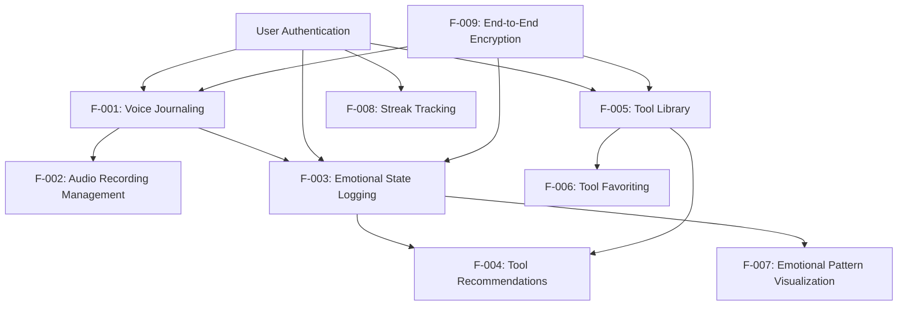

#### Integration Points

| Feature | Integration Points |
|---------|-------------------|
| Voice Journaling | Emotional Check-in System, Encryption System, Cloud Storage |
| Emotional State Logging | Progress Tracking System, Tool Recommendation Engine |
| Tool Library | Recommendation Engine, User Preferences System |
| Progress Tracking | Emotional Data Storage, Notification System |
| End-to-End Encryption | All Data Storage Systems, Cloud Storage |

#### Shared Components

| Component | Used By Features |
|-----------|------------------|
| User Authentication | All Features |
| Encryption System | Voice Journaling, Emotional Check-ins, User Data Storage |
| Data Storage | Voice Journaling, Emotional Check-ins, Progress Tracking |
| UI Components | Emotional Check-ins, Tool Library, Progress Visualization |

### IMPLEMENTATION CONSIDERATIONS

#### Voice Journaling (F-001, F-002)

**Technical Constraints:**
- Mobile device audio recording capabilities
- Storage limitations for audio files
- Network bandwidth for cloud storage

**Performance Requirements:**
- Audio recording response time < 1 second
- Smooth recording experience without interruptions
- Efficient compression for storage optimization

**Scalability Considerations:**
- Cloud storage scaling for increasing user base
- Processing capacity for concurrent recordings

**Security Implications:**
- End-to-end encryption for all audio data
- Secure transmission protocols
- Access controls for recordings

**Maintenance Requirements:**
- Regular testing of recording functionality
- Monitoring of storage usage
- Updates to audio processing libraries

#### Emotional Check-ins (F-003, F-004)

**Technical Constraints:**
- UI limitations for emotional expression
- Data structure for emotional states

**Performance Requirements:**
- Interface response time < 1 second
- Quick loading of recommendation engine

**Scalability Considerations:**
- Database scaling for emotional data
- Processing capacity for recommendation engine

**Security Implications:**
- Encryption of emotional data
- Privacy controls for sensitive information

**Maintenance Requirements:**
- Regular updates to emotional state options
- Refinement of recommendation algorithm
- Monitoring of data accuracy

#### Tool Library (F-005, F-006)

**Technical Constraints:**
- Content management system limitations
- Storage requirements for tool content

**Performance Requirements:**
- Tool loading time < 1 second
- Smooth navigation between categories

**Scalability Considerations:**
- Content database scaling
- Caching mechanisms for frequently accessed tools

**Security Implications:**
- Content integrity verification
- Access controls for premium content (future)

**Maintenance Requirements:**
- Regular content updates
- Category organization review
- Content quality assurance

#### Progress Tracking (F-007, F-008)

**Technical Constraints:**
- Data visualization library limitations
- Historical data storage requirements

**Performance Requirements:**
- Chart generation time < 2 seconds
- Responsive interaction with visualizations

**Scalability Considerations:**
- Analytics processing for large user base
- Efficient data aggregation methods

**Security Implications:**
- Privacy controls for progress data
- Aggregated vs. individual data handling

**Maintenance Requirements:**
- Regular review of visualization effectiveness
- Optimization of data queries
- Updates to gamification elements

## 3. TECHNOLOGY STACK

### PROGRAMMING LANGUAGES

| Platform/Component | Language | Version | Justification |
|-------------------|----------|---------|---------------|
| iOS | Swift | 5.9+ | Native performance for audio processing, better security controls, and seamless iOS integration |
| Android | Kotlin | 1.9+ | Modern Android development with improved safety features and concise syntax |
| Backend | Python | 3.11+ | Excellent for rapid API development, strong encryption libraries, and data processing capabilities |
| Database Scripts | SQL | - | Required for complex queries and data migrations |

Swift and Kotlin were selected for their native performance capabilities, which are critical for the audio recording functionality that requires low latency and smooth user experience. Python was chosen for the backend due to its robust ecosystem for secure API development and data processing, which aligns with the application's focus on privacy and data analysis for emotional tracking.

### FRAMEWORKS & LIBRARIES

#### Mobile Development

| Framework/Library | Version | Purpose | Justification |
|-------------------|---------|---------|---------------|
| SwiftUI | Latest | iOS UI development | Modern declarative UI framework for responsive interfaces |
| UIKit | Latest | iOS UI components | Required for custom audio recording components |
| Jetpack Compose | 1.5+ | Android UI development | Declarative UI toolkit for efficient development |
| Room | 2.6+ | Android local database | Provides abstraction layer over SQLite for local data storage |
| AVFoundation | Latest | iOS audio recording | Native audio processing with high performance |
| ExoPlayer | 2.19+ | Android media playback | Efficient audio playback with streaming capabilities |

#### Backend Development

| Framework/Library | Version | Purpose | Justification |
|-------------------|---------|---------|---------------|
| FastAPI | 0.104+ | API framework | High-performance async framework with automatic documentation |
| SQLAlchemy | 2.0+ | ORM | Robust database abstraction for complex data relationships |
| Pydantic | 2.4+ | Data validation | Type checking and data validation for API requests/responses |
| PyJWT | 2.8+ | JWT authentication | Secure token-based authentication |
| cryptography | 41.0+ | Encryption | End-to-end encryption implementation |
| pandas | 2.1+ | Data analysis | Processing emotional data for visualization and insights |

These frameworks were selected to support the core requirements of voice journaling, emotional tracking, and secure data handling. FastAPI provides the performance needed for handling concurrent API requests, while the mobile frameworks enable the responsive and intuitive UI required for emotional check-ins and progress visualization.

### DATABASES & STORAGE

| Component | Technology | Version | Purpose | Justification |
|-----------|------------|---------|---------|---------------|
| Primary Database | PostgreSQL | 15+ | Relational data storage | Strong data integrity, complex query support for emotional data analysis |
| Document Storage | MongoDB | 6.0+ | Tool library content | Flexible schema for varied content types in the tool library |
| Caching | Redis | 7.0+ | Performance optimization | Fast in-memory caching for frequently accessed data |
| Audio Storage | Amazon S3 | - | Secure audio file storage | Scalable, secure object storage with encryption support |
| Local Storage | Core Data (iOS) | - | Offline data persistence | Native iOS data persistence framework |
| Local Storage | Room (Android) | - | Offline data persistence | SQLite wrapper for Android with ORM features |

The database architecture employs PostgreSQL for structured data that requires strong relationships (user profiles, emotional check-ins, progress data) while using MongoDB for the more flexible content in the tool library. Amazon S3 provides the secure, scalable storage needed for encrypted audio recordings with appropriate access controls.

### THIRD-PARTY SERVICES

| Service | Purpose | Justification |
|---------|---------|---------------|
| AWS | Cloud infrastructure | Comprehensive suite of secure, scalable services |
| Amazon Cognito | User authentication | Secure, scalable authentication service with MFA support |
| Amazon CloudFront | Content delivery | Fast delivery of tool library content with edge caching |
| AWS KMS | Encryption key management | Secure management of encryption keys for end-to-end encryption |
| Firebase Analytics | Usage analytics | Privacy-focused analytics for understanding user behavior |
| Firebase Cloud Messaging | Push notifications | Reliable notification delivery for reminders and affirmations |
| Sentry | Error monitoring | Real-time error tracking to ensure application stability |
| AWS CloudWatch | System monitoring | Comprehensive monitoring of backend services |

These services were selected to support the application's requirements for security, scalability, and performance. AWS provides the infrastructure needed for secure data storage and processing, while Firebase services enable essential mobile app features like notifications and analytics with privacy considerations in mind.

### DEVELOPMENT & DEPLOYMENT

| Component | Technology | Purpose | Justification |
|-----------|------------|---------|---------------|
| Version Control | Git/GitHub | Code management | Industry standard with strong collaboration features |
| CI/CD | GitHub Actions | Automated pipeline | Seamless integration with GitHub repositories |
| Containerization | Docker | Backend deployment | Consistent environments across development and production |
| Container Orchestration | Kubernetes | Service management | Scalable, resilient backend service deployment |
| Infrastructure as Code | Terraform | Infrastructure management | Reproducible infrastructure with version control |
| API Documentation | Swagger/OpenAPI | API specification | Automated documentation for backend APIs |
| Mobile Build | Xcode Cloud | iOS build pipeline | Native iOS build system with CI/CD capabilities |
| Mobile Build | Gradle | Android build system | Flexible build configuration for Android |
| Code Quality | SonarQube | Code analysis | Automated code quality and security scanning |

The development and deployment stack focuses on automation and consistency to ensure reliable delivery of features. Docker and Kubernetes provide the scalability needed to support growth in the user base, while CI/CD automation ensures consistent quality across releases.

### ARCHITECTURE DIAGRAM

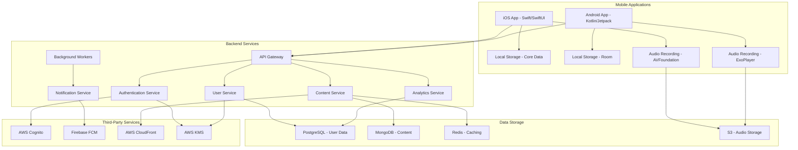

This architecture supports the core requirements of Amira Wellness, with a focus on secure data handling, responsive user experience, and scalable infrastructure to accommodate growth. The separation of concerns between services allows for independent scaling and maintenance of each component.

## 4. PROCESS FLOWCHART

### SYSTEM WORKFLOWS

#### Core Business Processes

##### Voice Journaling Workflow

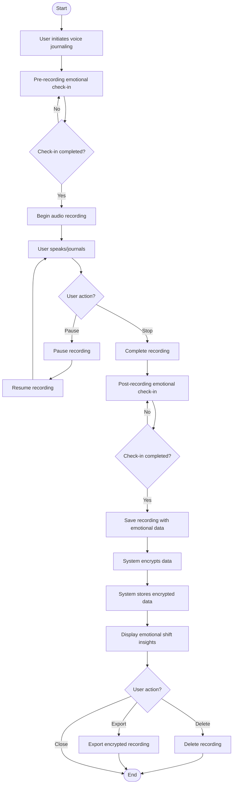

##### Emotional Check-in Workflow

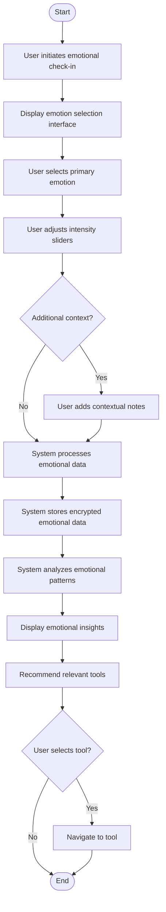

##### Tool Library Access Workflow

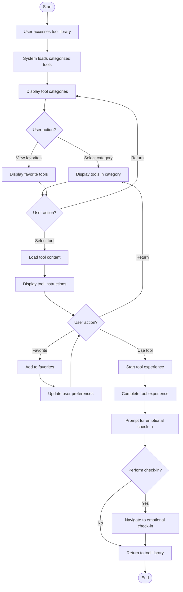

##### Progress Tracking Workflow

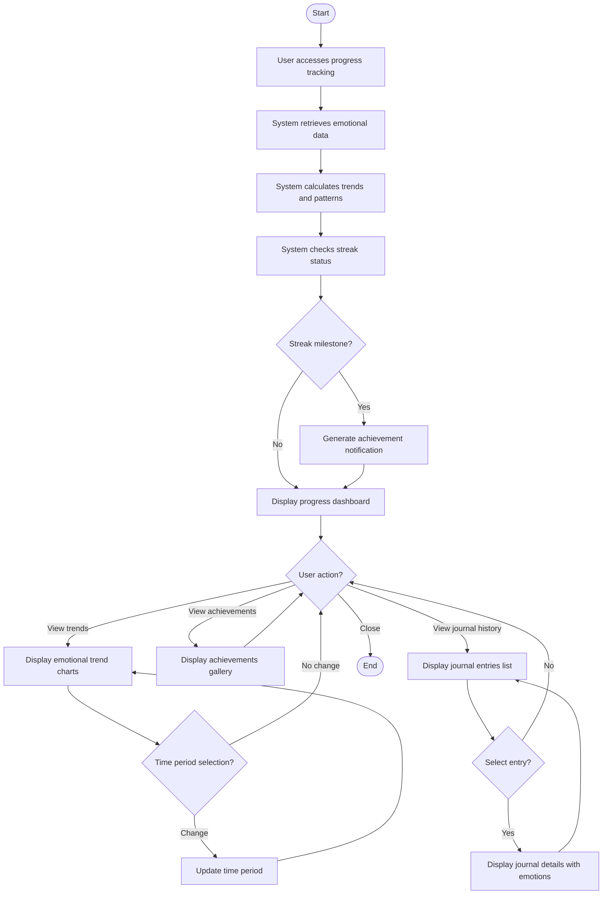

#### Integration Workflows

##### Authentication and Data Synchronization

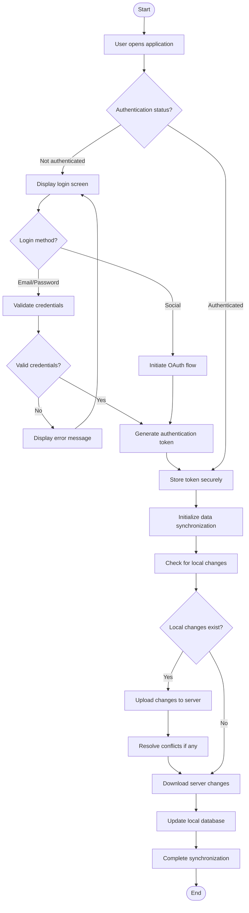

##### Audio Recording Storage and Retrieval

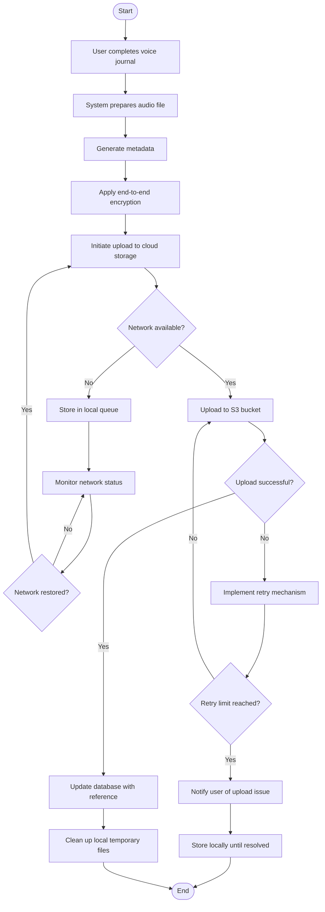

##### Notification Processing

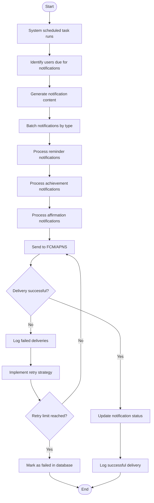

### FLOWCHART REQUIREMENTS

#### Voice Journaling Detailed Workflow

```mermaid
flowchart TD
    Start([Start]) --> A[User initiates voice journaling]
    A --> B[System checks microphone permissions]
    B --> C{Permissions granted?}
    C -->|No| D[Request microphone permissions]
    D --> E{User grants permissions?}
    E -->|No| F[Display permission error]
    F --> End([End])
    E -->|Yes| G[Initialize audio recording components]
    C -->|Yes| G
    G --> H[Display pre-recording emotional check-in]
    
    subgraph "Pre-Recording Emotional Check-in"
        H --> I[User selects primary emotion]
        I --> J[User adjusts intensity]
        J --> K[System validates input]
        K --> L{Valid input?}
        L -->|No| M[Display validation error]
        M --> I
        L -->|Yes| N[Save pre-recording emotional state]
    end
    
    N --> O[Activate recording interface]
    O --> P[User starts recording]
    P --> Q[System begins audio capture]
    Q --> R[Display recording visualization]
    R --> S{User action?}
    
    S -->|Pause| T[Pause audio capture]
    T --> U[Display paused state]
    U --> V{User action?}
    V -->|Resume| W[Resume audio capture]
    W --> R
    V -->|Cancel| X[Discard recording]
    X --> End
    
    S -->|Stop| Y[Finalize recording]
    Y --> Z[Process audio file]
    Z --> AA[Display post-recording emotional check-in]
    
    subgraph "Post-Recording Emotional Check-in"
        AA --> AB[User selects primary emotion]
        AB --> AC[User adjusts intensity]
        AC --> AD[System validates input]
        AD --> AE{Valid input?}
        AE -->|No| AF[Display validation error]
        AF --> AB
        AE -->|Yes| AG[Save post-recording emotional state]
    end
    
    AG --> AH[Compare pre/post emotional states]
    AH --> AI[Generate emotional shift insights]
    AI --> AJ[Encrypt audio and metadata]
    AJ --> AK[Store in local database]
    AK --> AL[Queue for cloud upload]
    AL --> AM[Display journal saved confirmation]
    AM --> AN{User action?}
    
    AN -->|View details| AO[Display journal details]
    AO --> AP{User action?}
    AP -->|Export| AQ[Generate encrypted export file]
    AQ --> AR[Share via system dialog]
    AR --> AP
    AP -->|Delete| AS[Confirm deletion]
    AS --> AT{Confirmed?}
    AT -->|No| AP
    AT -->|Yes| AU[Delete local and queued data]
    AU --> End
    AP -->|Close| End
    
    AN -->|Close| End
```

#### Emotional Pattern Analysis Workflow

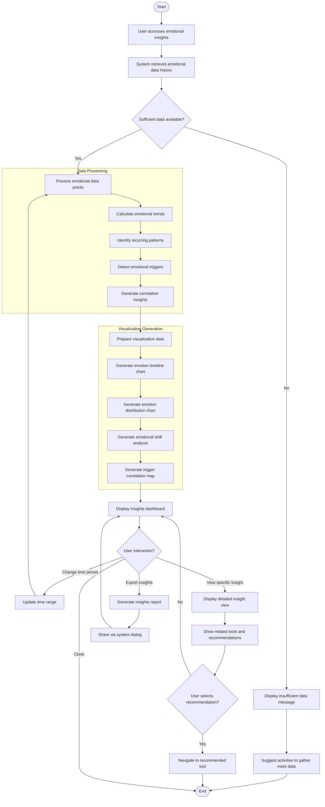

#### Tool Recommendation Workflow

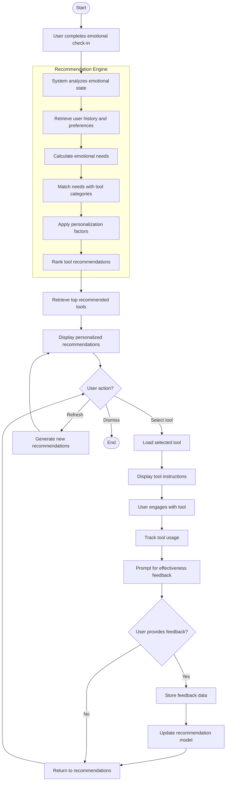

### TECHNICAL IMPLEMENTATION

#### State Management for Voice Journaling

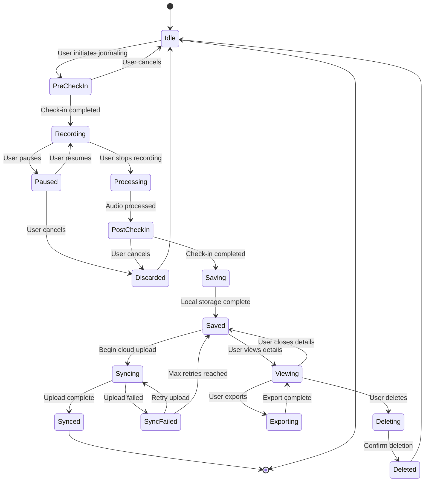

#### Error Handling for Data Synchronization

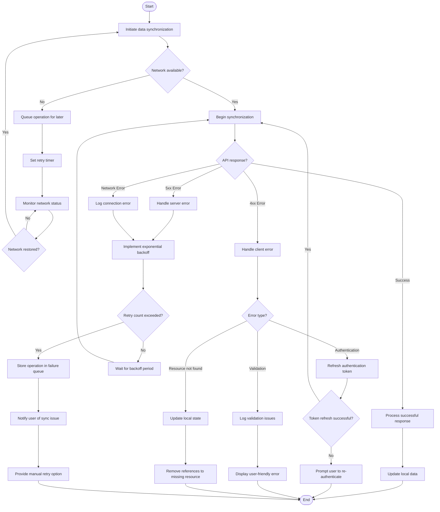

### REQUIRED DIAGRAMS

#### High-Level System Workflow

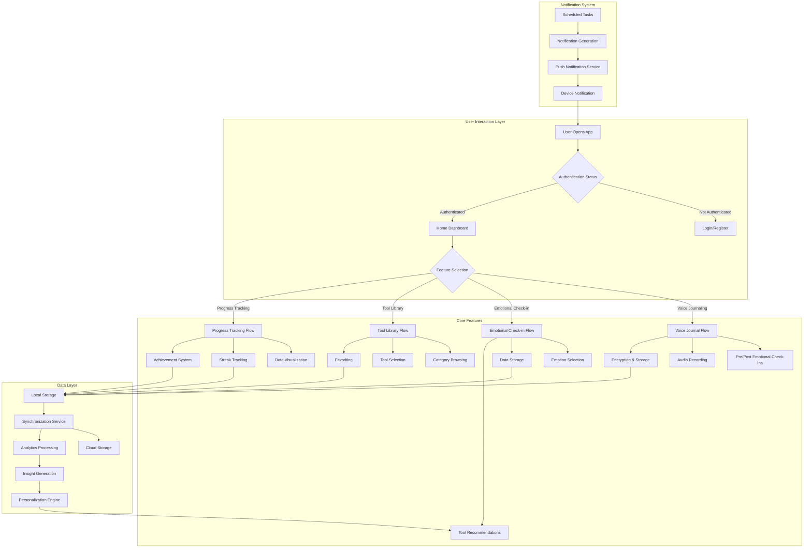

#### Detailed Process Flow for Voice Journaling Feature

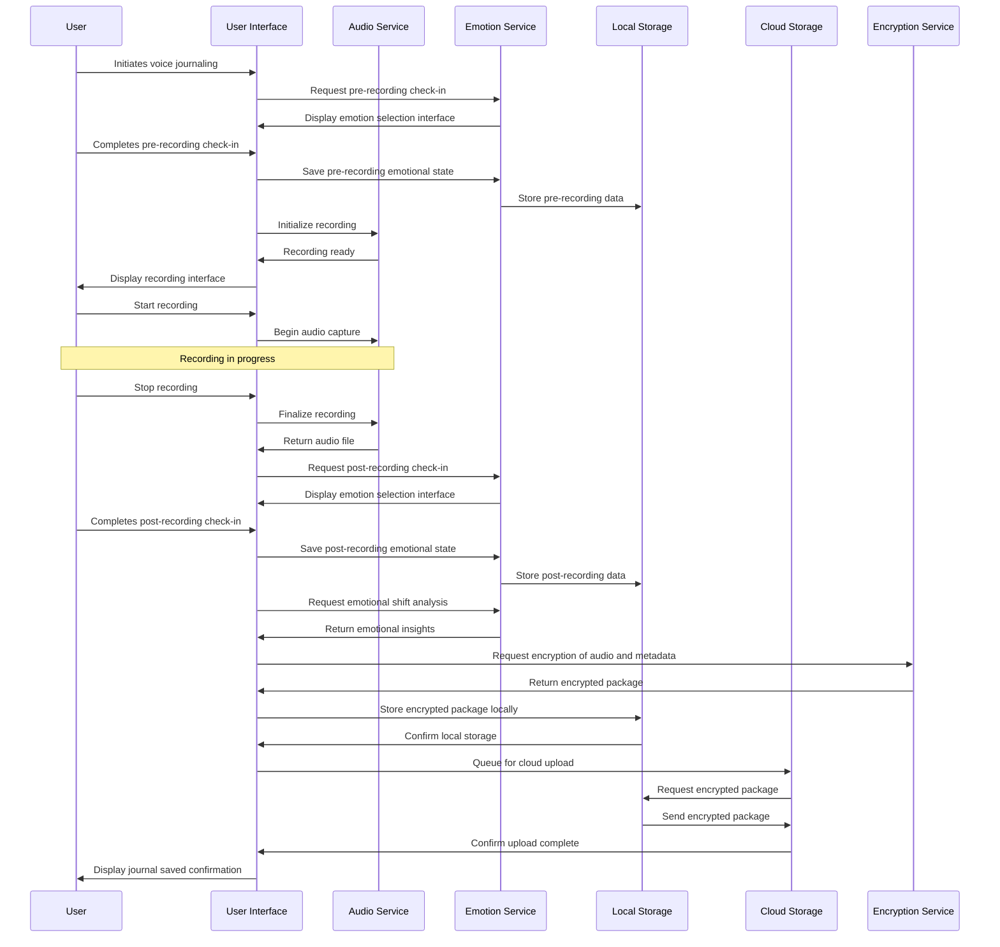

#### Error Handling Flowchart for Audio Recording

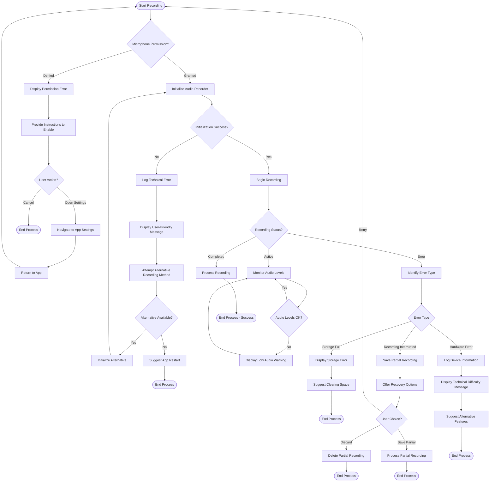

#### Integration Sequence Diagram for Emotional Data Analysis

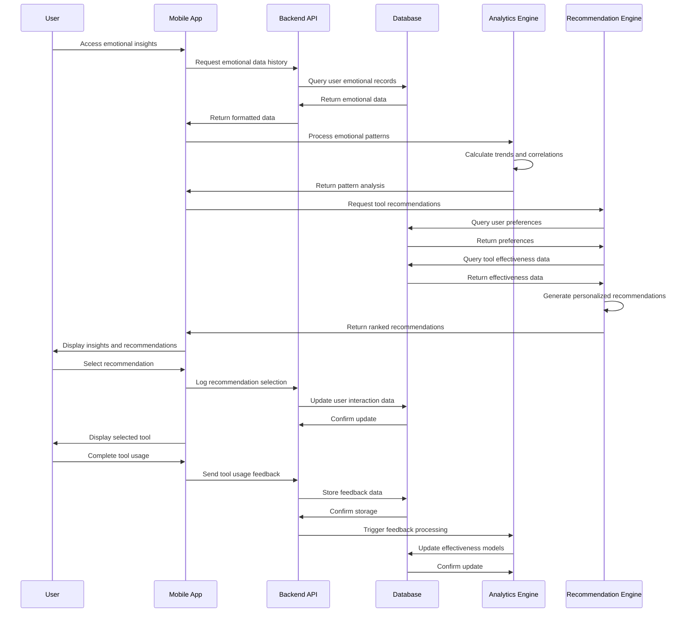

#### State Transition Diagram for Tool Usage

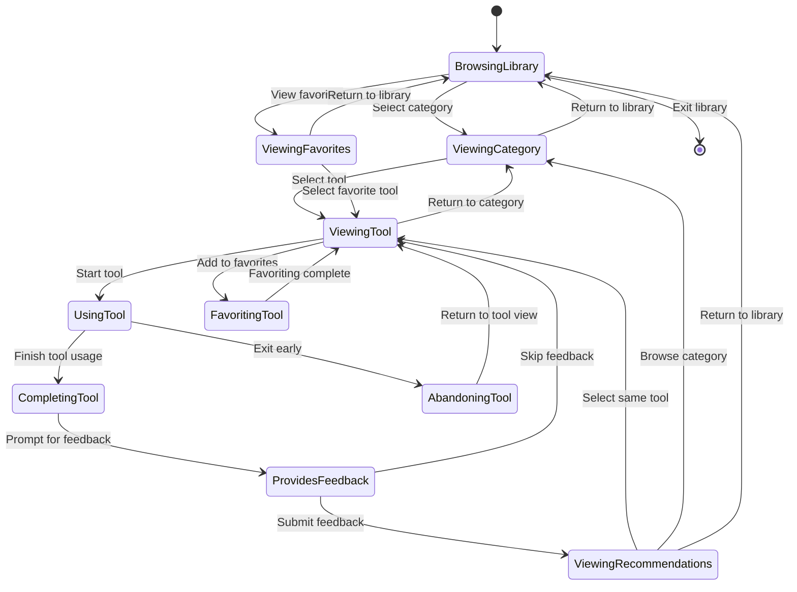

## 5. SYSTEM ARCHITECTURE

### HIGH-LEVEL ARCHITECTURE

#### System Overview

Amira Wellness employs a client-server architecture with native mobile applications communicating with cloud-based backend services. The system follows a layered architecture pattern with clear separation of concerns between presentation, business logic, and data layers.

Key architectural principles include:
- **Privacy by design**: End-to-end encryption for sensitive user data, particularly voice recordings
- **Scalability**: Horizontally scalable microservices to accommodate user growth
- **Resilience**: Fault-tolerant design with graceful degradation capabilities
- **Modularity**: Loosely coupled components to enable independent development and deployment

The system boundaries encompass mobile client applications (iOS and Android), backend API services, secure cloud storage, and third-party integration points for authentication and notifications. Major interfaces include RESTful APIs for client-server communication, secure storage interfaces for encrypted data, and notification delivery channels.

#### Core Components Table

| Component Name | Primary Responsibility | Key Dependencies | Critical Considerations |
|----------------|------------------------|------------------|-------------------------|
| Mobile Client | User interface, audio recording, local caching | Device OS, network connectivity | Offline capabilities, battery usage, secure local storage |
| Authentication Service | User identity management, access control | Identity provider, encryption service | Token security, session management, privacy compliance |
| API Gateway | Request routing, rate limiting, API versioning | Service registry, load balancer | Performance, security, request validation |
| Voice Journal Service | Audio processing, storage management | Encryption service, cloud storage | Audio quality, storage efficiency, privacy |
| Emotional Tracking Service | Emotion data processing, pattern analysis | Analytics engine, recommendation service | Data accuracy, pattern recognition algorithms |
| Tool Library Service | Content management, tool recommendations | Content database, user preferences | Content relevance, personalization accuracy |
| Progress Tracking Service | User activity analysis, streak management | Analytics engine, notification service | Data aggregation, insight generation |
| Notification Service | Alert delivery, reminder management | Push notification providers, user preferences | Timing accuracy, delivery reliability |

#### Data Flow Description

The primary data flow begins with user interactions in the mobile client, which are processed locally before being securely transmitted to backend services through the API Gateway. Authentication tokens accompany all requests to verify user identity and permissions.

Voice journaling data follows a specialized flow where audio is recorded locally, encrypted on-device, and then transmitted to the Voice Journal Service. This service manages secure storage in the cloud while maintaining metadata references in the database. Emotional check-in data is captured before and after journaling sessions, flowing to the Emotional Tracking Service for storage and analysis.

The Tool Library Service provides content to users based on their emotional state and preferences, with usage data flowing back to inform the recommendation engine. The Progress Tracking Service aggregates data from multiple services to generate insights and trigger notifications through the Notification Service.

Key data stores include the encrypted audio storage for voice journals, the user profile database, the emotional data time-series database, and the content management system for the tool library. Caching occurs at multiple levels, including client-side caching for frequently accessed tools and server-side caching for recommendation algorithms.

#### External Integration Points

| System Name | Integration Type | Data Exchange Pattern | Protocol/Format | SLA Requirements |
|-------------|------------------|------------------------|-----------------|------------------|
| AWS Cognito | Authentication | Request-response | OAuth 2.0/HTTPS | 99.9% availability, <500ms response time |
| AWS S3 | Storage | Asynchronous upload/download | HTTPS/REST | 99.99% availability, <1s upload initiation |
| Firebase FCM | Notifications | Publish-subscribe | HTTPS/JSON | 99% delivery rate, <5s delivery time |
| AWS CloudFront | Content delivery | Cache-based distribution | HTTPS | 99.9% availability, <200ms response time |
| AWS KMS | Encryption | Request-response | HTTPS/REST | 99.999% availability, <300ms response time |

### COMPONENT DETAILS

#### Mobile Client

**Purpose and Responsibilities:**
- Provide intuitive user interface for all application features
- Capture and process audio recordings for voice journaling
- Manage local data storage and synchronization
- Implement client-side encryption for sensitive data
- Handle offline functionality and data queuing

**Technologies and Frameworks:**
- iOS: Swift, SwiftUI, AVFoundation, Core Data
- Android: Kotlin, Jetpack Compose, Room, ExoPlayer
- Cross-platform: Shared encryption libraries, RESTful API clients

**Key Interfaces and APIs:**
- Authentication API for user identity management
- Voice Journal API for audio storage and retrieval
- Emotional Tracking API for check-in data
- Tool Library API for content access
- Progress Tracking API for insights and streaks

**Data Persistence Requirements:**
- Encrypted local storage for voice recordings pending upload
- Secure cache for user preferences and frequently accessed content
- Offline-capable data store for emotional check-ins
- Encrypted storage for authentication tokens

**Scaling Considerations:**
- Efficient battery and memory usage
- Adaptive UI for different device sizes
- Bandwidth optimization for audio uploads
- Graceful handling of network limitations

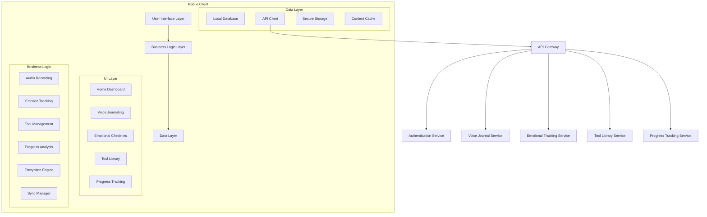

#### Voice Journal Service

**Purpose and Responsibilities:**
- Manage secure storage and retrieval of voice journal recordings
- Process audio metadata and link with emotional check-ins
- Implement end-to-end encryption for audio data
- Provide secure sharing and export capabilities

**Technologies and Frameworks:**
- Python with FastAPI for service implementation
- AWS S3 for encrypted audio storage
- PostgreSQL for metadata storage
- AWS KMS for encryption key management

**Key Interfaces and APIs:**
- Upload API for receiving encrypted audio files
- Retrieval API for secure access to recordings
- Metadata API for managing recording information
- Export API for generating shareable encrypted packages

**Data Persistence Requirements:**
- Immutable storage for encrypted audio files
- Relational database for metadata and relationships
- Secure key management for encryption/decryption

**Scaling Considerations:**
- Horizontal scaling for concurrent upload handling
- Storage optimization for long-term retention
- Bandwidth management for audio streaming

```mermaid
sequenceDiagram
    participant User
    participant MobileApp
    participant APIGateway
    participant VoiceJournalService
    participant EncryptionService
    participant S3Storage
    participant Database
    
    User->>MobileApp: Record voice journal
    MobileApp->>MobileApp: Encrypt audio locally
    MobileApp->>APIGateway: Upload encrypted audio
    APIGateway->>VoiceJournalService: Process upload request
    VoiceJournalService->>EncryptionService: Verify encryption
    EncryptionService->>VoiceJournalService: Confirm validity
    VoiceJournalService->>S3Storage: Store encrypted audio
    S3Storage->>VoiceJournalService: Return storage reference
    VoiceJournalService->>Database: Save metadata with reference
    Database->>VoiceJournalService: Confirm storage
    VoiceJournalService->>APIGateway: Return success response
    APIGateway->>MobileApp: Confirm upload complete
    MobileApp->>User: Display confirmation
```

#### Emotional Tracking Service

**Purpose and Responsibilities:**
- Process and store emotional check-in data
- Analyze emotional patterns and trends
- Generate insights from emotional data
- Provide data for personalized recommendations

**Technologies and Frameworks:**
- Python with FastAPI for service implementation
- Time-series database (TimescaleDB) for emotional data
- Pandas and NumPy for data analysis
- Redis for caching frequent queries

**Key Interfaces and APIs:**
- Check-in API for recording emotional states
- Analysis API for retrieving patterns and insights
- Comparison API for pre/post recording analysis
- Recommendation API for suggesting relevant tools

**Data Persistence Requirements:**
- Time-series database for temporal emotional data
- Relational mappings to user profiles and recordings
- Efficient indexing for pattern recognition queries

**Scaling Considerations:**
- Computational scaling for analysis operations
- Query optimization for real-time insights
- Data partitioning for high-volume users

```mermaid
stateDiagram-v2
    [*] --> EmotionalCheckIn
    
    EmotionalCheckIn --> DataProcessing: User submits check-in
    DataProcessing --> PatternAnalysis: Process emotional data
    PatternAnalysis --> InsightGeneration: Analyze patterns
    InsightGeneration --> RecommendationEngine: Generate insights
    RecommendationEngine --> ToolRecommendation: Create recommendations
    
    ToolRecommendation --> [*]: Return to user
    
    state DataProcessing {
        [*] --> Validation
        Validation --> Normalization
        Normalization --> Storage
        Storage --> [*]
    }
    
    state PatternAnalysis {
        [*] --> HistoricalRetrieval
        HistoricalRetrieval --> TrendCalculation
        TrendCalculation --> CorrelationAnalysis
        CorrelationAnalysis --> [*]
    }
```

#### Tool Library Service

**Purpose and Responsibilities:**
- Manage the catalog of emotional regulation tools
- Serve tool content to mobile clients
- Track tool usage and effectiveness
- Support favoriting and personalization

**Technologies and Frameworks:**
- Python with FastAPI for service implementation
- MongoDB for flexible content storage
- Redis for caching popular tools
- AWS CloudFront for content delivery

**Key Interfaces and APIs:**
- Catalog API for browsing tool categories
- Content API for retrieving tool details
- Favorites API for managing user preferences
- Usage API for tracking tool engagement

**Data Persistence Requirements:**
- Document database for flexible tool content
- Relational mappings for user favorites
- Usage statistics for recommendation refinement

**Scaling Considerations:**
- Content caching for popular tools
- CDN integration for media content
- Database sharding for growing content library

```mermaid
flowchart TD
    subgraph "Tool Library Service"
        CatalogAPI[Catalog API]
        ContentAPI[Content API]
        FavoritesAPI[Favorites API]
        UsageAPI[Usage API]
        
        CatalogAPI --> ContentManager[Content Manager]
        ContentAPI --> ContentManager
        FavoritesAPI --> UserPreferences[User Preferences]
        UsageAPI --> AnalyticsCollector[Analytics Collector]
        
        ContentManager --> ContentDB[(Content Database)]
        UserPreferences --> UserDB[(User Database)]
        AnalyticsCollector --> AnalyticsDB[(Analytics Database)]
        
        RecommendationEngine[Recommendation Engine] --> ContentManager
        RecommendationEngine --> UserPreferences
        RecommendationEngine --> AnalyticsCollector
    end
    
    MobileClient[Mobile Client] --> CatalogAPI
    MobileClient --> ContentAPI
    MobileClient --> FavoritesAPI
    MobileClient --> UsageAPI
    
    EmotionalService[Emotional Tracking Service] --> RecommendationEngine
```

#### Progress Tracking Service

**Purpose and Responsibilities:**
- Aggregate user activity data across features
- Calculate streaks and achievement progress
- Generate visualizations of emotional patterns
- Trigger notifications for milestones and reminders

**Technologies and Frameworks:**
- Python with FastAPI for service implementation
- PostgreSQL for structured activity data
- Redis for streak calculations and caching
- Matplotlib/Plotly for visualization generation

**Key Interfaces and APIs:**
- Activity API for recording user actions
- Streak API for tracking consistent usage
- Visualization API for generating charts
- Achievement API for managing rewards

**Data Persistence Requirements:**
- Activity log database with efficient querying
- User achievement and streak state storage
- Cached calculations for frequent access

**Scaling Considerations:**
- Batch processing for visualization generation
- Scheduled aggregation for performance optimization
- Notification throttling to prevent overload

```mermaid
sequenceDiagram
    participant User
    participant MobileApp
    participant ProgressService
    participant ActivityStore
    participant StreakEngine
    participant VisualizationEngine
    participant NotificationService
    
    User->>MobileApp: Open progress dashboard
    MobileApp->>ProgressService: Request progress data
    ProgressService->>ActivityStore: Retrieve activity history
    ActivityStore->>ProgressService: Return activity data
    ProgressService->>StreakEngine: Calculate current streaks
    StreakEngine->>ProgressService: Return streak information
    ProgressService->>VisualizationEngine: Generate emotional charts
    VisualizationEngine->>ProgressService: Return visualizations
    ProgressService->>MobileApp: Return complete progress data
    MobileApp->>User: Display progress dashboard
    
    Note over StreakEngine,NotificationService: Milestone detection
    StreakEngine->>NotificationService: Trigger milestone notification
    NotificationService->>MobileApp: Send achievement notification
    MobileApp->>User: Display achievement alert
```

### TECHNICAL DECISIONS

#### Architecture Style Decisions

| Decision Area | Selected Approach | Alternatives Considered | Rationale |
|---------------|-------------------|-------------------------|-----------|
| Overall Architecture | Microservices | Monolithic, Serverless | Enables independent scaling of components, supports team autonomy, and provides flexibility for future expansion |
| Client Architecture | Native Mobile Apps | Progressive Web App, Hybrid | Provides best performance for audio recording, access to native security features, and optimal user experience |
| API Design | RESTful with JSON | GraphQL, gRPC | Simplifies integration, widely supported by tools and libraries, and familiar to development team |
| Data Storage | Polyglot Persistence | Single Database System | Different data types (audio, time-series emotional data, content) have different storage requirements |

The microservices architecture was selected to allow independent scaling of high-demand components like voice journaling while maintaining isolation for sensitive services like authentication. Native mobile applications provide the performance and security capabilities essential for audio recording and local encryption, which would be limited in web-based alternatives.

#### Communication Pattern Choices

| Pattern | Application | Benefits | Considerations |
|---------|-------------|----------|----------------|
| Synchronous REST | User interactions, real-time features | Immediate feedback, simple implementation | Requires reliable network connectivity |
| Asynchronous Messaging | Audio uploads, notifications | Resilience to network issues, background processing | Complexity in tracking status, eventual consistency |
| Publish-Subscribe | Notifications, achievement events | Decoupled components, scalable event distribution | Message delivery guarantees, ordering challenges |
| Batch Processing | Analytics, insight generation | Efficient resource usage, comprehensive processing | Delayed results, scheduling complexity |

The system employs synchronous REST communication for most user-facing interactions to provide immediate feedback. Asynchronous messaging is used for audio uploads to handle potential network interruptions and large file sizes. The publish-subscribe pattern supports notification delivery and system events, while batch processing handles computationally intensive analytics operations.

```mermaid
flowchart TD
    subgraph "Communication Patterns"
        REST[Synchronous REST]
        Async[Asynchronous Messaging]
        PubSub[Publish-Subscribe]
        Batch[Batch Processing]
    end
    
    subgraph "Use Cases"
        UI[User Interactions]
        Upload[Audio Uploads]
        Notify[Notifications]
        Analytics[Data Analysis]
    end
    
    REST --> UI
    Async --> Upload
    PubSub --> Notify
    Batch --> Analytics
    
    subgraph "Considerations"
        Network[Network Reliability]
        Latency[Response Latency]
        Scale[Scalability]
        Complexity[Implementation Complexity]
    end
    
    UI --> Latency
    Upload --> Network
    Notify --> Scale
    Analytics --> Complexity
```

#### Data Storage Solution Rationale

| Data Type | Selected Solution | Justification |
|-----------|-------------------|---------------|
| User Profiles | PostgreSQL | Strong consistency, relational integrity for user data |
| Voice Recordings | AWS S3 with client-side encryption | Scalable object storage, cost-effective for large files |
| Emotional Data | TimescaleDB | Optimized for time-series data, efficient querying of temporal patterns |
| Tool Content | MongoDB | Flexible schema for varied content types, document-oriented structure |
| Session Data | Redis | In-memory performance, automatic expiration for temporary data |

The data storage strategy employs specialized solutions for different data types to optimize performance, cost, and security. Voice recordings use encrypted object storage to handle large files efficiently while maintaining privacy. Emotional data leverages time-series capabilities for pattern analysis, and tool content uses document storage for flexibility in content structure.

#### Caching Strategy Justification

| Cache Type | Implementation | Purpose | Invalidation Strategy |
|------------|----------------|---------|------------------------|
| API Response Cache | Redis | Reduce database load, improve response times | Time-based expiration, explicit invalidation on updates |
| Content Cache | CloudFront CDN | Accelerate delivery of static tool content | Version-based cache keys, controlled invalidation |
| User Preference Cache | In-memory (service level) | Reduce latency for personalization | Short TTL, event-based invalidation |
| Computed Insights Cache | Redis | Avoid recalculation of expensive analytics | Time-based expiration, recalculation on new data |

The caching strategy balances performance improvements with data freshness requirements. API responses use short-lived caches to reduce database load while ensuring reasonable data currency. Content caching employs a CDN for global distribution of static assets, while computed insights use longer cache periods with scheduled recalculation to optimize resource usage.

#### Security Mechanism Selection

| Security Concern | Selected Mechanism | Justification |
|------------------|---------------------|---------------|
| Authentication | JWT with OAuth 2.0 | Industry standard, supports multiple authentication flows |
| Data Privacy | End-to-end encryption | Ensures data can only be accessed by the user, even if storage is compromised |
| API Security | TLS, API keys, rate limiting | Protects against interception and abuse |
| Storage Security | Encrypted at rest, access controls | Defense in depth for stored data |
| Mobile Security | Secure local storage, certificate pinning | Protects against device-level threats |

Security mechanisms were selected based on the privacy-first requirement of the application. End-to-end encryption ensures that sensitive voice recordings and emotional data remain private even from the application operators. JWT authentication provides secure, stateless authentication while supporting future expansion to additional authentication methods.

```mermaid
flowchart TD
    subgraph "Security Layers"
        Transport[Transport Security]
        Authentication[Authentication & Authorization]
        Encryption[Data Encryption]
        Access[Access Controls]
        Monitoring[Security Monitoring]
    end
    
    Transport --> TLS[TLS 1.3]
    Transport --> HSTS[HSTS]
    
    Authentication --> OAuth[OAuth 2.0]
    Authentication --> JWT[JWT Tokens]
    Authentication --> MFA[Multi-Factor Auth]
    
    Encryption --> E2E[End-to-End Encryption]
    Encryption --> AtRest[Encryption at Rest]
    Encryption --> InTransit[Encryption in Transit]
    
    Access --> RBAC[Role-Based Controls]
    Access --> ResourceLevel[Resource-Level Permissions]
    
    Monitoring --> Logging[Security Logging]
    Monitoring --> Alerting[Threat Alerting]
    Monitoring --> Audit[Audit Trails]
```

### CROSS-CUTTING CONCERNS

#### Monitoring and Observability Approach

Amira Wellness implements a comprehensive monitoring strategy to ensure system health, performance, and security. The approach includes:

- **Infrastructure Monitoring**: AWS CloudWatch metrics for resource utilization, service health, and scaling triggers
- **Application Performance Monitoring**: Custom instrumentation and tracing to identify bottlenecks and optimize user experience
- **Business Metrics**: Tracking of key performance indicators like active users, feature usage, and emotional improvement trends
- **Alerting**: Tiered alerting system with appropriate escalation paths based on severity and impact
- **Dashboards**: Real-time visualization of system health and business metrics for operations and stakeholders

Observability is implemented through distributed tracing with correlation IDs across service boundaries, structured logging with consistent formats, and centralized log aggregation for analysis and troubleshooting.

#### Logging and Tracing Strategy

| Log Category | Content | Retention | Privacy Considerations |
|--------------|---------|-----------|------------------------|
| System Logs | Service health, resource usage | 30 days | No PII, aggregated metrics |
| Application Logs | Feature usage, error details | 90 days | Anonymized user identifiers |
| Security Logs | Authentication events, access patterns | 1 year | Minimal identifiable information |
| Audit Logs | Data access, administrative actions | 2 years | Compliance-focused, restricted access |

The logging strategy employs structured JSON logging with consistent field names across services. Log levels (DEBUG, INFO, WARN, ERROR, FATAL) are used appropriately to facilitate filtering and alerting. Distributed tracing with correlation IDs enables end-to-end request tracking across service boundaries.

Privacy is maintained by avoiding logging of sensitive user data, using anonymized identifiers where user context is necessary, and implementing access controls on log storage and analysis tools.

#### Error Handling Patterns

The application implements a layered error handling approach:

1. **Client-Side Handling**: Graceful degradation, retry mechanisms with exponential backoff, and user-friendly error messages
2. **API Gateway**: Request validation, rate limiting, and consistent error response formatting
3. **Service Layer**: Domain-specific error classification, detailed logging, and appropriate status codes
4. **Infrastructure**: Auto-recovery, circuit breakers, and fallback mechanisms

Error responses follow a consistent structure with error codes, user-friendly messages, and detailed developer information when appropriate. Critical errors trigger alerts for immediate attention, while patterns of errors are analyzed to identify systemic issues.

```mermaid
flowchart TD
    Error[Error Occurs] --> Classify[Classify Error Type]
    
    Classify --> Transient[Transient Error]
    Classify --> Client[Client Error]
    Classify --> Server[Server Error]
    Classify --> Security[Security Error]
    
    Transient --> Retry[Implement Retry with Backoff]
    Retry --> Success{Successful?}
    Success -->|Yes| Continue[Continue Operation]
    Success -->|No| Fallback[Use Fallback Mechanism]
    
    Client --> Validate[Validate Request]
    Validate --> UserMessage[Return User-Friendly Message]
    
    Server --> Log[Log Detailed Error]
    Log --> Alert{Critical?}
    Alert -->|Yes| Notify[Notify Operations Team]
    Alert -->|No| Monitor[Add to Monitoring Metrics]
    
    Security --> Audit[Log Security Event]
    Audit --> Block[Implement Protective Measures]
    
    Fallback --> Degrade[Gracefully Degrade]
    UserMessage --> Suggest[Suggest User Action]
    Notify --> Investigate[Investigate Root Cause]
    Block --> Review[Security Review]
```

#### Authentication and Authorization Framework

Amira Wellness implements a comprehensive authentication and authorization framework:

- **Authentication**: OAuth 2.0 with JWT tokens, supporting email/password and future social login options
- **Token Management**: Short-lived access tokens with refresh token rotation for security
- **Authorization**: Role-based access control (RBAC) with fine-grained permissions
- **Multi-Factor Authentication**: Optional for sensitive operations like data export
- **Session Management**: Secure session handling with inactivity timeouts and device tracking

The authorization model defines roles including standard users, premium users, content administrators, and system administrators. Each role has specific permissions mapped to API endpoints and resources, enforced at the API Gateway and service levels.

#### Performance Requirements and SLAs

| Metric | Target | Critical Threshold | Measurement Method |
|--------|--------|---------------------|-------------------|
| API Response Time | <500ms (p95) | >1s (p95) | Application monitoring |
| Voice Recording Latency | <1s start time | >2s start time | Client-side metrics |
| Emotional Check-in Response | <1s (p99) | >2s (p99) | Application monitoring |
| System Availability | 99.9% uptime | <99.5% uptime | Infrastructure monitoring |
| Data Synchronization | <5min delay | >15min delay | Sync status tracking |

Performance is monitored continuously with automated alerts for threshold violations. Load testing is performed before major releases to ensure scalability, and performance optimization is prioritized for critical user journeys like voice journaling and emotional check-ins.

#### Disaster Recovery Procedures

Amira Wellness implements a comprehensive disaster recovery strategy:

- **Data Backup**: Daily automated backups of all databases with point-in-time recovery capability
- **Backup Verification**: Weekly automated restoration tests to verify backup integrity
- **Recovery Time Objective (RTO)**: 4 hours for critical services, 24 hours for non-critical services
- **Recovery Point Objective (RPO)**: 1 hour data loss maximum for critical data, 24 hours for non-critical data
- **Disaster Scenarios**: Documented procedures for infrastructure failure, data corruption, security breach, and regional outage

The disaster recovery plan includes clear roles and responsibilities, communication protocols, and step-by-step recovery procedures. Regular disaster recovery drills ensure team readiness and validate recovery processes.

```mermaid
flowchart TD
    Incident[Disaster Incident] --> Detect[Detection Phase]
    Detect --> Assess[Assessment Phase]
    
    Assess --> Minor[Minor Incident]
    Assess --> Major[Major Incident]
    Assess --> Critical[Critical Incident]
    
    Minor --> LocalRecovery[Local Recovery Procedures]
    Major --> PartialDR[Partial DR Activation]
    Critical --> FullDR[Full DR Activation]
    
    LocalRecovery --> Restore[Restore from Backups]
    PartialDR --> Failover[Service Failover]
    FullDR --> ActivateSecondary[Activate Secondary Region]
    
    Restore --> Verify[Verify Data Integrity]
    Failover --> Verify
    ActivateSecondary --> Verify
    
    Verify --> Success{Recovery Successful?}
    Success -->|Yes| Resume[Resume Operations]
    Success -->|No| Escalate[Escalate Response]
    
    Resume --> Review[Post-Incident Review]
    Escalate --> Reassess[Reassess Strategy]
    Reassess --> FullDR
    
    Review --> Update[Update DR Procedures]
    Update --> Test[Schedule DR Test]
```

## 6. SYSTEM COMPONENTS DESIGN

### COMPONENT ARCHITECTURE

#### Component Hierarchy

```mermaid
graph TD
    subgraph "Presentation Layer"
        MobileUI[Mobile UI Components]
        Navigation[Navigation System]
        UIState[UI State Management]
    end
    
    subgraph "Business Logic Layer"
        JournalManager[Journal Manager]
        EmotionTracker[Emotion Tracker]
        ToolLibrary[Tool Library]
        ProgressAnalytics[Progress Analytics]
        UserManager[User Manager]
        NotificationEngine[Notification Engine]
    end
    
    subgraph "Data Access Layer"
        LocalStorage[Local Storage]
        APIClient[API Client]
        SyncManager[Sync Manager]
        EncryptionService[Encryption Service]
    end
    
    subgraph "Backend Services"
        AuthService[Authentication Service]
        JournalService[Journal Service]
        EmotionService[Emotion Service]
        ContentService[Content Service]
        AnalyticsService[Analytics Service]
        NotificationService[Notification Service]
    end
    
    MobileUI --> Navigation
    MobileUI --> UIState
    Navigation --> JournalManager
    Navigation --> EmotionTracker
    Navigation --> ToolLibrary
    Navigation --> ProgressAnalytics
    Navigation --> UserManager
    
    JournalManager --> LocalStorage
    JournalManager --> APIClient
    JournalManager --> EncryptionService
    
    EmotionTracker --> LocalStorage
    EmotionTracker --> APIClient
    
    ToolLibrary --> LocalStorage
    ToolLibrary --> APIClient
    
    ProgressAnalytics --> LocalStorage
    ProgressAnalytics --> APIClient
    
    UserManager --> LocalStorage
    UserManager --> APIClient
    UserManager --> EncryptionService
    
    NotificationEngine --> APIClient
    
    SyncManager --> LocalStorage
    SyncManager --> APIClient
    
    APIClient --> AuthService
    APIClient --> JournalService
    APIClient --> EmotionService
    APIClient --> ContentService
    APIClient --> AnalyticsService
    APIClient --> NotificationService
```

#### Component Responsibilities

| Component | Primary Responsibility | Secondary Responsibilities |
|-----------|------------------------|----------------------------|
| Mobile UI Components | Render user interface elements | Handle user interactions, Validate input |
| Navigation System | Manage screen transitions | Maintain navigation history, Handle deep links |
| UI State Management | Maintain UI state | Coordinate UI updates, Manage loading states |
| Journal Manager | Process voice recordings | Manage recording lifecycle, Handle pre/post check-ins |
| Emotion Tracker | Track emotional states | Process check-in data, Generate emotional insights |
| Tool Library | Manage tool content | Filter and categorize tools, Handle favorites |
| Progress Analytics | Generate progress insights | Calculate streaks, Process achievement triggers |
| User Manager | Handle user authentication | Manage user profile, Control privacy settings |
| Notification Engine | Process notifications | Schedule reminders, Generate affirmations |
| Local Storage | Persist data on device | Handle data migrations, Manage storage constraints |
| API Client | Communicate with backend | Handle request/response, Manage authentication tokens |
| Sync Manager | Synchronize local/remote data | Resolve conflicts, Manage offline operations |
| Encryption Service | Encrypt sensitive data | Manage encryption keys, Verify data integrity |

#### Component Interactions

```mermaid
sequenceDiagram
    participant User
    participant UI as Mobile UI
    participant JM as Journal Manager
    participant ET as Emotion Tracker
    participant ES as Encryption Service
    participant LS as Local Storage
    participant API as API Client
    participant JS as Journal Service
    
    User->>UI: Initiate voice journaling
    UI->>ET: Request pre-recording check-in
    ET->>UI: Return check-in interface
    User->>UI: Complete emotional check-in
    UI->>ET: Submit emotional state
    ET->>LS: Store pre-recording state
    
    UI->>JM: Start recording
    JM->>UI: Return recording interface
    User->>UI: Record journal entry
    User->>UI: Stop recording
    UI->>JM: Finalize recording
    
    JM->>ES: Encrypt audio data
    ES->>JM: Return encrypted data
    JM->>LS: Store encrypted recording locally
    
    UI->>ET: Request post-recording check-in
    ET->>UI: Return check-in interface
    User->>UI: Complete emotional check-in
    UI->>ET: Submit emotional state
    ET->>LS: Store post-recording state
    
    JM->>API: Upload encrypted recording
    API->>JS: Send to Journal Service
    JS->>API: Confirm storage
    API->>JM: Return success
    
    JM->>UI: Display completion confirmation
    UI->>User: Show journal saved message
```

### COMPONENT SPECIFICATIONS

#### Mobile UI Components

| Aspect | Specification |
|--------|---------------|
| **Purpose** | Provide intuitive, responsive user interfaces for all application features |
| **Key Features** | Responsive layouts, Accessibility support, Localization (Spanish primary) |
| **Technologies** | SwiftUI (iOS), Jetpack Compose (Android) |
| **Dependencies** | Navigation System, UI State Management |
| **Interfaces** | Component props/events, Theme system, Animation controllers |
| **Constraints** | Must support iOS 14+ and Android 8.0+, Optimize for battery usage |

**Design Considerations:**
- Implement a consistent design system with reusable components
- Support dark/light mode themes with nature-inspired color palette
- Ensure accessibility compliance (VoiceOver, TalkBack support)
- Optimize rendering performance for smooth animations
- Implement responsive layouts for different device sizes

**Implementation Notes:**
- Use declarative UI frameworks for maintainable code
- Implement lazy loading for performance optimization
- Create abstraction layer for platform-specific implementations
- Establish component testing strategy with snapshot tests

#### Journal Manager

| Aspect | Specification |
|--------|---------------|
| **Purpose** | Handle all aspects of voice journal recording, storage, and retrieval |
| **Key Features** | Audio recording, Playback controls, Export functionality, Deletion management |
| **Technologies** | AVFoundation (iOS), ExoPlayer/MediaRecorder (Android) |
| **Dependencies** | Encryption Service, Local Storage, API Client, Emotion Tracker |
| **Interfaces** | Recording controls API, Playback API, Export API |
| **Constraints** | Must handle interrupted recordings, Optimize storage usage |

**Design Considerations:**
- Implement state machine for recording lifecycle management
- Create buffer system for audio processing to prevent data loss
- Design recovery mechanism for interrupted recordings
- Implement efficient audio compression while maintaining quality
- Ensure proper resource cleanup to prevent memory leaks

**Implementation Notes:**
- Use background processing for encoding and encryption
- Implement progressive upload for large recordings
- Create caching strategy for frequently accessed recordings
- Design format conversion system for exports
- Implement secure deletion with verification

#### Emotion Tracker

| Aspect | Specification |
|--------|---------------|
| **Purpose** | Process and analyze emotional check-in data |
| **Key Features** | Emotion selection UI, Intensity tracking, Pattern recognition, Recommendation generation |
| **Technologies** | Custom UI components, Local analytics engine |
| **Dependencies** | Local Storage, API Client, Tool Library |
| **Interfaces** | Check-in API, Analysis API, History API |
| **Constraints** | Must be intuitive and quick to use (<30 seconds per check-in) |

**Design Considerations:**
- Design intuitive emotion selection interface with cultural relevance
- Implement sliding scale for emotion intensity
- Create data structure for efficient emotion tracking over time
- Design algorithm for emotional pattern recognition
- Implement recommendation system based on emotional states

**Implementation Notes:**
- Use local processing for immediate feedback
- Implement data aggregation for trend analysis
- Create visualization components for emotional patterns
- Design caching strategy for recommendation engine
- Implement privacy controls for emotional data sharing

#### Tool Library

| Aspect | Specification |
|--------|---------------|
| **Purpose** | Manage and present emotional regulation tools and exercises |
| **Key Features** | Categorized browsing, Search functionality, Favorites management, Usage tracking |
| **Technologies** | Content management system, Caching system |
| **Dependencies** | Local Storage, API Client, Content Service |
| **Interfaces** | Catalog API, Content API, Favorites API |
| **Constraints** | Must support offline access to favorited tools |

**Design Considerations:**
- Design flexible content model for different tool types
- Implement category system with intuitive navigation
- Create favorites mechanism with local persistence
- Design content versioning for updates
- Implement usage tracking for personalization

**Implementation Notes:**
- Use content caching for offline access
- Implement content prefetching for improved performance
- Create content rendering engine for different formats
- Design search algorithm with relevance ranking
- Implement content refresh strategy

#### Progress Analytics

| Aspect | Specification |
|--------|---------------|
| **Purpose** | Generate insights from user activity and emotional data |
| **Key Features** | Trend visualization, Streak tracking, Achievement system, Insight generation |
| **Technologies** | Data visualization library, Analytics engine |
| **Dependencies** | Local Storage, API Client, Emotion Tracker |
| **Interfaces** | Visualization API, Streak API, Achievement API |
| **Constraints** | Must balance accuracy with privacy considerations |

**Design Considerations:**
- Design visualization components for emotional trends
- Implement streak calculation algorithm with grace periods
- Create achievement system with meaningful milestones
- Design insight generation rules based on patterns
- Implement data aggregation for privacy protection

**Implementation Notes:**
- Use efficient data structures for time-series analysis
- Implement caching for expensive calculations
- Create notification triggers for achievements
- Design export functionality for progress reports
- Implement privacy controls for analytics sharing

#### Encryption Service

| Aspect | Specification |
|--------|---------------|
| **Purpose** | Provide end-to-end encryption for sensitive user data |
| **Key Features** | Key management, Data encryption/decryption, Secure storage |
| **Technologies** | AES-256, RSA, Secure enclave (iOS), Keystore (Android) |
| **Dependencies** | Local Storage, Secure device storage |
| **Interfaces** | Encryption API, Key management API |
| **Constraints** | Must not impact performance significantly, Must be unbreakable without user key |

**Design Considerations:**
- Design key derivation from user credentials
- Implement secure key storage using platform capabilities
- Create key rotation mechanism for enhanced security
- Design recovery mechanism for key loss
- Implement verification system for data integrity

**Implementation Notes:**
- Use hardware security modules when available
- Implement progressive encryption for large files
- Create secure memory handling for sensitive operations
- Design audit logging for security operations
- Implement secure deletion with verification

### COMPONENT INTERFACES

#### Journal Manager Interfaces

**Recording Control Interface**

```
interface RecordingController {
    // Start a new recording session
    function startRecording(): Promise<RecordingSession>
    
    // Pause the current recording
    function pauseRecording(sessionId: string): Promise<void>
    
    // Resume a paused recording
    function resumeRecording(sessionId: string): Promise<void>
    
    // Stop and finalize the recording
    function stopRecording(sessionId: string): Promise<RecordingResult>
    
    // Cancel and discard the recording
    function cancelRecording(sessionId: string): Promise<void>
    
    // Get the current recording state
    function getRecordingState(sessionId: string): RecordingState
    
    // Listen for recording events
    function addRecordingListener(listener: RecordingEventListener): void
    
    // Remove a recording listener
    function removeRecordingListener(listener: RecordingEventListener): void
}

interface RecordingSession {
    id: string
    startTime: Date
    preRecordingEmotionalState: EmotionalState
}

interface RecordingResult {
    id: string
    duration: number
    fileSize: number
    encryptedFilePath: string
}

enum RecordingState {
    IDLE,
    RECORDING,
    PAUSED,
    PROCESSING,
    COMPLETED,
    FAILED
}

interface RecordingEventListener {
    onRecordingStateChanged(sessionId: string, state: RecordingState): void
    onRecordingProgress(sessionId: string, durationSeconds: number, audioLevel: number): void
    onRecordingError(sessionId: string, error: RecordingError): void
}
```

**Journal Management Interface**

```
interface JournalManager {
    // Get all journal entries
    function getJournalEntries(filter?: JournalFilter): Promise<JournalEntry[]>
    
    // Get a specific journal entry
    function getJournalEntry(id: string): Promise<JournalEntry>
    
    // Play a journal recording
    function playRecording(id: string): Promise<PlaybackController>
    
    // Export a journal entry
    function exportJournalEntry(id: string, format: ExportFormat): Promise<ExportResult>
    
    // Delete a journal entry
    function deleteJournalEntry(id: string): Promise<void>
    
    // Get emotional shift for a journal entry
    function getEmotionalShift(id: string): Promise<EmotionalShift>
}

interface JournalEntry {
    id: string
    recordingDate: Date
    duration: number
    preEmotionalState: EmotionalState
    postEmotionalState: EmotionalState
    isUploaded: boolean
    isFavorite: boolean
}

interface JournalFilter {
    startDate?: Date
    endDate?: Date
    emotionTypes?: EmotionType[]
    favoriteOnly?: boolean
}

interface PlaybackController {
    play(): void
    pause(): void
    stop(): void
    seekTo(positionMs: number): void
    getDuration(): number
    getCurrentPosition(): number
    addPlaybackListener(listener: PlaybackListener): void
    removePlaybackListener(listener: PlaybackListener): void
}

enum ExportFormat {
    ENCRYPTED,
    MP3,
    AAC
}

interface ExportResult {
    filePath: string
    fileSize: number
    format: ExportFormat
}

interface EmotionalShift {
    preEmotionalState: EmotionalState
    postEmotionalState: EmotionalState
    primaryShift: EmotionType
    intensityChange: number
    insights: string[]
}
```

#### Emotion Tracker Interfaces

**Emotional Check-in Interface**

```
interface EmotionTracker {
    // Start a new emotional check-in
    function startCheckIn(context: CheckInContext): Promise<CheckInSession>
    
    // Submit emotional check-in data
    function submitCheckIn(sessionId: string, emotionalState: EmotionalState): Promise<CheckInResult>
    
    // Get emotional history
    function getEmotionalHistory(filter?: EmotionHistoryFilter): Promise<EmotionalDataPoint[]>
    
    // Get emotional insights
    function getEmotionalInsights(timeRange: TimeRange): Promise<EmotionalInsight[]>
    
    // Get recommended tools based on emotional state
    function getRecommendedTools(emotionalState: EmotionalState): Promise<ToolRecommendation[]>
}

enum CheckInContext {
    PRE_JOURNALING,
    POST_JOURNALING,
    STANDALONE,
    TOOL_USAGE,
    DAILY_CHECK_IN
}

interface CheckInSession {
    id: string
    context: CheckInContext
    timestamp: Date
}

interface CheckInResult {
    id: string
    emotionalState: EmotionalState
    recommendations: ToolRecommendation[]
}

interface EmotionalState {
    primaryEmotion: EmotionType
    intensity: number // 1-10
    secondaryEmotions?: EmotionType[]
    notes?: string
}

enum EmotionType {
    JOY,
    SADNESS,
    ANGER,
    FEAR,
    DISGUST,
    SURPRISE,
    TRUST,
    ANTICIPATION,
    // Additional nuanced emotions
    GRATITUDE,
    CONTENTMENT,
    ANXIETY,
    FRUSTRATION,
    OVERWHELM,
    CALM,
    HOPE,
    LONELINESS
}

interface EmotionalDataPoint {
    timestamp: Date
    emotionalState: EmotionalState
    context: CheckInContext
    relatedJournalId?: string
    relatedToolId?: string
}

interface EmotionHistoryFilter {
    startDate: Date
    endDate: Date
    emotionTypes?: EmotionType[]
    contexts?: CheckInContext[]
}

interface TimeRange {
    startDate: Date
    endDate: Date
}

interface EmotionalInsight {
    type: InsightType
    description: string
    relatedEmotions: EmotionType[]
    confidence: number // 0-1
    recommendedActions: string[]
}

enum InsightType {
    PATTERN,
    TRIGGER,
    IMPROVEMENT,
    CORRELATION,
    RECOMMENDATION
}

interface ToolRecommendation {
    toolId: string
    toolName: string
    toolCategory: ToolCategory
    relevanceScore: number // 0-1
    reasonForRecommendation: string
}
```

#### Tool Library Interfaces

**Tool Catalog Interface**

```
interface ToolLibrary {
    // Get all tool categories
    function getToolCategories(): Promise<ToolCategory[]>
    
    // Get tools by category
    function getToolsByCategory(categoryId: string): Promise<Tool[]>
    
    // Get a specific tool
    function getTool(toolId: string): Promise<Tool>
    
    // Search for tools
    function searchTools(query: string): Promise<Tool[]>
    
    // Get favorite tools
    function getFavoriteTools(): Promise<Tool[]>
    
    // Add tool to favorites
    function addToFavorites(toolId: string): Promise<void>
    
    // Remove tool from favorites
    function removeFromFavorites(toolId: string): Promise<void>
    
    // Track tool usage
    function trackToolUsage(toolId: string, usageDuration: number): Promise<void>
    
    // Get tool usage history
    function getToolUsageHistory(): Promise<ToolUsage[]>
}

interface ToolCategory {
    id: string
    name: string
    description: string
    iconUrl: string
    toolCount: number
}

interface Tool {
    id: string
    name: string
    description: string
    category: ToolCategory
    contentType: ToolContentType
    content: ToolContent
    isFavorite: boolean
    usageCount: number
    targetEmotions: EmotionType[]
    estimatedDuration: number // in minutes
}

enum ToolContentType {
    TEXT,
    AUDIO,
    VIDEO,
    INTERACTIVE,
    GUIDED_EXERCISE
}

interface ToolContent {
    title: string
    instructions: string
    mediaUrl?: string
    steps?: ToolStep[]
    additionalResources?: Resource[]
}

interface ToolStep {
    order: number
    title: string
    description: string
    duration: number // in seconds
    mediaUrl?: string
}

interface Resource {
    title: string
    description: string
    url: string
    type: ResourceType
}

enum ResourceType {
    ARTICLE,
    AUDIO,
    VIDEO,
    EXTERNAL_LINK
}

interface ToolUsage {
    toolId: string
    toolName: string
    timestamp: Date
    duration: number
    completionStatus: CompletionStatus
    emotionalStateChange?: EmotionalShift
}

enum CompletionStatus {
    COMPLETED,
    PARTIAL,
    ABANDONED
}
```

#### Progress Analytics Interfaces

**Progress Tracking Interface**

```
interface ProgressAnalytics {
    // Get user streak information
    function getStreakInfo(): Promise<StreakInfo>
    
    // Get user achievements
    function getAchievements(): Promise<Achievement[]>
    
    // Get emotional trend data
    function getEmotionalTrends(timeRange: TimeRange): Promise<EmotionalTrend[]>
    
    // Get usage statistics
    function getUsageStatistics(timeRange: TimeRange): Promise<UsageStatistics>
    
    // Get progress insights
    function getProgressInsights(): Promise<ProgressInsight[]>
    
    // Generate progress report
    function generateProgressReport(timeRange: TimeRange): Promise<ProgressReport>
}

interface StreakInfo {
    currentStreak: number
    longestStreak: number
    totalDaysActive: number
    lastActiveDate: Date
    nextMilestone: number
    streakHistory: DailyActivity[]
}

interface DailyActivity {
    date: Date
    isActive: boolean
    activities: ActivityType[]
}

enum ActivityType {
    VOICE_JOURNAL,
    EMOTIONAL_CHECK_IN,
    TOOL_USAGE,
    PROGRESS_REVIEW
}

interface Achievement {
    id: string
    title: string
    description: string
    iconUrl: string
    earnedDate?: Date
    progress: number // 0-1
    category: AchievementCategory
    isHidden: boolean
}

enum AchievementCategory {
    STREAK,
    JOURNALING,
    EMOTIONAL_AWARENESS,
    TOOL_USAGE,
    MILESTONE
}

interface EmotionalTrend {
    emotionType: EmotionType
    dataPoints: TrendDataPoint[]
    overallTrend: TrendDirection
    averageIntensity: number
    peakIntensity: number
    peakDate: Date
}

interface TrendDataPoint {
    date: Date
    value: number
    context?: string
}

enum TrendDirection {
    INCREASING,
    DECREASING,
    STABLE,
    FLUCTUATING
}

interface UsageStatistics {
    totalJournalEntries: number
    totalJournalingMinutes: number
    totalCheckIns: number
    totalToolUsage: number
    toolUsageByCategory: CategoryUsage[]
    activeTimeOfDay: TimeOfDay
    mostProductiveDay: DayOfWeek
}

interface CategoryUsage {
    category: ToolCategory
    usageCount: number
    totalDuration: number
}

enum TimeOfDay {
    MORNING,
    AFTERNOON,
    EVENING,
    NIGHT
}

enum DayOfWeek {
    MONDAY,
    TUESDAY,
    WEDNESDAY,
    THURSDAY,
    FRIDAY,
    SATURDAY,
    SUNDAY
}

interface ProgressInsight {
    type: InsightType
    title: string
    description: string
    supportingData: string
    actionableSteps: string[]
    relatedTools: string[]
}

interface ProgressReport {
    generatedDate: Date
    timeRange: TimeRange
    emotionalSummary: string
    keyInsights: ProgressInsight[]
    streakSummary: StreakInfo
    achievementsSummary: Achievement[]
    usageSummary: UsageStatistics
    recommendedFocus: string
}
```

#### Encryption Service Interfaces

**Encryption Interface**

```
interface EncryptionService {
    // Initialize encryption service
    function initialize(): Promise<void>
    
    // Check if encryption is available
    function isEncryptionAvailable(): boolean
    
    // Encrypt data
    function encryptData(data: ArrayBuffer, metadata?: object): Promise<EncryptedData>
    
    // Decrypt data
    function decryptData(encryptedData: EncryptedData): Promise<ArrayBuffer>
    
    // Encrypt file
    function encryptFile(filePath: string, metadata?: object): Promise<EncryptedFile>
    
    // Decrypt file
    function decryptFile(encryptedFile: EncryptedFile, outputPath: string): Promise<string>
    
    // Generate export package
    function generateExportPackage(data: EncryptedData[], password: string): Promise<ExportPackage>
    
    // Import export package
    function importExportPackage(packagePath: string, password: string): Promise<ImportResult>
    
    // Verify data integrity
    function verifyDataIntegrity(encryptedData: EncryptedData): Promise<boolean>
}

interface EncryptedData {
    data: ArrayBuffer
    iv: ArrayBuffer
    authTag: ArrayBuffer
    encryptedMetadata?: ArrayBuffer
    version: string
    timestamp: Date
}

interface EncryptedFile {
    filePath: string
    iv: ArrayBuffer
    authTag: ArrayBuffer
    encryptedMetadata?: ArrayBuffer
    version: string
    timestamp: Date
}

interface ExportPackage {
    packagePath: string
    itemCount: number
    totalSize: number
    creationDate: Date
    expirationDate?: Date
}

interface ImportResult {
    successCount: number
    failureCount: number
    importedItems: ImportedItem[]
    errors: ImportError[]
}

interface ImportedItem {
    type: string
    id: string
    metadata: object
}

interface ImportError {
    type: string
    reason: string
    details: string
}
```

### COMPONENT IMPLEMENTATION DETAILS

#### Voice Journaling Implementation

**Recording State Machine**

```mermaid
stateDiagram-v2
    [*] --> Idle
    
    Idle --> PreCheckIn: User initiates journaling
    PreCheckIn --> Idle: User cancels
    PreCheckIn --> Preparing: Check-in completed
    
    Preparing --> Recording: Start recording
    Preparing --> Idle: Initialization failed
    
    Recording --> Paused: User pauses
    Recording --> Processing: User stops
    Recording --> Failed: Error occurs
    
    Paused --> Recording: User resumes
    Paused --> Processing: User stops
    Paused --> Idle: User cancels
    
    Failed --> Idle: User acknowledges
    
    Processing --> PostCheckIn: Processing complete
    Processing --> Failed: Processing error
    
    PostCheckIn --> Saving: Check-in completed
    PostCheckIn --> Idle: User cancels
    
    Saving --> Syncing: Local save complete
    Saving --> Failed: Save error
    
    Syncing --> Complete: Sync complete
    Syncing --> LocalOnly: Sync failed
    
    LocalOnly --> Syncing: Retry sync
    LocalOnly --> Complete: User dismisses
    
    Complete --> Idle: User dismisses
```

**Audio Processing Pipeline**

```mermaid
flowchart TD
    A[Raw Audio Input] --> B[Audio Buffer]
    B --> C{Format Check}
    C -->|Valid| D[Noise Reduction]
    C -->|Invalid| E[Error Handler]
    
    D --> F[Audio Compression]
    F --> G[Metadata Attachment]
    G --> H[Encryption]
    
    H --> I{Storage Type}
    I -->|Local| J[Local File System]
    I -->|Cloud| K[Upload Queue]
    
    K --> L[Background Upload]
    L --> M{Upload Status}
    M -->|Success| N[Update Database]
    M -->|Failure| O[Retry Mechanism]
    
    O --> P{Retry Count}
    P -->|Exceeded| Q[Mark for Manual Retry]
    P -->|Within Limit| L
    
    J --> R[Update Local Database]
    N --> S[Complete Processing]
    Q --> S
    R --> S
```

**Emotional Check-in Flow**

```mermaid
sequenceDiagram
    participant User
    participant UI as User Interface
    participant ET as Emotion Tracker
    participant DB as Local Database
    participant API as API Client
    
    User->>UI: Initiate check-in
    UI->>ET: Create check-in session
    ET->>UI: Return session interface
    
    UI->>User: Display emotion selection
    User->>UI: Select primary emotion
    UI->>User: Display intensity slider
    User->>UI: Adjust intensity
    UI->>User: Prompt for notes (optional)
    User->>UI: Add notes (optional)
    
    UI->>ET: Submit emotional state
    ET->>DB: Store locally
    ET->>API: Send to server (if online)
    API->>ET: Confirm storage
    
    ET->>ET: Process for insights
    ET->>ET: Generate recommendations
    ET->>UI: Return results
    
    UI->>User: Display confirmation
    UI->>User: Show recommendations
```

#### Tool Library Implementation

**Tool Content Structure**

The Tool Library implements a flexible content structure to support various tool types:

1. **Text-Based Tools**
   - Journaling prompts
   - Reflection exercises
   - Written instructions

2. **Audio-Based Tools**
   - Guided meditations
   - Breathwork exercises
   - Affirmations

3. **Interactive Tools**
   - Step-by-step exercises
   - Timed activities
   - Input-based tools

Each tool follows a consistent metadata structure:

```
{
  "id": "unique-tool-id",
  "name": "Tool Name",
  "description": "Brief description of the tool",
  "category": {
    "id": "category-id",
    "name": "Category Name"
  },
  "contentType": "TEXT|AUDIO|VIDEO|INTERACTIVE|GUIDED_EXERCISE",
  "targetEmotions": ["ANXIETY", "OVERWHELM"],
  "estimatedDuration": 5, // minutes
  "content": {
    // Content varies based on contentType
    "title": "Tool Title",
    "instructions": "Main instructions",
    "mediaUrl": "url-to-media-if-applicable",
    "steps": [
      {
        "order": 1,
        "title": "Step 1",
        "description": "Step description",
        "duration": 60 // seconds
      },
      // Additional steps
    ]
  },
  "metadata": {
    "author": "Tool author",
    "createdDate": "2023-01-01",
    "version": "1.0",
    "tags": ["beginner", "quick"]
  }
}
```

**Tool Recommendation Algorithm**

The recommendation engine uses a multi-factor scoring system:

1. **Emotional Relevance (40%)**
   - Match between tool's target emotions and user's current emotional state
   - Consideration of emotional intensity

2. **User Preferences (30%)**
   - Previous tool usage patterns
   - Explicitly favorited tools
   - Completed vs. abandoned tools

3. **Contextual Factors (20%)**
   - Time of day
   - Available time (based on tool duration)
   - Current streak status

4. **Diversity (10%)**
   - Ensuring variety in recommendations
   - Introducing new tools periodically

The algorithm calculates a relevance score (0-1) for each tool and returns the top-ranked tools.

**Offline Access Implementation**

To support offline access to tools:

1. **Favorited tools** are automatically downloaded and stored locally
2. **Recently used tools** are cached based on usage patterns
3. **Essential tools** (core set) are included in the app package
4. **Media content** is stored in compressed format to minimize storage
5. **Sync mechanism** updates tool content when online

#### Progress Tracking Implementation

**Streak Calculation Algorithm**

The streak system implements a flexible approach to maintain user motivation:

1. **Daily Activity Definition**
   - Any meaningful interaction (journal, check-in, tool usage)
   - Minimum engagement threshold (e.g., 2-minute interaction)

2. **Grace Period**
   - One missed day doesn't break streak if followed by activity
   - Limited to once per week to maintain integrity

3. **Streak Calculation**
   - Incremented at first qualifying activity each day
   - Timezone-aware to handle travel scenarios
   - Persisted locally and synced to server

4. **Milestone Triggers**
   - Achievement unlocks at specific streak counts (7, 14, 30, etc.)
   - Special celebrations for major milestones

**Emotional Trend Analysis**

The emotional trend analysis implements:

1. **Data Aggregation**
   - Daily emotional averages
   - Weekly emotional patterns
   - Monthly emotional summaries

2. **Pattern Detection**
   - Recurring emotional cycles
   - Correlation with days of week
   - Intensity progression over time

3. **Insight Generation**
   - Identifying most frequent emotions
   - Detecting emotional shifts after tool usage
   - Recognizing improvement patterns

4. **Visualization Components**
   - Line charts for emotion intensity over time
   - Heatmaps for emotion frequency
   - Before/after comparisons for journaling sessions

```mermaid
flowchart TD
    A[Emotional Data Points] --> B[Data Preprocessing]
    B --> C[Temporal Aggregation]
    C --> D[Pattern Detection]
    
    D --> E[Cycle Detection]
    D --> F[Correlation Analysis]
    D --> G[Trend Identification]
    
    E --> H[Insight Generation]
    F --> H
    G --> H
    
    H --> I[Actionable Insights]
    H --> J[Tool Recommendations]
    H --> K[Progress Indicators]
    
    I --> L[User Presentation Layer]
    J --> L
    K --> L
```

#### Encryption Implementation

**End-to-End Encryption Approach**

The encryption service implements true end-to-end encryption:

1. **Key Generation**
   - Device-generated encryption keys
   - Key derivation from user credentials
   - Secure storage in device keychain/keystore

2. **Encryption Process**
   - AES-256-GCM for data encryption
   - RSA for key exchange when needed
   - Unique IV for each encryption operation
   - Authentication tags for integrity verification

3. **Metadata Handling**
   - Sensitive metadata encrypted
   - Non-sensitive metadata stored separately
   - Searchable encryption for specific fields

4. **Key Management**
   - Biometric protection option for key access
   - Key rotation schedule
   - Secure backup mechanism

**Secure Export Implementation**

For sharing or backing up encrypted data:

1. **Export Package Creation**
   - Password-based encryption for the package
   - Inclusion of necessary decryption information
   - Integrity verification data

2. **Export Format**
   - Standardized format for cross-platform compatibility
   - Version information for backward compatibility
   - Metadata for content identification

3. **Import Process**
   - Password verification
   - Integrity checking
   - Conflict resolution for existing data

### COMPONENT DEPENDENCIES

#### Dependency Matrix

| Component | Dependencies | Dependent Components |
|-----------|--------------|----------------------|
| Mobile UI Components | Navigation System, UI State Management | All user-facing components |
| Navigation System | - | Mobile UI Components, Journal Manager, Emotion Tracker, Tool Library, Progress Analytics |
| UI State Management | - | Mobile UI Components, Navigation System |
| Journal Manager | Encryption Service, Local Storage, API Client, Emotion Tracker | Mobile UI Components, Progress Analytics |
| Emotion Tracker | Local Storage, API Client | Journal Manager, Tool Library, Progress Analytics, Mobile UI Components |
| Tool Library | Local Storage, API Client | Mobile UI Components, Emotion Tracker |
| Progress Analytics | Local Storage, API Client, Emotion Tracker, Journal Manager, Tool Library | Mobile UI Components, Notification Engine |
| User Manager | Local Storage, API Client, Encryption Service | Mobile UI Components, All other components (for authentication) |
| Notification Engine | API Client | Mobile UI Components |
| Local Storage | - | Journal Manager, Emotion Tracker, Tool Library, Progress Analytics, User Manager, Sync Manager |
| API Client | User Manager (for authentication) | Journal Manager, Emotion Tracker, Tool Library, Progress Analytics, Notification Engine, Sync Manager |
| Sync Manager | Local Storage, API Client | Journal Manager, Emotion Tracker, Tool Library, Progress Analytics |
| Encryption Service | Secure device storage | Journal Manager, User Manager |

#### Critical Path Dependencies

```mermaid
flowchart TD
    A[User Manager] -->|Authentication| B[API Client]
    B -->|Data Access| C[All Backend Services]
    
    D[Encryption Service] -->|Secure Data| E[Journal Manager]
    D -->|Secure Credentials| A
    
    F[Local Storage] -->|Offline Data| G[Sync Manager]
    G -->|Data Synchronization| B
    
    H[Emotion Tracker] -->|Emotional Data| I[Progress Analytics]
    E -->|Journal Data| I
    
    J[Tool Library] -->|Usage Data| I
    I -->|Recommendations| J
    
    K[Navigation System] -->|Screen Flow| L[Mobile UI Components]
    L -->|User Interaction| E
    L -->|User Interaction| H
    L -->|User Interaction| J
    L -->|User Interaction| I
```

#### Dependency Management Strategy

1. **Initialization Order**
   - User Manager (authentication)
   - Encryption Service
   - Local Storage
   - API Client
   - Core business components
   - UI components

2. **Dependency Injection**
   - Constructor injection for required dependencies
   - Factory pattern for component creation
   - Service locator for cross-cutting concerns

3. **Loose Coupling**
   - Interface-based communication
   - Event-based interaction where appropriate
   - Mediator pattern for complex interactions

4. **Fallback Mechanisms**
   - Graceful degradation for missing dependencies
   - Default implementations for testing
   - Feature flags for partial functionality

5. **Versioning Strategy**
   - Semantic versioning for all components
   - Compatibility matrices for interdependent components
   - Migration paths for breaking changes

### COMPONENT TESTING STRATEGY

#### Testing Approach by Component Type

| Component Type | Primary Testing Approach | Secondary Approaches | Key Test Scenarios |
|----------------|--------------------------|----------------------|-------------------|
| UI Components | Snapshot Testing, UI Automation | Unit Testing, Integration Testing | Rendering correctness, Accessibility, Responsiveness |
| Business Logic | Unit Testing | Integration Testing, Property Testing | Core functionality, Edge cases, Error handling |
| Data Components | Integration Testing | Unit Testing, Performance Testing | Data integrity, Persistence, Synchronization |
| Security Components | Security Testing | Unit Testing, Penetration Testing | Encryption correctness, Key management, Vulnerability assessment |

#### Test Coverage Goals

| Component | Unit Test Coverage | Integration Test Coverage | UI Test Coverage |
|-----------|-------------------|--------------------------|------------------|
| Mobile UI Components | 70% | 50% | 90% |
| Navigation System | 90% | 80% | 70% |
| UI State Management | 95% | 70% | N/A |
| Journal Manager | 90% | 80% | 60% |
| Emotion Tracker | 90% | 80% | 70% |
| Tool Library | 85% | 75% | 60% |
| Progress Analytics | 90% | 70% | 60% |
| User Manager | 95% | 85% | 50% |
| Notification Engine | 85% | 70% | 50% |
| Local Storage | 90% | 85% | N/A |
| API Client | 90% | 85% | N/A |
| Sync Manager | 95% | 90% | N/A |
| Encryption Service | 98% | 90% | N/A |

#### Testing Strategies by Component

**Journal Manager Testing**

1. **Unit Tests**
   - Recording state transitions
   - Audio processing functions
   - Metadata handling
   - Export functionality

2. **Integration Tests**
   - End-to-end recording flow
   - Integration with encryption service
   - Storage and retrieval
   - Synchronization with backend

3. **Performance Tests**
   - Recording with limited resources
   - Large file handling
   - Concurrent operations

4. **Security Tests**
   - Encryption verification
   - Access control validation
   - Secure deletion confirmation

**Emotion Tracker Testing**

1. **Unit Tests**
   - Emotion classification
   - Data processing functions
   - Recommendation algorithm
   - Pattern detection

2. **Integration Tests**
   - Check-in workflow
   - Data persistence
   - Integration with tool library
   - Synchronization with backend

3. **UI Tests**
   - Emotion selection interface
   - Visualization components
   - Accessibility compliance

4. **Data Tests**
   - Historical data processing
   - Trend calculation accuracy
   - Data migration scenarios

**Tool Library Testing**

1. **Unit Tests**
   - Content retrieval functions
   - Categorization logic
   - Search functionality
   - Favorites management

2. **Integration Tests**
   - Content synchronization
   - Offline access
   - Integration with recommendation engine

3. **Performance Tests**
   - Large content library handling
   - Caching effectiveness
   - Search performance

4. **Content Tests**
   - Content rendering accuracy
   - Media playback
   - Interactive tool functionality

**Progress Analytics Testing**

1. **Unit Tests**
   - Streak calculation
   - Achievement triggers
   - Data aggregation functions
   - Insight generation algorithms

2. **Integration Tests**
   - Data collection from multiple sources
   - Visualization generation
   - Notification triggers

3. **Data Tests**
   - Historical data analysis
   - Edge case handling
   - Data consistency checks

4. **Visual Tests**
   - Chart rendering accuracy
   - Visualization responsiveness
   - Color scheme accessibility

**Encryption Service Testing**

1. **Unit Tests**
   - Encryption/decryption functions
   - Key generation and management
   - Format validation
   - Error handling

2. **Security Tests**
   - Cryptographic algorithm verification
   - Key storage security
   - Export/import security
   - Brute force resistance

3. **Performance Tests**
   - Large file encryption performance
   - Resource usage monitoring
   - Battery impact assessment

4. **Compatibility Tests**
   - Cross-platform compatibility
   - Version compatibility
   - Export format validation

#### Automated Testing Implementation

```mermaid
flowchart TD
    A[Code Changes] --> B[Static Analysis]
    B --> C[Unit Tests]
    C --> D[Integration Tests]
    D --> E[UI Tests]
    
    E --> F{All Tests Pass?}
    F -->|Yes| G[Deploy to Test Environment]
    F -->|No| H[Return to Development]
    
    G --> I[Performance Tests]
    G --> J[Security Tests]
    G --> K[Manual QA]
    
    I --> L{Quality Gates}
    J --> L
    K --> L
    
    L -->|Pass| M[Release Candidate]
    L -->|Fail| H
    
    subgraph "Continuous Integration"
        B
        C
        D
        E
        F
    end
    
    subgraph "Quality Assurance"
        I
        J
        K
        L
    end
```

### COMPONENT DEPLOYMENT STRATEGY

#### Deployment Architecture

```mermaid
flowchart TD
    subgraph "Mobile Deployment"
        A[iOS App Store]
        B[Google Play Store]
        C[TestFlight]
        D[Firebase App Distribution]
    end
    
    subgraph "Backend Deployment"
        E[Development Environment]
        F[Staging Environment]
        G[Production Environment]
        
        E --> F
        F --> G
    end
    
    subgraph "Deployment Pipeline"
        H[Source Control]
        I[CI/CD System]
        J[Build System]
        K[Test Automation]
        L[Release Management]
        
        H --> I
        I --> J
        J --> K
        K --> L
    end
    
    L --> C
    L --> D
    L --> E
    
    C --> A
    D --> B
```

#### Component Versioning Strategy

1. **Semantic Versioning**
   - Major.Minor.Patch format
   - Major: Breaking changes
   - Minor: New features, backward compatible
   - Patch: Bug fixes, backward compatible

2. **Mobile App Versioning**
   - Marketing version (user-facing)
   - Build number (internal tracking)
   - Minimum supported OS version

3. **API Versioning**
   - URL-based versioning (v1, v2)
   - Backward compatibility for at least one previous version
   - Deprecation notices before removing old versions

4. **Component Compatibility**
   - Compatibility matrix documentation
   - Runtime version checking
   - Graceful degradation for version mismatches

#### Deployment Environments

| Environment | Purpose | Update Frequency | Access Control |
|-------------|---------|------------------|---------------|
| Development | Active development, feature testing | Continuous | Development team only |
| Testing | Integration testing, QA | Daily/Weekly | Development and QA teams |
| Staging | Pre-production validation, UAT | Weekly/Bi-weekly | Development, QA, and stakeholders |
| Production | Live user environment | Bi-weekly/Monthly | All users |

#### Mobile App Distribution Strategy

1. **Beta Testing**
   - TestFlight for iOS (up to 10,000 testers)
   - Google Play Beta for Android
   - Firebase App Distribution for internal testing

2. **Phased Rollout**
   - Initial release to 10% of users
   - Monitoring for critical issues
   - Gradual expansion to 100%

3. **Update Cadence**
   - Major features: Monthly
   - Bug fixes: Bi-weekly
   - Critical fixes: Immediate

4. **Backward Compatibility**
   - Support for previous two OS versions
   - Graceful degradation for older devices
   - Clear minimum requirements in store listings

#### Feature Flags and Toggles

1. **Implementation Approach**
   - Remote configuration system
   - Local override capability
   - User segment targeting

2. **Flag Categories**
   - Release toggles (new features)
   - Operational toggles (performance options)
   - Experimental toggles (A/B testing)
   - Permission toggles (access control)

3. **Management Strategy**
   - Centralized flag management system
   - Documentation requirements for each flag
   - Cleanup process for obsolete flags

4. **Testing Considerations**
   - Testing all flag combinations
   - Default fallback behavior
   - Performance impact assessment

## 6.1 CORE SERVICES ARCHITECTURE

### SERVICE COMPONENTS

The Amira Wellness application employs a microservices architecture to ensure modularity, scalability, and maintainability. Each service has well-defined boundaries and responsibilities, allowing for independent development and deployment.

#### Service Boundaries and Responsibilities

| Service | Primary Responsibility | Key Functions |
|---------|------------------------|--------------|
| Authentication Service | User identity and access management | User registration, authentication, token management, permission control |
| Journal Service | Voice journal management | Audio recording storage, retrieval, metadata management, encryption coordination |
| Emotion Service | Emotional data processing | Check-in processing, pattern analysis, trend detection, insight generation |
| Content Service | Tool library management | Content delivery, categorization, search, favorites management |
| Analytics Service | Progress tracking and insights | Streak calculation, achievement management, visualization generation |
| Notification Service | User alerts and reminders | Scheduled notifications, achievement alerts, affirmation delivery |

#### Inter-Service Communication Patterns

The system implements multiple communication patterns based on specific service interaction requirements:

| Pattern | Application | Implementation |
|---------|-------------|----------------|
| Synchronous REST | Direct user actions, immediate responses | HTTP/JSON with standardized error handling |
| Asynchronous Messaging | Background processing, event notifications | Message queue (RabbitMQ) with dead-letter queues |
| Event Sourcing | Activity tracking, audit logging | Event store with consumer groups |
| API Gateway | Client-service communication | AWS API Gateway with request validation |

```mermaid
flowchart TD
    Client[Mobile Client] --> Gateway[API Gateway]
    
    Gateway --> Auth[Authentication Service]
    Gateway --> Journal[Journal Service]
    Gateway --> Emotion[Emotion Service]
    Gateway --> Content[Content Service]
    Gateway --> Analytics[Analytics Service]
    
    Journal --> EventBus[Event Bus]
    Emotion --> EventBus
    Analytics --> EventBus
    
    EventBus --> Notification[Notification Service]
    EventBus --> Analytics
    
    Journal -.-> Auth
    Emotion -.-> Auth
    Content -.-> Auth
    Analytics -.-> Auth
    Notification -.-> Auth
```

#### Service Discovery Mechanisms

Amira Wellness implements a service registry pattern for dynamic service discovery:

| Mechanism | Purpose | Implementation |
|-----------|---------|----------------|
| Service Registry | Centralized service catalog | AWS Cloud Map |
| Health Checks | Service availability monitoring | Regular HTTP health endpoints |
| DNS-Based Discovery | Service location resolution | Route 53 service endpoints |
| Configuration Service | Dynamic configuration management | AWS AppConfig |

#### Load Balancing Strategy

The system employs a multi-level load balancing approach:

| Level | Strategy | Implementation |
|-------|----------|----------------|
| Global | Geographic distribution | CloudFront distribution with edge locations |
| Service | Request distribution | Application Load Balancer with sticky sessions |
| Container | Instance distribution | Kubernetes service load balancing |
| Database | Query distribution | Read replicas with connection pooling |

#### Circuit Breaker Patterns

To prevent cascading failures, circuit breakers are implemented for inter-service communication:

| Pattern | Trigger | Recovery |
|---------|---------|----------|
| Standard Circuit Breaker | 50% failure rate over 10 requests | Half-open after 30 seconds |
| Bulkhead Pattern | Resource isolation per service | Separate thread pools with timeouts |
| Rate Limiter | Maximum requests per second | Token bucket algorithm with prioritization |
| Timeout Management | Response time thresholds | Adaptive timeouts based on service health |

#### Retry and Fallback Mechanisms

The system implements resilient communication patterns:

| Mechanism | Application | Implementation |
|-----------|-------------|----------------|
| Exponential Backoff | Transient failures | Increasing delays with jitter |
| Retry Budget | Service protection | Maximum retry attempts per time window |
| Fallback Responses | Degraded operation | Cached responses, default values |
| Circuit Breaker Integration | Failure detection | Skip retries when circuit is open |

```mermaid
sequenceDiagram
    participant Client
    participant Service A
    participant Service B
    participant Fallback
    
    Client->>Service A: Request
    Service A->>Service B: Dependent request
    
    alt Successful Response
        Service B->>Service A: Response data
        Service A->>Client: Complete response
    else Timeout/Error
        Service B--xService A: Timeout/Error
        Service A->>Service A: Circuit breaker trips
        Service A->>Fallback: Request fallback data
        Fallback->>Service A: Fallback response
        Service A->>Client: Degraded response
    end
```

### SCALABILITY DESIGN

#### Horizontal/Vertical Scaling Approach

Amira Wellness employs a hybrid scaling strategy optimized for different service requirements:

| Service | Primary Scaling | Secondary Scaling | Rationale |
|---------|----------------|-------------------|-----------|
| Authentication Service | Horizontal | - | Stateless design enables easy horizontal scaling |
| Journal Service | Horizontal | Vertical | Storage-intensive operations benefit from both approaches |
| Emotion Service | Horizontal | - | Computation can be distributed across instances |
| Content Service | Horizontal | - | Read-heavy workload ideal for horizontal scaling |
| Analytics Service | Vertical | Horizontal | Computation-intensive tasks benefit from larger instances |
| Notification Service | Horizontal | - | Event-driven design scales horizontally |

#### Auto-Scaling Triggers and Rules

The system implements dynamic scaling based on multiple metrics:

| Metric | Threshold | Scaling Action | Cool-down Period |
|--------|-----------|----------------|------------------|
| CPU Utilization | >70% for 3 minutes | Add 1 instance | 5 minutes |
| Memory Utilization | >75% for 3 minutes | Add 1 instance | 5 minutes |
| Request Rate | >1000 req/min for 2 minutes | Add 2 instances | 3 minutes |
| Response Time | >500ms for 5 minutes | Add 1 instance | 5 minutes |
| Queue Depth | >5000 messages for 2 minutes | Add 2 instances | 3 minutes |

```mermaid
flowchart TD
    Monitor[Monitoring System] --> Metrics[Collect Metrics]
    Metrics --> Evaluate[Evaluate Scaling Rules]
    
    Evaluate --> CPU{CPU > 70%?}
    Evaluate --> Memory{Memory > 75%?}
    Evaluate --> Requests{Requests > 1000/min?}
    
    CPU -->|Yes| ScaleOut1[Scale Out +1]
    Memory -->|Yes| ScaleOut1
    Requests -->|Yes| ScaleOut2[Scale Out +2]
    
    ScaleOut1 --> Cooldown1[5min Cooldown]
    ScaleOut2 --> Cooldown2[3min Cooldown]
    
    Cooldown1 --> Monitor
    Cooldown2 --> Monitor
    
    CPU -->|No| ScaleIn{All metrics below threshold?}
    Memory -->|No| ScaleIn
    Requests -->|No| ScaleIn
    
    ScaleIn -->|Yes for 10min| ScaleIn1[Scale In -1]
    ScaleIn1 --> Cooldown3[10min Cooldown]
    Cooldown3 --> Monitor
    
    ScaleIn -->|No| Monitor
```

#### Resource Allocation Strategy

Resources are allocated based on service requirements and usage patterns:

| Service | CPU Allocation | Memory Allocation | Storage Allocation |
|---------|----------------|-------------------|-------------------|
| Authentication Service | 0.5-2 vCPU | 1-2 GB | 10 GB SSD |
| Journal Service | 1-4 vCPU | 2-8 GB | 500 GB SSD + S3 |
| Emotion Service | 1-4 vCPU | 2-4 GB | 100 GB SSD |
| Content Service | 1-2 vCPU | 2-4 GB | 200 GB SSD + CDN |
| Analytics Service | 2-8 vCPU | 4-16 GB | 200 GB SSD |
| Notification Service | 0.5-2 vCPU | 1-2 GB | 50 GB SSD |

#### Performance Optimization Techniques

The system implements multiple optimization strategies:

| Technique | Application | Implementation |
|-----------|-------------|----------------|
| Caching | Frequently accessed data | Redis with tiered expiration policies |
| Content Delivery | Static assets | CloudFront CDN with edge caching |
| Database Optimization | Query performance | Indexing, query optimization, connection pooling |
| Asynchronous Processing | Non-critical operations | Background workers with message queues |
| Data Compression | Network transfer | gzip for HTTP, custom compression for audio |

#### Capacity Planning Guidelines

Capacity planning follows these guidelines to ensure adequate resources:

| Metric | Planning Factor | Growth Accommodation |
|--------|----------------|----------------------|
| User Base | 10,000 initial users, 100% growth per quarter | Pre-provision for 3 months of growth |
| Storage | 5MB average per user for recordings | Auto-scaling storage with 30% buffer |
| Request Rate | 50 requests per DAU per day | Scale to handle 3x peak traffic |
| Concurrent Users | 10% of DAU during peak hours | Provision for 2x peak concurrency |

### RESILIENCE PATTERNS

#### Fault Tolerance Mechanisms

The system implements multiple layers of fault tolerance:

| Mechanism | Purpose | Implementation |
|-----------|---------|----------------|
| Service Redundancy | Eliminate single points of failure | Multiple service instances across availability zones |
| Data Replication | Ensure data availability | Multi-AZ database deployment with read replicas |
| Graceful Degradation | Maintain core functionality | Feature toggles, fallback responses |
| Request Throttling | Protect services during high load | Rate limiting at API Gateway and service levels |

#### Disaster Recovery Procedures

The disaster recovery strategy ensures business continuity:

| Scenario | Recovery Approach | RTO | RPO |
|----------|-------------------|-----|-----|
| Service Failure | Automatic failover to healthy instances | < 1 minute | 0 (no data loss) |
| Availability Zone Failure | Cross-AZ redundancy | < 5 minutes | < 1 minute |
| Region Failure | Cross-region backup deployment | < 1 hour | < 15 minutes |
| Data Corruption | Point-in-time recovery | < 2 hours | < 5 minutes |

```mermaid
flowchart TD
    subgraph "Primary Region"
        AZ1[Availability Zone 1]
        AZ2[Availability Zone 2]
        
        subgraph "AZ1"
            Services1[Service Instances]
            DB1[(Primary DB)]
        end
        
        subgraph "AZ2"
            Services2[Service Instances]
            DB2[(Replica DB)]
        end
        
        DB1 <-->|Replication| DB2
    end
    
    subgraph "Disaster Recovery Region"
        DR_AZ[DR Availability Zone]
        
        subgraph "DR_AZ"
            DR_Services[Standby Services]
            DR_DB[(DR Database)]
        end
    end
    
    DB1 -->|Async Replication| DR_DB
    
    Monitor[Monitoring System] --> HealthCheck{Health Check}
    HealthCheck -->|Failure| Failover[Initiate Failover]
    
    Failover -->|AZ Failure| ActivateAZ2[Activate AZ2]
    Failover -->|Region Failure| ActivateDR[Activate DR Region]
    
    ActivateAZ2 --> RouteTraffic1[Route Traffic to AZ2]
    ActivateDR --> RouteTraffic2[Route Traffic to DR]
```

#### Data Redundancy Approach

Data redundancy is implemented at multiple levels:

| Data Type | Primary Storage | Redundancy Mechanism | Recovery Method |
|-----------|----------------|----------------------|-----------------|
| User Data | PostgreSQL | Multi-AZ deployment, daily backups | Point-in-time recovery |
| Audio Recordings | S3 | Cross-region replication, versioning | Restore from replicated storage |
| Emotional Data | TimescaleDB | Continuous archiving, replication | WAL replay, standby activation |
| Application Content | MongoDB | Replica sets, backups | Replica promotion, restore from backup |

#### Failover Configurations

Automated failover is configured for critical components:

| Component | Failover Trigger | Failover Target | Verification Method |
|-----------|------------------|-----------------|-------------------|
| Database | Instance health check failure | Read replica promotion | Data consistency check |
| Service Instances | Health check failure | New instance in different AZ | Endpoint availability test |
| API Gateway | Regional endpoint failure | Secondary regional endpoint | Request success rate |
| Cache | Primary node failure | Replica promotion | Cache hit rate monitoring |

#### Service Degradation Policies

The system implements graceful degradation when resources are constrained:

| Condition | Degradation Policy | User Impact | Recovery Trigger |
|-----------|-------------------|-------------|------------------|
| High CPU Load | Disable non-critical features | Limited analytics, delayed sync | CPU < 70% for 5 minutes |
| Database Overload | Read-only mode for non-critical writes | Delayed updates, cached responses | DB load < 70% for 5 minutes |
| Network Congestion | Reduce media quality, increase caching | Lower audio quality, older content | Network latency < 100ms |
| Service Unavailability | Offline mode with local functionality | Limited to cached data and tools | Service restoration |

```mermaid
stateDiagram-v2
    [*] --> Normal
    
    Normal --> Degraded: Resource constraint detected
    Degraded --> Normal: Resources normalized
    
    state Degraded {
        [*] --> Level1
        Level1 --> Level2: Condition worsens
        Level2 --> Level3: Condition worsens
        Level3 --> Level2: Condition improves
        Level2 --> Level1: Condition improves
    }
    
    state Level1 {
        DisableAnalytics --> CacheResponses
    }
    
    state Level2 {
        ReadOnlyMode --> ReduceQuality
    }
    
    state Level3 {
        OfflineMode --> EssentialOnly
    }
    
    Degraded --> Emergency: Critical failure
    Emergency --> Degraded: Partial recovery
    Emergency --> Normal: Full recovery
    
    state Emergency {
        MaintenanceMode
    }
```

## 6.2 DATABASE DESIGN

### SCHEMA DESIGN

#### Entity Relationships

The Amira Wellness application uses a relational database for structured data and document storage for flexible content. The core entities and their relationships are designed to support the application's primary features while maintaining data integrity and privacy.

```mermaid
erDiagram
    USERS ||--o{ USER_PROFILES : has
    USERS ||--o{ VOICE_JOURNALS : creates
    USERS ||--o{ EMOTIONAL_CHECKINS : logs
    USERS ||--o{ TOOL_FAVORITES : saves
    USERS ||--o{ USER_ACTIVITIES : generates
    USERS ||--o{ USER_ACHIEVEMENTS : earns
    
    VOICE_JOURNALS ||--|| PRE_CHECKIN : has
    VOICE_JOURNALS ||--|| POST_CHECKIN : has
    VOICE_JOURNALS ||--|| AUDIO_METADATA : contains
    
    EMOTIONAL_CHECKINS }|--|| EMOTION_TYPES : categorizes
    
    TOOLS ||--|| TOOL_CATEGORIES : belongs_to
    TOOLS ||--o{ TOOL_FAVORITES : saved_in
    TOOLS ||--o{ TOOL_USAGE : used_in
    
    USER_ACTIVITIES ||--|| ACTIVITY_TYPES : categorizes
    USER_ACHIEVEMENTS ||--|| ACHIEVEMENT_TYPES : categorizes
    
    USER_STREAKS ||--|| USERS : tracks
```

#### Data Models and Structures

**Users and Authentication**

| Table | Description | Primary Key | Foreign Keys |
|-------|-------------|------------|--------------|
| USERS | Core user account information | user_id | - |
| USER_PROFILES | Extended user information | profile_id | user_id |
| AUTH_TOKENS | Authentication tokens | token_id | user_id |
| USER_DEVICES | Registered user devices | device_id | user_id |

**Voice Journaling**

| Table | Description | Primary Key | Foreign Keys |
|-------|-------------|------------|--------------|
| VOICE_JOURNALS | Journal entry metadata | journal_id | user_id |
| AUDIO_METADATA | Audio file information | metadata_id | journal_id |
| PRE_CHECKIN | Pre-recording emotional state | checkin_id | journal_id |
| POST_CHECKIN | Post-recording emotional state | checkin_id | journal_id |

**Emotional Tracking**

| Table | Description | Primary Key | Foreign Keys |
|-------|-------------|------------|--------------|
| EMOTIONAL_CHECKINS | Emotional check-in data | checkin_id | user_id, emotion_type_id |
| EMOTION_TYPES | Emotion categories and definitions | emotion_type_id | - |
| EMOTIONAL_INSIGHTS | Generated insights from patterns | insight_id | user_id |

**Tool Library**

| Table | Description | Primary Key | Foreign Keys |
|-------|-------------|------------|--------------|
| TOOLS | Tool definitions and content | tool_id | category_id |
| TOOL_CATEGORIES | Tool categorization | category_id | - |
| TOOL_FAVORITES | User's favorite tools | favorite_id | user_id, tool_id |
| TOOL_USAGE | Tool usage tracking | usage_id | user_id, tool_id |

**Progress Tracking**

| Table | Description | Primary Key | Foreign Keys |
|-------|-------------|------------|--------------|
| USER_ACTIVITIES | User activity tracking | activity_id | user_id, activity_type_id |
| ACTIVITY_TYPES | Activity type definitions | activity_type_id | - |
| USER_STREAKS | Streak tracking | streak_id | user_id |
| USER_ACHIEVEMENTS | Achievement tracking | achievement_id | user_id, achievement_type_id |
| ACHIEVEMENT_TYPES | Achievement definitions | achievement_type_id | - |

#### Key Table Structures

**USERS Table**

```
CREATE TABLE users (
    user_id UUID PRIMARY KEY,
    email VARCHAR(255) UNIQUE NOT NULL,
    password_hash VARCHAR(255) NOT NULL,
    created_at TIMESTAMP NOT NULL DEFAULT CURRENT_TIMESTAMP,
    updated_at TIMESTAMP NOT NULL DEFAULT CURRENT_TIMESTAMP,
    last_login TIMESTAMP,
    account_status VARCHAR(50) NOT NULL DEFAULT 'active',
    email_verified BOOLEAN NOT NULL DEFAULT FALSE,
    encryption_key_salt VARCHAR(255),
    subscription_tier VARCHAR(50) NOT NULL DEFAULT 'free',
    language_preference VARCHAR(10) NOT NULL DEFAULT 'es'
);
```

**VOICE_JOURNALS Table**

```
CREATE TABLE voice_journals (
    journal_id UUID PRIMARY KEY,
    user_id UUID NOT NULL REFERENCES users(user_id),
    created_at TIMESTAMP NOT NULL DEFAULT CURRENT_TIMESTAMP,
    duration_seconds INTEGER NOT NULL,
    title VARCHAR(255),
    is_favorite BOOLEAN NOT NULL DEFAULT FALSE,
    storage_path VARCHAR(255) NOT NULL,
    encryption_iv BYTEA NOT NULL,
    is_uploaded BOOLEAN NOT NULL DEFAULT FALSE,
    is_deleted BOOLEAN NOT NULL DEFAULT FALSE,
    deleted_at TIMESTAMP,
    CONSTRAINT fk_user FOREIGN KEY(user_id) REFERENCES users(user_id)
);
```

**EMOTIONAL_CHECKINS Table**

```
CREATE TABLE emotional_checkins (
    checkin_id UUID PRIMARY KEY,
    user_id UUID NOT NULL REFERENCES users(user_id),
    emotion_type_id INTEGER NOT NULL REFERENCES emotion_types(emotion_type_id),
    intensity INTEGER NOT NULL CHECK (intensity BETWEEN 1 AND 10),
    context VARCHAR(50) NOT NULL,
    notes TEXT,
    created_at TIMESTAMP NOT NULL DEFAULT CURRENT_TIMESTAMP,
    related_journal_id UUID REFERENCES voice_journals(journal_id),
    related_tool_id UUID REFERENCES tools(tool_id),
    CONSTRAINT fk_user FOREIGN KEY(user_id) REFERENCES users(user_id),
    CONSTRAINT fk_emotion_type FOREIGN KEY(emotion_type_id) REFERENCES emotion_types(emotion_type_id)
);
```

**TOOLS Table**

```
CREATE TABLE tools (
    tool_id UUID PRIMARY KEY,
    category_id INTEGER NOT NULL REFERENCES tool_categories(category_id),
    name VARCHAR(255) NOT NULL,
    description TEXT NOT NULL,
    content_type VARCHAR(50) NOT NULL,
    content JSONB NOT NULL,
    estimated_duration INTEGER,
    created_at TIMESTAMP NOT NULL DEFAULT CURRENT_TIMESTAMP,
    updated_at TIMESTAMP NOT NULL DEFAULT CURRENT_TIMESTAMP,
    is_active BOOLEAN NOT NULL DEFAULT TRUE,
    target_emotions INTEGER[] REFERENCES emotion_types(emotion_type_id),
    CONSTRAINT fk_category FOREIGN KEY(category_id) REFERENCES tool_categories(category_id)
);
```

#### Indexing Strategy

| Table | Index Name | Columns | Type | Purpose |
|-------|------------|---------|------|---------|
| USERS | idx_users_email | email | BTREE | Fast lookup by email during authentication |
| VOICE_JOURNALS | idx_journals_user_id | user_id | BTREE | Fast retrieval of user's journals |
| VOICE_JOURNALS | idx_journals_created_at | user_id, created_at | BTREE | Chronological journal listing |
| EMOTIONAL_CHECKINS | idx_checkins_user_time | user_id, created_at | BTREE | Time-based emotional data queries |
| EMOTIONAL_CHECKINS | idx_checkins_emotion | user_id, emotion_type_id | BTREE | Emotion-based filtering |
| TOOL_USAGE | idx_tool_usage_user | user_id | BTREE | User's tool usage history |
| USER_ACTIVITIES | idx_activities_user_time | user_id, created_at | BTREE | Chronological activity tracking |
| USER_STREAKS | idx_streaks_user | user_id | BTREE | Fast streak lookup |

#### Partitioning Approach

Time-series data like emotional check-ins and user activities are partitioned by time to improve query performance and facilitate data archiving:

| Table | Partition Type | Partition Key | Partition Interval | Retention Policy |
|-------|----------------|---------------|-------------------|------------------|
| EMOTIONAL_CHECKINS | Range | created_at | Monthly | 24 months online, then archived |
| USER_ACTIVITIES | Range | created_at | Monthly | 12 months online, then archived |
| VOICE_JOURNALS | Range | created_at | Quarterly | Indefinite (user-controlled) |

#### Replication Configuration

```mermaid
flowchart TD
    PrimaryDB[(Primary Database)] --> ReadReplica1[(Read Replica 1)]
    PrimaryDB --> ReadReplica2[(Read Replica 2)]
    PrimaryDB --> StandbyReplica[(Standby Replica)]
    
    subgraph "Primary Region"
        PrimaryDB
        ReadReplica1
        ReadReplica2
    end
    
    subgraph "Secondary Region"
        StandbyReplica
    end
    
    APIServices[API Services] --> LoadBalancer[Database Load Balancer]
    LoadBalancer -->|Write Operations| PrimaryDB
    LoadBalancer -->|Read Operations| ReadSelector[Read Replica Selector]
    
    ReadSelector --> ReadReplica1
    ReadSelector --> ReadReplica2
    
    MonitoringSystem[Monitoring System] --> PrimaryDB
    MonitoringSystem --> ReadReplica1
    MonitoringSystem --> ReadReplica2
    MonitoringSystem --> StandbyReplica
    
    FailoverController[Failover Controller] --> PrimaryDB
    FailoverController --> StandbyReplica
```

The database replication strategy includes:

1. **Primary-Replica Configuration**: One primary database for write operations with multiple read replicas
2. **Cross-Region Replication**: Standby replica in a secondary region for disaster recovery
3. **Synchronous Replication**: Between primary and standby for zero data loss
4. **Asynchronous Replication**: To read replicas for performance optimization

#### Backup Architecture

```mermaid
flowchart TD
    PrimaryDB[(Primary Database)] --> DailyBackup[Daily Full Backup]
    PrimaryDB --> ContinuousWAL[Continuous WAL Archiving]
    
    DailyBackup --> S3Backup[(S3 Backup Storage)]
    ContinuousWAL --> S3WAL[(S3 WAL Storage)]
    
    S3Backup --> CrossRegionBackup[(Cross-Region Backup)]
    S3WAL --> CrossRegionWAL[(Cross-Region WAL)]
    
    BackupManager[Backup Manager] --> DailyBackup
    BackupManager --> ContinuousWAL
    BackupManager --> BackupVerification[Backup Verification]
    
    BackupVerification --> TestRestore[Test Restoration]
    
    RetentionPolicy[Retention Policy Manager] --> S3Backup
    RetentionPolicy --> S3WAL
    
    DisasterRecovery[Disaster Recovery System] --> S3Backup
    DisasterRecovery --> S3WAL
    DisasterRecovery --> PrimaryDB
```

The backup strategy includes:

1. **Daily Full Backups**: Complete database snapshots stored in S3
2. **Continuous WAL Archiving**: Transaction logs for point-in-time recovery
3. **Cross-Region Replication**: Backups replicated to secondary region
4. **Automated Verification**: Weekly test restorations to verify backup integrity
5. **Retention Policies**: Tiered retention (daily for 7 days, weekly for 1 month, monthly for 1 year)

### DATA MANAGEMENT

#### Migration Procedures

Database migrations follow a structured approach to ensure data integrity and minimal downtime:

1. **Development Phase**
   - Schema changes developed and tested in development environment
   - Migration scripts created with both up and down migrations
   - Data transformation logic tested with production-like data

2. **Testing Phase**
   - Migrations applied to staging environment
   - Performance impact measured
   - Rollback procedures tested

3. **Deployment Phase**
   - Pre-migration validation checks
   - Off-peak execution window
   - Phased approach for large migrations
   - Real-time monitoring during migration

4. **Post-Deployment Phase**
   - Validation of data integrity
   - Performance benchmarking
   - Rollback readiness maintained for 24 hours

#### Versioning Strategy

| Version Component | Purpose | Implementation |
|-------------------|---------|----------------|
| Schema Version | Track database structure changes | Version table with sequential numbering |
| Migration Scripts | Apply incremental changes | Timestamped files with sequential execution |
| Data Version | Track data format changes | Version metadata in affected tables |
| API Version | Maintain compatibility | Version-specific endpoints during transitions |

Database schema changes follow semantic versioning:
- **Major**: Breaking changes requiring client updates
- **Minor**: Backward-compatible additions
- **Patch**: Non-structural changes and optimizations

#### Archival Policies

| Data Type | Active Retention | Archive Retention | Archival Trigger |
|-----------|------------------|-------------------|------------------|
| Voice Journals | Indefinite (user-controlled) | Indefinite | User deletion request |
| Emotional Check-ins | 24 months | 5 years | Time-based |
| User Activities | 12 months | 3 years | Time-based |
| Tool Usage | 12 months | 3 years | Time-based |
| Authentication Logs | 3 months | 1 year | Time-based |

Archival process:
1. Data is moved to cold storage (S3 Glacier)
2. Archived data is encrypted with user-specific keys
3. Metadata remains in primary database with archive references
4. Restoration process available for legal or user requests

#### Data Storage and Retrieval Mechanisms

| Data Type | Storage Mechanism | Retrieval Pattern | Optimization |
|-----------|-------------------|-------------------|-------------|
| User Profiles | Relational Database | Direct Query | Caching |
| Voice Recordings | S3 Object Storage | Presigned URLs | CDN for frequent access |
| Emotional Data | Time-Series Database | Aggregation Queries | Materialized Views |
| Tool Content | Document Database | Direct Query + Cache | Content Versioning |
| Activity Logs | Append-Only Log Store | Analytical Queries | Periodic Aggregation |

**Voice Journal Storage Flow**:

```mermaid
sequenceDiagram
    participant Client
    participant API as API Service
    participant DB as Database
    participant S3 as S3 Storage
    participant CDN as Content Delivery Network
    
    Client->>API: Upload encrypted recording
    API->>S3: Store encrypted audio
    S3->>API: Return storage reference
    API->>DB: Save metadata with reference
    DB->>API: Confirm storage
    API->>Client: Return success
    
    Client->>API: Request recording
    API->>DB: Fetch metadata
    DB->>API: Return metadata with reference
    API->>S3: Generate presigned URL
    S3->>API: Return URL
    API->>Client: Return URL and metadata
    Client->>S3: Fetch encrypted recording
    S3->>Client: Return encrypted data
```

#### Caching Policies

| Cache Type | Data Cached | Invalidation Strategy | TTL |
|------------|-------------|------------------------|-----|
| User Profile | Basic user information | On update, token expiration | 30 minutes |
| Tool Library | Tool content and metadata | On content update | 24 hours |
| Emotional Insights | Calculated trends and patterns | On new check-in, scheduled refresh | 6 hours |
| Authentication | Session tokens, permissions | On logout, password change | 2 hours |
| API Responses | Frequent non-personalized requests | Time-based, version change | 5 minutes |

### COMPLIANCE CONSIDERATIONS

#### Data Retention Rules

| Data Category | Retention Period | Justification | Deletion Method |
|---------------|------------------|---------------|----------------|
| Account Information | Account lifetime + 30 days | User identification | Soft delete, then anonymization |
| Voice Recordings | User-controlled | Personal content ownership | Immediate deletion with verification |
| Emotional Data | 24 months active, 5 years archived | Pattern analysis, legal compliance | Aggregation after archive period |
| Authentication Logs | 3 months active, 1 year archived | Security monitoring, fraud detection | Complete deletion after archive |
| Usage Analytics | 12 months with identifiers, indefinite when anonymized | Product improvement | Anonymization after 12 months |

#### Backup and Fault Tolerance Policies

| Component | Backup Frequency | Retention | Recovery Time Objective | Recovery Point Objective |
|-----------|------------------|-----------|-------------------------|--------------------------|
| Primary Database | Daily full, continuous WAL | 7 daily, 4 weekly, 12 monthly | 1 hour | < 5 minutes |
| User Content (S3) | Continuous replication | Indefinite (user-controlled) | 30 minutes | < 1 minute |
| Configuration Data | On change + daily | 90 days | 15 minutes | < 15 minutes |
| Application Code | On deployment | All versions for 1 year | 30 minutes | Last successful deployment |

Fault tolerance measures:
1. Multi-AZ database deployment with automatic failover
2. Cross-region replication for disaster recovery
3. Read replicas for load distribution and failover
4. Circuit breakers to prevent cascading failures
5. Data corruption detection with checksums and verification

#### Privacy Controls

| Privacy Measure | Implementation | User Control |
|-----------------|----------------|-------------|
| Data Encryption | End-to-end encryption for voice recordings | User holds encryption keys |
| Data Access | Role-based access control with least privilege | Access logs available to users |
| Data Portability | Export functionality for all user data | Self-service export in settings |
| Right to be Forgotten | Complete account deletion process | Self-service with verification |
| Consent Management | Granular permissions for data usage | Revocable through settings |

**Privacy-Focused Data Flow**:

```mermaid
flowchart TD
    UserData[User Data] --> Classification[Data Classification]
    
    Classification -->|Sensitive| E2EEncryption[End-to-End Encryption]
    Classification -->|Personal| StandardEncryption[Standard Encryption]
    Classification -->|Anonymous| Aggregation[Aggregation]
    
    E2EEncryption --> UserKeyStorage[User-Controlled Keys]
    StandardEncryption --> SystemKeyStorage[System-Managed Keys]
    
    UserKeyStorage --> EncryptedStorage[Encrypted Storage]
    SystemKeyStorage --> EncryptedStorage
    Aggregation --> AnalyticsStorage[Analytics Storage]
    
    EncryptedStorage --> AccessControl[Access Control Layer]
    AnalyticsStorage --> AccessControl
    
    AccessControl --> Logging[Access Logging]
    AccessControl --> UserAccess[User Access]
    AccessControl --> SystemAccess[System Access]
    AccessControl --> ThirdPartyAccess[Third Party Access]
    
    Logging --> AuditSystem[Audit System]
    UserAccess --> ConsentCheck[Consent Verification]
    SystemAccess --> PurposeValidation[Purpose Validation]
    ThirdPartyAccess --> ContractEnforcement[Contract Enforcement]
    
    ConsentCheck --> DataMinimization[Data Minimization]
    PurposeValidation --> DataMinimization
    ContractEnforcement --> DataMinimization
    
    DataMinimization --> DataDelivery[Data Delivery]
```

#### Audit Mechanisms

| Audit Type | Events Captured | Retention | Access Control |
|------------|-----------------|-----------|---------------|
| Authentication | Login attempts, password changes, token issuance | 1 year | Security team only |
| Data Access | Record views, exports, modifications | 6 months | User + Security team |
| Administrative | Schema changes, permission changes, user management | 2 years | Database administrators |
| Security | Encryption operations, key management, security settings | 2 years | Security team only |

Audit implementation:
1. Immutable audit logs stored separately from application data
2. Cryptographic verification of log integrity
3. Automated monitoring for suspicious patterns
4. Regular compliance reviews of audit trails

#### Access Controls

| Access Level | Permissions | Authentication Requirements | Example Roles |
|--------------|-------------|----------------------------|---------------|
| User | Access own data, create/modify own content | Standard authentication | Regular app users |
| Content Manager | Manage tool library content | MFA + IP restriction | Content creators, editors |
| Support | View limited user data, assist with issues | MFA + IP restriction | Customer support |
| Administrator | System configuration, user management | MFA + IP restriction + approval | System administrators |
| Data Analyst | Anonymized data access for analytics | MFA + IP restriction + approval | Data scientists |

Access control implementation:
1. Role-based access control (RBAC) with principle of least privilege
2. Attribute-based restrictions (time, location, device)
3. Just-in-time access for administrative functions
4. Segregation of duties for sensitive operations
5. Regular access reviews and certification

### PERFORMANCE OPTIMIZATION

#### Query Optimization Patterns

| Pattern | Application | Implementation |
|---------|-------------|----------------|
| Selective Indexing | Frequently filtered columns | Composite indexes for common query patterns |
| Materialized Views | Emotional trend analysis | Precalculated aggregations refreshed on schedule |
| Query Rewriting | Complex analytical queries | Stored procedures with optimized execution plans |
| Data Denormalization | Frequently joined data | Redundant storage with consistency mechanisms |
| Pagination | Large result sets | Keyset pagination with cursor-based approach |

Key optimization techniques:
1. Query plan analysis and tuning for frequent operations
2. Proper use of database-specific features (e.g., PostgreSQL JSONB for flexible data)
3. Avoiding N+1 query problems through eager loading
4. Strategic use of database functions for complex operations
5. Regular database statistics updates for query optimizer

#### Caching Strategy

```mermaid
flowchart TD
    Request[Client Request] --> CacheCheck{Cache Hit?}
    
    CacheCheck -->|Yes| CacheResponse[Return Cached Response]
    CacheCheck -->|No| DBQuery[Database Query]
    
    DBQuery --> ProcessResult[Process Result]
    ProcessResult --> CacheDecision{Cacheable?}
    
    CacheDecision -->|Yes| CacheStorage[Store in Cache]
    CacheDecision -->|No| SkipCache[Skip Caching]
    
    CacheStorage --> CacheTTL[Set TTL Based on Type]
    CacheTTL --> ReturnResponse[Return Response]
    SkipCache --> ReturnResponse
    CacheResponse --> ReturnResponse
    
    subgraph "Cache Layers"
        L1[Application Memory]
        L2[Distributed Cache]
        L3[Database Result Cache]
    end
    
    CacheCheck --> L1
    L1 -->|Miss| L2
    L2 -->|Miss| L3
    
    CacheStorage --> CacheType{Cache Type?}
    CacheType -->|Transient| L1
    CacheType -->|Shared| L2
    CacheType -->|Query| L3
    
    InvalidationEvents[Invalidation Events] --> CacheInvalidator[Cache Invalidator]
    CacheInvalidator --> L1
    CacheInvalidator --> L2
    CacheInvalidator --> L3
```

Multi-level caching strategy:
1. **L1: Application Memory Cache**
   - Scope: Instance-local, short-lived data
   - Implementation: In-memory cache with LRU eviction
   - TTL: Very short (seconds to minutes)

2. **L2: Distributed Cache**
   - Scope: Cross-instance, frequently accessed data
   - Implementation: Redis with data structures
   - TTL: Medium (minutes to hours)

3. **L3: Database Result Cache**
   - Scope: Query results, aggregations
   - Implementation: PostgreSQL result cache or materialized views
   - TTL: Longer (hours to days)

#### Connection Pooling

| Environment | Min Connections | Max Connections | Idle Timeout | Max Lifetime |
|-------------|----------------|-----------------|--------------|--------------|
| API Services | 5 | 20 | 10 minutes | 30 minutes |
| Background Workers | 2 | 10 | 15 minutes | 1 hour |
| Analytics Services | 2 | 5 | 5 minutes | 30 minutes |

Connection pool management:
1. Separate pools for read and write operations
2. Health checking with automatic removal of bad connections
3. Metrics collection for pool utilization and wait times
4. Adaptive sizing based on load patterns
5. Connection validation before use

#### Read/Write Splitting

```mermaid
flowchart TD
    Client[Client Request] --> RequestAnalyzer[Request Analyzer]
    
    RequestAnalyzer -->|Write Operation| PrimaryDB[(Primary Database)]
    RequestAnalyzer -->|Read Operation| ReadRouter[Read Router]
    
    ReadRouter -->|User Profile| UserProfileCache[User Profile Cache]
    ReadRouter -->|Content Data| ContentCache[Content Cache]
    ReadRouter -->|Analytics| AnalyticsDB[(Analytics Database)]
    ReadRouter -->|Standard Read| ReadBalancer[Read Replica Balancer]
    
    ReadBalancer --> ReadReplica1[(Read Replica 1)]
    ReadBalancer --> ReadReplica2[(Read Replica 2)]
    
    UserProfileCache -->|Miss| ReadBalancer
    ContentCache -->|Miss| ReadBalancer
    
    PrimaryDB -->|Replication| ReadReplica1
    PrimaryDB -->|Replication| ReadReplica2
    PrimaryDB -->|ETL| AnalyticsDB
```

Read/write splitting implementation:
1. Automatic routing based on query type detection
2. Sticky sessions for transaction consistency
3. Replica lag monitoring with fallback to primary
4. Load balancing across read replicas
5. Specialized replicas for analytical queries

#### Batch Processing Approach

| Process Type | Batch Size | Frequency | Priority |
|--------------|------------|-----------|----------|
| Emotional Trend Analysis | 1000 records | Hourly | Low |
| User Activity Aggregation | 5000 records | Daily | Medium |
| Recommendation Generation | 100 users | Daily | Medium |
| Data Archiving | 10000 records | Weekly | Low |

Batch processing implementation:
1. Background worker services with queue-based processing
2. Idempotent operations with checkpoint tracking
3. Parallel processing with configurable concurrency
4. Error handling with retry mechanisms
5. Resource throttling to prevent database overload

```mermaid
flowchart TD
    Scheduler[Scheduler] --> JobQueue[Job Queue]
    
    JobQueue --> Worker1[Worker 1]
    JobQueue --> Worker2[Worker 2]
    JobQueue --> WorkerN[Worker N]
    
    Worker1 --> BatchProcessor[Batch Processor]
    Worker2 --> BatchProcessor
    WorkerN --> BatchProcessor
    
    BatchProcessor --> ChunkManager[Chunk Manager]
    ChunkManager --> Chunk1[Chunk 1]
    ChunkManager --> Chunk2[Chunk 2]
    ChunkManager --> ChunkM[Chunk M]
    
    Chunk1 --> DBOperation1[Database Operation]
    Chunk2 --> DBOperation2[Database Operation]
    ChunkM --> DBOperationM[Database Operation]
    
    DBOperation1 --> ResultCollector[Result Collector]
    DBOperation2 --> ResultCollector
    DBOperationM --> ResultCollector
    
    ResultCollector --> CompletionHandler[Completion Handler]
    CompletionHandler --> Checkpoint[Checkpoint Storage]
    CompletionHandler --> Notification[Notification Service]
    
    ErrorHandler[Error Handler] --> RetryQueue[Retry Queue]
    RetryQueue --> JobQueue
    
    DBOperation1 -->|Error| ErrorHandler
    DBOperation2 -->|Error| ErrorHandler
    DBOperationM -->|Error| ErrorHandler
```

## 6.3 INTEGRATION ARCHITECTURE

The Amira Wellness application requires integration with several external systems to provide its core functionality while maintaining the privacy-first approach. This section outlines the integration architecture that enables secure communication between the mobile application and backend services, as well as with third-party systems.

### API DESIGN

#### Protocol Specifications

| Protocol | Usage | Justification |
|----------|-------|---------------|
| HTTPS | All API communications | Ensures encrypted data transmission for all client-server interactions |
| REST | Primary API architecture | Provides stateless, cacheable communication with clear resource definitions |
| WebSockets | Real-time notifications | Enables push notifications and real-time updates for emotional insights |

All API endpoints follow a resource-oriented design with standard HTTP methods:

```mermaid
flowchart TD
    Client[Mobile Client] -->|HTTPS| Gateway[API Gateway]
    Gateway -->|REST| Auth[Authentication API]
    Gateway -->|REST| Journal[Journal API]
    Gateway -->|REST| Emotion[Emotion API]
    Gateway -->|REST| Tool[Tool Library API]
    Gateway -->|REST| Progress[Progress API]
    Gateway -->|WebSockets| Notification[Notification Service]
```

#### Authentication Methods

| Method | Application | Security Considerations |
|--------|-------------|-------------------------|
| JWT | Primary authentication | Short-lived access tokens with refresh token rotation |
| OAuth 2.0 | Future social login | Delegated authorization with scope limitations |
| API Keys | Service-to-service | Limited to internal services with IP restrictions |

The authentication flow implements a secure token-based approach:

```mermaid
sequenceDiagram
    participant User
    participant Client as Mobile App
    participant Gateway as API Gateway
    participant Auth as Auth Service
    participant Service as API Service
    
    User->>Client: Login credentials
    Client->>Gateway: Authentication request
    Gateway->>Auth: Validate credentials
    Auth->>Gateway: Issue JWT tokens (access + refresh)
    Gateway->>Client: Return tokens
    
    Client->>Gateway: API request with access token
    Gateway->>Gateway: Validate token
    Gateway->>Service: Forward authenticated request
    Service->>Gateway: Response
    Gateway->>Client: Return response
    
    Note over Client,Auth: When access token expires
    Client->>Gateway: Request with expired token
    Gateway->>Client: 401 Unauthorized
    Client->>Gateway: Request new token with refresh token
    Gateway->>Auth: Validate refresh token
    Auth->>Gateway: Issue new access token
    Gateway->>Client: Return new access token
```

#### Authorization Framework

The authorization model uses role-based access control (RBAC) with fine-grained permissions:

| Role | Description | Access Level |
|------|-------------|--------------|
| User | Standard application user | Access to own data only |
| Premium | Paid subscription user | Access to premium features |
| Content Manager | Tool library administrator | Manage tool content |
| Administrator | System administrator | Full system access |

Authorization is enforced at multiple levels:

1. API Gateway level for coarse-grained access control
2. Service level for fine-grained permission checks
3. Database level for row-level security

#### Rate Limiting Strategy

| Client Type | Rate Limit | Burst Allowance | Throttling Response |
|-------------|------------|-----------------|---------------------|
| Mobile App | 100 req/min | 150 req/min | 429 Too Many Requests |
| Admin Portal | 300 req/min | 450 req/min | 429 Too Many Requests |
| Service-to-Service | 1000 req/min | 1500 req/min | 429 Too Many Requests |

Rate limiting is implemented using a token bucket algorithm with:

1. Per-user limits to prevent individual abuse
2. Per-IP limits to prevent distributed attacks
3. Endpoint-specific limits for sensitive operations
4. Graduated response with warning headers before throttling

#### Versioning Approach

API versioning follows a URL-based approach for clear client compatibility:

```
https://api.amirawellness.com/v1/journals
https://api.amirawellness.com/v2/journals
```

| Version | Status | Support Timeline | Migration Path |
|---------|--------|------------------|---------------|
| v1 | Current | Minimum 12 months | Documentation provided |
| v2 | Planning | Future release | Compatibility layer available |

Versioning principles:
1. Non-breaking changes are made within versions
2. Breaking changes require a new version
3. Deprecation notices are provided 3 months before end-of-life
4. Multiple versions are supported simultaneously during transition periods

#### Documentation Standards

API documentation follows the OpenAPI 3.0 specification with:

1. Complete endpoint descriptions with request/response schemas
2. Authentication and authorization requirements
3. Error codes and handling recommendations
4. Rate limiting information
5. Example requests and responses
6. SDK code samples for iOS and Android

Documentation is automatically generated from code annotations and maintained as part of the CI/CD pipeline to ensure accuracy.

### MESSAGE PROCESSING

#### Event Processing Patterns

The system implements an event-driven architecture for asynchronous operations:

```mermaid
flowchart TD
    subgraph "Event Sources"
        UserActivity[User Activity Events]
        SystemEvents[System Events]
        ScheduledEvents[Scheduled Events]
    end
    
    subgraph "Event Bus"
        EventRouter[Event Router]
    end
    
    subgraph "Event Consumers"
        AnalyticsProcessor[Analytics Processor]
        NotificationService[Notification Service]
        RecommendationEngine[Recommendation Engine]
        AuditLogger[Audit Logger]
    end
    
    UserActivity -->|Publish| EventRouter
    SystemEvents -->|Publish| EventRouter
    ScheduledEvents -->|Publish| EventRouter
    
    EventRouter -->|Subscribe| AnalyticsProcessor
    EventRouter -->|Subscribe| NotificationService
    EventRouter -->|Subscribe| RecommendationEngine
    EventRouter -->|Subscribe| AuditLogger
```

Key event types include:

| Event Category | Examples | Processing Priority |
|----------------|----------|---------------------|
| User Activity | Journal created, Emotional check-in | High |
| System Events | Service health, Error conditions | Medium |
| Scheduled Events | Daily summaries, Streak calculations | Low |

#### Message Queue Architecture

The message processing system uses a reliable message queue architecture:

```mermaid
flowchart TD
    Publishers[Event Publishers] -->|Produce| Exchange[Message Exchange]
    
    Exchange -->|Route| JournalQueue[Journal Queue]
    Exchange -->|Route| EmotionQueue[Emotion Queue]
    Exchange -->|Route| NotificationQueue[Notification Queue]
    Exchange -->|Route| AnalyticsQueue[Analytics Queue]
    
    JournalQueue -->|Consume| JournalWorkers[Journal Workers]
    EmotionQueue -->|Consume| EmotionWorkers[Emotion Workers]
    NotificationQueue -->|Consume| NotificationWorkers[Notification Workers]
    AnalyticsQueue -->|Consume| AnalyticsWorkers[Analytics Workers]
    
    JournalQueue -->|Failed Messages| DLQ[Dead Letter Queue]
    EmotionQueue -->|Failed Messages| DLQ
    NotificationQueue -->|Failed Messages| DLQ
    AnalyticsQueue -->|Failed Messages| DLQ
    
    DLQ -->|Monitor| AlertSystem[Alert System]
    DLQ -->|Retry| RetryProcessor[Retry Processor]
```

Message queue implementation details:

1. RabbitMQ for reliable message delivery
2. Topic-based routing for flexible subscription
3. Message persistence for durability
4. Dead letter queues for failed message handling
5. Message TTL to prevent queue overflow

#### Stream Processing Design

For real-time analytics and emotional pattern detection, the system implements stream processing:

```mermaid
flowchart TD
    EmotionalData[Emotional Data Stream] --> Processor[Stream Processor]
    
    Processor --> Filter[Filtering]
    Filter --> Transform[Transformation]
    Transform --> Aggregate[Aggregation]
    Aggregate --> PatternDetection[Pattern Detection]
    
    PatternDetection --> InsightStore[Insight Store]
    PatternDetection --> AlertGenerator[Alert Generator]
    
    AlertGenerator --> NotificationService[Notification Service]
    InsightStore --> VisualizationAPI[Visualization API]
```

Stream processing capabilities:
1. Real-time emotional trend analysis
2. Pattern detection for emotional shifts
3. Anomaly detection for potential interventions
4. Windowed aggregations for time-based insights

#### Batch Processing Flows

For computationally intensive operations, the system uses scheduled batch processing:

| Process | Frequency | Data Volume | Processing Window |
|---------|-----------|-------------|-------------------|
| Emotional Trend Analysis | Daily | All user emotional data | 2-4 AM UTC |
| Recommendation Recalculation | Weekly | User preferences and tool effectiveness | Weekend |
| Usage Analytics | Daily | Anonymized activity data | 3-5 AM UTC |

Batch processing implementation:
1. AWS Batch for managed job scheduling
2. Checkpointing for resumable processing
3. Parallel processing for performance optimization
4. Resource isolation from real-time services

#### Error Handling Strategy

The system implements a comprehensive error handling strategy:

```mermaid
flowchart TD
    Error[Error Occurs] --> Classify[Classify Error]
    
    Classify --> Transient[Transient Error]
    Classify --> Permanent[Permanent Error]
    Classify --> BusinessRule[Business Rule Violation]
    
    Transient --> RetryPolicy[Apply Retry Policy]
    RetryPolicy --> RetrySuccess{Success?}
    RetrySuccess -->|Yes| Continue[Continue Processing]
    RetrySuccess -->|No| DeadLetter[Move to Dead Letter]
    
    Permanent --> Log[Log Error Details]
    Log --> Alert[Generate Alert]
    Log --> DeadLetter
    
    BusinessRule --> UserNotification[Notify User]
    BusinessRule --> Log
    
    DeadLetter --> ErrorQueue[Error Queue]
    ErrorQueue --> ErrorDashboard[Error Dashboard]
    ErrorQueue --> ManualIntervention[Manual Intervention]
    ErrorQueue --> AutomaticRecovery[Automatic Recovery]
```

Error handling principles:
1. Detailed error logging with context for troubleshooting
2. Categorization of errors for appropriate handling
3. Retry policies with exponential backoff for transient failures
4. Circuit breakers to prevent cascading failures
5. User-friendly error messages for client-facing issues

### EXTERNAL SYSTEMS

#### Third-party Integration Patterns

The Amira Wellness application integrates with several third-party systems:

```mermaid
flowchart TD
    AmiraApp[Amira Wellness] --> AWS[AWS Services]
    AmiraApp --> Firebase[Firebase Services]
    AmiraApp --> Analytics[Analytics Services]
    AmiraApp --> Notification[Notification Services]
    
    subgraph "AWS Services"
        S3[S3 Storage]
        Cognito[Cognito Auth]
        CloudFront[CloudFront CDN]
    end
    
    subgraph "Firebase Services"
        FCM[Firebase Cloud Messaging]
        FireAnalytics[Firebase Analytics]
    end
    
    subgraph "Analytics Services"
        MixPanel[MixPanel]
        Segment[Segment]
    end
    
    subgraph "Notification Services"
        APNS[Apple Push Notification]
        GCM[Google Cloud Messaging]
    end
```

Integration patterns used:

| Pattern | Application | Example |
|---------|-------------|---------|
| API Gateway | Unified access point | AWS API Gateway for all client requests |
| Adapter | Legacy system integration | Custom adapters for notification services |
| Circuit Breaker | Fault tolerance | Resilience4j for external API calls |
| Bulkhead | Resource isolation | Separate thread pools for third-party services |

#### Legacy System Interfaces

While Amira Wellness is a new application, it's designed to support future integration with legacy systems:

1. **Data Export/Import**: Standard formats (CSV, JSON) for data portability
2. **API Compatibility**: Versioned APIs to support older clients
3. **Authentication Bridge**: Support for multiple authentication mechanisms
4. **Protocol Adapters**: Capability to interface with SOAP or other legacy protocols

#### API Gateway Configuration

The API Gateway serves as the central entry point for all client communications:

```mermaid
flowchart TD
    Client[Mobile Client] --> Gateway[API Gateway]
    
    Gateway --> Auth[Authentication]
    Gateway --> Routing[Request Routing]
    Gateway --> Validation[Request Validation]
    Gateway --> RateLimit[Rate Limiting]
    Gateway --> Logging[Request Logging]
    
    Auth --> AuthService[Auth Service]
    Routing --> Services[Backend Services]
    
    subgraph "Gateway Policies"
        CORS[CORS Policy]
        Security[Security Policy]
        Caching[Caching Policy]
        Transformation[Transformation Policy]
    end
    
    Gateway --> CORS
    Gateway --> Security
    Gateway --> Caching
    Gateway --> Transformation
```

API Gateway features:
1. Request validation against OpenAPI schemas
2. Authentication and authorization enforcement
3. Rate limiting and throttling
4. Request/response transformation
5. Logging and monitoring
6. CORS support for web clients

#### External Service Contracts

Service contracts with third-party providers include:

| Service | Provider | SLA | Contingency Plan |
|---------|----------|-----|------------------|
| Cloud Storage | AWS S3 | 99.99% availability | Local caching, alternative provider |
| Authentication | AWS Cognito | 99.9% availability | Fallback authentication mechanism |
| Push Notifications | Firebase/APNS | 99.5% availability | In-app notification center |
| Content Delivery | CloudFront | 99.9% availability | Alternative CDN provider |

Service contract management:
1. Regular monitoring of service health
2. Automated testing of integration points
3. Fallback mechanisms for service disruptions
4. Contractual SLAs with all providers
5. Regular review of service performance

### INTEGRATION FLOWS

#### Voice Journal Processing Flow

```mermaid
sequenceDiagram
    participant User
    participant MobileApp
    participant APIGateway
    participant JournalService
    participant S3Storage
    participant AnalyticsService
    participant NotificationService
    
    User->>MobileApp: Record voice journal
    MobileApp->>MobileApp: Encrypt recording locally
    MobileApp->>APIGateway: Upload encrypted recording
    APIGateway->>JournalService: Process journal request
    JournalService->>S3Storage: Store encrypted audio
    S3Storage->>JournalService: Return storage reference
    JournalService->>JournalService: Update journal metadata
    JournalService->>APIGateway: Return success response
    APIGateway->>MobileApp: Confirm journal saved
    
    JournalService->>AnalyticsService: Publish journal event
    AnalyticsService->>AnalyticsService: Update user statistics
    AnalyticsService->>NotificationService: Check achievement triggers
    NotificationService->>MobileApp: Send achievement notification (if applicable)
    
    MobileApp->>User: Display journal saved confirmation
```

#### Emotional Check-in Integration Flow

```mermaid
sequenceDiagram
    participant User
    participant MobileApp
    participant APIGateway
    participant EmotionService
    participant ToolService
    participant AnalyticsService
    
    User->>MobileApp: Complete emotional check-in
    MobileApp->>APIGateway: Submit emotional data
    APIGateway->>EmotionService: Process emotional check-in
    EmotionService->>EmotionService: Store emotional data
    EmotionService->>EmotionService: Analyze emotional patterns
    EmotionService->>ToolService: Request tool recommendations
    ToolService->>EmotionService: Return recommended tools
    EmotionService->>APIGateway: Return check-in results with recommendations
    APIGateway->>MobileApp: Display results to user
    
    EmotionService->>AnalyticsService: Publish emotional data event
    AnalyticsService->>AnalyticsService: Update emotional trends
    
    MobileApp->>User: Show tool recommendations
```

#### Notification Delivery Flow

```mermaid
sequenceDiagram
    participant ScheduledTask
    participant NotificationService
    participant MessageQueue
    participant PushProvider
    participant MobileApp
    participant User
    
    ScheduledTask->>NotificationService: Trigger notification generation
    NotificationService->>NotificationService: Generate personalized content
    NotificationService->>MessageQueue: Queue notification messages
    
    MessageQueue->>PushProvider: Send push notification
    
    alt iOS Device
        PushProvider->>PushProvider: Format for APNS
        PushProvider->>MobileApp: Deliver via APNS
    else Android Device
        PushProvider->>PushProvider: Format for FCM
        PushProvider->>MobileApp: Deliver via FCM
    end
    
    MobileApp->>MobileApp: Process notification
    MobileApp->>User: Display notification
    MobileApp->>NotificationService: Confirm delivery (when app opened)
```

### SECURITY INTEGRATION

#### End-to-End Encryption Flow

```mermaid
sequenceDiagram
    participant User
    participant MobileApp
    participant KeyManagement
    participant APIGateway
    participant StorageService
    
    User->>MobileApp: Create account/Login
    MobileApp->>KeyManagement: Generate encryption keys
    KeyManagement->>MobileApp: Store keys in secure enclave
    
    User->>MobileApp: Record voice journal
    MobileApp->>KeyManagement: Request encryption key
    KeyManagement->>MobileApp: Provide key (never leaves device)
    MobileApp->>MobileApp: Encrypt audio with user's key
    
    MobileApp->>APIGateway: Upload encrypted data
    APIGateway->>StorageService: Store encrypted blob
    StorageService->>APIGateway: Confirm storage
    APIGateway->>MobileApp: Return success
    
    User->>MobileApp: Request to play recording
    MobileApp->>APIGateway: Request encrypted data
    APIGateway->>StorageService: Retrieve encrypted blob
    StorageService->>APIGateway: Return encrypted data
    APIGateway->>MobileApp: Return encrypted data
    MobileApp->>KeyManagement: Request decryption key
    KeyManagement->>MobileApp: Provide key
    MobileApp->>MobileApp: Decrypt data locally
    MobileApp->>User: Play decrypted audio
```

This end-to-end encryption approach ensures that sensitive user data, particularly voice recordings, remains encrypted throughout the entire process and can only be decrypted on the user's device.

## 6.4 SECURITY ARCHITECTURE

### AUTHENTICATION FRAMEWORK

The Amira Wellness application implements a comprehensive authentication framework to ensure user identity protection while maintaining a seamless user experience. Privacy and security are core principles, especially given the sensitive nature of emotional wellness data.

#### Identity Management

| Component | Implementation | Purpose |
|-----------|----------------|---------|
| User Registration | Email verification flow | Verify user identity and prevent account abuse |
| Account Recovery | Secure password reset with verification | Allow legitimate account recovery while preventing takeover |
| Identity Providers | Native authentication, future OAuth support | Support multiple authentication methods |
| Device Registration | Unique device identifiers with verification | Track authorized devices for security monitoring |

The identity management system maintains a clear separation between authentication data and emotional wellness data, with the latter receiving additional encryption protections.

#### Multi-Factor Authentication

```mermaid
flowchart TD
    A[User Login Attempt] --> B{Primary Authentication}
    B -->|Success| C{Risk Assessment}
    B -->|Failure| D[Login Failed]
    
    C -->|Low Risk| E[Login Successful]
    C -->|Medium Risk| F{MFA Required?}
    C -->|High Risk| G[Require MFA]
    
    F -->|Yes| G
    F -->|No| E
    
    G --> H{MFA Method}
    H -->|Email Code| I[Send Email Code]
    H -->|SMS Code| J[Send SMS Code]
    H -->|Authenticator App| K[Request App Code]
    
    I --> L{Verify Code}
    J --> L
    K --> L
    
    L -->|Valid| E
    L -->|Invalid| M[MFA Failed]
    M --> N[Retry or Alternative]
```

MFA implementation details:
- Optional for standard access, mandatory for sensitive operations
- Supports email verification codes initially
- Future support for authenticator apps
- Adaptive MFA based on risk assessment (unusual location, new device)
- Fallback mechanisms for account recovery

#### Session Management

| Session Parameter | Value | Justification |
|-------------------|-------|---------------|
| Session Duration | 14 days | Balance between security and user convenience |
| Idle Timeout | 30 minutes | Protect against unauthorized access on unattended devices |
| Concurrent Sessions | Limited to 5 | Prevent credential sharing while allowing legitimate multi-device use |
| Session Validation | Server-side with client verification | Prevent session hijacking |

The session management system implements:
- Secure session storage on mobile devices using platform security features
- Automatic session termination on password change
- Ability for users to view and terminate active sessions
- Session continuity across app updates

#### Token Handling

```mermaid
sequenceDiagram
    participant User
    participant Client as Mobile App
    participant Auth as Auth Service
    participant API as API Services
    
    User->>Client: Login
    Client->>Auth: Authenticate
    Auth->>Client: Issue Access & Refresh Tokens
    
    Note over Client,API: Normal API Usage
    Client->>API: Request with Access Token
    API->>Client: Response
    
    Note over Client,Auth: Token Refresh Flow
    Client->>Auth: Refresh with Refresh Token
    Auth->>Client: New Access & Refresh Tokens
    
    Note over Client,Auth: Token Revocation
    User->>Client: Logout
    Client->>Auth: Revoke Tokens
    Auth->>Client: Tokens Invalidated
    Client->>Client: Clear Local Tokens
```

Token implementation details:
- JWT-based access tokens with short lifespan (15 minutes)
- Secure refresh tokens with longer lifespan (14 days)
- Refresh token rotation on each use
- Token revocation on logout or security events
- Secure storage using platform keychain/keystore

#### Password Policies

| Policy | Requirement | Enforcement |
|--------|-------------|-------------|
| Minimum Length | 10 characters | Client and server validation |
| Complexity | Mix of character types | Visual strength meter with requirements |
| Common Passwords | Prohibited | Server-side check against known weak passwords |
| Password History | No reuse of last 5 passwords | Server-side validation on password change |
| Reset Frequency | Optional, recommended every 6 months | Gentle reminders without forced resets |

Additional password security measures:
- Argon2id for password hashing with appropriate work factors
- Rate limiting on authentication attempts
- Account lockout after 5 failed attempts with progressive delays
- Password strength estimation during creation

### AUTHORIZATION SYSTEM

#### Role-Based Access Control

The application implements a role-based access control (RBAC) system with clearly defined roles and permissions:

```mermaid
flowchart TD
    subgraph "User Roles"
        A[Standard User]
        B[Premium User]
        C[Content Manager]
        D[System Administrator]
    end
    
    subgraph "Permission Sets"
        E[Basic Access]
        F[Premium Features]
        G[Content Management]
        H[User Management]
        I[System Configuration]
    end
    
    A -->|Has| E
    B -->|Has| E
    B -->|Has| F
    C -->|Has| E
    C -->|Has| G
    D -->|Has| E
    D -->|Has| H
    D -->|Has| I
    
    subgraph "Resources"
        J[Own User Data]
        K[Premium Content]
        L[Tool Library]
        M[User Accounts]
        N[System Settings]
    end
    
    E -->|Access| J
    F -->|Access| K
    G -->|Manage| L
    H -->|Manage| M
    I -->|Configure| N
```

| Role | Description | Permissions |
|------|-------------|-------------|
| Standard User | Regular application user | Access own data, use basic features |
| Premium User | Paid subscription user | Standard permissions plus premium features |
| Content Manager | Tool library administrator | Manage tool content and categories |
| System Administrator | Technical administrator | Full system access and configuration |

#### Permission Management

The permission system follows these principles:
- Least privilege by default
- Granular permissions for specific actions
- Hierarchical permission inheritance
- Dynamic permission evaluation based on context
- Regular permission audits and reviews

Permission assignments are stored in a dedicated database table with:
- Role-permission mappings
- User-role assignments
- Direct user-permission assignments for exceptions
- Temporal permissions with expiration dates

#### Resource Authorization

```mermaid
sequenceDiagram
    participant Client
    participant Gateway as API Gateway
    participant Auth as Authorization Service
    participant Resource as Resource Service
    
    Client->>Gateway: Request Resource
    Gateway->>Auth: Authorize Request
    
    Auth->>Auth: Validate Token
    Auth->>Auth: Extract User Context
    Auth->>Auth: Evaluate Policies
    
    alt Authorized
        Auth->>Gateway: Authorization Granted
        Gateway->>Resource: Forward Request
        Resource->>Resource: Apply Resource Filters
        Resource->>Gateway: Return Filtered Resource
        Gateway->>Client: Resource Response
    else Unauthorized
        Auth->>Gateway: Authorization Denied
        Gateway->>Client: 403 Forbidden
    end
```

Resource authorization is implemented at multiple levels:
1. **API Gateway**: Coarse-grained authorization based on role
2. **Service Layer**: Fine-grained authorization based on permissions
3. **Data Layer**: Row-level security for data access control
4. **Client**: UI element visibility based on permissions

#### Policy Enforcement Points

| Enforcement Point | Responsibility | Implementation |
|-------------------|----------------|----------------|
| API Gateway | Request validation, authentication verification | AWS API Gateway with custom authorizers |
| Service Controllers | Business logic authorization | Permission checks before operations |
| Data Access Layer | Data filtering and access control | Row-level security policies |
| Mobile Application | UI rendering based on permissions | Component visibility rules |

The policy enforcement architecture follows a defense-in-depth approach with multiple validation layers to prevent authorization bypasses.

#### Audit Logging

All security-relevant events are logged with the following information:
- Timestamp with millisecond precision
- User identifier and session identifier
- Action performed or attempted
- Resource affected
- Success/failure status
- Source IP and device information
- Geographic location when available

Security audit logs are:
- Stored separately from application logs
- Protected with strict access controls
- Retained for a minimum of 1 year
- Regularly reviewed for suspicious patterns
- Immutable to prevent tampering

### DATA PROTECTION

#### Encryption Standards

| Data Category | Encryption Standard | Implementation |
|---------------|---------------------|----------------|
| Voice Recordings | AES-256-GCM | End-to-end encryption with user-controlled keys |
| Emotional Data | AES-256-CBC | Encrypted at rest with application keys |
| User Credentials | Argon2id | Password hashing with appropriate work factors |
| Communications | TLS 1.3 | Secure transport for all API communications |

The encryption implementation follows these principles:
- Modern, widely-reviewed encryption algorithms
- Appropriate key lengths for long-term security
- Perfect forward secrecy for communications
- Regular cryptographic library updates
- Deprecation plan for algorithms approaching end-of-life

#### Key Management

```mermaid
flowchart TD
    subgraph "User Device"
        A[User Password] --> B[Key Derivation Function]
        B --> C[Device Master Key]
        C --> D[Content Encryption Keys]
    end
    
    subgraph "Secure Storage"
        E[Hardware Security Module]
        F[Secure Enclave/Keystore]
    end
    
    subgraph "Server Infrastructure"
        G[AWS KMS]
        H[Application Keys]
        I[Database Encryption]
    end
    
    C -.->|Protected by| F
    D -->|Encrypts| J[User Content]
    
    G -->|Manages| H
    H -->|Secures| I
    
    K[Key Rotation System] -->|Rotates| D
    K -->|Rotates| H
    
    L[Backup System] -->|Secures| M[Key Backups]
    M -.->|Protected by| E
```

Key management practices include:
- Separation of encryption keys by purpose and sensitivity
- Hardware-backed key storage where available
- Key derivation from user credentials for end-to-end encryption
- Regular key rotation for application keys
- Secure key backup and recovery procedures
- Key access audit logging

#### Data Masking Rules

| Data Type | Masking Rule | Application |
|-----------|--------------|-------------|
| Email Addresses | Partial masking (e.g., j***@example.com) | Logs, support contexts |
| User Identifiers | Tokenization | Analytics, debugging |
| Emotional Data | Aggregation and anonymization | Research, product improvement |
| Voice Recordings | No exposure outside user context | Never accessible to staff |

Data masking is applied in the following contexts:
- Support and troubleshooting scenarios
- Analytics and reporting
- Development and testing environments
- External integrations

#### Secure Communication

All communications between system components use secure channels:

```mermaid
flowchart TD
    subgraph "Client Zone"
        A[Mobile Application]
    end
    
    subgraph "DMZ"
        B[API Gateway]
        C[CDN]
    end
    
    subgraph "Application Zone"
        D[Application Services]
        E[Authentication Services]
    end
    
    subgraph "Data Zone"
        F[Databases]
        G[Object Storage]
    end
    
    A <-->|TLS 1.3| B
    A <-->|TLS 1.3| C
    
    B <-->|TLS 1.3| D
    B <-->|TLS 1.3| E
    
    D <-->|TLS 1.3 + mTLS| F
    D <-->|TLS 1.3| G
    E <-->|TLS 1.3 + mTLS| F
```

Secure communication measures include:
- TLS 1.3 for all external communications
- Certificate pinning in mobile applications
- Mutual TLS (mTLS) for service-to-service communication
- Strong cipher suites with perfect forward secrecy
- Automated certificate rotation
- HSTS implementation for web components

#### Compliance Controls

| Regulation | Control Implementation | Verification Method |
|------------|------------------------|---------------------|
| GDPR | Data minimization, right to be forgotten | Regular privacy audits |
| HIPAA | Not applicable (not medical data) | N/A |
| CCPA | Data inventory, deletion mechanisms | Compliance reviews |
| Local Data Protection | Data residency options | Regional deployments |

Compliance is maintained through:
- Regular security and privacy assessments
- Documented policies and procedures
- Staff training on security and privacy
- Vendor security assessments
- Incident response planning
- Privacy by design principles

### SECURITY ZONES AND BOUNDARIES

```mermaid
flowchart TD
    subgraph "Public Zone"
        A[End Users]
        B[Content Delivery Network]
    end
    
    subgraph "DMZ"
        C[API Gateway]
        D[WAF]
        E[DDoS Protection]
    end
    
    subgraph "Application Zone"
        F[Authentication Service]
        G[Journal Service]
        H[Emotion Service]
        I[Tool Service]
        J[Analytics Service]
    end
    
    subgraph "Data Zone"
        K[User Database]
        L[Content Database]
        M[Encrypted Storage]
    end
    
    subgraph "Management Zone"
        N[Monitoring]
        O[Logging]
        P[Administration]
    end
    
    A -->|HTTPS| B
    A -->|HTTPS| C
    
    B -->|HTTPS| C
    C -->|HTTPS| D
    D -->|Filtered Traffic| E
    
    E -->|Authorized Requests| F
    E -->|Authorized Requests| G
    E -->|Authorized Requests| H
    E -->|Authorized Requests| I
    E -->|Authorized Requests| J
    
    F -->|Encrypted| K
    G -->|Encrypted| K
    G -->|Encrypted| M
    H -->|Encrypted| K
    H -->|Encrypted| L
    I -->|Encrypted| L
    J -->|Encrypted| K
    
    F -.->|Logs| O
    G -.->|Logs| O
    H -.->|Logs| O
    I -.->|Logs| O
    J -.->|Logs| O
    
    O -->|Alerts| N
    N -->|Access| P
    P -->|Management| F
    P -->|Management| G
    P -->|Management| H
    P -->|Management| I
    P -->|Management| J
```

The security architecture implements a defense-in-depth approach with clearly defined security zones and boundaries:

1. **Public Zone**: End-user devices and public internet
2. **DMZ**: Edge services that handle public traffic
3. **Application Zone**: Core application services with business logic
4. **Data Zone**: Data storage with strict access controls
5. **Management Zone**: Administrative functions with privileged access

Traffic between zones is controlled by:
- Network segmentation with security groups
- Explicit allow-list traffic rules
- Service-to-service authentication
- Encryption of all cross-zone traffic
- Continuous monitoring and anomaly detection

### THREAT MITIGATION CONTROLS

| Threat Category | Controls | Implementation |
|-----------------|----------|----------------|
| Authentication Attacks | Rate limiting, MFA, Credential monitoring | API Gateway, Auth Service |
| Authorization Bypass | Defense-in-depth, Principle of least privilege | All service layers |
| Data Exfiltration | Encryption, Access controls, DLP | Storage, API controls |
| Injection Attacks | Input validation, Parameterized queries | API Gateway, Services |
| Denial of Service | Rate limiting, Auto-scaling, Traffic filtering | Edge protection |

The application implements OWASP recommended security controls to protect against common vulnerabilities, with particular attention to:
- Secure authentication and session management
- Proper access control implementation
- Protection against injection attacks
- Secure data storage and transmission
- Regular security testing and validation

### SECURITY MONITORING AND RESPONSE

The security monitoring system includes:
- Real-time monitoring of authentication attempts
- Behavioral analysis to detect anomalous patterns
- Automated alerts for security events
- Regular security log reviews
- Incident response procedures with defined roles

The incident response process follows these steps:
1. Detection and analysis
2. Containment and evidence collection
3. Eradication and recovery
4. Post-incident review and improvement

Security events are categorized by severity:
- Critical: Immediate response required (active breach)
- High: Same-day response required (credential compromise)
- Medium: Response within 72 hours (suspicious activity)
- Low: Response within 1 week (minor policy violations)

## 6.5 MONITORING AND OBSERVABILITY

### MONITORING INFRASTRUCTURE

The Amira Wellness application requires comprehensive monitoring to ensure system health, performance, and security, particularly given the sensitive nature of emotional wellness data and the privacy-first approach.

#### Metrics Collection

| Component | Metrics Type | Collection Method | Retention |
|-----------|-------------|-------------------|-----------|
| Mobile Apps | Performance, crashes, usage | Firebase Performance, Sentry | 90 days |
| API Services | Request rates, latency, errors | CloudWatch, custom metrics | 13 months |
| Databases | Query performance, connections, storage | CloudWatch, database metrics | 13 months |
| Storage | Capacity, throughput, errors | CloudWatch S3 metrics | 13 months |

The metrics collection system implements:
- Real-time performance monitoring with 1-minute resolution for critical metrics
- Custom metrics for business-specific indicators (active users, feature usage)
- Aggregated metrics for trend analysis and capacity planning
- Low-overhead collection to minimize performance impact

#### Log Aggregation

```mermaid
flowchart TD
    subgraph "Log Sources"
        A[Mobile App Logs]
        B[API Service Logs]
        C[Database Logs]
        D[Security Logs]
    end
    
    subgraph "Collection Layer"
        E[CloudWatch Logs]
        F[Fluentd Agents]
    end
    
    subgraph "Processing Layer"
        G[Log Streams]
        H[Filters & Parsers]
    end
    
    subgraph "Storage Layer"
        I[Short-term Storage]
        J[Long-term Archive]
    end
    
    subgraph "Analysis Layer"
        K[Log Insights]
        L[Elasticsearch]
        M[Kibana Dashboards]
    end
    
    A --> F
    B --> E
    C --> E
    D --> E
    
    F --> G
    E --> G
    
    G --> H
    H --> I
    I --> J
    
    I --> K
    I --> L
    L --> M
```

The log aggregation strategy includes:
- Structured logging with consistent JSON format across all components
- Centralized collection with CloudWatch Logs and Fluentd
- Automated parsing and indexing for efficient searching
- Privacy-aware logging that avoids capturing sensitive user data
- Tiered storage with hot storage for recent logs and cold storage for archives

#### Distributed Tracing

| Tracing Component | Implementation | Purpose |
|-------------------|----------------|---------|
| Request Tracing | AWS X-Ray | End-to-end request tracking |
| Service Mesh | AWS App Mesh | Inter-service communication visibility |
| Mobile Tracing | Firebase Performance | User-facing performance monitoring |
| Database Tracing | Performance Insights | Query performance analysis |

The distributed tracing system implements:
- Correlation IDs propagated across service boundaries
- Sampling strategies to balance visibility with overhead
- Detailed timing for critical user journeys (voice journaling, emotional check-ins)
- Integration with logging for context-rich troubleshooting

#### Alert Management

```mermaid
flowchart TD
    A[Monitoring Systems] --> B[Alert Rules Engine]
    
    B --> C{Severity Classification}
    
    C -->|Critical| D[Immediate Alert]
    C -->|High| E[Urgent Alert]
    C -->|Medium| F[Standard Alert]
    C -->|Low| G[Notification]
    
    D --> H[PagerDuty]
    E --> H
    F --> I[Slack Channel]
    G --> J[Email Digest]
    
    H --> K[On-Call Engineer]
    I --> L[Support Team]
    J --> M[Engineering Team]
    
    K --> N[Incident Response]
    L --> O[Issue Investigation]
    M --> P[Backlog Prioritization]
```

The alert management system includes:
- Multi-level severity classification based on user impact
- Intelligent alert grouping to prevent alert fatigue
- Automated routing based on component and issue type
- Escalation paths for unacknowledged critical alerts
- Scheduled maintenance windows to suppress expected alerts

#### Dashboard Design

The monitoring system includes purpose-built dashboards for different stakeholders:

1. **Operations Dashboard**
   - Real-time system health indicators
   - Active incidents and their status
   - Key performance metrics by component
   - Capacity utilization trends

2. **Development Dashboard**
   - Error rates and performance bottlenecks
   - Deployment status and version tracking
   - Feature usage statistics
   - Technical debt indicators

3. **Business Dashboard**
   - User acquisition and retention metrics
   - Feature engagement statistics
   - Emotional improvement trends
   - Subscription conversion rates (future)

4. **Security Dashboard**
   - Authentication attempts and failures
   - Encryption operation metrics
   - Access pattern anomalies
   - Security patch status

### OBSERVABILITY PATTERNS

#### Health Checks

| Component | Health Check Type | Frequency | Failure Action |
|-----------|-------------------|-----------|----------------|
| API Endpoints | HTTP status check | 30 seconds | Auto-recovery, alert |
| Database | Connection and query test | 1 minute | Failover, alert |
| Storage | Read/write test | 5 minutes | Alert, manual intervention |
| Background Jobs | Heartbeat and progress | 5 minutes | Restart, alert if repeated |

Health check implementation includes:
- Shallow checks for basic connectivity verification
- Deep checks that validate functional correctness
- Synthetic transactions that simulate user workflows
- Dependency checks that verify third-party service availability

```mermaid
sequenceDiagram
    participant Monitor as Monitoring System
    participant Gateway as API Gateway
    participant Service as Backend Service
    participant DB as Database
    participant Storage as S3 Storage
    
    Monitor->>Gateway: HTTP Health Check
    Gateway->>Service: Forward Health Request
    Service->>DB: Database Connectivity Check
    DB->>Service: Connection Status
    Service->>Storage: Storage Accessibility Check
    Storage->>Service: Storage Status
    Service->>Gateway: Aggregated Health Status
    Gateway->>Monitor: Health Response
    
    Note over Monitor,Gateway: If health check fails
    Monitor->>Monitor: Generate Alert
    Monitor->>Monitor: Initiate Recovery Action
```

#### Performance Metrics

| Metric Category | Key Metrics | Thresholds | Action |
|-----------------|-------------|------------|--------|
| API Performance | Response time, error rate | p95 > 500ms, error rate > 1% | Alert, auto-scale |
| Mobile Performance | App start time, UI responsiveness | Start > 2s, frame drops > 5% | Investigate, optimize |
| Database Performance | Query time, connection count | Query time > 100ms, connections > 80% | Optimize, scale |
| Storage Performance | Latency, throughput | Latency > 200ms, throttling > 0 | Investigate, scale |

Performance monitoring focuses on:
- User-perceived performance for critical interactions
- Backend service efficiency and resource utilization
- Database query performance and optimization opportunities
- Third-party service dependencies and their impact

#### Business Metrics

The system tracks key business metrics to measure application success:

| Metric | Definition | Target | Tracking Method |
|--------|------------|--------|----------------|
| Daily Active Users | Unique users per day | >10,000 within 6 months | User session counts |
| Feature Engagement | % users using each feature | >70% for voice journaling | Feature usage events |
| Emotional Improvement | Self-reported mood improvement | >80% positive trend | Emotional check-in data |
| Retention Rate | Users active after 30 days | >60% | Cohort analysis |

Business metrics implementation:
- Privacy-preserving analytics that avoid personal data
- Aggregated trends rather than individual tracking
- Opt-in feedback mechanisms for qualitative insights
- A/B testing framework for feature optimization

#### SLA Monitoring

| Service | SLA Target | Measurement Method | Reporting Frequency |
|---------|------------|-------------------|---------------------|
| API Availability | 99.9% uptime | Synthetic transactions | Daily, Monthly |
| Response Time | 95% requests < 500ms | Real user monitoring | Hourly, Daily |
| Error Rate | < 0.1% of requests | Server-side logging | Hourly, Daily |
| Data Durability | 99.999999% | Storage system metrics | Daily, Monthly |

SLA monitoring includes:
- Real-time dashboards showing current SLA compliance
- Historical trends to identify degradation patterns
- Automated alerts when approaching SLA thresholds
- Regular reports for stakeholder review

#### Capacity Tracking

```mermaid
flowchart TD
    A[Usage Data Collection] --> B[Capacity Models]
    
    B --> C[Current Utilization]
    B --> D[Growth Projections]
    B --> E[Seasonal Patterns]
    
    C --> F[Resource Planning]
    D --> F
    E --> F
    
    F --> G[Auto-scaling Policies]
    F --> H[Infrastructure Provisioning]
    F --> I[Cost Optimization]
    
    G --> J[Short-term Adaptation]
    H --> K[Medium-term Planning]
    I --> L[Long-term Strategy]
    
    J --> M[Monitoring Feedback Loop]
    K --> M
    L --> M
    
    M --> A
```

Capacity tracking monitors:
- CPU, memory, storage, and network utilization
- User growth trends and usage patterns
- Peak load periods and seasonal variations
- Resource costs and optimization opportunities

The system implements predictive scaling based on:
- Historical usage patterns
- Planned marketing activities
- Feature release schedule
- Growth projections

### INCIDENT RESPONSE

#### Alert Routing

| Alert Type | Initial Recipient | Escalation Path | Response Time |
|------------|-------------------|-----------------|---------------|
| System Down | On-call engineer | Engineering manager, CTO | Immediate (24/7) |
| Performance Degradation | Support team | On-call engineer | 30 minutes (business hours) |
| Security Event | Security team | CISO, CTO | Immediate (24/7) |
| Data Integrity | Data team | Engineering manager | 1 hour (24/7) |

Alert routing implementation:
- PagerDuty integration for critical alerts
- Slack channels for team-specific notifications
- Email digests for non-urgent issues
- SMS/phone escalation for unacknowledged critical alerts

#### Escalation Procedures

```mermaid
flowchart TD
    A[Incident Detected] --> B{Severity Level?}
    
    B -->|Critical| C[Page Primary On-Call]
    B -->|High| D[Notify Team Channel]
    B -->|Medium| E[Create Ticket]
    B -->|Low| F[Add to Backlog]
    
    C --> G{Acknowledged?}
    G -->|No, 15min| H[Page Secondary On-Call]
    G -->|Yes| I[Incident Response]
    
    H --> J{Acknowledged?}
    J -->|No, 15min| K[Escalate to Manager]
    J -->|Yes| I
    
    K --> L{Acknowledged?}
    L -->|No, 15min| M[Escalate to Executive]
    L -->|Yes| I
    
    D --> N{Resolved in 2h?}
    N -->|No| O[Escalate to On-Call]
    N -->|Yes| P[Resolution]
    
    O --> I
    I --> P
    
    E --> Q{SLA Breach Risk?}
    Q -->|Yes| R[Escalate Priority]
    Q -->|No| S[Normal Resolution]
    
    R --> T[Expedited Resolution]
```

The escalation procedures include:
- Clear definition of severity levels and response times
- Automated escalation for unacknowledged alerts
- Team-based initial response with individual escalation
- Executive notification for prolonged critical incidents

#### Runbooks

The system maintains detailed runbooks for common incidents:

1. **Service Outage Runbook**
   - Initial assessment steps
   - Service restart procedures
   - Failover activation process
   - Communication templates

2. **Performance Degradation Runbook**
   - Diagnostic queries and tools
   - Scaling procedures
   - Caching optimization steps
   - Traffic management options

3. **Data Integrity Runbook**
   - Validation queries
   - Restoration procedures
   - Corruption containment steps
   - User communication guidelines

4. **Security Incident Runbook**
   - Containment procedures
   - Forensic analysis steps
   - Remediation guidelines
   - Disclosure requirements

Runbooks are:
- Maintained in a centralized knowledge base
- Regularly tested through simulated incidents
- Updated after each incident with lessons learned
- Accessible via mobile devices for on-call staff

#### Post-Mortem Processes

The incident post-mortem process follows these steps:

1. **Incident Documentation**
   - Timeline of events
   - Actions taken and their effects
   - Root cause analysis
   - Impact assessment

2. **Blameless Review**
   - Team review meeting
   - Focus on process and system issues
   - Identification of improvement opportunities
   - Knowledge sharing

3. **Action Item Generation**
   - Preventive measures
   - Detection improvements
   - Response enhancements
   - Documentation updates

4. **Follow-up Tracking**
   - Assignment of action items
   - Implementation deadlines
   - Verification of effectiveness
   - Closure confirmation

#### Improvement Tracking

```mermaid
flowchart TD
    A[Incident Post-Mortem] --> B[Action Items]
    
    B --> C[Preventive Actions]
    B --> D[Detective Actions]
    B --> E[Responsive Actions]
    B --> F[Process Actions]
    
    C --> G[Engineering Backlog]
    D --> G
    E --> G
    F --> H[Process Documentation]
    
    G --> I[Implementation]
    H --> J[Process Update]
    
    I --> K[Verification]
    J --> K
    
    K --> L[Effectiveness Review]
    L --> M{Successful?}
    
    M -->|Yes| N[Close Action Item]
    M -->|No| O[Reassess and Revise]
    O --> B
```

The improvement tracking system:
- Integrates with project management tools
- Prioritizes actions based on impact and effort
- Tracks implementation progress
- Measures effectiveness of implemented changes
- Provides regular status reports to stakeholders

### MONITORING ARCHITECTURE

```mermaid
flowchart TD
    subgraph "Client Layer"
        A[iOS App]
        B[Android App]
    end
    
    subgraph "Collection Layer"
        C[Firebase Performance]
        D[Sentry]
        E[CloudWatch Agent]
        F[X-Ray Tracer]
    end
    
    subgraph "Processing Layer"
        G[CloudWatch]
        H[X-Ray]
        I[Elasticsearch]
        J[Log Processor]
    end
    
    subgraph "Storage Layer"
        K[Metrics Database]
        L[Log Storage]
        M[Trace Repository]
    end
    
    subgraph "Analysis Layer"
        N[CloudWatch Dashboards]
        O[Kibana]
        P[X-Ray Console]
        Q[Custom Analytics]
    end
    
    subgraph "Response Layer"
        R[Alert Manager]
        S[PagerDuty]
        T[Slack]
        U[Email]
    end
    
    A --> C
    A --> D
    B --> C
    B --> D
    
    C --> G
    D --> J
    E --> G
    E --> J
    F --> H
    
    G --> K
    H --> M
    I --> L
    J --> I
    
    K --> N
    K --> Q
    L --> O
    M --> P
    
    N --> R
    O --> R
    P --> R
    Q --> R
    
    R --> S
    R --> T
    R --> U
```

The monitoring architecture implements a layered approach:
- Client-side monitoring for user experience metrics
- Service-level monitoring for performance and availability
- Infrastructure monitoring for resource utilization
- Business metrics for product success indicators
- Integrated alerting for rapid incident response

### ALERT FLOW DIAGRAM

```mermaid
sequenceDiagram
    participant Monitoring as Monitoring System
    participant Rules as Alert Rules Engine
    participant Manager as Alert Manager
    participant PagerDuty as PagerDuty
    participant Slack as Slack
    participant Engineer as On-Call Engineer
    participant Team as Engineering Team
    
    Monitoring->>Rules: Metric exceeds threshold
    Rules->>Rules: Evaluate alert conditions
    Rules->>Manager: Generate alert
    
    Manager->>Manager: Deduplicate & group alerts
    
    alt Critical Alert
        Manager->>PagerDuty: Create incident
        PagerDuty->>Engineer: Page on-call engineer
        Engineer->>PagerDuty: Acknowledge alert
        Engineer->>Slack: Post incident status
        Engineer->>Monitoring: Investigate issue
        Engineer->>PagerDuty: Resolve incident
        PagerDuty->>Manager: Update alert status
    else Non-Critical Alert
        Manager->>Slack: Post to appropriate channel
        Slack->>Team: Team notification
        Team->>Slack: Acknowledge alert
        Team->>Monitoring: Investigate issue
        Team->>Slack: Post resolution
        Slack->>Manager: Update alert status
    end
    
    Manager->>Monitoring: Close alert
```

### DASHBOARD LAYOUT

```mermaid
flowchart TD
    subgraph "Operations Dashboard"
        A1[System Health Overview]
        A2[Active Incidents]
        A3[SLA Compliance]
        A4[Resource Utilization]
    end
    
    subgraph "User Experience Dashboard"
        B1[App Performance Metrics]
        B2[Error Rates by Feature]
        B3[User Journey Success]
        B4[Client-Side Latency]
    end
    
    subgraph "Business Metrics Dashboard"
        C1[Active Users Trend]
        C2[Feature Engagement]
        C3[Emotional Improvement]
        C4[Retention Metrics]
    end
    
    subgraph "Infrastructure Dashboard"
        D1[Service Health]
        D2[Database Performance]
        D3[Storage Metrics]
        D4[Scaling Events]
    end
    
    subgraph "Security Dashboard"
        E1[Authentication Metrics]
        E2[Encryption Operations]
        E3[Access Patterns]
        E4[Security Events]
    end
```

Each dashboard is designed for specific stakeholders and use cases:
- Operations Dashboard: For DevOps team to monitor system health
- User Experience Dashboard: For product and development teams to track user experience
- Business Metrics Dashboard: For product managers and executives to track business success
- Infrastructure Dashboard: For infrastructure team to manage resources
- Security Dashboard: For security team to monitor security posture

## 6.6 TESTING STRATEGY

### TESTING APPROACH

#### Unit Testing

The Amira Wellness application requires comprehensive unit testing to ensure the reliability and correctness of individual components, particularly those handling sensitive emotional data and voice recordings.

| Framework | Platform | Purpose | Version |
|-----------|----------|---------|---------|
| XCTest | iOS | Core unit testing for Swift code | Latest |
| JUnit | Android | Core unit testing for Kotlin code | 5.x |
| pytest | Backend | Python service testing | 7.x |
| Jest | Shared JS | Utility functions testing | 29.x |

**Test Organization Structure**:

```
src/
  ├── main/
  │   └── [component code]
  └── test/
      ├── unit/
      │   ├── services/
      │   ├── models/
      │   └── utils/
      ├── fixtures/
      └── helpers/
```

**Mocking Strategy**:

| Component Type | Mocking Approach | Tools |
|----------------|------------------|-------|
| External Services | Interface-based mocking | Mockito, MockK, unittest.mock |
| Database | In-memory test database | H2, SQLite |
| File System | Virtual file system | mock-fs, TempFile |
| Network | Request/response mocking | OkHttp MockWebServer, Nock |

**Code Coverage Requirements**:

| Component | Minimum Coverage | Target Coverage |
|-----------|------------------|----------------|
| Core Business Logic | 90% | 95% |
| Data Models | 85% | 90% |
| UI Components | 70% | 80% |
| Utility Functions | 90% | 95% |

**Test Naming Conventions**:

```
test_[MethodUnderTest]_[StateUnderTest]_[ExpectedBehavior]
```

Example: `test_saveJournal_withValidAudio_storesEncryptedFile()`

**Test Data Management**:

- Fixture-based test data for common scenarios
- Builder pattern for complex test objects
- Parameterized tests for edge cases
- Separate test data for different test categories

```mermaid
flowchart TD
    A[Test Case] --> B{Requires Test Data?}
    B -->|Yes| C{Data Type}
    B -->|No| G[Execute Test]
    
    C -->|Simple| D[Use Constants]
    C -->|Complex| E[Use Fixtures]
    C -->|Dynamic| F[Use Builders]
    
    D --> G
    E --> G
    F --> G
    
    G --> H[Verify Results]
    H --> I[Clean Up Test Data]
```

#### Integration Testing

Integration testing focuses on verifying interactions between components, particularly the critical flows for voice journaling and emotional data processing.

| Test Type | Focus Area | Tools |
|-----------|------------|-------|
| API Integration | Service endpoints | REST Assured, Supertest |
| Database Integration | Data persistence | TestContainers, Embedded MongoDB |
| Service Integration | Inter-service communication | Spring Test, FastAPI TestClient |
| Mobile Integration | Component interaction | XCUITest, Espresso |

**Service Integration Test Approach**:

1. Test each service in isolation with mocked dependencies
2. Test service pairs with real implementations
3. Test critical service chains end-to-end
4. Verify error handling and fallback mechanisms

**API Testing Strategy**:

| API Category | Testing Approach | Validation Focus |
|--------------|------------------|------------------|
| Public APIs | Contract-based testing | Schema validation, response codes |
| Internal APIs | Functional testing | Business logic, data integrity |
| Third-party APIs | Mock-based testing | Integration points, error handling |

**Database Integration Testing**:

- Use test containers for isolated database instances
- Apply migrations before test execution
- Test CRUD operations for all entities
- Verify transaction boundaries and rollback behavior
- Test data encryption and privacy controls

**External Service Mocking**:

```mermaid
flowchart TD
    A[Integration Test] --> B{External Service?}
    B -->|Yes| C{Test Environment}
    B -->|No| G[Use Real Implementation]
    
    C -->|Development| D[Use Wiremock]
    C -->|CI| E[Use Containerized Mock]
    C -->|Staging| F[Use Test Instance]
    
    D --> H[Execute Test]
    E --> H
    F --> H
    G --> H
    
    H --> I[Verify Integration]
    I --> J[Clean Up Resources]
```

**Test Environment Management**:

| Environment | Purpose | Provisioning |
|-------------|---------|-------------|
| Development | Local integration testing | Docker Compose |
| CI | Automated test execution | Ephemeral Kubernetes |
| Staging | Pre-production validation | Terraform-managed AWS |

#### End-to-End Testing

End-to-end testing validates complete user journeys and ensures the application functions correctly from the user's perspective.

**E2E Test Scenarios**:

1. **Voice Journaling Flow**
   - Complete pre-recording emotional check-in
   - Record audio journal
   - Complete post-recording emotional check-in
   - Verify emotional shift visualization

2. **Emotional Tracking Flow**
   - Log multiple emotional states
   - View emotional trends over time
   - Receive appropriate tool recommendations

3. **Tool Usage Flow**
   - Browse tool categories
   - Use different tool types
   - Favorite tools and access them quickly

4. **Progress Tracking Flow**
   - Complete activities to build streaks
   - Earn achievements
   - View progress visualizations

**UI Automation Approach**:

| Platform | Framework | Key Features |
|----------|-----------|-------------|
| iOS | XCUITest | Native integration, performance |
| Android | Espresso | Component-level testing |
| Cross-platform | Appium | Reusable test scripts |

**Test Data Setup/Teardown**:

- Isolated test accounts for each test run
- Pre-seeded emotional data for visualization testing
- Automated cleanup after test execution
- Data generation scripts for realistic scenarios

**Performance Testing Requirements**:

| Test Type | Metrics | Thresholds |
|-----------|---------|------------|
| Load Testing | Response time | p95 < 500ms |
| Stress Testing | Max concurrent users | Support 10,000 concurrent users |
| Endurance Testing | Stability over time | No degradation over 24 hours |
| Mobile Performance | CPU/Memory usage | < 15% CPU, < 100MB memory |

**Cross-Browser/Device Testing Strategy**:

- Test on top 5 device types by market share
- Cover minimum OS versions (iOS 14+, Android 8.0+)
- Include tablet testing for responsive layouts
- Prioritize testing on devices with audio recording limitations

### TEST AUTOMATION

The Amira Wellness application requires robust test automation to ensure consistent quality across releases, particularly for privacy and security features.

**CI/CD Integration**:

```mermaid
flowchart TD
    A[Code Commit] --> B[Static Analysis]
    B --> C[Unit Tests]
    C --> D{All Tests Pass?}
    
    D -->|Yes| E[Build Artifacts]
    D -->|No| F[Notify Developer]
    F --> A
    
    E --> G[Integration Tests]
    G --> H{All Tests Pass?}
    
    H -->|Yes| I[Deploy to Test]
    H -->|No| F
    
    I --> J[E2E Tests]
    J --> K{All Tests Pass?}
    
    K -->|Yes| L[Security Tests]
    K -->|No| F
    
    L --> M{All Tests Pass?}
    
    M -->|Yes| N[Deploy to Staging]
    M -->|No| F
    
    N --> O[Manual QA]
    O --> P{Approved?}
    
    P -->|Yes| Q[Deploy to Production]
    P -->|No| F
```

**Automated Test Triggers**:

| Trigger | Test Types | Environment |
|---------|------------|-------------|
| Pull Request | Unit, Static Analysis | CI |
| Merge to Main | Unit, Integration | CI |
| Nightly | E2E, Performance | Test |
| Release Candidate | Full Suite | Staging |

**Parallel Test Execution**:

- Partition tests by component and test type
- Distribute test execution across multiple agents
- Prioritize tests based on historical failure rates
- Optimize test dependencies for maximum parallelization

**Test Reporting Requirements**:

- Consolidated test results dashboard
- Trend analysis for test stability
- Detailed failure reports with screenshots/logs
- Integration with issue tracking system
- Daily test status email summaries

**Failed Test Handling**:

1. Capture detailed logs and screenshots
2. Record test environment state
3. Classify failures (test issue vs. product issue)
4. Automatically create tickets for product issues
5. Retry flaky tests with exponential backoff

**Flaky Test Management**:

```mermaid
flowchart TD
    A[Test Execution] --> B{Test Result}
    
    B -->|Pass| C[Record Success]
    B -->|Fail| D[Retry Test]
    
    D --> E{Retry Result}
    
    E -->|Pass| F[Mark as Flaky]
    E -->|Fail| G[Record Failure]
    
    F --> H[Add to Flaky Test Report]
    G --> I[Create Issue Ticket]
    
    H --> J[Weekly Flaky Test Review]
    J --> K[Prioritize Test Fixes]
    K --> L[Implement Stability Improvements]
    L --> A
```

### QUALITY METRICS

Quality metrics provide objective measures of the testing effectiveness and overall product quality.

**Code Coverage Targets**:

| Component | Line Coverage | Branch Coverage | Function Coverage |
|-----------|---------------|----------------|-------------------|
| Core Services | 90% | 85% | 95% |
| Mobile UI | 75% | 70% | 80% |
| Data Layer | 90% | 85% | 95% |
| Utility Code | 95% | 90% | 100% |

**Test Success Rate Requirements**:

| Test Type | Required Success Rate | Action on Failure |
|-----------|----------------------|-------------------|
| Unit Tests | 100% | Block PR merge |
| Integration Tests | 100% | Block deployment |
| E2E Tests | 95% | Review failures |
| Performance Tests | 90% | Review thresholds |

**Performance Test Thresholds**:

| Operation | Response Time | Throughput | Resource Usage |
|-----------|--------------|------------|----------------|
| Voice Recording Start | < 1s | N/A | < 10% CPU increase |
| Emotional Check-in | < 500ms | 100 req/s | < 50MB memory |
| Tool Library Loading | < 1s | 50 req/s | < 5% CPU increase |
| Progress Chart Generation | < 2s | 20 req/s | < 100MB memory |

**Quality Gates**:

```mermaid
flowchart TD
    A[Development] --> B{Unit Test Coverage}
    B -->|>= 90%| C{Static Analysis}
    B -->|< 90%| R[Reject]
    
    C -->|No Issues| D{Integration Tests}
    C -->|Issues| R
    
    D -->|100% Pass| E{E2E Tests}
    D -->|Failures| R
    
    E -->|>= 95% Pass| F{Security Scan}
    E -->|< 95% Pass| R
    
    F -->|No Vulnerabilities| G{Performance Tests}
    F -->|Vulnerabilities| R
    
    G -->|Within Thresholds| H[Approve Release]
    G -->|Exceeds Thresholds| R
    
    R --> A
```

**Documentation Requirements**:

| Documentation Type | Required Content | Review Process |
|--------------------|------------------|---------------|
| Test Plans | Scope, approach, resources | Peer review |
| Test Cases | Steps, expected results, data | Technical review |
| Test Reports | Results, defects, coverage | Stakeholder review |
| Test Automation | Setup, execution, maintenance | Developer review |

### TEST ENVIRONMENT ARCHITECTURE

The test environment architecture supports the various testing needs across the development lifecycle.

```mermaid
flowchart TD
    subgraph "Developer Environment"
        A[Local Unit Tests]
        B[Local Integration Tests]
        C[Simulator/Emulator Tests]
    end
    
    subgraph "CI Environment"
        D[Automated Unit Tests]
        E[Automated Integration Tests]
        F[Static Code Analysis]
        G[Security Scans]
    end
    
    subgraph "Test Environment"
        H[E2E Test Suite]
        I[Performance Tests]
        J[Compatibility Tests]
        K[Automated UI Tests]
    end
    
    subgraph "Staging Environment"
        L[Pre-release Validation]
        M[Manual Testing]
        N[UAT]
        O[Regression Testing]
    end
    
    A --> D
    B --> E
    C --> K
    
    D --> H
    E --> H
    F --> L
    G --> L
    
    H --> L
    I --> L
    J --> L
    K --> L
    
    L --> P[Production Release]
```

### TEST DATA MANAGEMENT

Proper test data management is critical for effective testing, especially for an application handling sensitive emotional data.

```mermaid
flowchart TD
    subgraph "Test Data Sources"
        A[Generated Test Data]
        B[Anonymized Production Data]
        C[Static Test Fixtures]
        D[Parameterized Test Data]
    end
    
    subgraph "Test Data Processing"
        E[Data Anonymization]
        F[Data Transformation]
        G[Data Validation]
    end
    
    subgraph "Test Data Storage"
        H[Test Database]
        I[File Storage]
        J[In-memory Data]
    end
    
    subgraph "Test Execution"
        K[Test Setup]
        L[Test Execution]
        M[Test Verification]
        N[Test Cleanup]
    end
    
    A --> F
    B --> E
    E --> F
    C --> G
    D --> G
    
    F --> G
    G --> H
    G --> I
    G --> J
    
    H --> K
    I --> K
    J --> K
    
    K --> L
    L --> M
    M --> N
    
    N --> H
    N --> I
```

**Test Data Principles**:

1. No real user data in test environments
2. Synthetic data generation for emotional patterns
3. Parameterized tests for edge cases
4. Isolated test data for concurrent test execution
5. Automated cleanup after test completion

### SECURITY TESTING

Given the sensitive nature of emotional wellness data, security testing is a critical component of the testing strategy.

| Security Test Type | Focus Area | Tools |
|-------------------|------------|-------|
| Static Application Security Testing | Code vulnerabilities | SonarQube, Checkmarx |
| Dynamic Application Security Testing | Runtime vulnerabilities | OWASP ZAP, Burp Suite |
| Dependency Scanning | Supply chain vulnerabilities | Snyk, OWASP Dependency Check |
| Encryption Validation | Data protection | Custom validation tools |

**Security Test Scenarios**:

1. **Authentication Testing**
   - Brute force protection
   - Session management
   - Multi-factor authentication
   - Password policies

2. **Authorization Testing**
   - Role-based access control
   - Resource permissions
   - API access controls
   - Data isolation between users

3. **Data Protection Testing**
   - End-to-end encryption validation
   - Data at rest encryption
   - Secure data deletion
   - Privacy controls effectiveness

4. **API Security Testing**
   - Input validation
   - Rate limiting
   - Authentication enforcement
   - Error handling

### MOBILE-SPECIFIC TESTING

The mobile-centric nature of Amira Wellness requires specialized testing approaches for iOS and Android platforms.

| Test Category | iOS Approach | Android Approach |
|---------------|--------------|------------------|
| UI Testing | XCUITest | Espresso |
| Performance | Instruments | Android Profiler |
| Compatibility | Device farm | Firebase Test Lab |
| Offline Mode | Network conditioning | Network conditioning |

**Mobile Test Considerations**:

1. **Device Fragmentation**
   - Test on representative device matrix
   - Focus on popular device/OS combinations
   - Include low-end devices for performance testing

2. **Platform-Specific Features**
   - Audio recording permissions
   - Background processing limitations
   - Notification handling differences
   - Secure storage implementation

3. **Offline Capabilities**
   - Test offline data creation
   - Verify synchronization on reconnection
   - Validate error handling during connectivity loss
   - Test partial connectivity scenarios

4. **Battery and Resource Usage**
   - Monitor battery consumption during recording
   - Test background processing efficiency
   - Validate memory usage during extended sessions
   - Measure network efficiency for audio uploads

### ACCESSIBILITY TESTING

Ensuring the application is accessible to all users is an important aspect of the testing strategy.

| Accessibility Test | Tools | Requirements |
|-------------------|-------|--------------|
| Screen Reader | VoiceOver, TalkBack | All UI elements must be properly labeled |
| Color Contrast | Contrast Analyzer | WCAG AA compliance (4.5:1 ratio) |
| Touch Targets | Manual testing | Minimum 44x44 points size |
| Text Scaling | OS settings | Support up to 200% text size |

**Accessibility Test Process**:

1. Automated scanning for basic issues
2. Manual testing with assistive technologies
3. Verification of keyboard/switch device navigation
4. User testing with individuals having different abilities

### TEST EXECUTION FLOW

```mermaid
sequenceDiagram
    participant Dev as Developer
    participant CI as CI System
    participant Test as Test Environment
    participant QA as QA Team
    participant Prod as Production
    
    Dev->>Dev: Local Unit Tests
    Dev->>CI: Commit Code
    
    CI->>CI: Static Analysis
    CI->>CI: Unit Tests
    CI->>CI: Build Artifacts
    
    CI->>Test: Deploy to Test
    Test->>Test: Integration Tests
    Test->>Test: API Tests
    Test->>Test: Security Scans
    
    alt All Tests Pass
        Test->>Test: E2E Tests
        Test->>Test: Performance Tests
        Test->>Test: Accessibility Tests
        
        Test->>QA: Deploy to Staging
        QA->>QA: Manual Testing
        QA->>QA: Exploratory Testing
        QA->>QA: Regression Testing
        
        alt Approved
            QA->>Prod: Deploy to Production
            Prod->>Prod: Smoke Tests
            Prod->>Prod: Monitoring
        else Rejected
            QA->>Dev: Return for Fixes
        end
    else Tests Fail
        Test->>Dev: Return for Fixes
    end
```

This comprehensive testing strategy ensures that the Amira Wellness application meets the highest standards of quality, security, and user experience, particularly for the sensitive domain of emotional wellness.

## 7. USER INTERFACE DESIGN

The Amira Wellness application features a minimalist, nature-inspired design that fosters calm and trust. The interface prioritizes emotional expression, privacy, and intuitive navigation to support users in their emotional wellness journey.

### UI Design Key

```
UI Element Key:
+-------+  Box/Container borders
|       |  Container content area
[Button]  Button element
[...]     Text input field
[v]       Dropdown menu
[ ]       Checkbox (unchecked)
[x]       Checkbox (checked)
( )       Radio button (unselected)
(•)       Radio button (selected)
[====]    Progress bar/slider
[+]       Add/create action
[x]       Close/delete action
[<]       Back/previous navigation
[>]       Forward/next navigation
[#]       Menu/dashboard
[@]       User/profile
[i]       Information
[?]       Help
[*]       Favorite/star
[=]       Settings/menu
[!]       Alert/warning
```

### 1. Onboarding Screens

#### 1.1 Welcome Screen

```
+-----------------------------------------------+
|                                               |
|                 Amira Wellness                |
|                                               |
|     +-----------------------------------+     |
|     |                                   |     |
|     |        [Nature-inspired logo]     |     |
|     |                                   |     |
|     +-----------------------------------+     |
|                                               |
|     Tu espacio seguro para el bienestar       |
|     emocional                                 |
|     (Your safe space for emotional wellness)  |
|                                               |
|                                               |
|     +-----------------------------------+     |
|     |         [Comenzar/Start]          |     |
|     +-----------------------------------+     |
|                                               |
|     ¿Ya tienes una cuenta?                    |
|     (Already have an account?)                |
|     +-----------------------------------+     |
|     |       [Iniciar Sesión/Login]      |     |
|     +-----------------------------------+     |
|                                               |
+-----------------------------------------------+
```

#### 1.2 Registration Screen

```
+-----------------------------------------------+
|  [<]                                          |
|                                               |
|  Crear una cuenta                             |
|  (Create an account)                          |
|                                               |
|  Correo electrónico (Email)                   |
|  +-----------------------------------+        |
|  |  [............................]  |        |
|  +-----------------------------------+        |
|                                               |
|  Contraseña (Password)                        |
|  +-----------------------------------+        |
|  |  [............................]  |        |
|  +-----------------------------------+        |
|                                               |
|  Confirmar contraseña (Confirm password)      |
|  +-----------------------------------+        |
|  |  [............................]  |        |
|  +-----------------------------------+        |
|                                               |
|  [x] Acepto los términos y condiciones        |
|      (I accept the terms and conditions)      |
|                                               |
|  +-----------------------------------+        |
|  |         [Crear cuenta]            |        |
|  +-----------------------------------+        |
|                                               |
|  O continuar con:                             |
|  (Or continue with:)                          |
|                                               |
|  +-------+    +-------+    +-------+          |
|  | Google |    | Apple |    |Facebook|         |
|  +-------+    +-------+    +-------+          |
|                                               |
+-----------------------------------------------+
```

#### 1.3 Login Screen

```
+-----------------------------------------------+
|  [<]                                          |
|                                               |
|  Iniciar Sesión                               |
|  (Login)                                      |
|                                               |
|  Correo electrónico (Email)                   |
|  +-----------------------------------+        |
|  |  [............................]  |        |
|  +-----------------------------------+        |
|                                               |
|  Contraseña (Password)                        |
|  +-----------------------------------+        |
|  |  [............................]  |        |
|  +-----------------------------------+        |
|                                               |
|  ¿Olvidaste tu contraseña?                    |
|  (Forgot your password?)                      |
|                                               |
|  +-----------------------------------+        |
|  |         [Iniciar Sesión]          |        |
|  +-----------------------------------+        |
|                                               |
|  O continuar con:                             |
|  (Or continue with:)                          |
|                                               |
|  +-------+    +-------+    +-------+          |
|  | Google |    | Apple |    |Facebook|         |
|  +-------+    +-------+    +-------+          |
|                                               |
+-----------------------------------------------+
```

### 2. Home Dashboard

```
+-----------------------------------------------+
|                                               |
|  Hola, María                                  |
|  (Hello, María)                               |
|                                               |
|  ¿Cómo te sientes hoy?                        |
|  (How are you feeling today?)                 |
|                                               |
|  +-----------------------------------+        |
|  |     [Emotional Check-in Button]    |        |
|  +-----------------------------------+        |
|                                               |
|  Actividades recientes                        |
|  (Recent activities)                          |
|                                               |
|  +-----------------------------------+        |
|  | Diario de voz - Ayer, 20:30       |        |
|  | (Voice journal - Yesterday, 8:30pm)|        |
|  +-----------------------------------+        |
|                                               |
|  +-----------------------------------+        |
|  | Check-in emocional - Hoy, 9:15    |        |
|  | (Emotional check-in - Today, 9:15am)|      |
|  +-----------------------------------+        |
|                                               |
|  Herramientas recomendadas                    |
|  (Recommended tools)                          |
|                                               |
|  +---------------+    +---------------+       |
|  | Respiración   |    | Ejercicio     |       |
|  | consciente    |    | de gratitud   |       |
|  | (Mindful      |    | (Gratitude    |       |
|  | breathing)    |    | exercise)     |       |
|  +---------------+    +---------------+       |
|                                               |
|  Tu racha actual: 5 días [=====>    ]         |
|  (Your current streak: 5 days)                |
|                                               |
+-----------------------------------------------+
|  [#]      [*]      [+]      [@]      [=]      |
| Home   Favorites  Create   Profile  Settings  |
+-----------------------------------------------+
```

### 3. Voice Journaling

#### 3.1 Pre-Recording Emotional Check-in

```
+-----------------------------------------------+
|  [<]                                          |
|                                               |
|  Check-in emocional                           |
|  (Emotional check-in)                         |
|                                               |
|  ¿Cómo te sientes antes de grabar?            |
|  (How do you feel before recording?)          |
|                                               |
|  Emoción principal:                           |
|  (Primary emotion:)                           |
|                                               |
|  +-----------------------------------+        |
|  | Alegría [v]                       |        |
|  +-----------------------------------+        |
|                                               |
|  Intensidad:                                  |
|  (Intensity:)                                 |
|                                               |
|  Baja [===|==========] Alta                   |
|  (Low)                 (High)                 |
|                                               |
|  Notas (opcional):                            |
|  (Notes - optional:)                          |
|  +-----------------------------------+        |
|  |                                   |        |
|  |  [............................]  |        |
|  |                                   |        |
|  +-----------------------------------+        |
|                                               |
|  +-----------------------------------+        |
|  |         [Continuar]               |        |
|  +-----------------------------------+        |
|                                               |
+-----------------------------------------------+
```

#### 3.2 Voice Recording Interface

```
+-----------------------------------------------+
|  [<]                                          |
|                                               |
|  Diario de voz                                |
|  (Voice journal)                              |
|                                               |
|  +-----------------------------------+        |
|  |                                   |        |
|  |                                   |        |
|  |         [Audio waveform]          |        |
|  |                                   |        |
|  |                                   |        |
|  +-----------------------------------+        |
|                                               |
|  00:45                                        |
|                                               |
|  +-------+    +-------+    +-------+          |
|  | [Pause]|    | [Stop] |    |[Delete]|        |
|  +-------+    +-------+    +-------+          |
|                                               |
|  Consejos:                                    |
|  (Tips:)                                      |
|  - Habla libremente sobre tus emociones       |
|  - No hay respuestas correctas o incorrectas  |
|  - Este es tu espacio seguro                  |
|                                               |
+-----------------------------------------------+
```

#### 3.3 Post-Recording Emotional Check-in

```
+-----------------------------------------------+
|  [<]                                          |
|                                               |
|  Check-in emocional                           |
|  (Emotional check-in)                         |
|                                               |
|  ¿Cómo te sientes después de grabar?          |
|  (How do you feel after recording?)           |
|                                               |
|  Emoción principal:                           |
|  (Primary emotion:)                           |
|                                               |
|  +-----------------------------------+        |
|  | Calma [v]                         |        |
|  +-----------------------------------+        |
|                                               |
|  Intensidad:                                  |
|  (Intensity:)                                 |
|                                               |
|  Baja [=========|====] Alta                   |
|  (Low)                 (High)                 |
|                                               |
|  Notas (opcional):                            |
|  (Notes - optional:)                          |
|  +-----------------------------------+        |
|  |                                   |        |
|  |  [............................]  |        |
|  |                                   |        |
|  +-----------------------------------+        |
|                                               |
|  +-----------------------------------+        |
|  |         [Guardar]                 |        |
|  +-----------------------------------+        |
|                                               |
+-----------------------------------------------+
```

#### 3.4 Recording Saved Confirmation

```
+-----------------------------------------------+
|  [<]                                          |
|                                               |
|  ¡Grabación guardada!                         |
|  (Recording saved!)                           |
|                                               |
|  +-----------------------------------+        |
|  |                                   |        |
|  |           [Check icon]            |        |
|  |                                   |        |
|  +-----------------------------------+        |
|                                               |
|  Tu cambio emocional:                         |
|  (Your emotional shift:)                      |
|                                               |
|  Antes: Alegría (4/10)                        |
|  (Before: Joy (4/10))                         |
|                                               |
|  Después: Calma (7/10)                        |
|  (After: Calm (7/10))                         |
|                                               |
|  +-----------------------------------+        |
|  |     [Ver todas mis grabaciones]    |        |
|  +-----------------------------------+        |
|                                               |
|  +-----------------------------------+        |
|  |     [Herramientas recomendadas]    |        |
|  +-----------------------------------+        |
|                                               |
|  +-----------------------------------+        |
|  |         [Volver al inicio]         |        |
|  +-----------------------------------+        |
|                                               |
+-----------------------------------------------+
```

### 4. Emotional Check-in

#### 4.1 Standalone Emotional Check-in

```
+-----------------------------------------------+
|  [<]                                          |
|                                               |
|  Check-in emocional                           |
|  (Emotional check-in)                         |
|                                               |
|  ¿Cómo te sientes en este momento?            |
|  (How are you feeling right now?)             |
|                                               |
|  +-----------------------------------+        |
|  |                                   |        |
|  |       [Emotion selection grid     |        |
|  |        with emoji/icons for       |        |
|  |        different emotions]        |        |
|  |                                   |        |
|  +-----------------------------------+        |
|                                               |
|  Emoción seleccionada: Ansiedad               |
|  (Selected emotion: Anxiety)                  |
|                                               |
|  Intensidad:                                  |
|  (Intensity:)                                 |
|                                               |
|  Baja [=====|========] Alta                   |
|  (Low)                 (High)                 |
|                                               |
|  ¿Hay algo específico que te haga sentir así? |
|  (Is there something specific making you      |
|  feel this way?)                              |
|                                               |
|  +-----------------------------------+        |
|  |                                   |        |
|  |  [............................]  |        |
|  |                                   |        |
|  +-----------------------------------+        |
|                                               |
|  +-----------------------------------+        |
|  |         [Guardar]                 |        |
|  +-----------------------------------+        |
|                                               |
+-----------------------------------------------+
```

#### 4.2 Emotional Check-in Results

```
+-----------------------------------------------+
|  [<]                                          |
|                                               |
|  Resultados del check-in                      |
|  (Check-in results)                           |
|                                               |
|  Tu emoción actual:                           |
|  (Your current emotion:)                      |
|                                               |
|  Ansiedad - 6/10                              |
|  (Anxiety - 6/10)                             |
|                                               |
|  Tendencia esta semana:                       |
|  (Trend this week:)                           |
|                                               |
|  +-----------------------------------+        |
|  |                                   |        |
|  |       [Small line chart showing   |        |
|  |        emotional trends]          |        |
|  |                                   |        |
|  +-----------------------------------+        |
|                                               |
|  Herramientas recomendadas:                   |
|  (Recommended tools:)                         |
|                                               |
|  +-----------------------------------+        |
|  | Respiración 4-7-8                 |        |
|  | (4-7-8 Breathing)                 |        |
|  +-----------------------------------+        |
|                                               |
|  +-----------------------------------+        |
|  | Meditación para la ansiedad       |        |
|  | (Anxiety meditation)              |        |
|  +-----------------------------------+        |
|                                               |
|  +-----------------------------------+        |
|  | Ejercicio de enraizamiento        |        |
|  | (Grounding exercise)              |        |
|  +-----------------------------------+        |
|                                               |
|  +-----------------------------------+        |
|  |     [Ver todas las herramientas]   |        |
|  +-----------------------------------+        |
|                                               |
+-----------------------------------------------+
```

### 5. Tool Library

#### 5.1 Tool Categories

```
+-----------------------------------------------+
|  [<]                                          |
|                                               |
|  Biblioteca de herramientas                   |
|  (Tool library)                               |
|                                               |
|  Categorías:                                  |
|  (Categories:)                                |
|                                               |
|  +-----------------------------------+        |
|  | Respiración                       |        |
|  | (Breathing)                       |        |
|  +-----------------------------------+        |
|                                               |
|  +-----------------------------------+        |
|  | Meditación                        |        |
|  | (Meditation)                      |        |
|  +-----------------------------------+        |
|                                               |
|  +-----------------------------------+        |
|  | Ejercicios somáticos              |        |
|  | (Somatic exercises)               |        |
|  +-----------------------------------+        |
|                                               |
|  +-----------------------------------+        |
|  | Prompts de journaling             |        |
|  | (Journaling prompts)              |        |
|  +-----------------------------------+        |
|                                               |
|  +-----------------------------------+        |
|  | Gratitud                          |        |
|  | (Gratitude)                       |        |
|  +-----------------------------------+        |
|                                               |
|  Mis favoritos:                               |
|  (My favorites:)                              |
|                                               |
|  +-----------------------------------+        |
|  |     [Ver todos mis favoritos]      |        |
|  +-----------------------------------+        |
|                                               |
+-----------------------------------------------+
|  [#]      [*]      [+]      [@]      [=]      |
| Home   Favorites  Create   Profile  Settings  |
+-----------------------------------------------+
```

#### 5.2 Tool List (Category View)

```
+-----------------------------------------------+
|  [<]                                          |
|                                               |
|  Ejercicios de respiración                    |
|  (Breathing exercises)                        |
|                                               |
|  +-----------------------------------+        |
|  | Respiración 4-7-8            [*]  |        |
|  | (4-7-8 Breathing)                 |        |
|  | Duración: 5 min                   |        |
|  +-----------------------------------+        |
|                                               |
|  +-----------------------------------+        |
|  | Respiración cuadrada          [ ] |        |
|  | (Box breathing)                   |        |
|  | Duración: 3 min                   |        |
|  +-----------------------------------+        |
|                                               |
|  +-----------------------------------+        |
|  | Respiración alterna nasal     [ ] |        |
|  | (Alternate nostril breathing)     |        |
|  | Duración: 7 min                   |        |
|  +-----------------------------------+        |
|                                               |
|  +-----------------------------------+        |
|  | Respiración para dormir        [ ] |        |
|  | (Sleep breathing)                 |        |
|  | Duración: 10 min                  |        |
|  +-----------------------------------+        |
|                                               |
|  +-----------------------------------+        |
|  | Respiración para ansiedad      [ ] |        |
|  | (Anxiety breathing)               |        |
|  | Duración: 5 min                   |        |
|  +-----------------------------------+        |
|                                               |
|  Filtrar por:                                 |
|  (Filter by:)                                 |
|                                               |
|  +-------+    +-------+    +-------+          |
|  |Duración|    |Emoción|    |Popular|         |
|  +-------+    +-------+    +-------+          |
|                                               |
+-----------------------------------------------+
```

#### 5.3 Tool Detail View

```
+-----------------------------------------------+
|  [<]                                          |
|                                               |
|  Respiración 4-7-8                            |
|  (4-7-8 Breathing)                            |
|                                               |
|  +-----------------------------------+        |
|  |                                   |        |
|  |         [Illustration of          |        |
|  |          breathing pattern]       |        |
|  |                                   |        |
|  +-----------------------------------+        |
|                                               |
|  Duración: 5 minutos                          |
|  (Duration: 5 minutes)                        |
|                                               |
|  Descripción:                                 |
|  (Description:)                               |
|  Esta técnica de respiración ayuda a          |
|  reducir la ansiedad y promover la calma.     |
|  (This breathing technique helps reduce       |
|  anxiety and promote calm.)                   |
|                                               |
|  Instrucciones:                               |
|  (Instructions:)                              |
|  1. Inhala por la nariz durante 4 segundos    |
|  2. Mantén la respiración durante 7 segundos  |
|  3. Exhala por la boca durante 8 segundos     |
|  4. Repite el ciclo 5 veces                   |
|                                               |
|  Beneficios:                                  |
|  (Benefits:)                                  |
|  - Reduce la ansiedad                         |
|  - Ayuda a conciliar el sueño                 |
|  - Mejora la concentración                    |
|                                               |
|  +-----------------------------------+        |
|  |         [Comenzar]                |        |
|  +-----------------------------------+        |
|                                               |
|  +-----------------------------------+        |
|  |     [Añadir a favoritos] [*]      |        |
|  +-----------------------------------+        |
|                                               |
+-----------------------------------------------+
```

#### 5.4 Tool in Progress

```
+-----------------------------------------------+
|  [<]                                          |
|                                               |
|  Respiración 4-7-8                            |
|  (4-7-8 Breathing)                            |
|                                               |
|  +-----------------------------------+        |
|  |                                   |        |
|  |         [Animated breathing       |        |
|  |          guide visualization]     |        |
|  |                                   |        |
|  +-----------------------------------+        |
|                                               |
|  Inhala: 4 segundos                           |
|  (Inhale: 4 seconds)                          |
|                                               |
|  [=========>     ]                            |
|                                               |
|  Tiempo restante: 3:45                        |
|  (Time remaining: 3:45)                       |
|                                               |
|  Ciclo: 2 de 5                                |
|  (Cycle: 2 of 5)                              |
|                                               |
|  +-------+    +-------+    +-------+          |
|  | [Pause]|    | [Stop] |    |[Restart]|       |
|  +-------+    +-------+    +-------+          |
|                                               |
+-----------------------------------------------+
```

#### 5.5 Tool Completion

```
+-----------------------------------------------+
|  [<]                                          |
|                                               |
|  ¡Ejercicio completado!                       |
|  (Exercise completed!)                        |
|                                               |
|  +-----------------------------------+        |
|  |                                   |        |
|  |           [Check icon]            |        |
|  |                                   |        |
|  +-----------------------------------+        |
|                                               |
|  ¿Cómo te sientes ahora?                      |
|  (How do you feel now?)                       |
|                                               |
|  +-----------------------------------+        |
|  |     [Hacer check-in emocional]     |        |
|  +-----------------------------------+        |
|                                               |
|  También te podría interesar:                 |
|  (You might also be interested in:)           |
|                                               |
|  +-----------------------------------+        |
|  | Meditación para la ansiedad       |        |
|  | (Anxiety meditation)              |        |
|  +-----------------------------------+        |
|                                               |
|  +-----------------------------------+        |
|  | Ejercicio de enraizamiento        |        |
|  | (Grounding exercise)              |        |
|  +-----------------------------------+        |
|                                               |
|  +-----------------------------------+        |
|  |         [Volver al inicio]         |        |
|  +-----------------------------------+        |
|                                               |
+-----------------------------------------------+
```

### 6. Progress Tracking

#### 6.1 Progress Dashboard

```
+-----------------------------------------------+
|  [<]                                          |
|                                               |
|  Mi progreso                                  |
|  (My progress)                                |
|                                               |
|  Racha actual: 5 días                         |
|  (Current streak: 5 days)                     |
|                                               |
|  [===========>      ]                         |
|  Próximo logro: 7 días                        |
|  (Next achievement: 7 days)                   |
|                                               |
|  Tendencias emocionales:                      |
|  (Emotional trends:)                          |
|                                               |
|  +-----------------------------------+        |
|  |                                   |        |
|  |       [Line chart showing         |        |
|  |        emotional patterns]        |        |
|  |                                   |        |
|  +-----------------------------------+        |
|                                               |
|  Emociones más frecuentes:                    |
|  (Most frequent emotions:)                    |
|                                               |
|  1. Calma (Calm) - 35%                        |
|  2. Ansiedad (Anxiety) - 25%                  |
|  3. Alegría (Joy) - 20%                       |
|                                               |
|  Actividad semanal:                           |
|  (Weekly activity:)                           |
|                                               |
|  +-----------------------------------+        |
|  |                                   |        |
|  |       [Bar chart showing          |        |
|  |        activity by day]           |        |
|  |                                   |        |
|  +-----------------------------------+        |
|                                               |
|  Logros:                                      |
|  (Achievements:)                              |
|                                               |
|  +-----------------------------------+        |
|  |     [Ver todos mis logros]         |        |
|  +-----------------------------------+        |
|                                               |
+-----------------------------------------------+
|  [#]      [*]      [+]      [@]      [=]      |
| Home   Favorites  Create   Profile  Settings  |
+-----------------------------------------------+
```

#### 6.2 Achievements View

```
+-----------------------------------------------+
|  [<]                                          |
|                                               |
|  Mis logros                                   |
|  (My achievements)                            |
|                                               |
|  Logros desbloqueados (3/12):                 |
|  (Unlocked achievements (3/12):)              |
|                                               |
|  +-----------------------------------+        |
|  | [Trophy] Primer paso              |        |
|  | (First step)                      |        |
|  | Completar el primer check-in      |        |
|  | emocional                         |        |
|  +-----------------------------------+        |
|                                               |
|  +-----------------------------------+        |
|  | [Trophy] Explorador               |        |
|  | (Explorer)                        |        |
|  | Probar 5 herramientas diferentes  |        |
|  +-----------------------------------+        |
|                                               |
|  +-----------------------------------+        |
|  | [Trophy] Racha de 3 días          |        |
|  | (3-day streak)                    |        |
|  | Usar la app durante 3 días        |        |
|  | consecutivos                      |        |
|  +-----------------------------------+        |
|                                               |
|  Próximos logros:                             |
|  (Upcoming achievements:)                     |
|                                               |
|  +-----------------------------------+        |
|  | [Lock] Racha de 7 días            |        |
|  | (7-day streak)                    |        |
|  | 2 días más para desbloquear       |        |
|  | (2 more days to unlock)           |        |
|  +-----------------------------------+        |
|                                               |
|  +-----------------------------------+        |
|  | [Lock] Maestro de la respiración  |        |
|  | (Breathing master)                |        |
|  | Completar 10 ejercicios de        |        |
|  | respiración                       |        |
|  +-----------------------------------+        |
|                                               |
+-----------------------------------------------+
```

#### 6.3 Detailed Emotional Trends

```
+-----------------------------------------------+
|  [<]                                          |
|                                               |
|  Tendencias emocionales                       |
|  (Emotional trends)                           |
|                                               |
|  Período: [Última semana v]                   |
|  (Period: [Last week v])                      |
|                                               |
|  +-----------------------------------+        |
|  |                                   |        |
|  |       [Detailed line chart with   |        |
|  |        multiple emotion lines]    |        |
|  |                                   |        |
|  +-----------------------------------+        |
|                                               |
|  Patrones detectados:                         |
|  (Detected patterns:)                         |
|                                               |
|  - La ansiedad tiende a ser más alta          |
|    por las mañanas                            |
|    (Anxiety tends to be higher in             |
|    the mornings)                              |
|                                               |
|  - Los ejercicios de respiración              |
|    mejoran tu nivel de calma                  |
|    (Breathing exercises improve               |
|    your calm levels)                          |
|                                               |
|  - Tus emociones positivas aumentan           |
|    después de las sesiones de journaling      |
|    (Your positive emotions increase           |
|    after journaling sessions)                 |
|                                               |
|  Comparar con:                                |
|  (Compare with:)                              |
|                                               |
|  +-------+    +-------+    +-------+          |
|  |Semana  |    |  Mes  |    |Año    |         |
|  |anterior|    |anterior|   |anterior|        |
|  +-------+    +-------+    +-------+          |
|                                               |
+-----------------------------------------------+
```

### 7. Settings and Profile

#### 7.1 Profile View

```
+-----------------------------------------------+
|  [<]                                          |
|                                               |
|  Mi perfil                                    |
|  (My profile)                                 |
|                                               |
|  +-----------------------------------+        |
|  |                                   |        |
|  |         [Profile picture or       |        |
|  |          default avatar]          |        |
|  |                                   |        |
|  +-----------------------------------+        |
|                                               |
|  María García                                 |
|  maria.garcia@email.com                       |
|                                               |
|  Miembro desde: 15 de marzo, 2023             |
|  (Member since: March 15, 2023)               |
|                                               |
|  Estadísticas:                                |
|  (Statistics:)                                |
|                                               |
|  - 28 check-ins emocionales                   |
|    (28 emotional check-ins)                   |
|  - 15 diarios de voz                          |
|    (15 voice journals)                        |
|  - 42 herramientas utilizadas                 |
|    (42 tools used)                            |
|  - Racha más larga: 8 días                    |
|    (Longest streak: 8 days)                   |
|                                               |
|  +-----------------------------------+        |
|  |     [Editar perfil]                |        |
|  +-----------------------------------+        |
|                                               |
|  +-----------------------------------+        |
|  |     [Exportar mis datos]           |        |
|  +-----------------------------------+        |
|                                               |
+-----------------------------------------------+
|  [#]      [*]      [+]      [@]      [=]      |
| Home   Favorites  Create   Profile  Settings  |
+-----------------------------------------------+
```

#### 7.2 Settings Menu

```
+-----------------------------------------------+
|  [<]                                          |
|                                               |
|  Configuración                                |
|  (Settings)                                   |
|                                               |
|  Cuenta                                       |
|  (Account)                                    |
|                                               |
|  +-----------------------------------+        |
|  | Información personal              |        |
|  | (Personal information)            |        |
|  +-----------------------------------+        |
|                                               |
|  +-----------------------------------+        |
|  | Cambiar contraseña                |        |
|  | (Change password)                 |        |
|  +-----------------------------------+        |
|                                               |
|  Privacidad y seguridad                       |
|  (Privacy and security)                       |
|                                               |
|  +-----------------------------------+        |
|  | Gestión de datos                  |        |
|  | (Data management)                 |        |
|  +-----------------------------------+        |
|                                               |
|  +-----------------------------------+        |
|  | Exportar grabaciones              |        |
|  | (Export recordings)               |        |
|  +-----------------------------------+        |
|                                               |
|  Preferencias                                 |
|  (Preferences)                                |
|                                               |
|  +-----------------------------------+        |
|  | Notificaciones                    |        |
|  | (Notifications)                   |        |
|  +-----------------------------------+        |
|                                               |
|  +-----------------------------------+        |
|  | Idioma: Español [v]               |        |
|  | (Language: Spanish)               |        |
|  +-----------------------------------+        |
|                                               |
|  +-----------------------------------+        |
|  | Tema: Claro [v]                   |        |
|  | (Theme: Light)                    |        |
|  +-----------------------------------+        |
|                                               |
|  Ayuda y soporte                              |
|  (Help and support)                           |
|                                               |
|  +-----------------------------------+        |
|  | Centro de ayuda                   |        |
|  | (Help center)                     |        |
|  +-----------------------------------+        |
|                                               |
|  +-----------------------------------+        |
|  | Contactar soporte                 |        |
|  | (Contact support)                 |        |
|  +-----------------------------------+        |
|                                               |
|  +-----------------------------------+        |
|  |     [Cerrar sesión]                |        |
|  +-----------------------------------+        |
|                                               |
+-----------------------------------------------+
```

#### 7.3 Notification Settings

```
+-----------------------------------------------+
|  [<]                                          |
|                                               |
|  Notificaciones                               |
|  (Notifications)                              |
|                                               |
|  Recordatorios diarios                        |
|  (Daily reminders)                            |
|                                               |
|  [x] Activar recordatorios diarios            |
|      (Enable daily reminders)                 |
|                                               |
|  Hora: [10:00 AM v]                           |
|  (Time: [10:00 AM v])                         |
|                                               |
|  Días:                                        |
|  (Days:)                                      |
|                                               |
|  [x] Lun [x] Mar [x] Mié [x] Jue [x] Vie     |
|  [x] Sáb [x] Dom                              |
|                                               |
|  Tipos de notificaciones                      |
|  (Notification types)                         |
|                                               |
|  [x] Check-in emocional diario                |
|      (Daily emotional check-in)               |
|                                               |
|  [x] Recordatorios de racha                   |
|      (Streak reminders)                       |
|                                               |
|  [x] Logros desbloqueados                     |
|      (Unlocked achievements)                  |
|                                               |
|  [x] Afirmaciones diarias                     |
|      (Daily affirmations)                     |
|                                               |
|  [ ] Consejos de bienestar                    |
|      (Wellness tips)                          |
|                                               |
|  [ ] Actualizaciones de la app                |
|      (App updates)                            |
|                                               |
|  +-----------------------------------+        |
|  |         [Guardar]                 |        |
|  +-----------------------------------+        |
|                                               |
+-----------------------------------------------+
```

### 8. Responsive Design Considerations

The UI will adapt to different screen sizes with the following considerations:

1. **Small Screens (iPhone SE, etc.)**
   - Simplified layouts with essential information
   - Vertical scrolling for longer content
   - Reduced padding and margins

2. **Medium Screens (Standard smartphones)**
   - Standard layouts as shown in wireframes
   - Balanced white space and content

3. **Large Screens (Tablets, large phones)**
   - Two-column layouts where appropriate
   - Larger touch targets
   - Enhanced visualizations for progress tracking

4. **Accessibility Considerations**
   - Support for dynamic text sizes
   - High contrast mode
   - Voice-over compatibility
   - Sufficient touch target sizes (minimum 44x44 points)

### 9. Design System Elements

The UI will follow a consistent design system with these key elements:

1. **Color Palette**
   - Primary: Calming blues and greens (nature-inspired)
   - Secondary: Warm accent colors for positive emotions
   - Neutral: Clean whites and soft grays for backgrounds
   - Emotional colors: Specific colors mapped to different emotions

2. **Typography**
   - Primary font: Clean, readable sans-serif
   - Headings: Bold weight for clarity
   - Body text: Regular weight with sufficient line height
   - Consistent text hierarchy across screens

3. **Components**
   - Rounded containers with subtle shadows
   - Clear visual hierarchy with consistent spacing
   - Intuitive iconography with labels
   - Animated transitions between states

4. **Interaction Patterns**
   - Consistent back navigation
   - Swipe gestures for common actions
   - Haptic feedback for important interactions
   - Progress indicators for multi-step processes

This UI design creates a calming, intuitive experience that supports users in their emotional wellness journey while maintaining the privacy-first approach and minimalist aesthetic defined in the requirements.

## 8. INFRASTRUCTURE

### DEPLOYMENT ENVIRONMENT

#### Target Environment Assessment

The Amira Wellness application requires a robust, secure, and scalable cloud infrastructure to support its privacy-focused emotional wellness features.

| Environment Type | Justification |
|------------------|---------------|
| Cloud-based | Provides necessary scalability, global availability, and managed services for security and compliance |
| Multi-region | Ensures data residency compliance and low-latency access for Spanish-speaking users across regions |

**Geographic Distribution Requirements:**

| Region | Purpose | Justification |
|--------|---------|---------------|
| AWS US-East-1 | Primary region | Comprehensive service availability, cost-effective |
| AWS EU-West-1 | Secondary region | Data residency for European users, disaster recovery |
| AWS SA-East-1 | Tertiary region | Proximity to Latin American users for lower latency |

**Resource Requirements:**

| Resource Type | Specifications | Scaling Parameters |
|---------------|----------------|-------------------|
| Compute | t3.medium (API services), c5.large (Audio processing) | Scale based on CPU utilization (>70%) |
| Memory | Minimum 4GB per service instance | Scale based on memory utilization (>75%) |
| Storage | S3 for audio files, RDS for user data, ElastiCache for caching | Auto-scaling storage with 30% buffer |
| Network | VPC with private subnets, NAT gateways, ALB | Bandwidth scaling based on throughput |

**Compliance and Regulatory Requirements:**

| Requirement | Implementation Approach |
|-------------|-------------------------|
| GDPR Compliance | Data encryption, right to be forgotten, data portability features |
| Data Residency | Multi-region deployment with user data stored in appropriate regions |
| Privacy by Design | End-to-end encryption, minimal data collection, secure defaults |
| Security Standards | SOC 2, ISO 27001 compliance for all infrastructure components |

#### Environment Management

**Infrastructure as Code (IaC) Approach:**

```mermaid
flowchart TD
    A[Infrastructure Repository] --> B[Terraform Modules]
    B --> C[AWS Provider]
    B --> D[Kubernetes Provider]
    
    A --> E[CI/CD Pipeline]
    E --> F[Terraform Plan]
    F --> G[Approval Gate]
    G --> H[Terraform Apply]
    
    H --> I[Dev Environment]
    H --> J[Staging Environment]
    H --> K[Production Environment]
    
    L[Monitoring] --> I
    L --> J
    L --> K
```

| IaC Tool | Purpose | Implementation |
|----------|---------|----------------|
| Terraform | Primary infrastructure provisioning | Modular design with reusable components |
| AWS CloudFormation | Specialized AWS service configuration | Used for complex AWS-specific resources |
| Helm Charts | Kubernetes application deployment | Standardized application configurations |

**Configuration Management Strategy:**

| Aspect | Approach | Tools |
|--------|----------|-------|
| Application Config | Environment variables, AWS AppConfig | Centralized configuration with versioning |
| Secrets Management | AWS Secrets Manager, HashiCorp Vault | Encrypted storage with access controls |
| Infrastructure Config | Terraform state in S3 with DynamoDB locking | Version-controlled with audit trail |
| Change Management | Pull request workflow with approvals | GitHub Actions, AWS CodePipeline |

**Environment Promotion Strategy:**

```mermaid
flowchart LR
    A[Development] --> B[Testing]
    B --> C[Staging]
    C --> D[Production]
    
    subgraph "Development Environment"
        A
    end
    
    subgraph "Testing Environment"
        B
    end
    
    subgraph "Staging Environment"
        C
    end
    
    subgraph "Production Environment"
        D
    end
    
    E[Feature Branch] --> A
    F[Release Branch] --> B
    G[Release Candidate] --> C
    H[Main Branch] --> D
```

| Environment | Purpose | Promotion Criteria |
|-------------|---------|-------------------|
| Development | Feature development, integration testing | Passing unit tests, code review approval |
| Testing | QA testing, automated testing | Passing integration tests, QA approval |
| Staging | Pre-production validation, performance testing | Passing E2E tests, stakeholder approval |
| Production | Live user environment | Final approval, scheduled release window |

**Backup and Disaster Recovery Plans:**

| Component | Backup Strategy | Recovery Strategy | RPO | RTO |
|-----------|-----------------|-------------------|-----|-----|
| User Data | Daily full backups, continuous transaction logs | Point-in-time recovery | 5 minutes | 1 hour |
| Audio Files | Cross-region replication, versioning | Automatic failover to replica | 0 minutes | 15 minutes |
| Application Code | Immutable artifacts in multiple regions | Blue-green deployment | 0 minutes | 5 minutes |
| Infrastructure | IaC templates in version control | Automated recreation | 0 minutes | 30 minutes |

### CLOUD SERVICES

#### Cloud Provider Selection

AWS has been selected as the primary cloud provider for Amira Wellness based on the following criteria:

| Criteria | AWS Advantage | Relevance to Amira |
|----------|---------------|-------------------|
| Security | Comprehensive security services | Critical for sensitive emotional data |
| Global Presence | Regions covering target markets | Supports Spanish-speaking users globally |
| Managed Services | Reduces operational overhead | Enables focus on core application features |
| Compliance | Extensive compliance certifications | Supports GDPR and other requirements |

#### Core Services Required

```mermaid
flowchart TD
    subgraph "Compute Services"
        ECS[Amazon ECS]
        Lambda[AWS Lambda]
        Fargate[AWS Fargate]
    end
    
    subgraph "Storage Services"
        S3[Amazon S3]
        RDS[Amazon RDS]
        ElastiCache[Amazon ElastiCache]
    end
    
    subgraph "Networking Services"
        VPC[Amazon VPC]
        CloudFront[Amazon CloudFront]
        ALB[Application Load Balancer]
    end
    
    subgraph "Security Services"
        Cognito[Amazon Cognito]
        KMS[AWS KMS]
        WAF[AWS WAF]
        Shield[AWS Shield]
    end
    
    subgraph "Developer Tools"
        CodeBuild[AWS CodeBuild]
        CodePipeline[AWS CodePipeline]
        CodeDeploy[AWS CodeDeploy]
    end
    
    subgraph "Monitoring Services"
        CloudWatch[Amazon CloudWatch]
        X-Ray[AWS X-Ray]
    end
```

| Service Category | AWS Services | Purpose |
|------------------|--------------|---------|
| Compute | ECS, Fargate, Lambda | Container orchestration, serverless functions |
| Storage | S3, RDS (PostgreSQL), ElastiCache | Audio storage, relational data, caching |
| Networking | VPC, CloudFront, Route 53, ALB | Secure networking, content delivery |
| Security | Cognito, KMS, WAF, Shield | Authentication, encryption, protection |
| Developer Tools | CodeBuild, CodePipeline, CodeDeploy | CI/CD pipeline automation |
| Monitoring | CloudWatch, X-Ray | Observability, tracing |

#### High Availability Design

```mermaid
flowchart TD
    subgraph "Region 1"
        subgraph "AZ 1"
            ALB1[Load Balancer]
            ECS1[ECS Cluster]
            RDS1[RDS Primary]
        end
        
        subgraph "AZ 2"
            ALB2[Load Balancer]
            ECS2[ECS Cluster]
            RDS2[RDS Standby]
        end
        
        S3_1[S3 Bucket]
        CloudFront1[CloudFront]
    end
    
    subgraph "Region 2"
        subgraph "AZ 3"
            ALB3[Load Balancer]
            ECS3[ECS Cluster]
            RDS3[RDS Read Replica]
        end
        
        subgraph "AZ 4"
            ALB4[Load Balancer]
            ECS4[ECS Cluster]
        end
        
        S3_2[S3 Bucket]
        CloudFront2[CloudFront]
    end
    
    Route53[Route 53] --> CloudFront1
    Route53 --> CloudFront2
    
    CloudFront1 --> ALB1
    CloudFront1 --> ALB2
    CloudFront2 --> ALB3
    CloudFront2 --> ALB4
    
    RDS1 <--> RDS2
    RDS1 --> RDS3
    
    S3_1 <--> S3_2
```

| Component | High Availability Strategy | Failover Mechanism |
|-----------|----------------------------|-------------------|
| API Services | Multi-AZ deployment with auto-scaling | Load balancer health checks |
| Database | Multi-AZ RDS with automated failover | Synchronous replication |
| Storage | Cross-region replication for S3 | Automatic failover via Route 53 |
| Content Delivery | Multi-region CloudFront distribution | Automatic edge location routing |

#### Cost Optimization Strategy

| Strategy | Implementation | Estimated Savings |
|----------|----------------|-------------------|
| Reserved Instances | 1-year commitment for baseline capacity | 30-40% |
| Spot Instances | For non-critical background processing | 60-80% |
| Auto-scaling | Scale down during low-usage periods | 20-30% |
| S3 Lifecycle Policies | Transition infrequently accessed data to cheaper tiers | 40-60% |
| CloudFront Caching | Reduce origin requests through effective caching | 15-25% |

**Estimated Monthly Infrastructure Costs:**

| Component | Estimated Cost (USD) | Scaling Factor |
|-----------|----------------------|----------------|
| Compute (ECS, Lambda) | $1,500 - $2,500 | User count, activity level |
| Storage (S3, RDS) | $800 - $1,200 | Audio recordings, user data |
| Networking | $500 - $800 | Data transfer, request volume |
| Security Services | $300 - $500 | Authentication volume |
| Monitoring & Management | $200 - $400 | Log volume, retention period |
| **Total Estimated Monthly Cost** | **$3,300 - $5,400** | |

#### Security and Compliance Considerations

| Security Aspect | Implementation | Compliance Relevance |
|-----------------|----------------|---------------------|
| Data Encryption | S3 with SSE-KMS, RDS with TDE | GDPR, data protection |
| Network Security | VPC with private subnets, security groups, NACLs | Defense in depth |
| Identity Management | Cognito with MFA, IAM with least privilege | Access control |
| DDoS Protection | Shield Standard, WAF | Service availability |
| Compliance Monitoring | AWS Config, Security Hub | Continuous compliance |

### CONTAINERIZATION

#### Container Platform Selection

Docker has been selected as the containerization platform for Amira Wellness services due to its industry-standard adoption, robust ecosystem, and seamless integration with AWS services.

| Criteria | Docker Advantage | Alternative Considered |
|----------|------------------|------------------------|
| Ecosystem | Extensive tooling and community support | Podman (less mature ecosystem) |
| Integration | Native integration with AWS ECS/EKS | containerd (requires additional tooling) |
| Developer Experience | Familiar to development team | LXC (steeper learning curve) |
| Security | Regular security updates, scanning tools | rkt (limited ongoing development) |

#### Base Image Strategy

| Service Type | Base Image | Justification |
|--------------|------------|---------------|
| API Services | Python:3.11-slim | Minimal size, official support |
| Background Workers | Python:3.11-slim | Consistency with API services |
| Frontend Assets | nginx:alpine | Lightweight for static content delivery |
| Database Migrations | flyway:latest | Purpose-built for database migrations |

**Image Security Hardening:**
- Remove unnecessary packages and tools
- Run as non-root user
- Use multi-stage builds to minimize image size
- Apply security patches in base images

#### Image Versioning Approach

```mermaid
flowchart TD
    A[Source Code] --> B[CI Pipeline]
    B --> C[Build Image]
    C --> D[Tag Image]
    
    D --> E[dev-{commit_hash}]
    D --> F[{semver}-{build_number}]
    D --> G[latest]
    
    E --> H[Development Registry]
    F --> I[Production Registry]
    G --> I
    
    H --> J[Development Environment]
    I --> K[Staging/Production Environment]
```

| Tag Type | Format | Usage |
|----------|--------|-------|
| Development | dev-{commit_hash} | Development and testing environments |
| Release | {major}.{minor}.{patch}-{build_number} | Staging and production environments |
| Latest | latest | Quick reference to most recent stable version |

#### Build Optimization Techniques

| Technique | Implementation | Benefit |
|-----------|----------------|---------|
| Multi-stage Builds | Separate build and runtime stages | Smaller final images |
| Layer Caching | Organize Dockerfile for optimal caching | Faster builds |
| Dependency Caching | Cache pip/npm dependencies | Reduced build time |
| Parallel Builds | Build multiple images concurrently | Faster CI pipeline |

#### Security Scanning Requirements

| Scan Type | Tool | Implementation Point | Action on Failure |
|-----------|------|----------------------|-------------------|
| Static Code Analysis | SonarQube | Pre-build | Block build |
| Dependency Scanning | OWASP Dependency Check | Build phase | Block push if critical |
| Container Scanning | Trivy | Post-build | Block deployment if critical |
| Runtime Scanning | Falco | Deployment | Alert and potentially quarantine |

### ORCHESTRATION

#### Orchestration Platform Selection

Amazon ECS (Elastic Container Service) has been selected as the primary orchestration platform for Amira Wellness.

| Criteria | ECS Advantage | Alternative Considered |
|----------|---------------|------------------------|
| AWS Integration | Native AWS service with deep integration | Kubernetes (more complex, higher overhead) |
| Operational Overhead | Managed service with less maintenance | Self-managed Kubernetes (higher maintenance) |
| Cost Efficiency | No control plane costs, Fargate option | EKS (additional control plane costs) |
| Simplicity | Easier learning curve for the team | Kubernetes (steeper learning curve) |

#### Cluster Architecture

```mermaid
flowchart TD
    subgraph "ECS Cluster Architecture"
        subgraph "VPC"
            subgraph "Public Subnet 1"
                ALB1[Application Load Balancer]
            end
            
            subgraph "Public Subnet 2"
                ALB2[Application Load Balancer]
            end
            
            subgraph "Private Subnet 1"
                Service1[API Service]
                Service2[Authentication Service]
                Service3[Journal Service]
            end
            
            subgraph "Private Subnet 2"
                Service4[API Service]
                Service5[Authentication Service]
                Service6[Journal Service]
            end
        end
        
        ALB1 --> Service1
        ALB1 --> Service2
        ALB1 --> Service3
        ALB2 --> Service4
        ALB2 --> Service5
        ALB2 --> Service6
    end
```

| Component | Configuration | Purpose |
|-----------|---------------|---------|
| ECS Cluster | Fargate launch type | Serverless container execution |
| Task Definitions | CPU/Memory per service requirements | Resource allocation |
| Services | Desired count, deployment configuration | Service management |
| Load Balancer | Application Load Balancer | Traffic distribution |

#### Service Deployment Strategy

```mermaid
flowchart TD
    A[New Version] --> B[Create New Task Definition]
    B --> C[Update ECS Service]
    C --> D[Rolling Deployment]
    
    D --> E{Health Checks}
    E -->|Pass| F[Complete Deployment]
    E -->|Fail| G[Automatic Rollback]
    
    F --> H[Update Service Registry]
    G --> I[Restore Previous Version]
    
    H --> J[Post-Deployment Tests]
    I --> K[Alert Operations Team]
```

| Deployment Type | Services | Configuration |
|-----------------|----------|---------------|
| Rolling Update | API Services | 100% minimum, 200% maximum capacity |
| Blue/Green | Critical Services | CodeDeploy integration with validation |
| Canary | Experimental Features | Traffic shifting with CloudWatch alarms |

#### Auto-scaling Configuration

| Service | Scaling Metric | Scale-Out Threshold | Scale-In Threshold | Cooldown |
|---------|----------------|---------------------|-------------------|----------|
| API Services | CPU Utilization | >70% for 3 minutes | <40% for 10 minutes | 5 minutes |
| Authentication | Request Count | >1000 req/min for 2 minutes | <500 req/min for 10 minutes | 3 minutes |
| Background Workers | Queue Depth | >500 messages for 5 minutes | <100 messages for 10 minutes | 5 minutes |

#### Resource Allocation Policies

| Service | CPU Allocation | Memory Allocation | Scaling Limits |
|---------|----------------|-------------------|---------------|
| API Services | 0.5 vCPU - 2 vCPU | 1 GB - 4 GB | 2-20 instances |
| Authentication | 1 vCPU - 2 vCPU | 2 GB - 4 GB | 2-10 instances |
| Journal Service | 1 vCPU - 4 vCPU | 2 GB - 8 GB | 2-10 instances |
| Background Workers | 0.5 vCPU - 2 vCPU | 1 GB - 4 GB | 1-10 instances |

### CI/CD PIPELINE

#### Build Pipeline

```mermaid
flowchart TD
    A[Developer Push] --> B[Source Control]
    B --> C[CI Trigger]
    
    C --> D[Static Code Analysis]
    D --> E{Quality Gate}
    E -->|Fail| F[Notify Developer]
    E -->|Pass| G[Unit Tests]
    
    G --> H{Tests Pass}
    H -->|Fail| F
    H -->|Pass| I[Build Container Image]
    
    I --> J[Security Scan]
    J --> K{Scan Results}
    K -->|Fail| F
    K -->|Pass| L[Push to Registry]
    
    L --> M[Tag Image]
    M --> N[Update Deployment Manifest]
    N --> O[Artifact Storage]
```

| Pipeline Stage | Tool | Configuration |
|----------------|------|---------------|
| Source Control | GitHub | Branch protection, required reviews |
| CI Trigger | GitHub Actions | On push, pull request |
| Static Analysis | SonarQube | Code quality, security rules |
| Unit Tests | pytest | >90% code coverage requirement |
| Container Build | Docker | Multi-stage builds |
| Security Scan | Trivy, OWASP DC | Block on critical vulnerabilities |
| Artifact Storage | ECR, S3 | Immutable artifacts |

#### Deployment Pipeline

```mermaid
flowchart TD
    A[Deployment Trigger] --> B{Environment}
    
    B -->|Development| C[Automatic Deployment]
    B -->|Staging| D[Manual Approval]
    B -->|Production| E[Change Advisory Board]
    
    C --> F[Deploy to Development]
    D -->|Approved| G[Deploy to Staging]
    E -->|Approved| H[Deploy to Production]
    
    F --> I[Integration Tests]
    G --> J[Performance Tests]
    H --> K[Smoke Tests]
    
    I --> L{Tests Pass}
    J --> M{Tests Pass}
    K --> N{Tests Pass}
    
    L -->|Fail| O[Rollback Development]
    M -->|Fail| P[Rollback Staging]
    N -->|Fail| Q[Rollback Production]
    
    L -->|Pass| R[Development Complete]
    M -->|Pass| S[Staging Complete]
    N -->|Pass| T[Production Complete]
```

| Deployment Strategy | Environment | Configuration |
|---------------------|-------------|---------------|
| Rolling Deployment | Development | Automatic on successful build |
| Blue/Green Deployment | Staging | Manual approval, automated tests |
| Blue/Green Deployment | Production | CAB approval, scheduled window |

**Rollback Procedures:**

| Scenario | Rollback Method | Recovery Time |
|----------|-----------------|---------------|
| Failed Deployment | Automatic reversion to previous task definition | <5 minutes |
| Post-Deployment Issues | Manual rollback via pipeline | <15 minutes |
| Data Issues | Point-in-time recovery from backups | Varies by issue |

**Post-Deployment Validation:**

| Validation Type | Tool | Criteria |
|-----------------|------|----------|
| Smoke Tests | Postman/Newman | Critical API endpoints functional |
| Synthetic Transactions | CloudWatch Synthetics | User journeys successful |
| Error Rate Monitoring | CloudWatch Alarms | Error rate <1% |
| Performance Monitoring | X-Ray | Response time <500ms |

### INFRASTRUCTURE MONITORING

#### Resource Monitoring Approach

```mermaid
flowchart TD
    subgraph "Monitoring Sources"
        A[Infrastructure Metrics]
        B[Application Metrics]
        C[Log Data]
        D[Traces]
    end
    
    subgraph "Collection Layer"
        E[CloudWatch Agent]
        F[X-Ray SDK]
        G[Custom Metrics]
        H[CloudWatch Logs]
    end
    
    subgraph "Processing Layer"
        I[CloudWatch]
        J[X-Ray]
        K[CloudWatch Insights]
    end
    
    subgraph "Visualization Layer"
        L[CloudWatch Dashboards]
        M[Grafana]
    end
    
    subgraph "Alerting Layer"
        N[CloudWatch Alarms]
        O[SNS]
        P[PagerDuty]
    end
    
    A --> E
    B --> G
    C --> H
    D --> F
    
    E --> I
    F --> J
    G --> I
    H --> K
    
    I --> L
    I --> N
    J --> L
    K --> L
    
    L --> M
    N --> O
    O --> P
```

| Monitoring Category | Tools | Metrics Collected |
|---------------------|-------|-------------------|
| Infrastructure | CloudWatch, AWS Health | CPU, memory, disk, network |
| Application | CloudWatch Custom Metrics | Request rates, error rates, latency |
| Database | RDS Enhanced Monitoring | Query performance, connections |
| Security | CloudTrail, GuardDuty | API calls, security threats |

#### Performance Metrics Collection

| Service | Key Metrics | Collection Method | Thresholds |
|---------|------------|-------------------|------------|
| API Services | Response time, throughput, error rate | CloudWatch, X-Ray | p95 <500ms, errors <1% |
| Database | Query time, connection count, CPU | RDS Enhanced Monitoring | Query time <100ms, CPU <70% |
| Storage | Latency, throughput, error count | CloudWatch | Latency <100ms, errors <0.1% |
| CDN | Cache hit ratio, origin latency | CloudFront metrics | Hit ratio >85%, latency <200ms |

#### Cost Monitoring and Optimization

| Monitoring Aspect | Tool | Implementation |
|-------------------|------|----------------|
| Budget Tracking | AWS Budgets | Monthly budgets with alerts |
| Cost Allocation | Cost Explorer, Tags | Resource tagging strategy |
| Anomaly Detection | Cost Anomaly Detection | Automatic detection with alerts |
| Optimization | Trusted Advisor | Regular review of recommendations |

#### Security Monitoring

| Security Aspect | Monitoring Approach | Response Plan |
|-----------------|---------------------|--------------|
| Authentication | Cognito logs, failed attempts | Alert on multiple failures |
| API Access | WAF logs, unusual patterns | Block suspicious IPs |
| Infrastructure | GuardDuty, unusual activity | Automated remediation |
| Data Access | CloudTrail, S3 access logs | Alert on unauthorized access |

#### Compliance Auditing

| Compliance Requirement | Auditing Approach | Frequency |
|------------------------|-------------------|-----------|
| GDPR | AWS Config rules, custom checks | Continuous |
| Security Best Practices | Security Hub | Daily |
| Infrastructure Compliance | Config Rules | Continuous |
| Access Reviews | IAM Access Analyzer | Weekly |

### NETWORK ARCHITECTURE

```mermaid
flowchart TD
    subgraph "Internet"
        A[End Users]
    end
    
    subgraph "Edge Layer"
        B[CloudFront]
        C[WAF]
        D[Shield]
    end
    
    subgraph "VPC"
        subgraph "Public Subnets"
            E[NAT Gateway]
            F[Application Load Balancer]
        end
        
        subgraph "Private Subnets"
            G[API Services]
            H[Authentication Services]
            I[Background Workers]
        end
        
        subgraph "Data Subnets"
            J[RDS Database]
            K[ElastiCache]
        end
    end
    
    subgraph "AWS Services"
        L[S3]
        M[Cognito]
        N[KMS]
    end
    
    A --> B
    B --> C
    C --> D
    D --> F
    
    F --> G
    F --> H
    
    G --> J
    G --> K
    G --> L
    G --> M
    G --> N
    
    H --> J
    H --> M
    H --> N
    
    I --> J
    I --> K
    I --> L
    I --> N
    
    G --> E
    H --> E
    I --> E
    E --> Internet
```

| Network Component | Configuration | Purpose |
|-------------------|---------------|---------|
| VPC | CIDR: 10.0.0.0/16 | Isolated network environment |
| Public Subnets | 10.0.0.0/24, 10.0.1.0/24 | Load balancers, NAT gateways |
| Private Subnets | 10.0.2.0/24, 10.0.3.0/24 | Application services |
| Data Subnets | 10.0.4.0/24, 10.0.5.0/24 | Database, cache services |
| Security Groups | Service-specific rules | Granular access control |
| NACLs | Subnet-level rules | Additional security layer |

### MAINTENANCE PROCEDURES

| Maintenance Type | Frequency | Procedure | Impact |
|------------------|-----------|-----------|--------|
| OS Patching | Monthly | Rolling updates via ECS | No downtime |
| Database Maintenance | Weekly | Multi-AZ failover | Minimal (<30s) |
| Security Updates | As needed | Priority-based deployment | Varies by severity |
| Capacity Reviews | Monthly | Analysis and adjustment | No impact |
| Backup Testing | Quarterly | Restore validation | No production impact |

**Maintenance Windows:**

| Environment | Standard Window | Emergency Window |
|-------------|-----------------|------------------|
| Development | Anytime | Anytime |
| Staging | Weekdays, 9 AM - 5 PM | Anytime with notification |
| Production | Tuesdays, 2 AM - 5 AM UTC | Any time with approval |

### DISASTER RECOVERY

```mermaid
flowchart TD
    A[Disaster Event] --> B{Severity}
    
    B -->|Minor| C[Service-Level Recovery]
    B -->|Major| D[Region-Level Recovery]
    B -->|Critical| E[Full DR Activation]
    
    C --> F[Restore from Backup]
    C --> G[Service Restart]
    C --> H[Configuration Fix]
    
    D --> I[Activate Standby Resources]
    D --> J[Route Traffic to Secondary Region]
    D --> K[Promote Read Replicas]
    
    E --> L[Complete Region Failover]
    E --> M[Activate DR Environment]
    E --> N[Execute Crisis Communication]
    
    F --> O[Validate Recovery]
    G --> O
    H --> O
    I --> O
    J --> O
    K --> O
    L --> O
    M --> O
    
    O --> P[Post-Incident Review]
```

| Disaster Scenario | Recovery Strategy | RTO | RPO |
|-------------------|-------------------|-----|-----|
| Single Service Failure | Auto-scaling, health checks | <5 minutes | 0 |
| Availability Zone Failure | Multi-AZ architecture | <15 minutes | <1 minute |
| Region Failure | Cross-region replication | <1 hour | <15 minutes |
| Data Corruption | Point-in-time recovery | <2 hours | <5 minutes |

**Recovery Testing Schedule:**

| Test Type | Frequency | Scope |
|-----------|-----------|-------|
| Service Recovery | Monthly | Individual service restoration |
| AZ Failover | Quarterly | Simulated AZ outage |
| Region Failover | Bi-annually | Controlled region switch |
| Full DR Test | Annually | Complete recovery simulation |

## APPENDICES

### ADDITIONAL TECHNICAL INFORMATION

#### Mobile Platform Compatibility

| Platform | Minimum Version | Target Version | Notes |
|----------|----------------|----------------|-------|
| iOS | 14.0 | Latest | Optimized for iPhone 12 and newer |
| Android | 8.0 (API 26) | Latest | Optimized for devices with >2GB RAM |
| iPad | iPadOS 14.0 | Latest | Responsive layout for larger screens |

#### Audio Recording Specifications

| Specification | Value | Justification |
|---------------|-------|---------------|
| Audio Format | AAC | Efficient compression with good quality |
| Bit Rate | 128 kbps | Balance between quality and storage |
| Sample Rate | 44.1 kHz | Standard for voice recording |
| Channels | Mono | Sufficient for voice journaling |

#### Encryption Implementation Details

| Component | Algorithm | Key Length | Notes |
|-----------|-----------|------------|-------|
| Voice Recordings | AES-256-GCM | 256-bit | Client-side encryption with user-derived keys |
| Data at Rest | AES-256-CBC | 256-bit | Server-side encryption with managed keys |
| Data in Transit | TLS 1.3 | - | HTTPS for all API communications |
| Key Derivation | Argon2id | - | Memory-hard function for password-based keys |

#### Localization Support

| Language | Initial Release | Future Phase | Notes |
|----------|----------------|--------------|-------|
| Spanish (ES) | Yes | - | Primary language for initial release |
| Spanish (LATAM) | Yes | - | Regional variations supported |
| English (US) | No | Yes | Planned for future expansion |
| Portuguese | No | Yes | Planned for future expansion |

#### Third-Party Service Dependencies

| Service | Purpose | Alternative | Contingency Plan |
|---------|---------|-------------|------------------|
| AWS S3 | Audio storage | Google Cloud Storage | Abstraction layer for storage provider switching |
| Firebase FCM | Push notifications | APNS/GCM direct integration | Fallback to in-app notification center |
| Segment | Analytics | Firebase Analytics | Local analytics processing with delayed upload |
| Sentry | Error tracking | Crashlytics | Local error logging with manual reporting |

### GLOSSARY

| Term | Definition |
|------|------------|
| Voice Journaling | The practice of recording spoken thoughts and reflections as a form of emotional expression and self-reflection |
| Emotional Check-in | A structured process for identifying and quantifying one's current emotional state |
| Emotional Regulation | The ability to effectively manage and respond to emotional experiences |
| Somatic Exercise | Physical activities designed to release tension and connect with bodily sensations |
| End-to-End Encryption | A system where only the communicating users can read the messages or access the data |
| Breathwork | Breathing techniques designed to influence mental, emotional, or physical states |
| Streak | A consecutive series of days where a user has engaged with the application |
| Tool Library | A collection of resources, exercises, and techniques for emotional wellness |
| Progress Tracking | The monitoring and visualization of changes in emotional states over time |
| Client-Side Encryption | Encryption that occurs on the user's device before data is transmitted |

### ACRONYMS

| Acronym | Expanded Form |
|---------|---------------|
| API | Application Programming Interface |
| AWS | Amazon Web Services |
| CRUD | Create, Read, Update, Delete |
| CDN | Content Delivery Network |
| CI/CD | Continuous Integration/Continuous Deployment |
| GDPR | General Data Protection Regulation |
| IAM | Identity and Access Management |
| JWT | JSON Web Token |
| MFA | Multi-Factor Authentication |
| REST | Representational State Transfer |
| RDS | Relational Database Service |
| S3 | Simple Storage Service |
| SDK | Software Development Kit |
| SLA | Service Level Agreement |
| SSL | Secure Sockets Layer |
| TLS | Transport Layer Security |
| UI | User Interface |
| UX | User Experience |
| VPC | Virtual Private Cloud |
| WAF | Web Application Firewall |

### REFERENCE ARCHITECTURE DIAGRAM

```mermaid
flowchart TD
    subgraph "Client Layer"
        iOS[iOS App]
        Android[Android App]
    end
    
    subgraph "API Gateway Layer"
        Gateway[API Gateway]
        WAF[Web Application Firewall]
    end
    
    subgraph "Service Layer"
        Auth[Authentication Service]
        Journal[Voice Journal Service]
        Emotion[Emotional Tracking Service]
        Tool[Tool Library Service]
        Progress[Progress Tracking Service]
        Notification[Notification Service]
    end
    
    subgraph "Data Layer"
        UserDB[(User Database)]
        EmotionDB[(Emotional Data)]
        ContentDB[(Content Database)]
        S3[Audio Storage]
        Cache[(Redis Cache)]
    end
    
    subgraph "External Services"
        FCM[Firebase Cloud Messaging]
        CDN[Content Delivery Network]
        KMS[Key Management Service]
    end
    
    iOS --> Gateway
    Android --> Gateway
    
    Gateway --> WAF
    WAF --> Auth
    WAF --> Journal
    WAF --> Emotion
    WAF --> Tool
    WAF --> Progress
    
    Auth --> UserDB
    Journal --> S3
    Journal --> EmotionDB
    Emotion --> EmotionDB
    Tool --> ContentDB
    Tool --> Cache
    Progress --> EmotionDB
    Progress --> UserDB
    
    Notification --> FCM
    Tool --> CDN
    Journal --> KMS
    Auth --> KMS
```

### RISK ASSESSMENT MATRIX

| Risk | Probability | Impact | Mitigation Strategy |
|------|------------|--------|---------------------|
| Data Privacy Breach | Low | High | End-to-end encryption, regular security audits, minimal data collection |
| Service Availability Issues | Medium | Medium | Multi-region deployment, auto-scaling, comprehensive monitoring |
| Poor Audio Quality | Medium | High | Optimized recording settings, quality validation, compression testing |
| User Adoption Challenges | High | High | Intuitive UX design, onboarding tutorials, feedback collection |
| Third-Party Service Outages | Medium | Medium | Service redundancy, fallback mechanisms, degraded mode operation |
| Regulatory Compliance Changes | Medium | High | Regular compliance reviews, adaptable data handling, legal consultation |
| Performance Degradation | Low | Medium | Performance testing, optimization, monitoring, auto-scaling |
| Development Timeline Delays | Medium | Medium | Agile methodology, prioritized feature development, buffer periods |