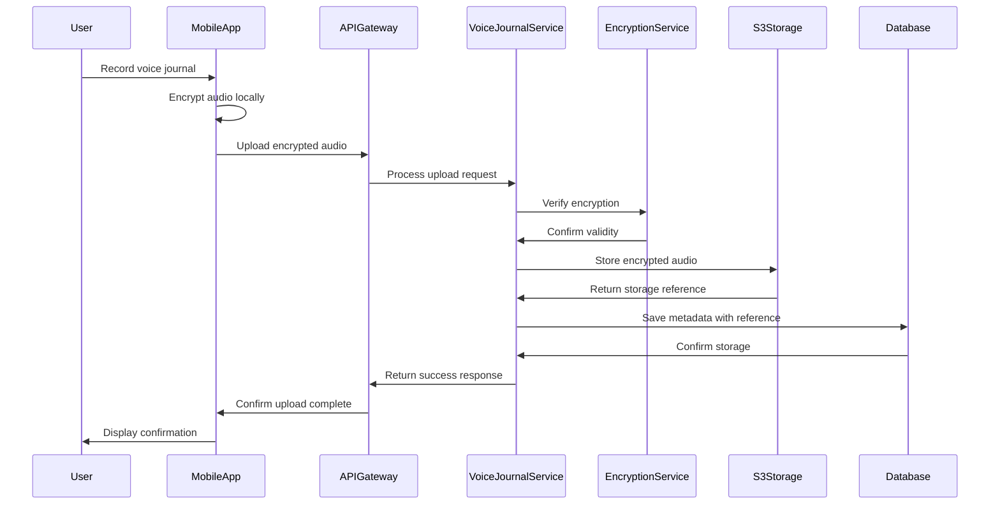

## Introduction
This document provides a detailed description of the backend architecture for the Amira Wellness application. The backend is designed as a microservices-based system that supports the core functionality of emotional well-being through accessible self-regulation tools, emotional release mechanisms, and personal growth tracking.

The backend architecture follows these key principles:

- **Microservices Design**: Domain-driven service boundaries with independent deployment and scaling
- **API-First Approach**: Well-defined RESTful APIs for all functionality
- **Security by Design**: End-to-end encryption and comprehensive security controls
- **Scalability**: Horizontal scaling capabilities for all services
- **Resilience**: Fault tolerance with graceful degradation

This document focuses specifically on the server-side components of the Amira Wellness platform, their interactions, and implementation details.

## Service Architecture
The Amira Wellness backend is composed of several microservices, each responsible for a specific domain of functionality. This approach enables independent development, deployment, and scaling of components based on their specific requirements.


### Service Components

#### Authentication Service

Responsible for user identity and access management, including:

- User registration and authentication
- JWT token issuance and validation
- Password management (reset, change)
- Session management
- Multi-device support

The Authentication Service is implemented using FastAPI with JWT-based authentication and Argon2id password hashing. It integrates with Amazon Cognito for identity management and provides a comprehensive authentication framework as detailed in the Security Architecture document.

#### Voice Journal Service

Manages voice recordings and associated metadata, including:

- Audio recording storage and retrieval
- End-to-end encryption of recordings
- Pre/post emotional check-in association
- Journal metadata management
- Export and sharing capabilities

The Voice Journal Service is implemented using FastAPI and integrates with Amazon S3 for secure storage of encrypted audio files. It implements client-side encryption where audio is encrypted on the device before transmission and remains encrypted throughout its lifecycle.

#### Emotional Tracking Service

Processes and analyzes emotional check-in data, including:

- Emotional state recording and retrieval
- Trend analysis and pattern detection
- Emotional shift analysis
- Insight generation
- Tool recommendations based on emotional state

The Emotional Tracking Service is implemented using FastAPI with TimescaleDB for efficient time-series data storage and analysis. It provides APIs for recording emotional states, analyzing trends, and generating insights.

#### Tool Library Service

Manages the catalog of emotional regulation tools, including:

- Tool content management
- Categorization and tagging
- Personalized recommendations
- Usage tracking
- Favorites management

The Tool Library Service is implemented using FastAPI with MongoDB for flexible content storage. It provides APIs for browsing, searching, and accessing tool content with personalization based on user preferences and emotional states.

#### Progress Tracking Service

Analyzes user activity and tracks progress, including:

- Streak calculation and management
- Achievement tracking
- Usage statistics
- Visualization data generation
- Progress insights

The Progress Tracking Service is implemented using FastAPI and aggregates data from multiple sources to generate insights and track user progress. It provides APIs for retrieving progress data and generating visualizations.

#### Notification Service

Manages alerts, reminders, and affirmations, including:

- Scheduled notifications
- Achievement notifications
- Reminder management
- Affirmation delivery
- Notification preferences

The Notification Service is implemented using FastAPI with background workers for scheduled tasks. It integrates with Firebase Cloud Messaging (FCM) for push notification delivery to mobile devices.

## API Design

The Amira Wellness backend follows an API-first design approach with well-defined RESTful APIs for all functionality. This enables clear contracts between services and clients, facilitating independent development and evolution.

### API Gateway

All client requests are routed through an API Gateway that provides:

- Request routing to appropriate backend services
- Authentication and authorization verification
- Rate limiting and throttling
- Request validation
- Response formatting
- CORS handling
- Basic request logging

The API Gateway is implemented using AWS API Gateway with custom authorizers for authentication and authorization.

### API Versioning

APIs are versioned using URL-based versioning to ensure backward compatibility:

```
https://api.amirawellness.com/v1/journals
https://api.amirawellness.com/v2/journals
```

This approach allows for the evolution of APIs while maintaining support for existing clients. The versioning strategy includes:

- Non-breaking changes within versions
- Breaking changes require a new version
- Deprecation notices provided 3 months before end-of-life
- Multiple versions supported simultaneously during transition periods

### Authentication and Authorization

API endpoints are secured using JWT-based authentication with the following characteristics:

- Short-lived access tokens (15 minutes)
- Refresh token rotation for secure session management
- Role-based access control for authorization
- Scope-based permissions for fine-grained access control

For more details, see the Authentication Framework section in the Security Architecture document.

### Core API Endpoints

#### Authentication API

- `POST /auth/register` - Register a new user
- `POST /auth/login` - Authenticate user and get tokens
- `POST /auth/refresh` - Refresh access token
- `POST /auth/logout` - Logout user and invalidate tokens
- `POST /auth/reset-password` - Request password reset
- `POST /auth/reset-password-confirm` - Confirm password reset
- `POST /auth/verify-email` - Verify user email

For detailed specifications, see the Authentication API Documentation.

#### Journal API

- `POST /journals` - Create a new journal entry
- `GET /journals` - Get user's journal entries
- `GET /journals/{id}` - Get a specific journal entry
- `GET /journals/{id}/audio` - Get journal audio data
- `POST /journals/filter` - Filter journal entries
- `PUT /journals/{id}/favorite` - Mark journal as favorite
- `DELETE /journals/{id}/favorite` - Remove journal from favorites
- `DELETE /journals/{id}` - Delete a journal entry
- `POST /journals/{id}/export` - Export a journal entry

For detailed specifications, see the Voice Journaling API Documentation.

#### Emotions API

- `POST /emotions` - Create a new emotional check-in
- `GET /emotions` - Get user's emotional check-ins
- `GET /emotions/{id}` - Get a specific emotional check-in
- `POST /emotions/filter` - Filter emotional check-ins
- `GET /emotions/distribution` - Get emotion distribution
- `POST /emotions/trends` - Analyze emotional trends
- `POST /emotions/patterns` - Detect emotional patterns
- `GET /emotions/insights` - Generate emotional insights
- `POST /emotions/recommendations` - Get tool recommendations

#### Tools API

- `GET /tools/categories` - Get tool categories
- `GET /tools/categories/{id}` - Get tools in category
- `GET /tools/{id}` - Get a specific tool
- `GET /tools/search` - Search for tools
- `GET /tools/favorites` - Get favorite tools
- `PUT /tools/{id}/favorite` - Add tool to favorites
- `DELETE /tools/{id}/favorite` - Remove tool from favorites
- `POST /tools/{id}/usage` - Track tool engagement

#### Progress API

- `GET /progress/streak` - Get user streak information
- `GET /progress/achievements` - Get user achievements
- `GET /progress/trends` - Get emotional trends
- `GET /progress/statistics` - Get usage statistics
- `GET /progress/insights` - Get progress insights

Detailed API documentation with request/response formats is maintained separately in the project repository.

## Data Architecture

The Amira Wellness backend employs a polyglot persistence approach, using different database technologies optimized for specific data types and access patterns.

### Database Technologies

#### PostgreSQL

PostgreSQL is used for structured relational data, including:

- User accounts and profiles
- Authentication data
- Journal metadata
- Relationships between entities

Key characteristics:
- Strong data consistency
- Complex query support
- Transactional integrity
- Row-level security for data isolation

#### TimescaleDB

TimescaleDB (PostgreSQL extension) is used for time-series emotional data, including:

- Emotional check-ins
- Trend data
- Activity logs

Key characteristics:
- Optimized for time-series data
- Efficient time-based queries
- Automatic partitioning by time
- Advanced aggregation capabilities

#### MongoDB

MongoDB is used for flexible content storage, including:

- Tool library content
- Content metadata
- Categorization data

Key characteristics:
- Flexible schema for varied content types
- Document-oriented structure
- Rich query capabilities
- Efficient for content retrieval

#### Amazon S3

Amazon S3 is used for object storage, including:

- Encrypted voice recordings
- Exported files
- Large media assets

Key characteristics:
- Scalable object storage
- Server-side encryption
- Lifecycle policies
- Access control policies

#### Redis

Redis is used for caching and ephemeral data, including:

- API response caching
- Session data
- Rate limiting counters
- Temporary data

Key characteristics:
- In-memory performance
- Data structure support
- Automatic expiration
- Pub/sub capabilities

### Data Models

#### User Data Model

```
User
├── id: UUID
├── email: String
├── password_hash: String
├── created_at: Timestamp
├── updated_at: Timestamp
├── last_login: Timestamp
├── account_status: String
├── email_verified: Boolean
├── encryption_key_salt: String
├── subscription_tier: String
└── language_preference: String

UserProfile
├── id: UUID
├── user_id: UUID (FK to User)
├── display_name: String
├── preferences: JSON
└── settings: JSON

UserDevice
├── id: UUID
├── user_id: UUID (FK to User)
├── device_id: String
├── device_name: String
├── platform: String
├── push_token: String
├── last_active: Timestamp
└── is_active: Boolean
```

#### Journal Data Model

```
Journal
├── id: UUID
├── user_id: UUID (FK to User)
├── created_at: Timestamp
├── duration_seconds: Integer
├── title: String
├── is_favorite: Boolean
├── storage_path: String
├── encryption_iv: Binary
├── is_uploaded: Boolean
├── is_deleted: Boolean
└── deleted_at: Timestamp

AudioMetadata
├── id: UUID
├── journal_id: UUID (FK to Journal)
├── format: String
├── sample_rate: Integer
├── bit_rate: Integer
├── channels: Integer
├── file_size: Integer
└── checksum: String
```

#### Emotional Data Model

```
EmotionalCheckin
├── id: UUID
├── user_id: UUID (FK to User)
├── emotion_type_id: Integer (FK to EmotionType)
├── intensity: Integer (1-10)
├── context: String
├── notes: Text
├── created_at: Timestamp
├── related_journal_id: UUID (FK to Journal, optional)
└── related_tool_id: UUID (FK to Tool, optional)

EmotionType
├── id: Integer
├── name: String
├── description: String
└── category: String
```

#### Tool Data Model

```
Tool
├── id: UUID
├── category_id: Integer (FK to ToolCategory)
├── name: String
├── description: Text
├── content_type: String
├── content: JSON
├── estimated_duration: Integer
├── created_at: Timestamp
├── updated_at: Timestamp
├── is_active: Boolean
└── target_emotions: Array<Integer> (FK to EmotionType)

ToolCategory
├── id: Integer
├── name: String
├── description: String
└── icon_url: String

ToolFavorite
├── id: UUID
├── user_id: UUID (FK to User)
├── tool_id: UUID (FK to Tool)
└── created_at: Timestamp

ToolUsage
├── id: UUID
├── user_id: UUID (FK to User)
├── tool_id: UUID (FK to Tool)
├── started_at: Timestamp
├── completed_at: Timestamp
├── duration_seconds: Integer
└── completion_status: String
```

#### Progress Data Model

```
UserActivity
├── id: UUID
├── user_id: UUID (FK to User)
├── activity_type_id: Integer (FK to ActivityType)
├── created_at: Timestamp
├── metadata: JSON
└── related_entity_id: UUID (optional)

ActivityType
├── id: Integer
├── name: String
└── description: String

UserStreak
├── id: UUID
├── user_id: UUID (FK to User)
├── current_streak: Integer
├── longest_streak: Integer
├── last_activity_date: Date
└── updated_at: Timestamp

UserAchievement
├── id: UUID
├── user_id: UUID (FK to User)
├── achievement_type_id: Integer (FK to AchievementType)
├── earned_at: Timestamp
└── metadata: JSON

AchievementType
├── id: Integer
├── name: String
├── description: String
├── criteria: JSON
└── icon_url: String
```

Detailed database schema documentation is maintained separately in the project repository.

## Security Implementation

Security is a fundamental aspect of the Amira Wellness backend architecture, with particular emphasis on protecting sensitive emotional data and voice recordings.

### Authentication Implementation

The authentication system is implemented using JWT-based tokens with the following characteristics:

- Access tokens with 15-minute expiration
- Refresh tokens with 14-day expiration and rotation on use
- Argon2id password hashing with appropriate work factors
- Email verification for new accounts
- Secure password reset workflow
- Rate limiting on authentication endpoints

The implementation uses FastAPI's security dependencies and integrates with Amazon Cognito for identity management. For more details, see the Authentication Framework section in the Security Architecture document.

### Authorization Implementation

Authorization is implemented at multiple levels:

1. **API Gateway**: Coarse-grained authorization based on JWT claims
2. **Service Layer**: Fine-grained authorization using role and permission checks
3. **Data Layer**: Row-level security in PostgreSQL for data isolation

The system uses role-based access control with the following roles:

- Standard User: Access to own data and basic features
- Premium User: Access to premium features in addition to standard features
- Content Manager: Ability to manage tool library content
- System Administrator: Full system access with administrative capabilities

### End-to-End Encryption Implementation

The backend supports end-to-end encryption for voice recordings with the following characteristics:



Key aspects of the implementation:

- AES-256-GCM encryption for data confidentiality and integrity
- Client-side encryption where audio is encrypted before transmission
- Encryption keys derived from user credentials, never transmitted to the server
- Unique initialization vectors (IV) for each encryption operation
- Authentication tags for integrity verification
- Secure key storage using platform security features (iOS Keychain, Android KeyStore)

The backend never has access to unencrypted user content or encryption keys, ensuring true end-to-end encryption.

### Data Protection Implementation

Data protection measures include:

- TLS 1.3 for all API communications
- Server-side encryption for databases (PostgreSQL, MongoDB)
- Server-side encryption for S3 storage
- Data minimization principles
- Purpose-specific data access
- Audit logging for sensitive operations

For more details, see the Data Protection section in the Security Architecture document.

## Service Implementation

This section details the implementation of key backend services, focusing on their internal architecture, components, and interactions.

### Authentication Service Implementation

The Authentication Service is implemented using FastAPI with the following components:


Key components:

- **Authentication API Routes**: FastAPI router with endpoints for authentication operations
- **Auth Service**: Core service for user authentication and registration
- **Token Service**: Handles JWT token generation, validation, and refresh
- **Password Service**: Manages password hashing, validation, and reset
- **Email Service**: Handles email verification and password reset emails
- **User Repository**: Data access layer for user information
- **Token Repository**: Data access layer for token blacklisting and tracking

The service implements rate limiting to prevent brute force attacks and includes comprehensive logging for security monitoring.

### Voice Journal Service Implementation

The Voice Journal Service is implemented using FastAPI with the following components:


Key components:

- **Journal API Routes**: FastAPI router with endpoints for journal operations
- **Journal Service**: Core service for journal management
- **Audio Processing Service**: Handles audio format conversion and optimization
- **Journal Encryption Service**: Manages encryption operations for journal audio
- **Journal Repository**: Data access layer for journal metadata
- **Storage Service**: Abstraction for storage operations
- **S3 Storage**: External storage for encrypted audio files
- **Emotion Service**: Integration with Emotional Tracking Service

The service supports end-to-end encryption where audio is encrypted on the client device and remains encrypted throughout its lifecycle.

### Emotional Tracking Service Implementation

The Emotional Tracking Service is implemented using FastAPI with the following components:


Key components:

- **Emotions API Routes**: FastAPI router with endpoints for emotional data operations
- **Emotion Service**: Core service for emotional check-in management
- **Trend Analysis Service**: Analyzes emotional trends over time
- **Pattern Detection Service**: Detects patterns in emotional data
- **Recommendation Service**: Generates tool recommendations based on emotional state
- **Emotion Repository**: Data access layer for emotional data
- **Analytics Repository**: Data access layer for aggregated analytics data
- **Tool Service**: Integration with Tool Library Service

The service uses TimescaleDB for efficient time-series data storage and analysis, enabling advanced emotional pattern detection and trend analysis.

### Tool Library Service Implementation

The Tool Library Service is implemented using FastAPI with the following components:


Key components:

- **Tools API Routes**: FastAPI router with endpoints for tool library operations
- **Tool Service**: Core service for tool management
- **Category Service**: Manages tool categories and organization
- **Recommendation Service**: Generates personalized tool recommendations
- **Usage Tracking Service**: Tracks tool usage for analytics and personalization
- **Tool Repository**: Data access layer for tool content
- **Category Repository**: Data access layer for category information
- **Usage Repository**: Data access layer for usage tracking
- **Cache Service**: Caching layer for frequently accessed content
- **CDN**: Content delivery network for static assets

The service uses MongoDB for flexible content storage and Redis for caching frequently accessed content.

## Scalability and Performance

The Amira Wellness backend is designed for scalability and performance to support growth in user base and usage patterns.

### Scaling Approach

The backend implements a multi-dimensional scaling strategy:


#### Horizontal Scaling

Stateless services are designed for horizontal scaling:

- API services scale based on request load
- Background workers scale based on queue depth
- Auto-scaling groups with health checks
- Load balancing across instances

#### Vertical Scaling

Stateful components scale vertically for performance:

- Database instances scale up for increased capacity
- Cache instances scale up for memory capacity
- Read replicas for read-heavy workloads

#### Functional Scaling

Services scale independently based on specific requirements:

- Voice Journal Service scales based on recording volume
- Emotional Tracking Service scales based on check-in frequency
- Tool Library Service scales based on content access patterns

#### Geographic Scaling (Future)

Multi-region deployment for global distribution:

- Region-specific deployments for data residency
- Cross-region replication for disaster recovery
- Content distribution via CDN

### Performance Optimization

Performance is optimized through several techniques:

#### Caching Strategy


The system implements a multi-level caching strategy:

- **API Response Caching**: Redis cache for frequent API responses
- **Content Caching**: CDN for static content delivery
- **Database Query Caching**: Result caching for expensive queries
- **Computed Results Caching**: Caching for expensive computations

#### Database Optimization

Database performance is optimized through:

- Proper indexing for common query patterns
- Query optimization and monitoring
- Connection pooling for efficient resource usage
- Read replicas for read-heavy workloads
- Data partitioning for large tables (e.g., emotional check-ins)

#### Asynchronous Processing

Non-critical operations are processed asynchronously:

- Background workers for data processing
- Message queues for task distribution
- Scheduled tasks for periodic operations
- Event-driven architecture for decoupling

#### Efficient API Design

API design optimizations include:

- Pagination for large result sets
- Partial responses for resource efficiency
- Batch operations for reducing request overhead
- Compression for network efficiency
- GraphQL (future) for flexible data fetching

## Resilience and Fault Tolerance

The Amira Wellness backend implements resilience patterns to ensure system availability and data integrity even during component failures.

### High Availability Design


High availability is achieved through:

- Multi-AZ deployment for redundancy
- Auto-scaling groups for service instances
- Database replication with automated failover
- Stateless service design for easy replacement
- Load balancing across healthy instances

### Fault Tolerance Mechanisms

#### Circuit Breaker Pattern

The system implements circuit breakers for dependency failures:


Circuit breakers are implemented for:

- Service-to-service communication
- Database connections
- External service integrations
- Storage operations

#### Retry Mechanisms

Retry strategies are implemented for transient failures:

- Exponential backoff with jitter
- Maximum retry limits
- Retry budgets to prevent cascading failures
- Idempotent operations for safe retries

#### Fallback Responses

Fallback mechanisms for degraded operation:

- Cached responses when live data is unavailable
- Default values for missing data
- Graceful degradation of features
- Clear user communication about limited functionality

#### Bulkhead Pattern

Resource isolation to prevent cascading failures:

- Separate connection pools for different services
- Thread pool isolation for critical operations
- Resource quotas for fair resource allocation
- Timeout policies to prevent resource exhaustion

### Disaster Recovery

Disaster recovery capabilities include:

- Regular automated backups
- Point-in-time recovery for databases
- Cross-region replication for critical data
- Documented recovery procedures with regular testing

Recovery objectives:

- Recovery Time Objective (RTO): 1 hour for critical services
- Recovery Point Objective (RPO): 5 minutes for critical data

## Deployment Architecture

The Amira Wellness backend is deployed using a containerized approach with AWS services for infrastructure.

### Container Architecture


The deployment architecture uses:

- Docker containers for service packaging
- Amazon ECR for container registry
- Amazon ECS for container orchestration
- Fargate for serverless container execution
- Application Load Balancer for traffic distribution

### Infrastructure as Code

The infrastructure is defined and managed using:

- Terraform for infrastructure provisioning
- AWS CloudFormation for AWS-specific resources
- GitHub Actions for CI/CD automation
- Infrastructure versioning in Git

### Deployment Pipeline


The deployment pipeline includes:

- Automated builds on code changes
- Unit and integration testing
- Security scanning
- Container image building and versioning
- Automated deployment to development environment
- Manual approval for production deployment
- Post-deployment validation

### Environment Strategy

The application uses multiple environments:

- **Development**: For active development and testing
- **Staging**: For pre-production validation
- **Production**: For end-user access

Each environment has isolated resources and appropriate access controls.

### Monitoring and Observability

The deployment includes comprehensive monitoring:

- CloudWatch for metrics and logs
- X-Ray for distributed tracing
- CloudWatch Alarms for alerting
- Dashboards for different stakeholders

## Development Considerations

This section covers important considerations for backend development, including coding standards, testing approaches, and development workflows.

### Development Environment

The development environment includes:

- Local development setup with Docker Compose
- Development AWS environment for integration testing
- CI/CD pipeline for automated testing and deployment
- Shared development tools and utilities

### Coding Standards

Backend development follows these coding standards:

- PEP 8 style guide for Python code
- Type hints for all function signatures
- Comprehensive docstrings for all modules, classes, and functions
- Consistent error handling patterns
- Logging at appropriate levels
- Security best practices

### Testing Approach

The testing strategy includes:

- Unit tests for all business logic
- Integration tests for service interactions
- API tests for endpoint validation
- Performance tests for critical paths
- Security tests for vulnerability detection

Test coverage requirements:

- Business logic: 90%+ coverage
- API endpoints: 85%+ coverage
- Data access layer: 80%+ coverage

### Development Workflow

The development workflow follows:

1. Feature branches from main branch
2. Pull request with code review
3. Automated testing in CI pipeline
4. Manual review and approval
5. Merge to main branch
6. Automated deployment to development environment
7. Integration testing
8. Deployment to staging for validation
9. Deployment to production

### Documentation

Documentation requirements include:

- API documentation using OpenAPI/Swagger
- Architecture documentation in Markdown
- Code documentation with docstrings
- Runbooks for operational procedures
- Diagrams for visual representation

### Dependency Management

Dependencies are managed using:

- Requirements files with pinned versions
- Regular dependency updates and security scanning
- Minimal dependency approach to reduce attack surface
- Containerization for consistent environments

## Future Considerations

The Amira Wellness backend architecture is designed to accommodate future growth and feature expansion. This section outlines planned enhancements and evolutionary paths for the backend architecture.

### Scalability Enhancements

- **Multi-Region Deployment**: Expand to multiple AWS regions for global distribution and data residency compliance
- **Enhanced Caching**: Implement more sophisticated caching strategies for improved performance
- **Database Sharding**: Implement sharding for horizontal database scaling as user base grows
- **Serverless Expansion**: Migrate more components to serverless architecture for improved scalability

### Feature Enhancements

- **GraphQL API**: Implement GraphQL for more flexible data fetching and reduced network overhead
- **Real-time Features**: Add WebSocket support for real-time notifications and updates
- **Advanced Analytics**: Enhance analytics capabilities with machine learning for deeper insights
- **Community Features**: Add backend support for community features with appropriate privacy controls
- **Integration APIs**: Develop APIs for integration with third-party wellness platforms

### Technical Improvements

- **Event Sourcing**: Implement event sourcing for improved auditability and data evolution
- **CQRS Pattern**: Separate read and write models for optimized performance
- **Enhanced Observability**: Implement more comprehensive tracing and monitoring
- **Automated Scaling**: Implement predictive auto-scaling based on usage patterns
- **Infrastructure Optimization**: Continuous refinement of infrastructure for cost and performance

### Security Enhancements

- **Enhanced Encryption**: Implement additional encryption mechanisms for different data types
- **Advanced Authentication**: Add support for additional authentication methods and MFA
- **Threat Detection**: Implement advanced threat detection and prevention mechanisms
- **Compliance Automation**: Automate compliance checks and reporting
- **Security Testing**: Enhance security testing with continuous penetration testing

### Operational Improvements

- **Chaos Engineering**: Implement chaos testing for improved resilience
- **Automated Remediation**: Develop automated remediation for common issues
- **Cost Optimization**: Implement more sophisticated cost optimization strategies
- **Performance Monitoring**: Enhance performance monitoring with user-centric metrics
- **Documentation Automation**: Automate documentation generation and maintenance

## Conclusion

The Amira Wellness backend architecture provides a robust, secure, and scalable foundation for the application's core features. By implementing a microservices approach with clear service boundaries, the architecture enables independent development, deployment, and scaling of components based on their specific requirements.

Key strengths of the architecture include:

- **Privacy-First Design**: End-to-end encryption and comprehensive security controls ensure user data privacy
- **Scalability**: Horizontal scaling capabilities and performance optimizations support growth
- **Resilience**: Fault tolerance mechanisms ensure system availability even during component failures
- **Flexibility**: Modular design enables independent evolution of components
- **Maintainability**: Clear separation of concerns and comprehensive documentation facilitate maintenance

The architecture addresses the core requirements of the Amira Wellness application while providing a foundation for future growth and feature expansion. By following industry best practices and leveraging modern cloud technologies, the backend architecture supports the application's mission of providing accessible, private, and effective emotional wellness tools.

## References

- [Security Architecture](security.md) - Comprehensive security model
- [AWS Well-Architected Framework](https://aws.amazon.com/architecture/well-architected/) - Best practices for cloud architecture
- [Microservices Patterns](https://microservices.io/patterns/index.html) - Patterns for microservices architecture
- [Twelve-Factor App](https://12factor.net/) - Methodology for building modern applications
- [Authentication API](../api/authentication.md) - Detailed authentication API documentation
- [Voice Journaling API](../api/journaling.md) - Detailed voice journaling API documentation