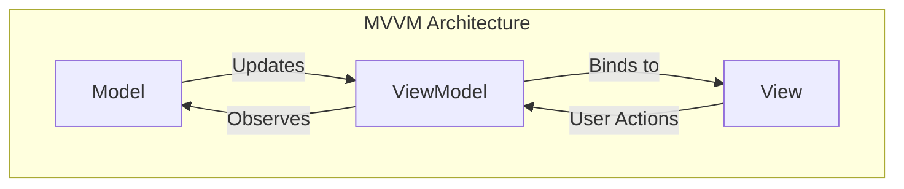
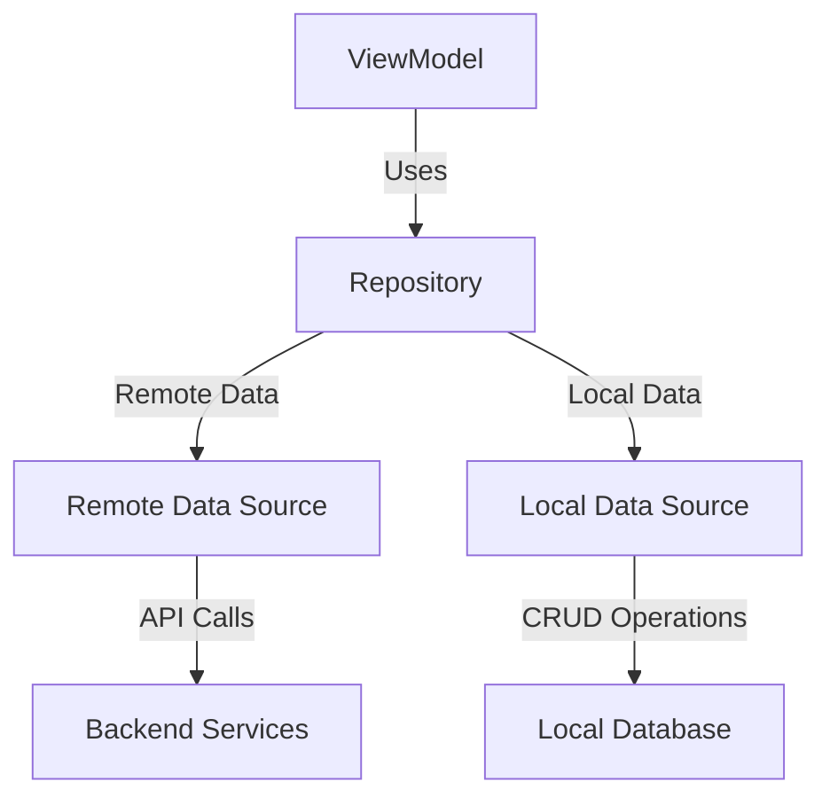
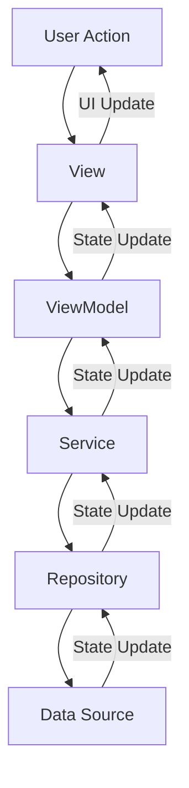
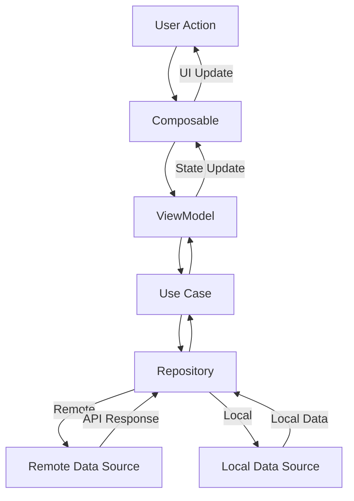
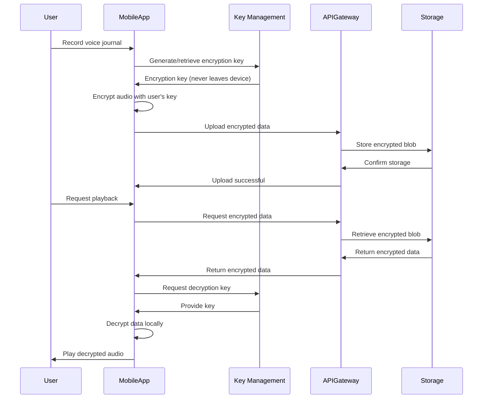
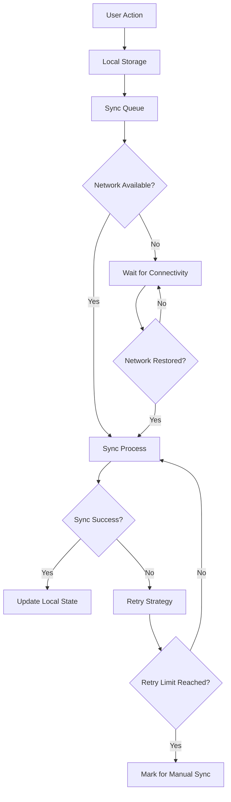

# Mobile Architecture - Amira Wellness

## Introduction

This document provides a detailed overview of the mobile architecture for the Amira Wellness application. The mobile applications are a critical component of the system, serving as the primary interface for users to access emotional wellness tools, record voice journals, track emotional states, and monitor their progress.

The mobile architecture follows these key principles:

- **Native Implementation**: Both iOS and Android applications are implemented using native technologies for optimal performance and user experience.
- **MVVM Architecture**: Clear separation of concerns using the Model-View-ViewModel pattern.
- **Privacy by Design**: End-to-end encryption and secure storage for sensitive user data.
- **Offline-First**: Core functionality available without internet connection.
- **Reactive Programming**: Responsive UI updates using reactive programming patterns.
- **Dependency Injection**: Modular and testable code through dependency injection.

This architecture supports the application's focus on providing a secure, private space for emotional expression and wellness tracking.

## Platform Overview

The Amira Wellness application is implemented as native applications for both iOS and Android platforms, targeting the following specifications:

### iOS Application

- **Language**: Swift 5.9+
- **UI Framework**: SwiftUI with UIKit components where needed
- **Minimum iOS Version**: iOS 14.0
- **Target Devices**: iPhone and iPad
- **Reactive Framework**: Combine

### Android Application

- **Language**: Kotlin 1.9+
- **UI Framework**: Jetpack Compose with some XML layouts for compatibility
- **Minimum Android Version**: Android 8.0 (API 26)
- **Target Devices**: Phones and tablets with >2GB RAM
- **Reactive Framework**: Kotlin Coroutines and Flow

Both applications share a common architecture and feature set while leveraging platform-specific capabilities for optimal performance and user experience.

## Client Layer Architecture

The Client Layer represents the mobile applications that interface directly with users. This layer is responsible for presenting information, capturing user input, and providing an intuitive interface to access all features of the Amira Wellness platform.

### Key Components of the Client Layer

- **Presentation Components**: UI elements that display information and capture user input
- **Business Logic**: Processes for handling user actions and application flow
- **Data Management**: Local storage and synchronization with backend services
- **Security**: Client-side encryption and secure storage mechanisms

### Responsibilities

- Providing an intuitive, responsive user interface
- Implementing client-side validation and error handling
- Managing local data persistence for offline functionality
- Handling device-specific features (camera, microphone, notifications)
- Ensuring secure communication with backend services
- Implementing client-side encryption for sensitive data

## Architectural Patterns

The mobile applications implement several architectural patterns to ensure maintainability, testability, and scalability:

### MVVM Pattern

Both iOS and Android applications follow the Model-View-ViewModel (MVVM) pattern:



- **Model**: Data models and business logic
  - Represents the domain data and business rules
  - Implemented as structs in Swift and data classes in Kotlin
  - Independent of UI and platform-specific code

- **View**: UI components with declarative syntax
  - Implemented using SwiftUI on iOS and Jetpack Compose on Android
  - Observes ViewModel state and renders UI accordingly
  - Forwards user actions to ViewModel
  - Contains minimal logic

- **ViewModel**: Presentation logic and state management
  - Processes data from Model for presentation
  - Handles user actions from View
  - Manages UI state
  - Platform-specific implementation with shared patterns
  - iOS: ObservableObject with @Published properties
  - Android: ViewModel with StateFlow

This pattern provides clear separation of concerns, testability, and reactive UI updates.

### Repository Pattern

Data access is abstracted through repositories:



- **Repository**: Provides a clean API for data access
  - Abstracts data sources (remote and local)
  - Handles data caching and synchronization
  - Implements business logic for data operations
  - Returns domain models to ViewModels

- **Data Sources**: Implement specific data access mechanisms
  - Remote Data Source: API client for backend communication
  - Local Data Source: Database and file system access

This pattern enables:
- Offline-first functionality through local caching
- Transparent synchronization when connectivity is restored
- Testability through dependency injection
- Separation of concerns between data access and business logic

### Dependency Injection

Both applications implement dependency injection to promote modularity and testability:

- **iOS**: Custom DI container (DIContainer) with service factories
- **Android**: Koin dependency injection framework

This approach enables:
- Loose coupling between components
- Easier testing through mock substitution
- Centralized dependency management
- Simplified component lifecycle management

## iOS Architecture

The iOS application is built using Swift and SwiftUI, following modern iOS development practices and architectural patterns.

### Project Structure

```
AmiraWellness/
├── Config/                 # App configuration
├── Core/
│   ├── Constants/          # App-wide constants
│   ├── Extensions/         # Swift extensions
│   ├── Modifiers/          # SwiftUI modifiers
│   ├── Utilities/          # Utility classes
│   └── DI/                 # Dependency injection
├── Models/                 # Data models
├── Services/
│   ├── Network/            # API client
│   ├── Authentication/     # Auth services
│   ├── Encryption/         # Encryption services
│   ├── Storage/            # Data persistence
│   ├── Journal/            # Journal services
│   ├── Emotion/            # Emotion tracking
│   ├── Tool/               # Tool library
│   ├── Progress/           # Progress tracking
│   └── Notification/       # Notifications
├── UI/
│   ├── Components/         # Reusable UI components
│   ├── Navigation/         # Navigation system
│   └── Screens/            # App screens
└── Resources/              # Assets and resources
```

### Dependency Injection

The iOS app uses a custom dependency injection container to manage service instances:

```swift
class DIContainer {
    static let shared = DIContainer()
    
    private let serviceFactory: ServiceFactory
    
    private var authService: AuthService?
    private var encryptionService: EncryptionService?
    // Other services...
    
    private init() {
        serviceFactory = ServiceFactory()
    }
    
    func getAuthService() -> AuthService {
        if authService == nil {
            authService = serviceFactory.createAuthService()
        }
        return authService!
    }
    
    // Other service getters...
}
```

This container:
- Provides centralized access to all services
- Implements lazy initialization of services
- Manages dependencies between services
- Facilitates testing through service mocking

### View Architecture

The UI layer is implemented using SwiftUI with the MVVM pattern:

```swift
// ViewModel
class RecordJournalViewModel: ObservableObject {
    @Published var viewState: RecordJournalViewState = .preCheckIn
    @Published var selectedEmotionType: EmotionType?
    @Published var emotionIntensity: Int = 5
    // Other state properties...
    
    private let journalService: JournalService
    private let emotionService: EmotionService
    
    init(journalService: JournalService? = nil, emotionService: EmotionService? = nil) {
        self.journalService = journalService ?? DIContainer.shared.getJournalService()
        self.emotionService = emotionService ?? DIContainer.shared.getEmotionService()
    }
    
    func submitPreRecordingEmotionalState() {
        // Implementation...
    }
    
    // Other methods...
}

// View
struct RecordJournalView: View {
    @StateObject var viewModel = RecordJournalViewModel()
    
    var body: some View {
        VStack {
            // UI implementation based on viewModel state
        }
    }
}
```

Key aspects of the view architecture:
- Views observe ViewModel state using @Published properties
- ViewModels handle business logic and state management
- Dependency injection for services in ViewModels
- State-driven UI rendering

### Data Flow

The iOS application implements a unidirectional data flow:



This pattern ensures:
- Predictable state management
- Clear responsibility boundaries
- Testable components
- Reactive UI updates

### Offline Support

Offline functionality is implemented through:

- **Local Storage**: Core Data for structured data, FileManager for files
- **Sync Manager**: Tracks changes and synchronizes when online
- **Operation Queuing**: Queues operations for execution when connectivity is restored
- **Conflict Resolution**: Strategies for handling conflicts during synchronization

## Android Architecture

The Android application is built using Kotlin and Jetpack Compose, following modern Android development practices and architectural patterns.

### Project Structure

```
com.amirawellness/
├── config/                 # App configuration
├── core/
│   ├── constants/          # App-wide constants
│   ├── extensions/         # Kotlin extensions
│   └── utils/              # Utility classes
├── data/
│   ├── models/             # Data models
│   ├── local/              # Local data sources
│   ├── remote/             # Remote data sources
│   └── repositories/       # Repository implementations
├── di/                     # Dependency injection
├── domain/
│   └── usecases/           # Business logic use cases
├── services/
│   ├── encryption/         # Encryption services
│   ├── audio/              # Audio recording/playback
│   ├── notification/       # Notification services
│   ├── biometric/          # Biometric authentication
│   ├── sync/               # Synchronization
│   └── analytics/          # Analytics tracking
├── ui/
│   ├── theme/              # App theme
│   ├── navigation/         # Navigation components
│   ├── components/         # Reusable UI components
│   └── screens/            # App screens
└── AmiraApplication.kt     # Application class
```

### Dependency Injection

The Android app uses Koin for dependency injection:

```kotlin
val appModule = module {
    // Provide application-level dependencies
    single { androidContext().getSharedPreferences("app_prefs", Context.MODE_PRIVATE) }
}

val serviceModule = module {
    // Service dependencies
    single { EncryptionManager(get()) }
    single { AudioRecordingService(get(), get()) }
    // Other services...
}

val viewModelModule = module {
    // ViewModels
    viewModel { RecordJournalViewModel(get(), get(), get(), get()) }
    // Other ViewModels...
}

fun initKoin(application: Application) {
    startKoin {
        androidLogger(Level.ERROR)
        androidContext(application)
        modules(listOf(appModule, networkModule, storageModule, encryptionModule, serviceModule, viewModelModule))
    }
}
```

This approach:
- Organizes dependencies into logical modules
- Provides singleton and factory scopes as needed
- Simplifies ViewModel creation and lifecycle management
- Facilitates testing through dependency substitution

### View Architecture

The UI layer is implemented using Jetpack Compose with the MVVM pattern:

```kotlin
// UI State
data class RecordJournalUiState(
    val isLoading: Boolean = false,
    val isSaving: Boolean = false,
    val recordingState: RecordingState = RecordingState.Idle,
    val currentAmplitude: Int = 0,
    val recordingDuration: Long = 0,
    val preEmotionalState: EmotionalState? = null,
    val postEmotionalState: EmotionalState? = null,
    val savedJournal: Journal? = null,
    val message: String? = null,
    val isError: Boolean = false,
    val permissionGranted: Boolean = false
)

// ViewModel
@HiltViewModel
class RecordJournalViewModel @Inject constructor(
    private val context: Context,
    private val audioRecordingService: AudioRecordingService,
    private val createJournalUseCase: CreateJournalUseCase,
    private val recordEmotionalStateUseCase: RecordEmotionalStateUseCase
) : ViewModel() {
    private val _uiState = MutableStateFlow(RecordJournalUiState())
    val uiState: StateFlow<RecordJournalUiState> = _uiState.asStateFlow()
    
    // Methods for handling user actions and state updates...
}

// Composable Screen
@Composable
fun RecordJournalScreen(
    viewModel: RecordJournalViewModel = koinViewModel(),
    onNavigateBack: () -> Unit
) {
    val uiState by viewModel.uiState.collectAsState()
    
    // UI implementation based on uiState
}
```

Key aspects of the view architecture:
- Immutable UI state represented by data classes
- StateFlow for reactive state updates
- ViewModels expose state and handle user actions
- Composable functions for UI rendering
- State hoisting for component reusability

### Data Flow

The Android application implements a unidirectional data flow using the Repository pattern and Use Cases:



This architecture:
- Separates concerns between data, domain, and presentation layers
- Centralizes business logic in use cases
- Provides a clean API for ViewModels
- Enables testability of each component

### Offline Support

Offline functionality is implemented through:

- **Room Database**: For structured data persistence
- **DataStore**: For key-value preferences
- **WorkManager**: For background synchronization
- **Data Queue Manager**: For operation queuing during offline periods

## Security Implementation

Security is a fundamental aspect of the Amira Wellness mobile architecture, with particular emphasis on protecting sensitive emotional data and voice recordings.

### End-to-End Encryption

Both iOS and Android applications implement end-to-end encryption for sensitive user data:



#### iOS Implementation

The iOS app uses CryptoKit for encryption operations:

```swift
class EncryptionService {
    static let shared = EncryptionService()
    
    private let keyManager: KeyManagementService
    
    func encryptData(data: Data, keyIdentifier: String) -> Result<EncryptedData, EncryptionError> {
        // Implementation using CryptoKit with AES-256-GCM
    }
    
    func decryptData(encryptedData: EncryptedData, keyIdentifier: String) -> Result<Data, EncryptionError> {
        // Implementation using CryptoKit with AES-256-GCM
    }
    
    // Other encryption methods...
}
```

#### Android Implementation

The Android app uses the Android Keystore and Cipher APIs:

```kotlin
class EncryptionManager @Inject constructor(
    private val keyStoreManager: KeyStoreManager
) {
    fun encryptData(data: ByteArray, keyAlias: String): Result<EncryptedData> {
        // Implementation using Android Keystore and AES-256-GCM
    }
    
    fun decryptData(encryptedData: EncryptedData, keyAlias: String): Result<ByteArray> {
        // Implementation using Android Keystore and AES-256-GCM
    }
    
    // Other encryption methods...
}
```

### Secure Storage

Sensitive data is stored securely on the device:

#### iOS Implementation

- **Keychain**: For encryption keys and authentication tokens
- **Secure Enclave**: For biometric-protected keys when available
- **Data Protection**: File-level encryption with complete protection

#### Android Implementation

- **Keystore**: For encryption keys and authentication tokens
- **EncryptedSharedPreferences**: For sensitive preferences
- **EncryptedFile**: For file-level encryption
- **Biometric authentication**: For accessing sensitive data

### Authentication

Both applications implement secure authentication:

- **Token-based authentication**: JWT tokens with secure storage
- **Biometric authentication**: TouchID/FaceID on iOS, Fingerprint/Face on Android
- **Secure token storage**: Platform-specific secure storage
- **Session management**: Automatic token refresh and expiration handling

### Certificate Pinning

To prevent man-in-the-middle attacks, both applications implement certificate pinning:

- **iOS**: Using URLSession with pinned certificates
- **Android**: Using OkHttp CertificatePinner

This ensures that the applications only communicate with the legitimate backend servers.

## Offline Capabilities

The Amira Wellness mobile applications implement an offline-first approach to ensure core functionality is available even without internet connectivity.

### Local Data Storage

#### iOS Implementation

- **Core Data**: For structured data (user profile, emotional states, journal metadata)
- **FileManager**: For encrypted audio files and other binary data
- **UserDefaults**: For app preferences and non-sensitive settings
- **Keychain**: For secure storage of authentication tokens and encryption keys

#### Android Implementation

- **Room Database**: For structured data with SQL support
- **DataStore**: For preferences and small datasets
- **File Storage**: For encrypted audio files with MediaStore integration
- **EncryptedSharedPreferences**: For secure storage of sensitive settings

### Synchronization Strategy

Both applications implement a robust synchronization strategy:



#### Key Components

1. **Offline Queue**:
   - Records all changes made while offline
   - Prioritizes operations for synchronization
   - Handles dependencies between operations

2. **Conflict Resolution**:
   - Server-wins strategy for most data
   - Client-wins strategy for user content
   - Three-way merge for complex conflicts
   - User notification for unresolvable conflicts

3. **Sync Manager**:
   - Monitors network connectivity
   - Manages synchronization process
   - Implements retry strategies with exponential backoff
   - Provides sync status to UI

4. **Background Synchronization**:
   - iOS: Background tasks for sync when app is in background
   - Android: WorkManager for reliable background processing

### Offline Feature Support

The following features are fully functional offline:

1. **Voice Journaling**:
   - Recording and playback of voice journals
   - Emotional check-ins before and after recording
   - Local storage of encrypted recordings
   - Queuing for upload when online

2. **Emotional Check-ins**:
   - Recording emotional states
   - Basic emotional trend visualization
   - Local storage of emotional data

3. **Tool Library**:
   - Access to downloaded/cached tools
   - Favorited tools available offline
   - Basic tool usage tracking

4. **Progress Tracking**:
   - Basic streak calculation
   - Local achievement tracking
   - Limited progress visualization

Features that require connectivity:

1. **Tool Library Updates**:
   - Downloading new tools
   - Tool content updates

2. **Advanced Analytics**:
   - Complex emotional trend analysis
   - Comparative analytics

3. **Account Management**:
   - Password changes
   - Profile updates
   - Subscription management

## Reactive Programming

Both iOS and Android applications implement reactive programming patterns to handle asynchronous events and state updates efficiently.

### iOS Implementation

The iOS application uses Combine framework for reactive programming:

```swift
class JournalListViewModel: ObservableObject {
    @Published var journals: [Journal] = []
    @Published var isLoading = false
    @Published var errorMessage: String? = nil
    
    private let journalService: JournalService
    private var cancellables = Set<AnyCancellable>()
    
    init(journalService: JournalService = DIContainer.shared.getJournalService()) {
        self.journalService = journalService
        loadJournals()
    }
    
    func loadJournals() {
        isLoading = true
        journalService.getJournals()
            .receive(on: DispatchQueue.main)
            .sink(receiveCompletion: { [weak self] completion in
                self?.isLoading = false
                if case .failure(let error) = completion {
                    self?.errorMessage = error.localizedDescription
                }
            }, receiveValue: { [weak self] journals in
                self?.journals = journals
            })
            .store(in: &cancellables)
    }
}
```

Key Combine features used:
- Publishers for asynchronous data streams
- Subscribers for consuming data streams
- Operators for transforming data
- Cancellables for managing subscriptions
- @Published property wrapper for observable state

### Android Implementation

The Android application uses Kotlin Coroutines and Flow for reactive programming:

```kotlin
@HiltViewModel
class JournalListViewModel @Inject constructor(
    private val getJournalsUseCase: GetJournalsUseCase
) : ViewModel() {
    private val _uiState = MutableStateFlow(JournalListUiState())
    val uiState: StateFlow<JournalListUiState> = _uiState.asStateFlow()
    
    init {
        loadJournals()
    }
    
    fun loadJournals() {
        viewModelScope.launch {
            _uiState.update { it.copy(isLoading = true) }
            try {
                val journals = getJournalsUseCase()
                _uiState.update { 
                    it.copy(journals = journals, isLoading = false) 
                }
            } catch (e: Exception) {
                _uiState.update { 
                    it.copy(errorMessage = e.message, isLoading = false) 
                }
            }
        }
    }
}
```

Key Coroutines and Flow features used:
- Coroutines for asynchronous operations
- Flow for reactive data streams
- StateFlow for observable UI state
- viewModelScope for coroutine lifecycle management
- Structured concurrency for error handling

### Common Reactive Patterns

Both platforms implement these common reactive patterns:

1. **Observable State**:
   - iOS: @Published properties with ObservableObject
   - Android: StateFlow with collect in Composables

2. **Asynchronous Data Loading**:
   - iOS: Combine publishers with sink
   - Android: Coroutines with Flow collection

3. **Event Handling**:
   - iOS: Combine subjects or callback closures
   - Android: SharedFlow or callback functions

4. **Transformation Chains**:
   - iOS: Combine operators (map, filter, etc.)
   - Android: Flow operators (map, filter, etc.)

5. **Error Handling**:
   - iOS: Combine completion handlers
   - Android: Try-catch in coroutines or catch operator in Flow

## Testing Strategy

The mobile applications implement a comprehensive testing strategy to ensure reliability, performance, and security.

### Test Types

#### Unit Tests

- **iOS**: XCTest framework
- **Android**: JUnit and Mockito
- **Coverage Target**: 80% for business logic, 70% overall

Key areas for unit testing:
- ViewModels and presentation logic
- Service implementations
- Repository implementations
- Utility functions and extensions
- Data transformations

#### Integration Tests

- **iOS**: XCTest with integration testing approach
- **Android**: AndroidX Test with Espresso
- **Coverage Target**: Critical user flows and service integrations

Key areas for integration testing:
- Service interactions
- Repository with data sources
- API client with mock server
- Database operations

#### UI Tests

- **iOS**: XCUITest
- **Android**: Espresso and Compose UI Testing
- **Coverage Target**: All screens and critical user interactions

Key areas for UI testing:
- Screen navigation
- User input handling
- State visualization
- Error states and recovery

#### Security Tests

- Encryption implementation verification
- Secure storage validation
- Authentication flow testing
- Certificate pinning validation

### Test Automation

Both platforms implement CI/CD pipelines for test automation:

- **iOS**: GitHub Actions with Xcode Cloud
- **Android**: GitHub Actions with Gradle

Automated test execution:
- On pull requests
- On merges to main branch
- Nightly full test suite
- Pre-release validation

### Test Data Management

- Mock data generators for consistent test data
- Test fixtures for common scenarios
- In-memory databases for integration tests
- Mock API responses for network tests

### Mocking Strategy

#### iOS

```swift
// Mock service for testing
class MockJournalService: JournalService {
    var journals: [Journal] = []
    var shouldFail = false
    
    func getJournals() -> AnyPublisher<[Journal], Error> {
        if shouldFail {
            return Fail(error: NSError(domain: "test", code: 0, userInfo: nil))
                .eraseToAnyPublisher()
        }
        return Just(journals)
            .setFailureType(to: Error.self)
            .eraseToAnyPublisher()
    }
    
    // Other mocked methods...
}

// Test using mock
func testJournalListViewModel() {
    // Given
    let mockService = MockJournalService()
    mockService.journals = [testJournal1, testJournal2]
    let viewModel = JournalListViewModel(journalService: mockService)
    
    // When
    viewModel.loadJournals()
    
    // Then
    XCTAssertEqual(viewModel.journals.count, 2)
    XCTAssertEqual(viewModel.journals[0].id, testJournal1.id)
}
```

#### Android

```kotlin
// Mock service for testing
class MockJournalRepository : JournalRepository {
    var journals = mutableListOf<Journal>()
    var shouldFail = false
    
    override suspend fun getJournals(): List<Journal> {
        if (shouldFail) {
            throw IOException("Test exception")
        }
        return journals
    }
    
    // Other mocked methods...
}

// Test using mock with Turbine for Flow testing
@Test
fun `load journals success`() = runTest {
    // Given
    val mockRepository = MockJournalRepository()
    mockRepository.journals = listOf(testJournal1, testJournal2)
    val useCase = GetJournalsUseCase(mockRepository)
    val viewModel = JournalListViewModel(useCase)
    
    // When
    viewModel.loadJournals()
    
    // Then
    viewModel.uiState.test {
        val initialState = awaitItem()
        val loadingState = awaitItem()
        val finalState = awaitItem()
        
        assert(initialState.journals.isEmpty())
        assert(loadingState.isLoading)
        assert(finalState.journals.size == 2)
        assert(finalState.journals[0].id == testJournal1.id)
    }
}
```

### Performance Testing

- **iOS**: Instruments for CPU, memory, and disk usage
- **Android**: Android Profiler and Benchmark library

Key performance metrics:
- App startup time: < 2 seconds
- Screen transition time: < 300ms
- Audio recording initialization: < 1 second
- Background sync impact: Minimal battery usage

## Accessibility

The Amira Wellness mobile applications are designed to be accessible to users with diverse abilities, following platform-specific accessibility guidelines.

### iOS Accessibility

- **VoiceOver Support**: All UI elements have appropriate accessibility labels and hints
- **Dynamic Type**: Text scales according to user preferences
- **Reduced Motion**: Alternative animations for users with motion sensitivity
- **Color Contrast**: WCAG AA compliance (4.5:1 ratio) for text elements
- **Haptic Feedback**: Provides tactile feedback for important actions

Implementation example:

```swift
struct EmotionButton: View {
    let emotion: EmotionType
    let isSelected: Bool
    let onSelect: () -> Void
    
    var body: some View {
        Button(action: onSelect) {
            VStack {
                Image(emotion.iconName)
                    .resizable()
                    .scaledToFit()
                    .frame(width: 44, height: 44)
                Text(emotion.localizedName)
                    .font(.caption)
            }
            .padding()
            .background(isSelected ? Color.accentColor.opacity(0.2) : Color.clear)
            .cornerRadius(8)
        }
        .accessibilityLabel(emotion.localizedName)
        .accessibilityHint("Tap to select this emotion")
        .accessibilityAddTraits(isSelected ? .isSelected : [])
    }
}
```

### Android Accessibility

- **TalkBack Support**: All UI elements have appropriate content descriptions
- **Text Scaling**: Support for font size adjustments
- **Reduced Motion**: Respects system animation scale settings
- **Color Contrast**: WCAG AA compliance (4.5:1 ratio) for text elements
- **Touch Target Size**: Minimum 48dp for interactive elements

Implementation example:

```kotlin
@Composable
fun EmotionButton(
    emotion: EmotionType,
    isSelected: Boolean,
    onSelect: () -> Unit
) {
    Button(
        onClick = onSelect,
        modifier = Modifier
            .semantics {
                contentDescription = emotion.localizedName
                stateDescription = if (isSelected) "Selected" else "Not selected"
            }
            .size(width = 80.dp, height = 80.dp),
        colors = ButtonDefaults.buttonColors(
            backgroundColor = if (isSelected) MaterialTheme.colors.primary.copy(alpha = 0.2f) else Color.Transparent
        )
    ) {
        Column(
            horizontalAlignment = Alignment.CenterHorizontally
        ) {
            Image(
                painter = painterResource(id = emotion.iconResId),
                contentDescription = null,
                modifier = Modifier.size(44.dp)
            )
            Text(
                text = emotion.localizedName,
                style = MaterialTheme.typography.caption
            )
        }
    }
}
```

### Common Accessibility Features

1. **Semantic Structure**:
   - Logical navigation flow
   - Proper heading hierarchy
   - Group related elements

2. **Keyboard/Switch Navigation**:
   - Full functionality without touch
   - Logical focus order
   - Visible focus indicators

3. **Error Handling**:
   - Clear error messages
   - Suggestions for correction
   - Non-visual error indicators

4. **Audio Recording Alternatives**:
   - Text input option for voice journaling
   - Transcription of audio (future feature)

5. **Localization**:
   - Spanish as primary language
   - Support for regional variations
   - Future language expansion

## Internationalization

The Amira Wellness application is designed with internationalization (i18n) in mind, with Spanish as the primary language for the initial release and support for additional languages planned for future releases.

### Language Support

- **Primary Language**: Spanish (es)
- **Regional Variations**: Support for different Spanish dialects
- **Future Languages**: English (en) planned for future phases

### iOS Internationalization

- **Localization Files**: Localizable.strings for text resources
- **String Formatting**: String interpolation with localized format specifiers
- **Date and Number Formatting**: Locale-aware formatting
- **Right-to-Left Support**: Base preparation for future RTL languages

Implementation example:

```swift
// Localizable.strings (es)
"journal.record.button" = "Grabar";
"journal.stop.button" = "Detener";
"journal.emotion.prompt" = "¿Cómo te sientes?";

// Usage in code
Text(LocalizedStringKey("journal.record.button"))

// String interpolation
Text(String(format: NSLocalizedString("journal.duration.format", comment: ""), duration))

// Date formatting
let dateFormatter = DateFormatter()
dateFormatter.dateStyle = .medium
dateFormatter.timeStyle = .short
dateFormatter.locale = Locale(identifier: "es")
let formattedDate = dateFormatter.string(from: date)
```

### Android Internationalization

- **Resource Files**: strings.xml with language qualifiers
- **String Formatting**: String templates with named parameters
- **Date and Number Formatting**: Locale-aware formatting
- **Right-to-Left Support**: Base preparation for future RTL languages

Implementation example:

```xml
<!-- strings.xml (es) -->
<resources>
    <string name="journal_record_button">Grabar</string>
    <string name="journal_stop_button">Detener</string>
    <string name="journal_emotion_prompt">¿Cómo te sientes?</string>
    <string name="journal_duration_format">Duración: %1$s</string>
</resources>

<!-- Usage in code -->
@Composable
fun RecordButton(onClick: () -> Unit) {
    Button(onClick = onClick) {
        Text(stringResource(R.string.journal_record_button))
    }
}

// String formatting
Text(text = stringResource(R.string.journal_duration_format, formattedDuration))

// Date formatting
val dateFormatter = SimpleDateFormat("dd MMM yyyy, HH:mm", Locale("es"))
val formattedDate = dateFormatter.format(date)
```

### Content Localization

Beyond string translations, the application localizes various content types:

1. **Images and Icons**:
   - Culture-appropriate imagery
   - Text-free icons where possible
   - Alternative text for screen readers

2. **Audio Content**:
   - Localized audio prompts and guides
   - Transcriptions in the appropriate language

3. **Tool Library Content**:
   - Culturally adapted wellness exercises
   - Language-specific journaling prompts
   - Regional variations where appropriate

4. **Date and Time Formats**:
   - Locale-specific date formatting
   - 12/24 hour time based on locale
   - First day of week adaptation

5. **Number Formatting**:
   - Decimal separators based on locale
   - Measurement units adaptation

### Localization Workflow

1. **String Extraction**:
   - Automated extraction of hardcoded strings
   - Centralization in resource files

2. **Translation Process**:
   - Professional translation services
   - Context provided for translators
   - Review by native speakers

3. **Testing**:
   - Pseudo-localization for layout testing
   - Native speaker review
   - Screenshot comparison across languages

4. **Maintenance**:
   - Version control for translation files
   - Change tracking for retranslation needs
   - Automated checks for missing translations

## Future Considerations

The Amira Wellness mobile architecture is designed to accommodate future growth and feature expansion. This section outlines planned architectural enhancements and considerations for future development.

### Planned Architectural Improvements

1. **Modularization**:
   - Feature-based modules for improved build times
   - Reusable component libraries
   - Dynamic feature delivery on Android

2. **Performance Optimization**:
   - Advanced caching strategies
   - Lazy loading of resources
   - Image and audio optimization
   - Startup time improvements

3. **Enhanced Offline Capabilities**:
   - Improved conflict resolution
   - Predictive data prefetching
   - Smarter synchronization strategies
   - Offline analytics

4. **Advanced Security**:
   - Biometric authentication enhancements
   - Secure enclaves for key storage
   - Advanced threat detection
   - Runtime application self-protection

### Feature Expansion Support

The architecture is designed to support these planned feature expansions:

1. **English Language Support**:
   - Expanded internationalization framework
   - Language switching without app restart
   - Content adaptation for different cultures

2. **Community Features**:
   - Privacy-focused social components
   - Content sharing with consent controls
   - Anonymous community insights

3. **AI Companion**:
   - On-device ML for privacy-preserving analysis
   - Personalized recommendations
   - Natural language processing for journal insights
   - Emotion detection from voice

4. **Premium Subscription**:
   - Feature flagging system
   - Subscription management
   - Payment processing integration
   - Entitlement verification

5. **Wearable Integration**:
   - WatchOS and Wear OS extensions
   - Health data integration
   - Biometric monitoring
   - Quick emotional check-ins

### Technical Debt Management

To maintain architectural integrity during growth:

1. **Code Quality Monitoring**:
   - Regular static analysis
   - Automated code reviews
   - Technical debt tracking
   - Refactoring sprints

2. **Architecture Reviews**:
   - Quarterly architecture assessments
   - Performance benchmarking
   - Security audits
   - Accessibility compliance checks

3. **Documentation**:
   - Living architecture documentation
   - Component API documentation
   - Decision records for architectural choices
   - Onboarding materials for new developers

### Scalability Considerations

As the user base grows, these scalability enhancements are planned:

1. **Client-Side Optimizations**:
   - Resource usage monitoring
   - Battery consumption optimization
   - Network traffic reduction
   - Storage management improvements

2. **Backend Integration**:
   - Enhanced API versioning
   - Graceful handling of backend changes
   - Adaptive retry strategies
   - Circuit breakers for API dependencies

3. **Analytics and Monitoring**:
   - Enhanced crash reporting
   - User experience monitoring
   - Performance analytics
   - Feature usage tracking

## Conclusion

The Amira Wellness mobile architecture provides a robust, secure, and scalable foundation for delivering emotional wellness tools to users. By implementing native applications for both iOS and Android platforms, the architecture ensures optimal performance and user experience while maintaining a consistent feature set and design language.

Key architectural strengths include:

1. **Privacy-First Design**: End-to-end encryption and secure storage protect sensitive user data, particularly voice recordings and emotional check-ins, ensuring that users have a truly private space for emotional expression.

2. **Offline-First Approach**: Core functionality remains available without internet connectivity, with intelligent synchronization when connectivity is restored, making the application reliable in all network conditions.

3. **Reactive Architecture**: The MVVM pattern with reactive programming enables responsive UI updates and efficient handling of asynchronous operations, creating a smooth and intuitive user experience.

4. **Modular Design**: Clear separation of concerns and dependency injection facilitate maintainability, testability, and future expansion of the application.

5. **Accessibility and Internationalization**: Built-in support for accessibility features and language localization ensures the application is usable by a diverse audience.

This architecture positions Amira Wellness for growth in both feature set and user base while maintaining the core principles of privacy, security, and user-centered design that define the application's value proposition.

## References

- [Backend Architecture](backend.md)
- [Security Architecture](security.md)
- [API Documentation](../api/)
- [iOS Development Guidelines](https://developer.apple.com/design/human-interface-guidelines/)
- [Android Development Guidelines](https://developer.android.com/design)
- [MVVM Architecture Pattern](https://en.wikipedia.org/wiki/Model%E2%80%93view%E2%80%93viewmodel)
- [Reactive Programming](https://en.wikipedia.org/wiki/Reactive_programming)
- [End-to-End Encryption](https://en.wikipedia.org/wiki/End-to-end_encryption)