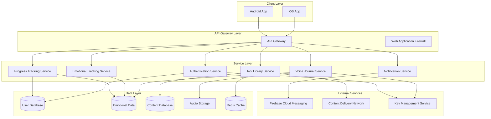
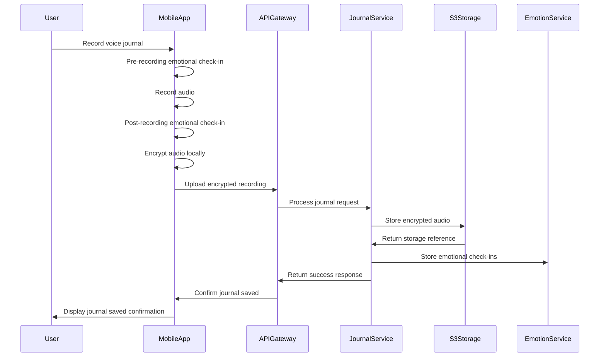
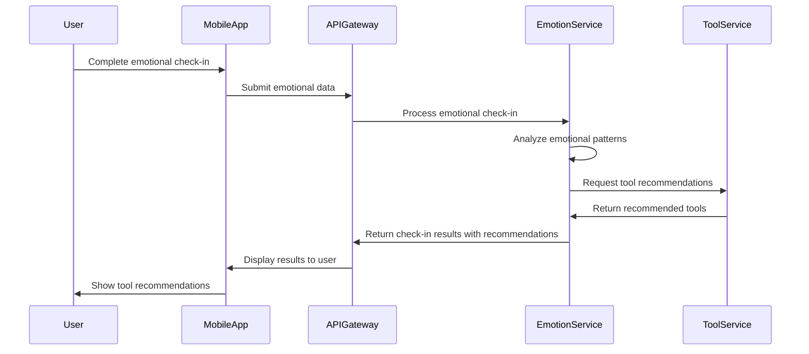
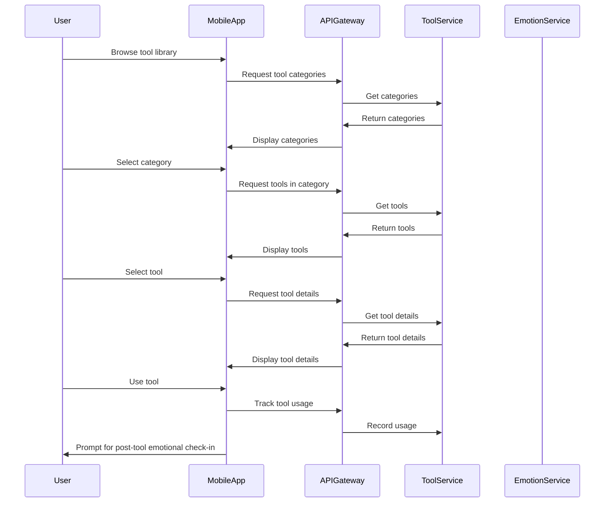
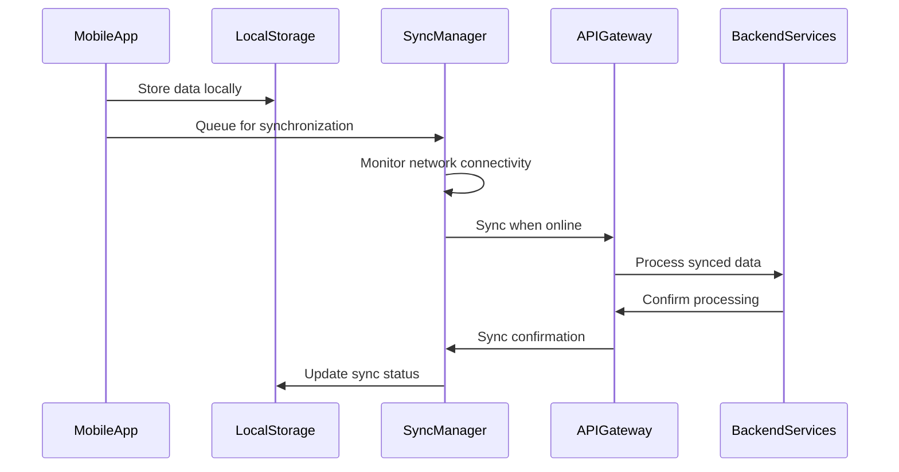

## Introduction
This document provides a high-level overview of the Amira Wellness application architecture. Amira Wellness is a mobile application designed to support emotional well-being through accessible self-regulation tools, emotional release mechanisms, and personal growth tracking. The application addresses the growing need for private, judgment-free spaces where users can express emotions and develop healthy emotional habits.

The architecture is designed with the following key principles in mind:

- **Privacy by Design**: End-to-end encryption for sensitive user data, particularly voice recordings
- **Scalability**: Horizontally scalable microservices to accommodate user growth
- **Resilience**: Fault-tolerant design with graceful degradation capabilities
- **Modularity**: Loosely coupled components to enable independent development and deployment

This overview document serves as an entry point to more detailed architecture documentation, providing context and relationships between the various components of the system.

## System Context
Amira Wellness operates within the context of emotional wellness applications, with a specific focus on Spanish-speaking users seeking private, secure tools for emotional expression and regulation. The application addresses the lack of accessible, privacy-focused emotional wellness tools for this demographic.

### Key Stakeholders

- **End Users**: Spanish-speaking individuals (primarily ages 25-45) seeking emotional regulation tools
- **Content Creators**: Wellness professionals providing journaling prompts, breathwork guides, and exercises
- **Development Team**: Engineers, designers, and product managers building the application
- **Business Owners**: Stakeholders responsible for the application's success and growth

### External Systems

The application interacts with the following external systems:

- **AWS Cloud Infrastructure**: Hosting and managed services for backend components
- **Firebase Cloud Messaging**: Push notification delivery to mobile devices
- **Content Delivery Network**: Efficient delivery of static content
- **App Stores**: Distribution channels for mobile applications (iOS App Store, Google Play Store)

## Architectural Overview
Amira Wellness employs a client-server architecture with native mobile applications communicating with cloud-based backend services. The system follows a layered architecture pattern with clear separation of concerns between presentation, business logic, and data layers.

### Key Architectural Decisions

1. **Native Mobile Applications**: iOS (Swift) and Android (Kotlin) native applications for optimal performance and user experience
2. **Microservices Backend**: Loosely coupled services organized by domain functionality
3. **End-to-End Encryption**: Client-side encryption for sensitive data, particularly voice recordings
4. **API-First Design**: Well-defined RESTful APIs for all backend functionality
5. **Cloud-Native Infrastructure**: AWS-based infrastructure with containerized services
6. **Offline-First Approach**: Core functionality available without internet connection

These architectural decisions support the application's focus on privacy, performance, and user experience while enabling scalability and maintainability.

## Component Architecture
The Amira Wellness application consists of the following major components:

### Client Layer

The client layer consists of native mobile applications for iOS and Android platforms:

- **iOS Application**: Built with Swift, SwiftUI and UIKit, following MVVM architecture
- **Android Application**: Built with Kotlin and Jetpack Compose, following MVVM architecture

Both applications implement client-side encryption for sensitive data and provide offline functionality for core features. For more details, see the [Mobile Architecture](mobile.md) document.

### API Gateway Layer

The API Gateway serves as the entry point for all client requests, providing:

- Request routing to appropriate backend services
- Authentication and authorization verification
- Rate limiting and throttling
- Request validation
- Response formatting
- CORS handling
- Basic request logging

### Service Layer

The service layer consists of microservices organized by domain functionality:

- **Authentication Service**: User identity and access management
- **Voice Journal Service**: Management of voice recordings and associated metadata
- **Emotional Tracking Service**: Processing and analysis of emotional check-in data
- **Tool Library Service**: Management of emotional regulation tools and content
- **Progress Tracking Service**: Analysis of user activity and progress tracking
- **Notification Service**: Management of alerts, reminders, and affirmations

Each service is independently deployable and scalable, with its own data storage and business logic. For more details, see the [Backend Architecture](backend.md) document.

### Data Layer

The data layer consists of various storage solutions optimized for different data types:

- **User Database**: PostgreSQL for structured user data
- **Emotional Data**: TimescaleDB for time-series emotional data
- **Content Database**: MongoDB for flexible tool content
- **Audio Storage**: Amazon S3 for encrypted voice recordings
- **Cache**: Redis for performance optimization

### External Services

The application integrates with several external services:

- **Firebase Cloud Messaging**: Push notification delivery
- **Content Delivery Network**: Efficient delivery of static content
- **Key Management Service**: Secure management of encryption keys

## Key Architectural Patterns
The Amira Wellness application implements several architectural patterns to address specific requirements:

### MVVM Pattern (Mobile Applications)

Both iOS and Android applications follow the Model-View-ViewModel (MVVM) pattern:

- **Model**: Data models and business logic
- **View**: UI components with declarative syntax (SwiftUI/Compose)
- **ViewModel**: Presentation logic and state management

This pattern provides clear separation of concerns, testability, and reactive UI updates.

### Microservices Pattern (Backend)

The backend follows a microservices architecture with:

- Domain-driven service boundaries
- Independent deployment and scaling
- Service-specific data storage
- API-based communication

This pattern enables team autonomy, targeted scaling, and technology flexibility.

### Repository Pattern (Data Access)

Data access is abstracted through repositories:

- Consistent interface for data operations
- Separation of business logic from data access
- Testability through dependency injection
- Caching and optimization opportunities

### Circuit Breaker Pattern (Resilience)

Service interactions implement circuit breakers to prevent cascading failures:

- Failure detection and service isolation
- Graceful degradation with fallbacks
- Automatic recovery and testing
- Monitoring and alerting integration

## Data Flow Architecture
The Amira Wellness application implements several key data flows that support its core functionality:

### Voice Journaling Flow

### Emotional Check-in Flow

### Tool Usage Flow

### Offline Synchronization Flow

## Security Architecture
Security is a fundamental aspect of the Amira Wellness architecture, with particular emphasis on protecting sensitive emotional data and voice recordings.

### Authentication and Authorization

The application implements a comprehensive authentication framework:

- JWT-based authentication with short-lived access tokens (15 minutes)
- Refresh token rotation for secure session management
- Argon2id password hashing with appropriate work factors
- Role-based access control for authorization
- Multi-factor authentication for sensitive operations (future)

For more details, see the [Security Architecture](security.md) document.

### End-to-End Encryption

Sensitive user data, particularly voice recordings, are protected with end-to-end encryption:

- AES-256-GCM encryption for data confidentiality and integrity
- Client-side encryption with user-derived keys
- Secure key storage using platform security features (iOS Keychain, Android KeyStore)
- Unique initialization vectors (IV) for each encryption operation

The encryption implementation ensures that the backend never has access to unencrypted user content or encryption keys.

### Data Protection

User data is protected throughout its lifecycle:

- Encryption at rest for all sensitive data
- Encryption in transit for all communications (TLS 1.3)
- Secure deletion with verification

## Scalability and Performance
The Amira Wellness architecture is designed for scalability and performance to support growth in user base and usage patterns.

### Scalability Approach

The application implements a multi-dimensional scaling strategy:

- **Horizontal Scaling**: Stateless services scale horizontally based on demand
- **Vertical Scaling**: Database and cache components scale vertically for performance
- **Geographic Scaling**: Multi-region deployment for global distribution (future)
- **Functional Scaling**: Independent scaling of services based on specific requirements

### Performance Optimization

Performance is optimized through several techniques:

- **Caching**: Multi-level caching strategy with Redis
- **Content Delivery**: CDN for static content delivery
- **Database Optimization**: Indexing, query optimization, connection pooling
- **Asynchronous Processing**: Background workers for non-critical operations
- **Efficient Mobile Implementation**: Native code for performance-critical features

## Resilience and Fault Tolerance
The Amira Wellness architecture implements resilience patterns to ensure system availability and data integrity even during component failures.

### High Availability Design

High availability is achieved through:

- Multi-AZ deployment for redundancy
- Auto-scaling groups for service instances
- Database replication with automated failover
- Stateless service design for easy replacement

### Fault Tolerance Mechanisms

The system implements multiple layers of fault tolerance:

- Circuit breakers for dependency failures
- Retry mechanisms with exponential backoff
- Fallback responses for degraded operation

### Disaster Recovery

Disaster recovery capabilities include:

- Regular automated backups
- Point-in-time recovery for databases
- Cross-region replication for critical data
- Documented recovery procedures with regular testing

### Offline Capability

The mobile applications implement offline-first architecture:

- Local data storage for core functionality
- Operation queuing for offline changes
- Background synchronization when connectivity is restored
- Conflict resolution for concurrent changes

## Development and Deployment
The Amira Wellness application follows modern development and deployment practices to ensure quality, security, and reliability.

### Development Workflow

The development process includes:

- Feature branches with pull request workflow
- Automated testing in CI/CD pipeline
- Code review requirements
- Static analysis and security scanning
- Documentation as part of the development process

### Continuous Integration and Deployment

The CI/CD pipeline includes:

- Automated builds on code changes
- Unit and integration testing
- Security scanning
- Artifact versioning and storage
- Automated deployment to development and staging environments
- Manual approval for production deployment

### Environment Strategy

The application uses multiple environments:

- Development: For active development and testing
- Staging: For pre-production validation
- Production: For end-user access

Each environment has isolated resources and appropriate access controls.

### Monitoring and Observability

The system implements comprehensive monitoring:

- Centralized logging with structured format
- Metrics collection for performance and health
- Distributed tracing for request flows
- Custom dashboards for different stakeholders

## Future Considerations
The Amira Wellness architecture is designed to accommodate future growth and feature expansion.

### Scalability Path

The architecture supports scaling in several dimensions:

- User base growth through horizontal scaling
- Feature expansion through modular architecture
- Geographic expansion through multi-region deployment
- Performance scaling through optimization and caching

### Planned Enhancements

The architecture supports planned future enhancements:

- English language support through internationalization framework
- Community features with appropriate privacy controls
- AI companion with natural language processing
- Premium subscription features with access control
- Integration with wearable devices for biometric data

### Technical Improvements

Ongoing technical improvements include:

- Enhanced observability with distributed tracing
- Automated performance optimization
- Advanced analytics for user insights
- Improved offline capabilities
- Enhanced security measures

## Conclusion
The Amira Wellness architecture provides a robust, secure, and scalable foundation for the application's core features. By implementing a privacy-first approach with end-to-end encryption, native mobile applications, and a microservices backend, the architecture supports the application's focus on emotional well-being while ensuring user privacy and data security.

The modular design enables independent development and scaling of components, while the offline-first approach ensures core functionality is available even without internet connectivity. Security is integrated at all levels, from client-side encryption to infrastructure protection.

This architecture positions Amira Wellness for growth in user base, feature set, and geographic reach while maintaining the core principles that define the application's value proposition.

## References
For more detailed information about specific aspects of the architecture, refer to the following documents:

- [Backend Architecture](backend.md) - Detailed documentation of backend services
- [Mobile Architecture](mobile.md) - Detailed documentation of mobile applications
- [Security Architecture](security.md) - Comprehensive security model
- [API Documentation](../api/) - Detailed API specifications
- [Database Schema](../database/) - Database design and relationships
- [Deployment Guide](../deployment/) - Deployment procedures and configuration