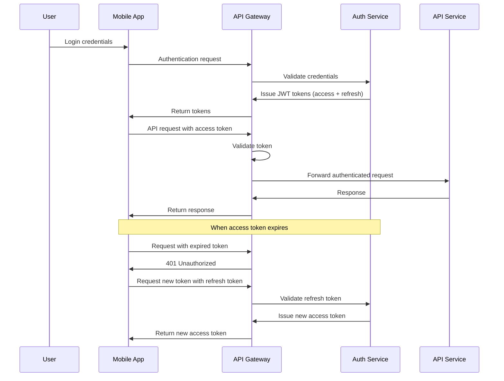
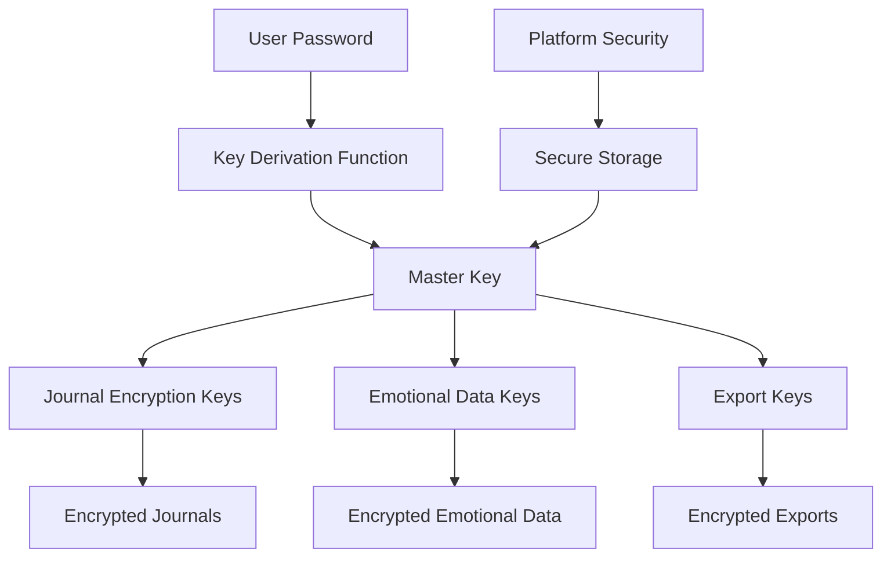

# Amira Wellness Security Architecture

## Introduction

This document provides a comprehensive overview of the security architecture for the Amira Wellness application. Security is a fundamental aspect of the application design, with particular emphasis on protecting sensitive emotional data and voice recordings.

The security architecture is built on the following key principles:

- **Privacy by Design**: Security measures are integrated into all aspects of the application architecture from the ground up
- **Defense in Depth**: Multiple layers of security controls are implemented to protect user data
- **Least Privilege**: Components and users only have access to the resources they need
- **Secure by Default**: Security features are enabled by default and require explicit action to disable
- **Transparency**: Security measures are documented and communicated to users

This document covers authentication and authorization mechanisms, end-to-end encryption implementation, data protection measures, and infrastructure security controls that collectively ensure the privacy and security of user data. The security architecture described here is designed to support the overall system architecture while maintaining the privacy-first approach that is central to Amira Wellness.

## Authentication Framework

The Amira Wellness application implements a comprehensive authentication framework to verify user identity and control access to resources.

### Authentication Mechanisms

The primary authentication mechanism is JWT (JSON Web Token) based authentication with the following characteristics:

- Email and password authentication with secure password policies
- JWT tokens signed with RS256 algorithm
- Short-lived access tokens (15 minutes) for API requests
- Refresh tokens with rotation for maintaining sessions
- Future support for social authentication providers

The authentication flow follows these steps:

This approach provides secure authentication while maintaining a good user experience by not requiring frequent re-authentication.

### Password Security

Password security is enforced through the following measures:

- Minimum length of 10 characters
- Complexity requirements (uppercase, lowercase, numbers, special characters)
- Check against common password lists
- Argon2id password hashing with appropriate work factors
- Rate limiting on authentication attempts
- Account lockout after 5 failed attempts with progressive delays

Password validation is performed both client-side for immediate feedback and server-side for enforcement. Password hashes are never exposed outside the authentication service.

### Token Management

The token management system implements the following security features:

- Access tokens are short-lived (15 minutes) to limit the impact of token theft
- Refresh tokens have a longer lifespan (14 days) but are rotated on each use
- Tokens are stored securely on mobile devices using platform security features (iOS Keychain, Android KeyStore)
- Tokens can be revoked server-side in case of security incidents
- All tokens include standard JWT claims (iss, sub, exp, iat, jti) for validation

Token validation occurs at multiple levels:
1. API Gateway validates token signature and expiration
2. Services validate token claims and permissions
3. Client validates token expiration before use

### Multi-Factor Authentication

The authentication framework includes support for multi-factor authentication (MFA):

- Initial implementation includes email verification as a second factor
- Future support for authenticator apps (TOTP) is planned
- MFA will be required for sensitive operations like data export
- Risk-based MFA triggers (new device, unusual location) will be implemented

The MFA implementation follows NIST guidelines for secure authentication.

## Authorization System

The authorization system controls what authenticated users can access and what actions they can perform.

### Role-Based Access Control

The application implements role-based access control (RBAC) with the following roles:

- **User**: Standard application user with access to their own data
- **Premium User**: User with access to premium features (future)
- **Content Manager**: Administrator for tool library content
- **System Administrator**: Full system access for maintenance and support

Each role has specific permissions that determine what resources they can access and what operations they can perform. Permissions are enforced at multiple levels:

1. API Gateway for coarse-grained access control
2. Service layer for fine-grained permission checks
3. Database level for row-level security

This multi-layered approach ensures that authorization cannot be bypassed by targeting a specific component.

### Resource Authorization

Resource authorization follows these principles:

- Users can only access their own data by default
- Resource ownership is verified for all operations
- Explicit sharing mechanisms are required for any data sharing
- Content managers can only access non-personal content
- System administrators have access to system configuration but not user content

Resource authorization is implemented through:

1. User ID verification in API requests
2. Database queries filtered by user ID
3. Object-level permission checks before operations
4. Audit logging of all access attempts

### API Authorization

API endpoints are protected through:

- Required authentication for all non-public endpoints
- Permission checks based on user role and resource ownership
- Rate limiting to prevent abuse
- Input validation to prevent unauthorized operations

API authorization is centralized in the API Gateway and consistently applied across all services.

## End-to-End Encryption

End-to-end encryption is a core security feature of the Amira Wellness application, ensuring that sensitive user data, particularly voice recordings, can only be accessed by the user who created it.

### Encryption Architecture

The encryption architecture follows these key principles:

- Client-side encryption for all sensitive data
- User-controlled encryption keys derived from passwords
- Server never has access to unencrypted data or encryption keys
- Modern, widely-reviewed encryption algorithms

The encryption system uses a hierarchical key model:

This approach ensures that each data type has its own encryption keys, limiting the impact of any potential key compromise.

### Encryption Standards

The application uses the following encryption standards:

- **Algorithm**: AES-256-GCM (Authenticated Encryption with Associated Data)
- **Key Derivation**: Argon2id with appropriate memory, iterations, and parallelism parameters
- **Random Number Generation**: Platform-specific secure random number generators
- **Key Length**: 256 bits for all encryption keys
- **Initialization Vectors**: Unique for each encryption operation
- **Authentication Tags**: Used to verify data integrity
- **Forward Secrecy**: Implemented for communications

These standards were selected based on current cryptographic best practices and recommendations from NIST and other security organizations. Regular reviews of cryptographic standards ensure that the encryption remains strong against evolving threats.

### Key Management

Encryption keys are managed securely through:

- **Key Generation**: Cryptographically secure random number generators
- **Key Storage**: Hardware-backed secure storage where available (iOS Secure Enclave, Android KeyStore)
- **Key Protection**: Master keys are encrypted with keys derived from user passwords
- **Key Derivation**: Password-based keys use Argon2id with salt and appropriate work factors
- **Key Rotation**: Support for key rotation when passwords change
- **Key Backup**: Optional encrypted key backup mechanisms
- **Key Isolation**: Keys are memory-protected during use and never persisted in plaintext

The key management system ensures that keys are protected at rest and during use, with hardware protection where available. Additional measures include secure key destruction when no longer needed and defense against side-channel attacks.

### Implementation Details

The end-to-end encryption is implemented across all platforms:

- **iOS**: Uses CryptoKit for encryption operations and Keychain for secure key storage
- **Android**: Uses Java Cryptography Architecture with Android KeyStore for secure key storage
- **Backend**: Uses Python cryptography library for handling encrypted data without decryption

Each platform implementation follows the same encryption standards and protocols while leveraging platform-specific security features for maximum protection. Implementation details include:

- Secure memory handling for cryptographic operations
- Protection against timing attacks
- Validation of encryption parameters
- Comprehensive testing of cryptographic implementations
- Regular security audits of encryption code

### Encryption Workflow

The encryption workflow for voice journals follows these steps:

1. User records a voice journal on their device
2. Client generates or retrieves the encryption key for the journal
3. Client generates a unique initialization vector (IV)
4. Client encrypts the audio data with AES-256-GCM using the key and IV
5. Client generates and verifies the authentication tag
6. Client uploads the encrypted data, IV, and authentication tag to the server
7. Server stores the encrypted data without decryption capability
8. When the user wants to play the recording, the client downloads the encrypted data
9. Client verifies the authentication tag to ensure data integrity
10. Client decrypts the data using the stored encryption key and the IV
11. Client plays the decrypted audio

This workflow ensures that the server never has access to the unencrypted data or the encryption keys, providing true end-to-end encryption. Similar workflows are implemented for other sensitive data types such as emotional check-in information.

### Cryptographic Validation

The encryption implementation undergoes rigorous validation:

- Compliance with FIPS 140-2 requirements where applicable
- Regular cryptographic algorithm review
- Validation against known cryptographic attack vectors
- Testing with cryptographic validation suites
- Independent security review of the implementation

This validation ensures the robustness of the encryption implementation and its resistance to known attack techniques. The cryptographic implementation is regularly updated to address new vulnerabilities and incorporate improved algorithms and techniques.

## Data Protection

Data protection measures ensure the security of user data throughout its lifecycle.

### Data Classification

User data is classified into the following categories:

- **Highly Sensitive**: Voice recordings, emotional check-in data
- **Sensitive**: User profile information, usage patterns
- **Non-Sensitive**: Public content, anonymized analytics

Each data classification has specific protection requirements and handling procedures.

### Data at Rest Protection

Data at rest is protected through:

- End-to-end encryption for highly sensitive data
- Database encryption for sensitive data
- Secure storage solutions (S3 with server-side encryption)
- Secure deletion with verification

Database backups are also encrypted to maintain protection throughout the data lifecycle.

### Data in Transit Protection

Data in transit is protected through:

- TLS 1.3 for all API communications
- Certificate pinning in mobile applications
- Secure WebSocket connections for real-time features
- Strong cipher suites with perfect forward secrecy

These measures protect against interception and man-in-the-middle attacks during data transmission.

### Data Minimization

The application follows data minimization principles:

- Only collecting data necessary for functionality
- Providing options to limit data collection
- Automatic deletion of data that is no longer needed
- Anonymization of data used for analytics

These practices reduce the risk and impact of potential data breaches.

### Secure Deletion

When users delete their data, the application ensures secure deletion through:

- Immediate removal of encryption keys
- Overwriting of database records
- Scheduled removal from backups
- Verification of deletion completion

This approach ensures that deleted data cannot be recovered, even with administrative access.

### Data Privacy Policies

The application implements comprehensive data privacy policies:

- Clear documentation of data collection and use
- User consent for all data collection
- User control over their data, including export and deletion
- Privacy impact assessments for new features
- Regular privacy audits and compliance checks

These policies ensure compliance with privacy regulations and build user trust through transparency.

## Infrastructure Security

The infrastructure supporting the Amira Wellness application is designed with security as a primary consideration.

### Network Security

Network security measures include:

- VPC with private subnets for application components
- Network ACLs and security groups for traffic control
- Web Application Firewall (WAF) for attack protection
- DDoS protection through AWS Shield
- Regular network security scanning

These measures create a secure network environment for application components.

### Cloud Security

Cloud security is implemented through:

- AWS security best practices
- Least privilege IAM policies
- Resource tagging and access control
- CloudTrail for API activity monitoring
- AWS Config for compliance monitoring
- Regular security assessments

The cloud infrastructure is configured according to the AWS Well-Architected Framework security pillar.

### Container Security

Container security includes:

- Minimal base images to reduce attack surface
- Image scanning for vulnerabilities
- Immutable infrastructure approach
- Runtime security monitoring
- Regular security updates

These practices ensure that containerized services remain secure throughout their lifecycle.

### Secrets Management

Sensitive configuration values and credentials are protected through:

- AWS Secrets Manager for secure storage
- IAM roles for service authentication
- Rotation of credentials and secrets
- Audit logging of secrets access
- Encryption of all stored secrets

This approach eliminates the need for hardcoded credentials in application code or configuration files.

## Security Monitoring and Response

Continuous monitoring and incident response procedures ensure that security events are detected and addressed promptly.

### Security Monitoring

Security monitoring includes:

- Real-time monitoring of authentication attempts
- Behavioral analysis to detect anomalous patterns
- Automated alerts for security events
- Regular security log reviews
- Vulnerability scanning and penetration testing

These monitoring capabilities provide visibility into the security posture of the application and infrastructure.

### Incident Response

The incident response process follows a comprehensive framework with these key phases:

1. **Preparation**: Maintaining incident response readiness through training, tools, and documentation

2. **Detection and Analysis**: Identifying and validating security incidents through monitoring, alerts, and investigation

3. **Containment**: Implementing immediate measures to limit the impact and prevent further damage

4. **Eradication**: Removing the cause of the incident and addressing vulnerabilities

5. **Recovery**: Restoring affected systems and data to normal operation securely

6. **Post-Incident Activities**: Learning from incidents to improve security posture

The incident response approach is tailored to specific scenarios relevant to Amira Wellness:

- **Data Breach Response**: Specific procedures for handling breaches of sensitive user data, including voice recordings and emotional data

- **Authentication System Compromise**: Measures for responding to compromises of authentication mechanisms

- **API Abuse or Injection Attacks**: Procedures for detecting and mitigating API-related attacks

- **Denial of Service**: Approaches to maintain availability during DoS attempts

- **Mobile Application Security Incidents**: Specialized responses for mobile app vulnerabilities

Incident severity is classified to ensure appropriate response:

| Severity | Description | Response Time | Example |
|----------|-------------|---------------|----------|
| Critical | Confirmed breach of sensitive data, system outage | Immediate (<15min) | Voice recordings exposed |
| High | Potential data exposure, significant degradation | <1 hour | Authentication system compromise |
| Medium | Limited exposure, moderate impact | <4 hours | Suspicious access attempts |
| Low | Minor issues with minimal impact | <24 hours | Isolated policy violation |

All security incidents undergo a thorough post-incident analysis to identify improvements and prevent recurrence. This includes a formal lessons learned process and implementation of security enhancements.

### Security Logging

Security logging captures the following events:

- Authentication attempts (successful and failed)
- Authorization decisions
- Resource access
- Configuration changes
- Security-relevant application events

Logs are centralized, protected, and retained according to compliance requirements.

### Vulnerability Management

The vulnerability management process includes:

- Regular vulnerability scanning
- Dependency checking for known vulnerabilities
- Security patch management
- Risk assessment and prioritization
- Verification of remediation effectiveness

This process ensures that vulnerabilities are identified and addressed in a timely manner.

## Compliance and Privacy

The security architecture supports compliance with relevant regulations and privacy requirements.

### GDPR Compliance

GDPR compliance is supported through:

- Data minimization and purpose limitation
- Lawful basis for processing
- User consent management
- Right to access, rectification, and erasure
- Data portability support
- Privacy by design implementation

These measures ensure that the application meets GDPR requirements for protecting user data.

### Privacy Controls

Privacy controls include:

- Granular permission settings
- Transparency about data collection and use
- User control over data sharing
- Privacy-preserving analytics
- Data anonymization where appropriate

These controls give users visibility and control over their personal data.

### Data Residency

Data residency considerations include:

- Regional deployment options
- Data storage location controls
- Cross-border transfer limitations
- Compliance with local data protection laws

These measures address data sovereignty requirements for international users.

### Security Compliance

The security architecture is designed to meet industry security standards:

- OWASP Top 10 mitigations
- NIST Cybersecurity Framework alignment
- CIS Benchmarks for infrastructure
- Regular security assessments and audits

Compliance with these standards ensures a robust security posture.

## Mobile Application Security

The mobile applications (iOS and Android) implement platform-specific security measures.

### iOS Security

iOS-specific security measures include:

- Secure local storage using Keychain
- Data Protection API for file encryption
- Secure Enclave integration for biometric authentication
- App Transport Security enforcement
- Runtime protections against common attacks
- Regular security updates

These measures leverage iOS platform security features to protect user data on the device.

### Android Security

Android-specific security measures include:

- Android Keystore for secure key storage
- File-level encryption for sensitive data
- SafetyNet attestation for device integrity
- Network Security Configuration for secure communications
- Runtime permissions model
- Regular security updates

These measures leverage Android platform security features to protect user data on the device.

### Code Protection

Mobile application code is protected through:

- Code obfuscation to prevent reverse engineering
- Anti-tampering measures
- Root/jailbreak detection
- Certificate pinning for API communications
- Secure coding practices

These protections make it more difficult for attackers to analyze or modify the application.

### Secure Local Storage

Sensitive data stored on mobile devices is protected through:

- Encrypted databases (SQLCipher)
- Encrypted file storage
- Secure key storage in platform-specific secure elements
- Secure deletion when data is no longer needed
- Memory protection during application use

These measures ensure that data remains protected even if the device is compromised.

## Security Testing and Validation

Regular security testing ensures that security controls are effective and vulnerabilities are identified and addressed.

### Security Testing Approach

The security testing approach includes:

- Static Application Security Testing (SAST)
- Dynamic Application Security Testing (DAST)
- Dependency scanning for known vulnerabilities
- Infrastructure security scanning
- Manual penetration testing
- Continuous security validation

This multi-layered approach provides comprehensive security testing coverage.

### Penetration Testing

Regular penetration testing is conducted by qualified security professionals to identify vulnerabilities that automated testing might miss. Penetration testing includes:

- Web application penetration testing
- Mobile application penetration testing
- API security testing
- Infrastructure penetration testing
- Social engineering testing

Findings from penetration testing are prioritized and addressed according to their severity.

### Security in CI/CD

Security is integrated into the CI/CD pipeline through:

- Automated security testing in build processes
- Security gates that prevent deployment of vulnerable code
- Dependency checking before builds
- Container image scanning
- Infrastructure as Code security validation

This approach ensures that security issues are identified early in the development process.

### Continuous Validation

Security controls are continuously validated through:

- Automated security testing
- Compliance monitoring
- Configuration validation
- Security logging and alerting
- Regular security reviews

Continuous validation ensures that security controls remain effective as the application evolves.

## Future Security Enhancements

The security architecture is designed to evolve with emerging threats and technologies.

### Planned Enhancements

Planned security enhancements include:

- Enhanced multi-factor authentication options
- Advanced threat detection and prevention
- Improved security analytics and visualization
- Additional encryption options for shared content
- Enhanced privacy controls for users

These enhancements will further strengthen the security posture of the application.

### Emerging Technologies

The security team is evaluating emerging technologies for potential integration:

- Post-quantum cryptography
- Decentralized identity solutions
- Advanced privacy-preserving analytics
- Machine learning for threat detection
- Zero-knowledge proofs for privacy

These technologies may be incorporated as they mature and their security benefits are validated.

### Security Roadmap

The security roadmap includes:

- Short-term improvements to address current risks
- Medium-term enhancements to strengthen security posture
- Long-term strategic initiatives for advanced security capabilities
- Regular reassessment based on threat landscape evolution

This roadmap ensures that security remains a priority throughout the application lifecycle.

## Conclusion

The security architecture of the Amira Wellness application provides a comprehensive approach to protecting user data and ensuring privacy. By implementing multiple layers of security controls, from authentication and authorization to end-to-end encryption and infrastructure security, the application maintains a strong security posture.

The privacy-first approach, with end-to-end encryption for sensitive data, ensures that users maintain control over their personal information and emotional content. This approach builds trust with users while meeting regulatory requirements for data protection.

Security is an ongoing process, and the security architecture will continue to evolve to address emerging threats and incorporate new security technologies. Regular security testing, monitoring, and improvement ensure that the application remains secure throughout its lifecycle.

## References

- [OWASP Mobile Security Testing Guide](https://owasp.org/www-project-mobile-security-testing-guide/)
- [NIST Cryptographic Standards](https://csrc.nist.gov/projects/cryptographic-standards-and-guidelines)
- [AWS Security Best Practices](https://aws.amazon.com/architecture/security-identity-compliance/)
- [iOS Security Guide](https://support.apple.com/guide/security/welcome/web)
- [Android Security Overview](https://source.android.com/security)
- [NIST SP 800-61: Computer Security Incident Handling Guide](https://csrc.nist.gov/publications/detail/sp/800-61/rev-2/final)