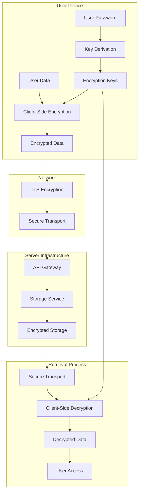
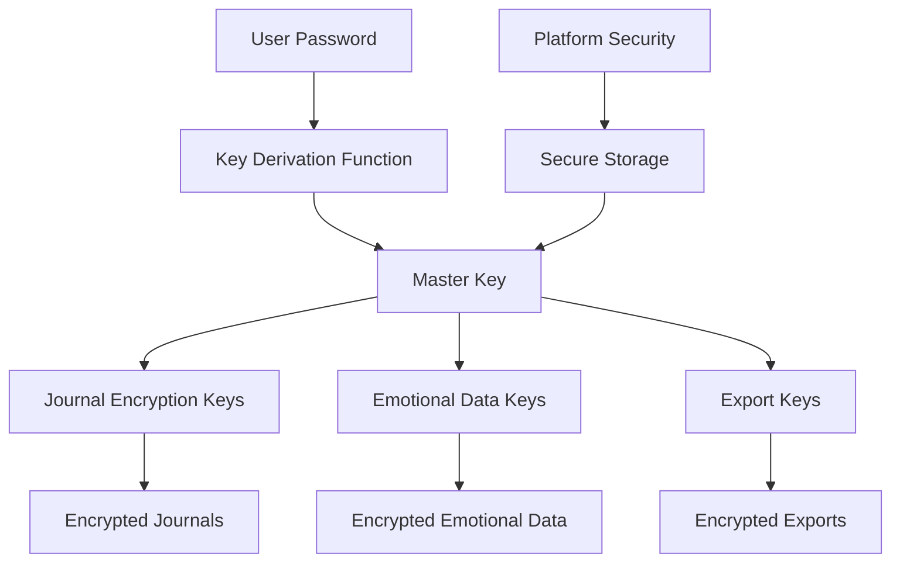
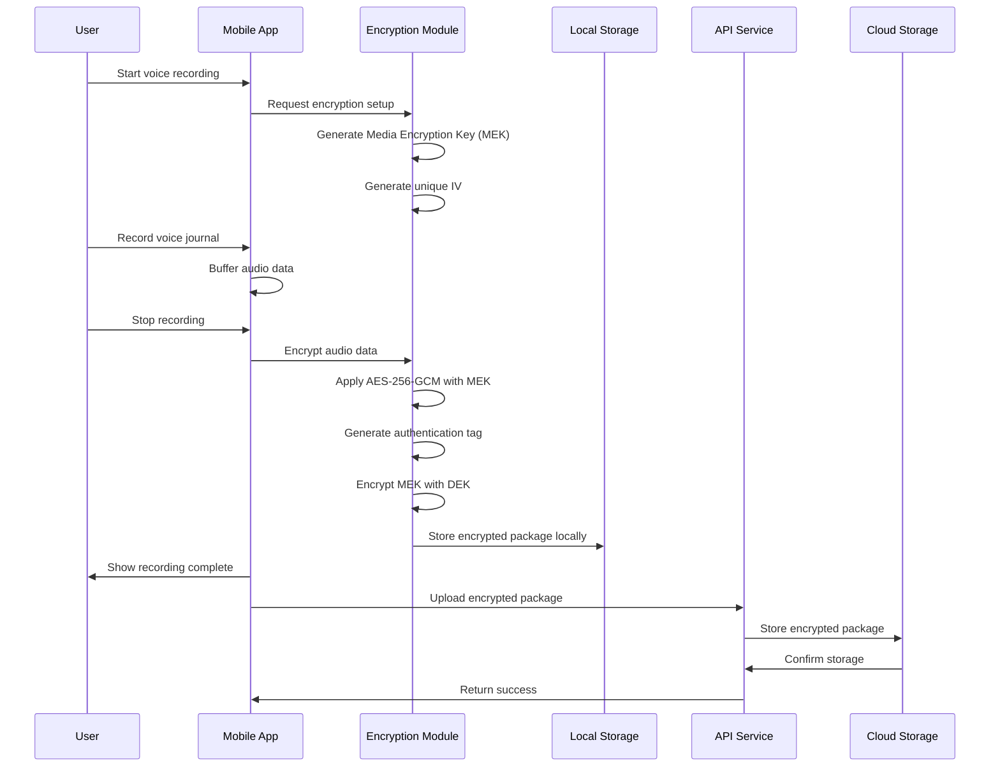

# End-to-End Encryption in Amira Wellness

## Introduction

This document details the end-to-end encryption implementation in the Amira Wellness application. Encryption is a cornerstone of our privacy-first design philosophy, ensuring that sensitive user data, particularly voice recordings and emotional check-ins, remains private and secure throughout its lifecycle.

Amira Wellness handles highly personal and sensitive information that reveals users' emotional states and innermost thoughts. Our encryption architecture guarantees that this data can only be accessed by the user who created it, protecting it from external threats, server breaches, and even from our own staff. 

This comprehensive encryption implementation addresses the following key objectives:
- Protecting the confidentiality and integrity of voice journal recordings
- Securing sensitive emotional check-in data
- Ensuring user control over personal data
- Meeting regulatory requirements for privacy and data protection
- Building user trust through transparent security measures

## Encryption Architecture

### End-to-End Encryption Model

The end-to-end encryption model in Amira Wellness follows these core principles:

1. **Client-side encryption**: All sensitive data is encrypted on the user's device before transmission
2. **User-controlled keys**: Encryption keys are derived from user credentials and never leave the device
3. **Zero-knowledge design**: Server infrastructure never has access to unencrypted data or encryption keys
4. **Complete privacy**: Even Amira Wellness staff cannot access users' sensitive content

This model protects user data against various threats including server breaches, network interception, and unauthorized internal access.



### Client-Side Encryption

Client-side encryption is implemented on both iOS and Android platforms:

1. **Data Processing Flow**:
   - Data is captured in memory (voice recording, emotional check-in)
   - An encryption key is derived from the user's credentials
   - A unique initialization vector is generated for each encryption operation
   - Data is encrypted using AES-256-GCM before leaving the secure memory space
   - Encrypted data is prepared for storage or transmission

2. **Security Boundaries**:
   - The device's secure memory is the only place where unencrypted data exists
   - Encryption occurs before data is written to disk or transmitted
   - Keys are protected using platform security features (iOS Keychain, Android KeyStore)
   - Optional additional protection through biometric authentication

3. **Platform Security Integration**:
   - iOS: Secure Enclave for biometric-protected keys on supported devices
   - Android: Hardware-backed KeyStore for secure key storage where available
   - Memory protection to prevent unauthorized access during processing

### Server-Side Security

While the server never has access to unencrypted data or encryption keys, it implements several additional security measures:

1. **Transport Security**:
   - TLS 1.3 with strong cipher suites for all API communications
   - Certificate pinning in mobile applications
   - Protection against downgrade attacks

2. **Storage Security**:
   - Encrypted data stored in secure cloud infrastructure (AWS S3)
   - Server-side encryption at rest (in addition to client-side encryption)
   - Strict access controls and audit logging

3. **Request Validation**:
   - Authentication and authorization for all data access
   - Request signing to prevent tampering
   - Rate limiting to prevent abuse

4. **Integrity Verification**:
   - Authentication tags stored with encrypted data
   - Server-side integrity checks before storage and after retrieval
   - Tamper detection mechanisms

### Encryption Boundaries

The encryption system has clearly defined boundaries that determine what data is encrypted and at what points:

1. **Data Classification**:
   - **Highly Sensitive** (End-to-End Encrypted): Voice recordings, emotional check-in data
   - **Sensitive** (Encrypted at Rest): User profile information, app settings
   - **Non-Sensitive** (Standard Protection): Public content, anonymized analytics

2. **Trust Boundaries**:
   - **Trusted**: User's authenticated device with proper key access
   - **Semi-Trusted**: Server infrastructure with encrypted data access
   - **Untrusted**: Public networks, third-party systems

3. **Encryption Points**:
   - Before storage (local or remote)
   - Before transmission (even over TLS)
   - During backup/export operations

## Encryption Algorithms and Standards

### AES-256-GCM

Amira Wellness uses AES-256-GCM (Advanced Encryption Standard with Galois/Counter Mode) as the primary encryption algorithm:

**Specifications:**
- **Algorithm**: AES-256-GCM
- **Key Length**: 256 bits (32 bytes)
- **IV Length**: 96 bits (12 bytes)
- **Authentication Tag Length**: 128 bits (16 bytes)

**Implementation Details:**
- Unique initialization vector (IV) for each encryption operation
- Associated authenticated data (AAD) includes metadata for integrity protection
- Authentication tags stored with encrypted data for integrity verification
- Fully conformant with NIST SP 800-38D specifications

**Security Properties:**
- Confidentiality protection of encrypted data
- Integrity verification to detect tampering
- Authentication to confirm data source
- Resistance against known cryptographic attacks

AES-256-GCM was selected for its combination of security, performance, and widespread support across platforms. Its authenticated encryption capability provides both confidentiality and integrity in a single operation, simplifying the security architecture while maintaining strong protection.

### Key Derivation Functions

Secure key derivation is crucial for generating strong encryption keys from user passwords:

**Primary: Argon2id**
- **Purpose**: Password-based key derivation
- **Parameters**:
  - Memory cost: 64 MB
  - Iterations: 3
  - Parallelism: 4
  - Output length: 32 bytes (256 bits)
- **Implementation**: Uses validated libraries on each platform
- **Security Properties**: Memory-hard function resistant to GPU/ASIC attacks

**Alternative: PBKDF2-HMAC-SHA256**
- **Purpose**: Alternative when Argon2id is not available
- **Parameters**:
  - Iterations: 100,000 (adjusted based on device performance)
  - Salt length: 16 bytes (128 bits)
  - Output length: 32 bytes (256 bits)
- **Implementation**: Native implementation on iOS, BouncyCastle on Android
- **Security Properties**: Widely reviewed key derivation function

Both functions utilize cryptographically secure random salts to prevent rainbow table attacks and ensure that identical passwords produce different encryption keys.

### Transport Layer Security

All communication between the mobile applications and backend services is protected using TLS:

**Specifications:**
- **Protocol Version**: TLS 1.3 (fallback to TLS 1.2 with secure configurations when necessary)
- **Cipher Suites**:
  - `TLS_AES_256_GCM_SHA384` (preferred)
  - `TLS_CHACHA20_POLY1305_SHA256` (alternative)
- **Key Exchange**: ECDHE with P-256 or X25519
- **Certificate Validation**: Full validation with certificate pinning

**Additional Transport Security Measures:**
- HTTP Strict Transport Security (HSTS)
- Certificate pinning in mobile applications
- Extended validation certificates for production environments
- Regular certificate rotation

TLS provides an additional layer of protection for all data in transit, including already encrypted sensitive data, ensuring protection against network-based attacks.

### Cryptographic Libraries

Amira Wellness uses platform-specific cryptographic libraries:

**iOS Implementation:**
- **CryptoKit** (iOS 13+): Modern Swift cryptography framework
- **CommonCrypto**: For compatibility with older iOS versions
- **Version**: Latest stable with SwiftPM integration (version 2.4+)

**Android Implementation:**
- **Java Cryptography Architecture (JCA)**: Core cryptography API
- **BouncyCastle Provider**: Extended cryptographic capabilities
- **Jetpack Security**: For simplified encryption operations
- **Version**: 1.72.0+ for BouncyCastle

**Backend Implementation:**
- **Python cryptography**: Modern cryptographic library
- **Version**: 41.0+
- **Purpose**: Handling encrypted data without decryption capability

All cryptographic libraries undergo regular security reviews and updates to address vulnerabilities and incorporate improvements.

## Key Management

### Key Hierarchy

Amira Wellness implements a hierarchical key management system:



1. **User Master Key (UMK)**:
   - Primary encryption key derived from user password
   - Used to protect all other keys in the hierarchy
   - Never stored in plaintext, only in protected form
   - Rotation occurs on password change

2. **Data Encryption Keys (DEKs)**:
   - Purpose-specific keys for different data types
   - Encrypted with the UMK before storage
   - Unique per data category (journals, emotional data)
   - Regular rotation without requiring password change

3. **Media Encryption Keys (MEKs)**:
   - Individual keys for specific voice recordings
   - Encrypted with the Journal DEK
   - Unique per recording for isolation
   - Stored with the encrypted recording

4. **Authentication Keys**:
   - Used for message authentication
   - Derived separately from encryption keys
   - Applied to verify data integrity
   - Rotation aligned with encryption keys

This hierarchical model enables key isolation, efficient key rotation, and compartmentalization of security breaches.

### Key Generation

Secure key generation is fundamental to the encryption system:

1. **Random Number Generation**:
   - **iOS**: `SecRandomCopyBytes` for cryptographically secure random data
   - **Android**: `SecureRandom` with the strongest available provider
   - **Backend**: `secrets.token_bytes` or equivalent

2. **Key Generation Process**:
   - 256-bit (32-byte) randomly generated keys for symmetric encryption
   - Full-entropy generation using cryptographically secure random number generators
   - Hardware-based entropy sources when available
   - Post-generation validation to verify key quality

3. **Initialization Vector (IV) Generation**:
   - 96-bit (12-byte) randomly generated IVs for each encryption operation
   - Never reused across encryption operations
   - Generated immediately before encryption
   - Stored alongside encrypted data for decryption

All generated keys undergo validation to ensure they meet cryptographic strength requirements before use.

### Key Storage

Encryption keys are stored securely using platform-specific security features:

**iOS Key Storage:**
- **Keychain Services**: Used with appropriate protection classes
  - `kSecAttrAccessibleWhenUnlockedThisDeviceOnly` for most keys
  - Additional biometric protection when available
- **Secure Enclave**: For biometric-protected keys on supported devices
- **Encrypted Key Blobs**: Keys are encrypted before storage in Keychain

**Android Key Storage:**
- **Android Keystore System**: Hardware-backed key storage where available
- **StrongBox Keymaster**: On supported devices for hardware isolation
- **EncryptedSharedPreferences**: For encrypted storage of key material
- **User authentication binding**: Optional authentication requirement for key access

**Key Metadata Protection:**
- Metadata stored separately from key material
- Minimal metadata to reduce exposure
- Integrity protection for key metadata
- Access controls on metadata equivalent to key material

Keys are never exposed in plaintext outside of secure memory during cryptographic operations, and secure deletion is implemented when keys are no longer needed.

### Key Rotation

The key management system implements key rotation to limit the impact of potential key compromise:

1. **User Master Key Rotation**:
   - Triggered by password changes
   - Previous master key decrypts DEKs
   - New master key re-encrypts DEKs
   - Secure deletion of previous master key

2. **Data Encryption Key Rotation**:
   - Periodic rotation based on security policy (default: 90 days)
   - New data encrypted with new keys
   - Historical data remains accessible with old keys
   - Optional background re-encryption of historical data

3. **Automatic Rotation Triggers**:
   - Suspicious activity detection
   - Device change or new login
   - Operating system upgrade
   - Application security updates

4. **Key Rotation Process**:
   - Generate new key
   - Encrypt with appropriate parent key
   - Update key metadata and version
   - Maintain secure access to previous keys for decryption
   - Gradually phase out old keys

Key rotation maintains the security of the encryption system over time and limits the amount of data protected by any single key.

### Password-Based Key Derivation

The User Master Key is derived from the user's password using secure key derivation:

1. **Key Derivation Process**:
   - Generate a cryptographically secure random salt (16 bytes)
   - Apply Argon2id with memory-hard parameters
   - Produce a 256-bit key for AES-256-GCM

2. **Salt Management**:
   - Unique salt for each user
   - Stored alongside encrypted master key
   - Rotated during password changes
   - Protected with same controls as key material

3. **Strengthening Measures**:
   - Strong password requirements enforced during creation
   - Password strength estimation and feedback
   - Rate limiting on derivation attempts
   - Progressive delays for repeated attempts

4. **Memory Protection**:
   - Key material zeroed in memory after use
   - Protection against memory dumps
   - Secure allocation for cryptographic operations
   - Minimized key material lifetime in memory

Password-based key derivation transforms user passwords into cryptographically strong keys while making brute force attacks computationally expensive.

### Biometric Protection

On supported devices, Amira Wellness offers biometric protection for encryption keys:

1. **iOS Implementation**:
   - LocalAuthentication framework integration
   - Keychain items with `kSecAccessControlBiometryAny` constraint
   - Secure Enclave protection for biometric keys
   - Fallback mechanism for devices without biometric capabilities

2. **Android Implementation**:
   - BiometricPrompt API for authentication
   - Keystore with `setUserAuthenticationRequired(true)`
   - Strong authentication requirements
   - Device credential fallback

3. **User Experience**:
   - Optional feature (enabled by user choice)
   - Graceful fallback to password authentication
   - Clear explanation of security benefits
   - Support for all platform-supported biometric types

4. **Security Model**:
   - Biometrics protect access to encryption keys
   - Keys remain encrypted at rest
   - Biometric data never leaves the device
   - Authentication failures limit before fallback

Biometric protection adds an additional layer of security by requiring physical presence and biometric verification before encrypted data can be accessed.

## Voice Journal Encryption

### Recording Encryption Process



The voice journal recording encryption process follows these steps:

1. **Pre-Recording Setup**:
   - Retrieve the Journal Data Encryption Key (DEK)
   - Generate a unique Media Encryption Key (MEK) for this recording
   - Prepare secure memory for audio buffer

2. **Encryption Preparation**:
   - Generate a unique 96-bit initialization vector (IV)
   - Prepare metadata for authenticated encryption
   - Set up encryption context with appropriate parameters

3. **Audio Encryption**:
   - Encrypt completed audio using AES-256-GCM with the MEK and IV
   - Include recording metadata in the authentication context
   - Generate and verify the authentication tag
   - Encrypt the MEK with the Journal DEK

4. **Secure Storage**:
   - Create a protected package containing:
     - Encrypted audio data
     - Encrypted MEK
     - IV
     - Authentication tag
     - Minimal necessary metadata
   - Store package locally in encrypted storage
   - Queue for secure upload to cloud storage

This process ensures that voice recordings are encrypted before leaving the secure memory space and remain encrypted throughout their lifecycle.

### Metadata Protection

Voice recording metadata requires specific protection:

1. **Protected Metadata Elements**:
   - Recording timestamp and duration
   - Pre/post emotional states
   - User-provided titles or notes
   - Tags or categories
   - Device information

2. **Metadata Encryption Approach**:
   - Sensitive metadata encrypted with the recording
   - Authentication tag covers metadata to detect tampering
   - Separate storage from the encrypted content
   - Minimal indexable metadata for functionality

3. **Search and Organization**:
   - Encrypted search indexes for content discovery
   - Client-side filtering and sorting
   - Minimal server-side metadata exposure
   - User control over searchable attributes

4. **Privacy Controls**:
   - Granular metadata collection settings
   - Clear indication of metadata usage
   - Inclusion in deletion requests
   - Data minimization by design

Proper metadata protection prevents information leakage while maintaining necessary application functionality.

### Secure Playback

When users access their voice recordings, the playback process maintains security:

1. **Authentication and Retrieval**:
   - Verify user authentication status
   - Retrieve encrypted recording package
   - Validate package integrity

2. **Decryption Process**:
   - Decrypt the Media Encryption Key using the Journal DEK
   - Decrypt the recording using the MEK and stored IV
   - Verify the authentication tag before playback
   - Load decrypted data into secure memory

3. **Playback Security**:
   - Stream from memory without writing decrypted content to disk
   - Prevent unauthorized recording of playback (platform APIs)
   - Clear decrypted data after playback
   - Protect against screenshot/screen recording during playback

4. **Caching Considerations**:
   - Encrypted caching only
   - Secure cache invalidation
   - Memory limits for decrypted content
   - Application backgrounding protection

Secure playback ensures that recordings remain protected even during access and prevents unauthorized capture of decrypted content.

### Secure Export

Amira Wellness allows users to export their voice recordings with strong security protections:

1. **Export Package Creation**:
   - Generate an Export Encryption Key (EEK)
   - Re-encrypt selected recordings with the EEK
   - Package recordings with necessary decryption information
   - Apply integrity protection to the entire package

2. **Export Protection Options**:
   - Password-protection (generates key using PBKDF2)
   - Expiration period for shared exports
   - Limitation on access attempts
   - Device targeting (optional)

3. **User Guidance**:
   - Clear security recommendations during export
   - Password strength guidance
   - Secure sharing instructions
   - Revocation capabilities for shared content

4. **Export Security Measures**:
   - No cloud storage of export packages (direct sharing only)
   - Client-side encryption of all export content
   - Integrity verification before and after transfer
   - Secure deletion of temporary export files

Secure export functionality balances the need for data portability with strong security protections, ensuring that exported recordings maintain their confidentiality.

## Emotional Data Encryption

### Emotional Check-in Protection

Emotional check-in data is particularly sensitive as it reveals users' psychological states:

1. **Data Elements Protected**:
   - Emotion selections (primary and secondary emotions)
   - Intensity ratings for each emotion
   - Contextual notes provided by users
   - Timestamps and patterns
   - Associated voice journal references

2. **Encryption Implementation**:
   - Client-side encryption using AES-256-GCM
   - Dedicated Emotional Data Encryption Key (E-DEK)
   - Unique IV for each emotional check-in
   - Authentication tags for integrity verification

3. **Storage Approach**:
   - Encrypted individual check-in records
   - Encrypted batch storage for efficient retrieval
   - Minimal metadata for organization
   - Privacy-preserving index structure

4. **Emotional Data Security Model**:
   - Zero-knowledge design for sensitive emotional content
   - Temporal access controls based on authentication
   - Protection against pattern analysis
   - Secure deletion capabilities with verification

This comprehensive protection ensures that intimate details about users' emotional states remain private and secure throughout their lifecycle.

### Secure Analytics

Amira Wellness provides insights based on emotional data while maintaining privacy:

1. **Client-Side Analysis**:
   - Emotional pattern detection on device
   - Local trend calculation and visualization
   - Personalized insights generated on device
   - Minimal data transmission for analysis

2. **Privacy-Preserving Techniques**:
   - Differential privacy for aggregated analysis
   - Homomorphic encryption for specific operations
   - Secure multi-party computation for cross-user insights
   - Federated analytics approach

3. **Data Minimization in Analytics**:
   - Analysis based on derived features, not raw data
   - Temporal limitation of analytical data
   - Aggregation to remove individual identifiers
   - Purpose limitation for all analytics

4. **User Control**:
   - Opt-in/out options for different analytics
   - Transparency about analytical processes
   - Access to analysis inputs and outputs
   - Deletion rights for derived insights

These approaches allow valuable insights to be derived from emotional data without compromising the privacy of individual users or exposing sensitive emotional information.

### Trend Analysis Security

Trend analysis of emotional data requires specific security considerations:

1. **Secure Visualization Methods**:
   - Client-side rendering of trend visualizations
   - Encrypted transmission of trend data
   - Anonymization of trend data points
   - Protection against inference attacks

2. **Temporal Pattern Protection**:
   - Obfuscation of exact timestamps
   - Aggregation into time buckets
   - Randomization of precise values
   - Limitation of historical range

3. **Multi-device Consistency**:
   - Secure synchronization of trend data
   - Consistent encryption across devices
   - Device-specific view customization
   - Access controls for shared devices

4. **Educational Context**:
   - Contextual information to aid interpretation
   - Privacy explanations with visualizations
   - Clear ownership of trend data
   - User control over sharing insights

Secure trend analysis allows users to gain insights from their emotional data patterns while maintaining the confidentiality and integrity of their sensitive emotional information.

## Implementation by Platform

### iOS Implementation

The iOS implementation leverages Apple's security architecture:

1. **Cryptographic Components**:
   - CryptoKit framework for modern cryptographic operations
   - CommonCrypto for compatibility with older iOS versions
   - Security framework for key management
   - LocalAuthentication for biometric verification

2. **Secure Storage**:
   - Keychain Services API with appropriate protection classes
   - Data Protection for encrypted file storage
   - Secure Enclave integration on supported devices
   - Memory protection for cryptographic operations

3. **Platform-Specific Security Features**:
   - App Transport Security enforcement
   - Privacy manifests and usage descriptions
   - Background session protection
   - App attestation for integrity verification

#### Example: iOS Encryption Implementation

```swift
// Example of encrypting data using AES-GCM in iOS
func encryptData(data: Data, keyIdentifier: String) -> Result<EncryptedData, EncryptionError> {
    // Get the encryption key
    guard let key = keyManager.getDataKey(keyIdentifier) else {
        return .failure(.keyRetrievalFailed)
    }
    
    do {
        // Generate a random IV
        let iv = try generateRandomIV()
        
        // Create a symmetric key from the key data
        let symmetricKey = SymmetricKey(data: key)
        
        // Encrypt the data
        let sealedBox = try AES.GCM.seal(data, using: symmetricKey, nonce: AES.GCM.Nonce(data: iv))
        
        // Create encrypted data object with ciphertext and IV
        let encryptedData = EncryptedData(
            data: sealedBox.ciphertext,
            iv: iv,
            authTag: sealedBox.tag
        )
        
        return .success(encryptedData)
    } catch {
        Logger.shared.error("Encryption failed: \(error)")
        return .failure(.encryptionFailed)
    }
}
```

#### Example: iOS Key Derivation

```swift
// Example of deriving an encryption key from a password in iOS
func deriveKeyFromPassword(password: String, salt: Data? = nil) -> Result<(key: Data, salt: Data), EncryptionError> {
    // Generate a random salt if not provided
    let usedSalt = salt ?? generateRandomSalt()
    
    do {
        // Convert password to data
        guard let passwordData = password.data(using: .utf8) else {
            return .failure(.invalidData)
        }
        
        // Set up key derivation parameters
        let rounds = 100_000 // High number of rounds for security
        let derivedKeyLength = 32 // 256 bits
        
        // Derive the key using PBKDF2
        let key = try PKCS5.PBKDF2.deriveKey(
            fromPassword: passwordData,
            salt: usedSalt,
            iterations: rounds,
            keyLength: derivedKeyLength,
            using: .hmacSHA256
        )
        
        return .success((key: key, salt: usedSalt))
    } catch {
        return .failure(.encryptionFailed)
    }
}
```

### Android Implementation

The Android implementation utilizes platform security features:

1. **Cryptographic Components**:
   - Java Cryptography Architecture (JCA) with BouncyCastle provider
   - Android Keystore System for secure key operations
   - Jetpack Security library for simplified encryption
   - Conscrypt for improved cryptographic implementation

2. **Secure Storage**:
   - Android Keystore for hardware-backed key storage
   - EncryptedSharedPreferences for secure preferences
   - EncryptedFile for file encryption
   - Secure memory handling for sensitive data

3. **Platform-Specific Security Features**:
   - Network Security Configuration
   - SafetyNet Attestation API
   - StrongBox Keymaster on supported devices
   - Biometric authentication integration

#### Example: Android Encryption Implementation

```kotlin
// Example of encrypting data using AES-GCM in Android
fun encrypt(data: ByteArray, key: ByteArray, associatedData: ByteArray? = null): Result<EncryptedData> {
    try {
        // Validate key
        if (key.isEmpty()) {
            return Result.failure(EncryptionException.InvalidKey("Encryption key cannot be empty"))
        }
        
        // Generate a random IV
        val iv = ByteArray(12).apply {
            SecureRandom().nextBytes(this)
        }
        
        // Create secret key spec
        val secretKeySpec = SecretKeySpec(key, "AES")
        
        // Create GCM parameter spec
        val gcmParameterSpec = GCMParameterSpec(128, iv)
        
        // Initialize cipher for encryption
        val cipher = Cipher.getInstance("AES/GCM/NoPadding")
        cipher.init(Cipher.ENCRYPT_MODE, secretKeySpec, gcmParameterSpec)
        
        // Add associated data if provided
        associatedData?.let {
            cipher.updateAAD(it)
        }
        
        // Encrypt the data
        val encryptedBytes = cipher.doFinal(data)
        
        // Return encrypted data with IV
        return Result.success(EncryptedData(encryptedBytes, iv))
    } catch (e: Exception) {
        LogUtils.e(TAG, "Encryption failed", e)
        return Result.failure(EncryptionException.EncryptionFailed(cause = e))
    }
}
```

#### Example: Android Key Storage

```kotlin
// Example of generating and storing an encryption key in Android KeyStore
fun generateDataKey(keyAlias: String, requireUserAuthentication: Boolean = false): Result<ByteArray> {
    try {
        // Get the Android KeyStore instance
        val keyStore = KeyStore.getInstance("AndroidKeyStore")
        keyStore.load(null)
        
        // Check if the key already exists
        if (keyStore.containsAlias(keyAlias)) {
            keyStore.deleteEntry(keyAlias)
        }
        
        // Set up key generation parameters
        val keyGenParameterSpec = KeyGenParameterSpec.Builder(
            keyAlias,
            KeyProperties.PURPOSE_ENCRYPT or KeyProperties.PURPOSE_DECRYPT
        ).apply {
            setBlockModes(KeyProperties.BLOCK_MODE_GCM)
            setEncryptionPaddings(KeyProperties.ENCRYPTION_PADDING_NONE)
            setKeySize(256)
            
            if (requireUserAuthentication) {
                setUserAuthenticationRequired(true)
                setUserAuthenticationValidityDurationSeconds(300) // 5 minutes
            }
        }.build()
        
        // Generate the key
        val keyGenerator = KeyGenerator.getInstance(
            KeyProperties.KEY_ALGORITHM_AES,
            "AndroidKeyStore"
        )
        keyGenerator.init(keyGenParameterSpec)
        keyGenerator.generateKey()
        
        // Return a reference to the key
        return Result.success(keyAlias.toByteArray())
    } catch (e: Exception) {
        LogUtils.e(TAG, "Key generation failed", e)
        return Result.failure(KeyStoreException("Failed to generate key: ${e.message}"))
    }
}
```

### Backend Implementation

The backend implementation supports the end-to-end encryption model:

1. **Security Approach**:
   - Zero-knowledge design for sensitive data
   - Handling of encrypted data without decryption capability
   - Metadata management with strict access controls
   - Integrity verification of encrypted data

2. **Server-Side Components**:
   - Python `cryptography` library (v41.0+) for cryptographic operations
   - AWS KMS for service-level key management
   - Hardware Security Modules for high-security operations
   - Secure audit logging of all operations

3. **Data Flow Management**:
   - Secure API endpoints for encrypted data
   - Access control enforcement
   - Encrypted data storage management
   - Integrity validation during storage and retrieval

#### Example: Backend Encryption Handling

```python
# Example of encrypting data using AES-GCM in Python backend
def encrypt(data: bytes, key: bytes, associated_data: bytes = None) -> Dict:
    """Encrypts data using AES-256-GCM with authentication."""
    try:
        # Generate a random IV
        iv = secrets.token_bytes(IV_LENGTH)
        
        # Create an AESGCM instance with the key
        cipher = AESGCM(key)
        
        # Encrypt the data
        encrypted_data = cipher.encrypt(iv, data, associated_data)
        
        # Extract the authentication tag (last 16 bytes)
        tag = encrypted_data[-TAG_LENGTH:]
        encrypted_data = encrypted_data[:-TAG_LENGTH]
        
        # Return a dictionary with encrypted data, IV, and tag
        return {
            "encrypted_data": encrypted_data,
            "iv": iv,
            "tag": tag
        }
    except Exception as e:
        logger.error(f"Encryption failed: {str(e)}")
        raise EncryptionError(f"Encryption failed: {str(e)}")
```

## Encryption Key Recovery

### Recovery Mechanisms

Amira Wellness implements secure key recovery mechanisms to balance security with usability:

1. **Password-Based Recovery**:
   - Primary recovery mechanism
   - Uses user's password to regenerate encryption keys
   - Seamless integration with authentication
   - Requires user to remember or securely store password

2. **Device-Based Recovery**:
   - Multi-device key synchronization (optional)
   - Secure device-to-device key transfer
   - Device authentication and verification
   - Requires at least one authenticated device

3. **Optional Backup Methods**:
   - User-controlled recovery phrases (optional)
   - Secure export of recovery key (user-managed)
   - Password hints that don't compromise security
   - Clear guidance on secure storage of recovery information

4. **Recovery Experience**:
   - Step-by-step guided recovery process
   - Clear status and progress indication
   - Verification of recovery success
   - Education about future prevention

The recovery mechanisms are designed to give users options while maintaining the security of the end-to-end encryption model.

### Security Considerations

Key recovery mechanisms introduce potential security considerations:

1. **Threat Assessment**:
   - Social engineering risks
   - Brute force attack surfaces
   - Account takeover scenarios
   - Recovery mechanism abuse

2. **Mitigation Strategies**:
   - Strong identity verification during recovery
   - Rate limiting and suspicious attempt detection
   - Progressive difficulty for repeated attempts
   - Notification of recovery attempts

3. **Recovery Limitations**:
   - Clear communication about recovery boundaries
   - Explicit scenarios where data may be unrecoverable
   - Transparency about security tradeoffs
   - User acknowledgment of recovery risks

4. **Auditing and Monitoring**:
   - Comprehensive logging of recovery attempts
   - Anomaly detection for unusual recovery patterns
   - Ongoing assessment of recovery security
   - Regular testing of recovery mechanisms

These considerations ensure that recovery mechanisms don't undermine the overall security of the encryption system.

### User Education

Clear user education about key recovery is essential:

1. **Proactive Guidance**:
   - In-app explanations of encryption protection
   - Recommendations for password management
   - Explanation of recovery options and limitations
   - Prompts to set up recovery mechanisms

2. **Recovery Preparation**:
   - Guided setup of recovery options
   - Verification of recovery mechanism effectiveness
   - Periodic reminders to update recovery information
   - Integration with security checkup features

3. **Recovery Experience**:
   - Clear, jargon-free instructions during recovery
   - Contextual help and support resources
   - Explanation of each recovery step
   - Post-recovery security recommendations

4. **Security Context**:
   - Education about security model and encryption
   - Transparent explanation of tradeoffs
   - Privacy implications of different recovery options
   - Empowerment through knowledge

Effective user education ensures that users can make informed decisions about recovery options and successfully navigate recovery scenarios when needed.

## Security Validation

### Cryptographic Verification

The encryption implementation undergoes rigorous cryptographic verification:

1. **Implementation Validation**:
   - Conformance to NIST standards and recommendations
   - Validation against test vectors for algorithms
   - Verification of cryptographic properties
   - Secure parameter selection validation

2. **Key Management Verification**:
   - Key generation quality testing
   - Key storage security assessment
   - Key isolation verification
   - Key lifecycle management validation

3. **Cryptographic Testing**:
   - Known-answer tests for all cryptographic operations
   - Edge case testing for encryption and decryption
   - Error handling verification
   - Performance analysis under various conditions

4. **Automated Validation**:
   - Continuous testing in CI/CD pipeline
   - Regular cryptographic health checks
   - Automated detection of implementation weaknesses
   - Validation against cryptographic best practices

These verification methods ensure the correctness and security of the cryptographic implementation across all platforms.

### Security Testing

Comprehensive security testing validates the entire encryption system:

1. **Penetration Testing**:
   - Regular penetration testing by qualified security professionals
   - Targeted testing of encryption components
   - Attempts to extract keys or bypass encryption
   - Assessment of implementation weaknesses

2. **Code Security Review**:
   - Expert review of cryptographic implementation
   - Static analysis with security focus
   - Identification of security anti-patterns
   - Verification of secure coding practices

3. **Attack Simulation**:
   - Simulation of various attack scenarios
   - Testing of security boundaries
   - Verification of defense mechanisms
   - Assessment of incident response

4. **Continuous Security Validation**:
   - Automated security testing in development pipeline
   - Regular security scans and assessments
   - Dependency checking for security vulnerabilities
   - Security regression testing

Security testing provides assurance that the theoretical security properties are maintained in the actual implementation.

### Third-Party Audits

Independent verification through third-party audits adds another layer of assurance:

1. **Audit Scope**:
   - Comprehensive review of encryption implementation
   - Assessment of key management practices
   - Validation of security claims
   - Compliance verification

2. **Audit Process**:
   - Engagement of recognized security experts
   - Full access to implementation details
   - Thorough documentation review
   - Hands-on testing and verification

3. **Audit Schedule**:
   - Initial audit before production release
   - Annual comprehensive security audits
   - Additional audits after significant changes
   - Ongoing relationship with security partners

4. **Transparency Approach**:
   - Publication of audit methodology
   - Summary of audit findings (without exposing vulnerabilities)
   - Public commitment to addressing findings
   - Transparency regarding remediation

Independent security audits provide objective validation of the security implementation and identify potential issues that internal testing might miss.

## Threat Model

### Attacker Capabilities

The encryption system is designed to protect against attackers with various capabilities:

1. **Network Attackers**:
   - Can intercept and modify network traffic
   - Can perform man-in-the-middle attacks
   - Cannot break properly implemented TLS
   - Cannot decrypt end-to-end encrypted data

2. **Server/Cloud Compromise**:
   - Can access all server infrastructure
   - Can access encrypted data stored on servers
   - Cannot access encryption keys (never stored on server)
   - Cannot decrypt end-to-end encrypted data

3. **Device Compromise (Limited)**:
   - Can access non-secured areas of device storage
   - Cannot access secure enclaves/keystores (with limitations)
   - Cannot access keys protected by biometrics (with limitations)
   - Limited by platform security features

4. **Advanced Persistent Threats**:
   - Have significant computing resources
   - Can perform sophisticated attacks
   - May attempt side-channel attacks
   - Limited by fundamental cryptographic security

5. **Insider Threats**:
   - Could have administrative access to infrastructure
   - Cannot access end-to-end encrypted user content
   - Limited by access controls and audit logging
   - Cannot compromise client-side encryption

Understanding these attacker capabilities guides the security controls and encryption design to provide appropriate protections.

### Attack Vectors

The encryption system defends against multiple attack vectors:

1. **Cryptographic Attacks**:
   - Brute force key/password attacks
   - Known plaintext/ciphertext attacks
   - Chosen ciphertext attacks
   - Algorithm implementation flaws

2. **Key Compromise Attempts**:
   - Memory extraction attacks
   - Side-channel attacks (timing, power analysis)
   - Hardware-based attacks
   - Social engineering for password disclosure

3. **Implementation Attacks**:
   - Code injection and manipulation
   - API misuse 
   - Dependency vulnerabilities
   - Debug/development backdoors

4. **Platform Security Bypasses**:
   - Secure storage compromise
   - Keystore/keychain attacks
   - Biometric spoofing
   - Operating system vulnerabilities

5. **User-Targeted Attacks**:
   - Phishing for authentication credentials
   - Social engineering for recovery information
   - Malware on user devices
   - Physical device access

Each attack vector is addressed through specific controls, with defense in depth providing multiple layers of protection.

### Security Boundaries

Clear definition of security boundaries establishes trust assumptions:

1. **Trusted Components**:
   - User's authenticated device(s)
   - Platform security features (when properly implemented)
   - Client-side encryption implementation
   - Validated cryptographic libraries

2. **Untrusted Components**:
   - Network infrastructure
   - Cloud and server infrastructure
   - Backend services
   - Other applications on user device

3. **Semi-Trusted Components**:
   - Operating system (with security measures)
   - Platform APIs (with validation)
   - Development tools and dependencies (with vetting)

4. **Security Limitations**:
   - Protection is limited by user password strength
   - Cannot protect against compromised client devices
   - Limited protection against sophisticated physical attacks
   - Legal/regulatory compulsion considerations

Understanding these boundaries and assumptions is crucial for maintaining appropriate security expectations and implementing controls at the right boundaries.

## Compliance and Standards

### GDPR Compliance

The encryption implementation supports GDPR compliance:

1. **Data Protection by Design**:
   - End-to-end encryption as a core privacy measure
   - Client-side encryption limiting data exposure
   - Minimization of unencrypted data storage
   - User control over personal data

2. **Article 32 Requirements**:
   - State-of-the-art encryption implementation
   - Appropriate technical measures for data protection
   - Regular testing and evaluation
   - Confidentiality, integrity, and resilience

3. **Data Subject Rights**:
   - Right to access (with proper authentication)
   - Right to erasure (through key deletion)
   - Right to data portability (secure export)
   - Right to restriction of processing

4. **Accountability Measures**:
   - Documentation of security measures
   - Encryption implementation details
   - Regular assessment and improvement
   - Demonstration of compliance

The end-to-end encryption approach provides robust technical measures for GDPR compliance, particularly for Articles 25 (Data Protection by Design) and 32 (Security of Processing).

### Industry Standards

The encryption implementation aligns with industry standards:

1. **NIST Standards and Guidelines**:
   - NIST FIPS 197 (AES)
   - NIST SP 800-38D (GCM mode)
   - NIST SP 800-132 (password-based key derivation)
   - NIST SP 800-175B (key management guidelines)

2. **OWASP Guidelines**:
   - OWASP Mobile Top 10 security risks
   - OWASP Cryptographic Storage Cheat Sheet
   - OWASP Authentication Guidelines
   - OWASP Mobile Security Testing Guide

3. **Platform-Specific Standards**:
   - Apple iOS Security Guidelines
   - Android Security Best Practices
   - AWS Security Best Practices
   - NIST Mobile Device Security Guidelines

4. **General Security Standards**:
   - ISO/IEC 27001 Information Security Management
   - SOC 2 Type II controls
   - SANS Critical Security Controls
   - CIS Benchmarks

Alignment with these standards ensures that the encryption implementation follows best practices and meets industry expectations for security.

### Future-Proofing

The encryption architecture is designed to adapt to evolving threats and standards:

1. **Cryptographic Agility**:
   - Modular design supporting algorithm replacement
   - Version indicators in encrypted data format
   - Protocol negotiation capabilities
   - Migration paths for algorithm updates

2. **Post-Quantum Readiness**:
   - Monitoring of NIST Post-Quantum Cryptography standardization
   - Architecture designed for algorithm transition
   - Key size and parameter flexibility
   - Hybrid cryptography support capability

3. **Continuous Improvement**:
   - Regular security assessment and enhancement
   - Cryptographic library updates
   - Threat monitoring and adaptation
   - Proactive security research

4. **Backwards Compatibility**:
   - Support for decrypting data encrypted with older versions
   - Graceful handling of algorithm transitions
   - Migration utilities for key rotation
   - Clear deprecation timelines

These future-proofing measures ensure that the encryption system can adapt to new threats and standards while maintaining backward compatibility and security.

## Encryption Performance Considerations

### Mobile Performance

Performance optimizations for mobile devices include:

1. **CPU Optimization**:
   - Efficient cryptographic implementation
   - Hardware acceleration where available
   - Batched operations for efficiency
   - Background processing for large operations

2. **Memory Management**:
   - Minimized memory footprint
   - Proper handling of large data encryption
   - Secure memory handling
   - Garbage collection consideration

3. **Battery Impact**:
   - Optimized cryptographic operations
   - Batched processing to reduce wake cycles
   - Background task scheduling
   - Awareness of device power state

4. **Storage Efficiency**:
   - Optimized encrypted data format
   - Efficient metadata storage
   - Appropriate caching strategies
   - Storage impact assessment

Mobile performance optimizations ensure that strong security is provided without significantly impacting device performance, battery life, or user experience.

### Optimization Techniques

Specific optimization techniques include:

1. **Algorithmic Optimizations**:
   - Streaming encryption for large files
   - Optimized implementation of cryptographic primitives
   - Memory-efficient processing
   - Reduced copy operations for large data

2. **Hardware Acceleration**:
   - AES-NI on supported processors
   - ARMv8 Cryptography Extensions
   - Secure Element offloading where available
   - Dynamic adaptation to available hardware

3. **Efficient Key Management**:
   - Cached derived keys (with appropriate security)
   - Optimized key derivation parameters
   - Key reuse with proper security boundaries
   - Minimal key derivation during normal usage

4. **Process Optimization**:
   - Parallelization of independent operations
   - Asynchronous processing
   - Progressive encryption for large content
   - Prioritization based on user interaction

These optimizations balance security requirements with performance needs to provide a responsive user experience while maintaining strong encryption.

### Benchmarks

Performance benchmarks for key encryption operations:

| Operation | Target Performance | Platform | Notes |
|-----------|-------------------|----------|-------|
| Key Derivation | <500ms | iOS/Android | Initial login operation |
| Voice Recording Encryption | <1s | iOS/Android | Per minute of recording |
| Emotional Data Encryption | <100ms | iOS/Android | Per check-in |
| Decryption for Playback | <300ms | iOS/Android | Start time for playback |
| Secure Export | <3s | iOS/Android | Per minute of content |

These benchmarks establish performance expectations across different devices and help identify areas for optimization to ensure a good user experience while maintaining security.

## Future Enhancements

### Post-Quantum Cryptography

The encryption system is being prepared for quantum computing threats:

1. **Current Status**:
   - Monitoring NIST Post-Quantum Cryptography standardization process
   - Research on performance impact of post-quantum algorithms
   - Assessment of mobile implementation feasibility
   - Timeline planning based on quantum computing development

2. **Planned Approach**:
   - Hybrid classical + post-quantum cryptography
   - Initial implementation for key encapsulation
   - Gradual rollout to minimize user impact
   - Backward compatibility with existing encrypted data

3. **Implementation Timeline**:
   - Research and evaluation: Current
   - Prototype implementation: 2024
   - Limited production deployment: 2025-2026
   - Full implementation: Based on threat assessment

4. **User Communication**:
   - Education about quantum computing security implications
   - Transparency about transition approach
   - Clear explanation of security enhancements
   - Minimal disruption to user experience

This forward-looking approach ensures that the encryption system will remain secure even as quantum computing advances threaten traditional cryptographic algorithms.

### Enhanced Key Management

Planned key management enhancements include:

1. **Advanced Multi-Device Support**:
   - Seamless secure key synchronization
   - Cross-platform key sharing
   - Per-device key management
   - Improved recovery mechanisms

2. **Threshold Cryptography**:
   - Split-key approaches for critical data
   - M-of-N access schemes
   - Distributed key generation
   - Enhanced recovery options

3. **Hardware Security Integration**:
   - Expanded secure element usage
   - FIDO2/WebAuthn integration
   - Hardware security keys support
   - Enhanced biometric protection

4. **Key Lifecycle Enhancements**:
   - Automated security-based rotation
   - Smart key management policies
   - Enhanced auditing and verification
   - Improved user visibility and control

These enhancements will provide more flexible and robust key management while maintaining or improving security.

### Additional Security Features

Future security enhancements include:

1. **Advanced Sharing Features**:
   - End-to-end encrypted sharing
   - Granular access controls
   - Time-limited access
   - Revocable sharing permissions

2. **Enhanced Authentication**:
   - Passkey support (FIDO2)
   - Risk-based authentication
   - Continuous authentication factors
   - Enhanced biometric integration

3. **Secure Collaboration**:
   - Encrypted group journaling
   - Secure therapist sharing
   - Privacy-preserving insights sharing
   - Controlled professional access

4. **Privacy Enhancements**:
   - Metadata minimization
   - Enhanced traffic protection
   - Improved anonymization
   - Stronger unlinkability properties

These additional features will expand the functionality of the application while maintaining the strong security and privacy foundation.

## References

1. NIST SP 800-38D: Recommendation for Block Cipher Modes of Operation: Galois/Counter Mode (GCM) and GMAC
2. NIST SP 800-132: Recommendation for Password-Based Key Derivation
3. OWASP Mobile Security Testing Guide (MSTG)
4. OWASP Cryptographic Storage Cheat Sheet
5. Apple CryptoKit Documentation
6. Android Keystore System Documentation
7. RFC 8446: The Transport Layer Security (TLS) Protocol Version 1.3
8. GDPR Article 32: Security of processing
9. Argon2: The memory-hard function for password hashing and other applications
10. AWS Key Management Service Best Practices